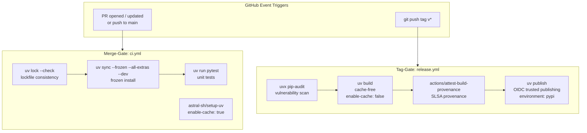
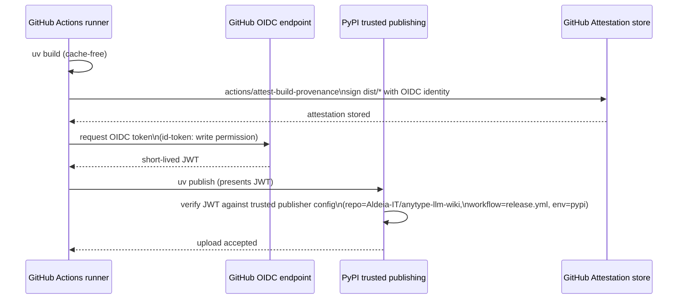

# Supply-Chain Security Hardening (rotki measures) — #231

**Status:** SPEC
**Date:** 2026-05-30
**Author:** spec-writer agent
**Review rounds:** 0

---

## Problem Statement

`anytype-llm-wiki` has no CI at all — no `.github/` directory exists. Any future PyPI
release would be built and published without lockfile enforcement, reproducibility
guarantees, build provenance, or a vetted dependency review process. The rotki security
blog (2026-05-22) documented seven concrete supply-chain hardening measures that apply
directly to Python/uv projects. This ticket establishes CI from scratch with all seven
measures baked in from day one.

The immediate risks absent these controls:

1. A stale or drifted `uv.lock` could allow unexpected package versions to reach a
   release build if a contributor forgets to regenerate it.
2. GitHub Actions referenced by mutable tag (`@v4`) could be transparently replaced by
   a compromised upstream commit — the 2026 tj-actions/changed-files attack compromised
   >23,000 repositories through exactly this mechanism.
3. A cached uv download artifact from an earlier (potentially compromised) run could be
   reused during a release build without re-verification from PyPI.
4. Released wheels will have no cryptographic link to the source commit and workflow that
   produced them, making supply-chain audits impossible for downstream consumers.
5. A long-lived PyPI upload token stored as a GitHub secret could be exfiltrated from
   the repository's secret store.
6. There is no documented or enforced process for evaluating new dependencies before they
   are added to the project.

---

## Research Summary

Research findings are in `.aldeia/231-supply-chain-security-hardening-apply-rotki-s-meas/research.md`
(verified 2026-05-30). Key findings:

**Lockfile semantics:** `uv lock --check` is the right fast gate — it verifies lockfile
consistency without installing anything. `uv sync --frozen` is the right install command
— it treats `uv.lock` as authoritative and skips re-running the resolver (faster than
`--locked`, appropriate after `--check` has already validated consistency).

**SHA pins (all verified via `git ls-remote` 2026-05-30):**

| Action | Version | Commit SHA |
|--------|---------|------------|
| `actions/checkout` | v6.0.2 | `de0fac2e4500dabe0009e67214ff5f5447ce83dd` |
| `astral-sh/setup-uv` | v8.1.0 | `08807647e7069bb48b6ef5acd8ec9567f424441b` |
| `actions/attest-build-provenance` | v4.1.0 | `a2bbfa25375fe432b6a289bc6b6cd05ecd0c4c32` |
| `pypa/gh-action-pypi-publish` | v1.14.0 | `cef221092ed1bacb1cc03d23a2d87d1d172e277b` |
| `actions/setup-python` | v5.6.0 | `a26af69be951a213d495a4c3e4e4022e16d87065` |

Note: `pypa/gh-action-pypi-publish` v1.14.0 is an annotated tag; the SHA above is the
dereferenced commit (`^{}` value). The other four are lightweight tags where the SHA is
the commit directly.

**Publishing approach:** `uv publish` with OIDC trusted publishing is preferred over
`pypa/gh-action-pypi-publish`. See Proposed Solution §5.

**Dependency audit:** `pip-audit` (via `uvx`) is recommended over `uv audit` for now.
`uv audit` exists but remains preview-quality as of 2026-05-30 — its flags and output
format may change without a deprecation cycle. Switch to `uv audit` once it exits
preview status.

**Dependabot:** Supports `github-actions` and `uv` ecosystems natively. There is a known
bug (dependabot/dependabot-core#13426) where `uv` security updates occasionally fall
back to the pip resolver; track this issue and add a `pip` fallback entry if needed.

---

## Applicability Matrix (rotki measures → this repo)

| # | Rotki measure | Applies? | Notes |
|---|---------------|----------|-------|
| 1 | Frozen lockfile installs | **Yes — uv only** | `uv lock --check` + `uv sync --frozen` |
| 2 | Prefer pnpm over npm | **Not Applicable** | No Node ecosystem in this repo |
| 3 | Cache-free release builds | **Yes** | `enable-cache: false` on tag-triggered release job |
| 4 | SHA-pin all GitHub Actions | **Yes** | All `uses:` lines pinned to 40-char commit SHAs |
| 5 | Build-provenance attestations | **Yes — tag-gated** | `actions/attest-build-provenance` on sdist+wheel |
| 6 | OIDC Trusted Publishing | **Yes — tag-gated** | `uv publish` with `id-token: write` |
| 7 | Dependency-intake review | **Yes** | `docs/dependency-intake.md` checklist |

**Cargo/Rust (measure #1 cargo half):** Not Applicable — no Rust code in this repo.

---

## Proposed Solution

### Design Principle: Merge-Gate vs Tag-Gate Split

Two distinct event models govern which checks run when:

- **MERGE-GATE** (every PR and push to `main`): fast feedback loop — lockfile consistency
  check, frozen install, unit tests. Caching enabled for speed. Must complete in under
  2 minutes. Does not run security audits or publish anything.

- **TAG-GATE** (push of a `v*` version tag): heavier security and release checks —
  dependency vulnerability audit, static security analysis, license check, cache-free
  build, provenance attestation, OIDC publish to PyPI. Runs only on controlled,
  reviewed code.

This split prevents security audit failures (which require human triage) from blocking
routine development, while ensuring every release artifact is thoroughly vetted.



### 1. Lockfile-Frozen Installs (merge-gate)

Every CI job that installs the project must use frozen installs. The pattern is:

```yaml
- name: Check lockfile consistency
  run: uv lock --check

- name: Install dependencies (frozen)
  run: uv sync --frozen --all-extras --dev
```

`uv lock --check` exits non-zero if `uv.lock` is inconsistent with `pyproject.toml` —
this catches PRs that modify dependencies without regenerating the lockfile.

`uv sync --frozen` skips the resolver and treats `uv.lock` as the source of truth,
making installs deterministic and fast. The `--all-extras` flag ensures all optional
dependency groups (including `dev`) are installed.

**Developer workflow note:** Contributors must run `uv lock` after modifying
`pyproject.toml`, and commit the updated `uv.lock`. CONTRIBUTING.md will document this
requirement.

### 2. SHA-Pinned GitHub Actions

Every `uses:` line in every workflow file is pinned to a full 40-character commit SHA
with a trailing `# vX.Y.Z` version comment:

```yaml
uses: actions/checkout@de0fac2e4500dabe0009e67214ff5f5447ce83dd  # v6.0.2
uses: astral-sh/setup-uv@08807647e7069bb48b6ef5acd8ec9567f424441b  # v8.1.0
uses: actions/attest-build-provenance@a2bbfa25375fe432b6a289bc6b6cd05ecd0c4c32  # v4.1.0
```

**Rationale:** Mutable tags (`@v4`, `@main`) allow an upstream repository owner (or an
attacker with push access) to silently replace the action code that runs in your
workflow. A commit SHA is immutable — the only way to change what code runs is to push
a new commit with a new SHA.

**Note on `actions/checkout`:** The current latest is v6.0.2. Older documentation
examples commonly show v4 — v6 is the current release.

**Note on `actions/attest-build-provenance`:** GitHub internally recommends `actions/attest`
as the lower-level action; `attest-build-provenance` v4 is a wrapper around it. The
wrapper is simpler and fully supported. This spec uses the wrapper.

**Refreshing SHAs:** When a new action release is published, resolve the new commit SHA:

```bash
# For lightweight tags (one line returned — SHA is the commit directly)
git ls-remote https://github.com/OWNER/ACTION.git refs/tags/vX.Y.Z

# For annotated tags (two lines returned — use the ^{} line, which is the commit SHA)
git ls-remote https://github.com/OWNER/ACTION.git refs/tags/vX.Y.Z 'refs/tags/vX.Y.Z^{}'
```

Update the workflow `uses:` line with the new SHA and update the version comment.
Dependabot (§6) handles this automatically via weekly PRs.

### 3. Cache-Free Release Builds (tag-gate)

The release workflow uses `enable-cache: false` on `astral-sh/setup-uv`:

```yaml
- uses: astral-sh/setup-uv@08807647e7069bb48b6ef5acd8ec9567f424441b  # v8.1.0
  with:
    enable-cache: false
```

This forces fresh downloads from PyPI for every release build. If an attacker has
poisoned the GitHub Actions cache (via a cache-key collision or a compromised earlier
run), a cache-free build ensures the poisoned artifact cannot reach the release.

Dev and test jobs (`ci.yml`) retain `enable-cache: true` for speed. The risk of a
poisoned cache in a test job is limited — the worst outcome is a flaky test, not a
compromised release artifact.

### 4. Build Provenance Attestation (tag-gate)

The release job generates a SLSA-style provenance attestation signed with the GitHub
OIDC identity of the workflow run:

```yaml
- name: Build distributions
  run: uv build

- name: Attest build provenance
  uses: actions/attest-build-provenance@a2bbfa25375fe432b6a289bc6b6cd05ecd0c4c32  # v4.1.0
  with:
    subject-path: dist/*
```

Required permissions (set at job level for least privilege):

```yaml
permissions:
  id-token: write      # obtain OIDC token for signing
  attestations: write  # write attestation to GitHub's attestation store
  contents: read       # read the repository
```

**GitHub-hosted runner requirement:** Attestation generation requires a GitHub-hosted
runner (or a runner with network access to GitHub's OIDC endpoint). The release job
must use `runs-on: ubuntu-latest` (a GitHub-hosted runner).

**Consumer verification:** After a wheel is published to PyPI, a downstream consumer
can verify its provenance:

```bash
gh attestation verify anytype_llm_wiki-0.1.0-py3-none-any.whl \
  --repo Aldeia-IT/anytype-llm-wiki
```

Note: `gh attestation verify` does not accept globs — each artifact file must be
verified individually.

### 5. OIDC Trusted Publishing (tag-gate) — Recommended Approach

**Recommendation: use `uv publish` with native OIDC trusted publishing.**

Rationale over `pypa/gh-action-pypi-publish`:
1. This is a uv-first project — keeping the full build/publish pipeline in uv reduces
   the number of SHA-pinned action dependencies.
2. Astral publishes a reference example (`trusted-publishing-examples`) specifically for
   `uv publish`, confirming it is the current uv-native recommended pattern.
3. `uv publish` composes cleanly with `actions/attest-build-provenance` in a single
   job: build, attest, then publish.
4. Signed attestations are generated automatically by PyPI for all trusted-publishing
   uploads (via Sigstore), regardless of which upload method is used.

The publish step requires only `id-token: write` — no long-lived PyPI token stored as a
GitHub secret:

```yaml
- name: Publish to PyPI
  run: uv publish
```

uv detects the GitHub Actions OIDC environment automatically when `id-token: write` is
set, exchanges the OIDC token for a short-lived upload credential from PyPI, and uploads
the built distributions from `dist/`.

**OIDC trust flow:**



**One-time manual prerequisite — PyPI pending publisher setup:**

Before the first tag/release push, the project maintainer must configure a pending
publisher on PyPI. This cannot be done by CI:

1. Log into PyPI → Account sidebar → Publishing → "Add a new pending publisher"
2. Fill in:
   - PyPI project name: `anytype-llm-wiki`
   - GitHub owner: `Aldeia-IT`
   - GitHub repository: `anytype-llm-wiki`
   - Workflow filename: `release.yml` (exact filename, case-sensitive)
   - Environment name: `pypi` (must match the `environment:` value in the workflow)
3. On the first successful publish, the pending publisher converts to a standard
   trusted publisher automatically.

**GitHub Environment guardrail:**

The publish job uses `environment: pypi` to link it to a named GitHub environment. In
`Settings → Environments → pypi`, configure:
- Required reviewers: at least one maintainer must approve before the publish job runs
- Deployment branches: restrict to protected tags matching `v*`

This ensures the publish step cannot be triggered by an unreviewed commit or an
untrusted fork.

### 6. Dependabot — Keeping SHAs and Dependencies Current

`.github/dependabot.yml` configures Dependabot to open weekly PRs for:
- GitHub Actions SHA-pin updates (parses trailing `# vX.Y.Z` comments, updates both the
  SHA and the version comment)
- Python dependency updates (reads `pyproject.toml` + `uv.lock`)

Known issue: Dependabot `uv` ecosystem (dependabot/dependabot-core#13426) may fall back
to the pip resolver for security updates. If this affects the project, add a
`package-ecosystem: pip` entry for security-update scanning alongside the `uv` entry.

**7-day cooldown convention:** The rotki blog recommends waiting 7 days after a new
dependency release before applying it. Dependabot has no native cooldown setting.
Enforce this as a manual convention: do not merge Dependabot PRs for new package
releases until 7 days after the release date. (Renovate supports `minimumReleaseAge`
natively, but Dependabot is the lower-friction choice for a single-maintainer project.)

### 7. Dependency-Intake Checklist

`docs/dependency-intake.md` is committed to the repository with a structured checklist
(from research.md §Q8). The checklist covers:
1. Necessity — can we implement this ourselves? Is vendoring appropriate?
2. Maintainer health — reputation, activity, succession
3. Release history — recent advisories, suspicious releases
4. Transitive impact — `uv add --dry-run`, CVE scan
5. License compatibility — MIT-compatible check
6. Cooldown — defer if released < 7 days ago
7. Decision record — document the outcome in the PR

`CONTRIBUTING.md` is updated to reference `docs/dependency-intake.md` and to document
the frozen-install dev workflow (`uv lock` after modifying `pyproject.toml`).

---

## Deliverables and AC Traceability

| Deliverable | File | Acceptance Criteria covered |
|-------------|------|-----------------------------|
| Merge-gate workflow | `.github/workflows/ci.yml` | AC1 (lockfile enforcement), AC2 (SHA-pinned actions) |
| Release workflow | `.github/workflows/release.yml` | AC1 (frozen install), AC2 (SHA pins), AC3 (cache-free), AC4 (provenance), AC5 (OIDC publish) |
| Dependabot config | `.github/dependabot.yml` | AC2 (keep SHA pins current) |
| Intake checklist | `docs/dependency-intake.md` | AC6 (checklist documented in repo) |
| CONTRIBUTING.md edit | `CONTRIBUTING.md` | AC6 (checklist referenced from repo) |
| README snippet | `README.md` (optional) | AC4 (provenance verification guidance for consumers) |

### Acceptance Criteria Detail

**AC1 — Lockfile-frozen installs enforced in CI**
- Satisfied by: `ci.yml` runs `uv lock --check` and `uv sync --frozen`; `release.yml`
  runs `uv sync --frozen` before build.
- Verification: open a PR that modifies `pyproject.toml` without running `uv lock`; the
  `uv lock --check` step must exit non-zero and block the merge.
- Ecosystem scope: Python/uv only. pnpm (Node) and cargo (Rust) are Not Applicable —
  no such ecosystems exist in this repo.

**AC2 — All GitHub Actions pinned to full commit SHAs**
- Satisfied by: every `uses:` line in `ci.yml`, `release.yml`, and `dependabot.yml`
  uses `@<40-char-sha>` format with `# vX.Y.Z` comment.
- Verification: `grep -r 'uses:' .github/workflows/ | grep -v '@[0-9a-f]\{40\}'` must
  return no lines (zero un-SHA-pinned actions).

**AC3 — Release workflows build cache-free**
- Satisfied by: `release.yml` sets `enable-cache: false` on `astral-sh/setup-uv`.
- Verification: inspect `release.yml` for `enable-cache: false`; confirm `ci.yml` uses
  `enable-cache: true` (cache enabled for dev speed).

**AC4 — Build-provenance attestation on published artifacts**
- Satisfied by: `release.yml` runs `actions/attest-build-provenance` with
  `subject-path: dist/*` after `uv build`.
- Verification: after a test release tag, run
  `gh attestation verify dist/anytype_llm_wiki-0.1.0-py3-none-any.whl --repo Aldeia-IT/anytype-llm-wiki`
  and expect exit code 0.

**AC5 — OIDC Trusted Publishing configured for PyPI**
- Satisfied by: `release.yml` uses `uv publish` with `id-token: write` permission and
  `environment: pypi`; PyPI pending-publisher setup documented as a manual prerequisite.
- Verification: no `PYPI_TOKEN` or equivalent secret exists; `release.yml` greppably
  contains `id-token: write` and `environment: pypi`.

**AC6 — Dependency-intake review checklist documented in the repo**
- Satisfied by: `docs/dependency-intake.md` committed with full checklist; `CONTRIBUTING.md`
  links to it.
- Verification: both files exist and `CONTRIBUTING.md` contains a reference to
  `docs/dependency-intake.md`.

---

## Workflow File Specifications

### `.github/workflows/ci.yml` (merge-gate)

```yaml
name: CI

on:
  push:
    branches: [main]
  pull_request:
    branches: [main]

permissions:
  contents: read

jobs:
  test:
    name: Lockfile check + tests
    runs-on: ubuntu-latest
    steps:
      - uses: actions/checkout@de0fac2e4500dabe0009e67214ff5f5447ce83dd  # v6.0.2

      - uses: astral-sh/setup-uv@08807647e7069bb48b6ef5acd8ec9567f424441b  # v8.1.0
        with:
          enable-cache: true

      - name: Check lockfile consistency
        run: uv lock --check

      - name: Install dependencies (frozen)
        run: uv sync --frozen --all-extras --dev

      - name: Run tests
        run: uv run pytest
```

### `.github/workflows/release.yml` (tag-gate)

```yaml
name: Release

on:
  push:
    tags:
      - "v*"

permissions:
  contents: read

jobs:
  audit:
    name: Dependency audit
    runs-on: ubuntu-latest
    steps:
      - uses: actions/checkout@de0fac2e4500dabe0009e67214ff5f5447ce83dd  # v6.0.2

      - uses: astral-sh/setup-uv@08807647e7069bb48b6ef5acd8ec9567f424441b  # v8.1.0
        with:
          enable-cache: false

      - name: Export lockfile for audit
        run: uv export --format requirements-txt --no-dev > /tmp/requirements-audit.txt

      - name: Audit dependencies
        run: uvx pip-audit -r /tmp/requirements-audit.txt

  build-and-publish:
    name: Build, attest, and publish
    runs-on: ubuntu-latest
    needs: audit
    environment: pypi
    permissions:
      id-token: write
      attestations: write
      contents: read
    steps:
      - uses: actions/checkout@de0fac2e4500dabe0009e67214ff5f5447ce83dd  # v6.0.2

      - uses: astral-sh/setup-uv@08807647e7069bb48b6ef5acd8ec9567f424441b  # v8.1.0
        with:
          enable-cache: false

      - name: Install dependencies (frozen)
        run: uv sync --frozen --all-extras --dev

      - name: Build distributions
        run: uv build

      - name: Attest build provenance
        uses: actions/attest-build-provenance@a2bbfa25375fe432b6a289bc6b6cd05ecd0c4c32  # v4.1.0
        with:
          subject-path: dist/*

      - name: Publish to PyPI
        run: uv publish
```

**Notes on `release.yml`:**
- The `audit` job is a separate job that runs first; `build-and-publish` has
  `needs: audit` so a vulnerability finding blocks the publish step.
- Elevated permissions (`id-token: write`, `attestations: write`) are scoped to the
  `build-and-publish` job only, following least-privilege.
- `environment: pypi` links this job to the GitHub Environment with required-reviewer
  approval and branch/tag protection rules.
- `actions/setup-python` is not needed — `astral-sh/setup-uv` manages the Python
  version and the `uv python install` path covers any version pinning needed.

### `.github/dependabot.yml`

```yaml
version: 2
updates:
  # Keep GitHub Actions SHA-pinned references up to date
  - package-ecosystem: "github-actions"
    directory: "/"
    schedule:
      interval: "weekly"
    groups:
      actions:
        patterns: ["*"]

  # Keep Python dependencies in uv.lock up to date
  - package-ecosystem: "uv"
    directory: "/"
    schedule:
      interval: "weekly"
```

If dependabot/dependabot-core#13426 (uv ecosystem security-update regression) affects
this project, add:

```yaml
  # Fallback for security-only updates until uv ecosystem bug is resolved
  - package-ecosystem: "pip"
    directory: "/"
    schedule:
      interval: "daily"
```

---

## Resource Impact

Negligible for the 32GB Mac Mini — all CI runs on GitHub-hosted runners. No local
infrastructure changes. The two new workflow files and one Dependabot config file add
trivial storage overhead. `docs/dependency-intake.md` is a text document.

GitHub Actions usage: merge-gate runs are fast (<2 minutes target). Release runs are
longer (dependency audit adds 30-90 seconds) but are infrequent (tag-triggered only).
Both use `ubuntu-latest` (GitHub-provided, no billing concern for an open-source repo).

---

## Security Considerations

**Trust model for the release workflow:**

The `release.yml` workflow acquires elevated permissions (`id-token: write`,
`attestations: write`). These are scoped to the `build-and-publish` job only. The
`environment: pypi` gate plus GitHub Environment required-reviewer protection means a
malicious tag push cannot trigger an unreviewed publish.

**OIDC token scope:** The OIDC token issued to the workflow is scoped to the specific
run. PyPI validates it against the trusted-publisher configuration (repo, workflow
filename, environment name). A token cannot be reused after the run ends.

**No secrets stored:** The publish path stores no long-lived secrets. If a secret were
exfiltrated from the repo's secret store, it would have no PyPI upload capability.

**Cache poisoning surface:** Merge-gate jobs use the uv cache — the attack surface is
limited to test/dev dependencies, not release artifacts. Release jobs use `enable-cache:
false`, eliminating the cache poisoning vector for published artifacts.

**Self-hosted runner warning:** The `build-and-publish` job must run on a GitHub-hosted
runner (`ubuntu-latest`). Self-hosted runners with network egress restrictions may be
unable to reach GitHub's OIDC endpoint to sign attestations.

**Dependabot PRs:** Dependabot PRs update SHA pins and dependency versions. Treat them
as you would any dependency update — apply the 7-day cooldown convention and review the
diff before merging.

---

## Operational Considerations

**First release checklist (manual, one-time):**

Before pushing the first `v*` tag:
1. Create the `pypi` GitHub Environment in repo Settings → Environments.
2. Add required reviewers to the `pypi` environment.
3. Restrict deployments to tags matching `v*`.
4. Configure the PyPI pending publisher (see Proposed Solution §5 for exact fields).

If any of these steps are skipped, the first `release.yml` run will fail at the publish
step with an authentication error.

**Dependabot PR workflow:**
- Dependabot opens PRs on the `main` branch (or the default branch) — not on feature
  branches.
- Review and merge Dependabot PRs after the 7-day cooldown convention.
- Action SHA-pin PRs can generally be merged immediately after CI passes, since actions
  are already pinned — the risk window is narrow.

**`uv audit` migration path:** When `uv audit` exits preview status, replace:
```yaml
- run: uv export --format requirements-txt --no-dev > /tmp/requirements-audit.txt
- run: uvx pip-audit -r /tmp/requirements-audit.txt
```
with:
```yaml
- run: uv audit
```
There is no hard timeline for this — wait for Astral's announcement that `uv audit` is
stable.

---

## Test Plan

### Testing Without a Real PyPI Publish

**Local workflow validation with `act`:**
```bash
# Install act (requires Docker)
brew install act

# Dry-run the merge-gate workflow (no publish steps, no secrets needed)
act push --workflows .github/workflows/ci.yml --dry-run

# Run the ci workflow locally (requires Docker)
act push --workflows .github/workflows/ci.yml
```

**Validate lockfile-check gate:** In a test branch, add a dummy dependency to
`pyproject.toml` without running `uv lock`. Open a PR — the `uv lock --check` step
should fail with a non-zero exit code. Then run `uv lock` and push the updated
`uv.lock` — the check should pass.

**Validate SHA-pin coverage:**
```bash
grep -r 'uses:' .github/workflows/ | grep -v '@[0-9a-f]\{40\}'
```
This must return zero lines.

**Test build and attestation without publishing:**
```bash
# Build locally
uv build

# Verify dist/ contains sdist and wheel
ls dist/

# (After pushing a test release tag and running the workflow without the publish step)
# Verify attestation was created:
gh attestation verify dist/anytype_llm_wiki-0.1.0-py3-none-any.whl \
  --repo Aldeia-IT/anytype-llm-wiki
```

**Test release workflow with publish skipped:** Add a `workflow_dispatch` trigger to
`release.yml` with an input `skip_publish: boolean`. When `true`, the publish step runs
`echo "Skipping publish (dry-run mode)"` instead of `uv publish`. This lets the full
audit + build + attest pipeline be exercised without pushing to PyPI.

**Verify no long-lived secrets required:**
```bash
grep -r 'PYPI_TOKEN\|pypi_token\|password:' .github/workflows/
```
Must return zero lines.

**Verify cache-free release build:** Inspect `release.yml` and confirm `enable-cache:
false` is present in the `astral-sh/setup-uv` step of the release job.

**Verify `environment: pypi`:**
```bash
grep 'environment:' .github/workflows/release.yml
```
Must show `environment: pypi`.

---

## Implementation Plan

Ordered steps (all can be done in a single PR on the feature branch):

1. **Create `.github/` directory structure.**
   ```
   .github/
   ├── workflows/
   │   ├── ci.yml
   │   └── release.yml
   └── dependabot.yml
   ```

2. **Author `.github/workflows/ci.yml`** (merge-gate) per the specification in
   §Workflow File Specifications. Verify SHA pins match the table in §Research Summary.

3. **Author `.github/workflows/release.yml`** (tag-gate) per the specification in
   §Workflow File Specifications. Verify `enable-cache: false`, `environment: pypi`,
   correct permissions at the job level.

4. **Author `.github/dependabot.yml`** per the specification in §Workflow File
   Specifications.

5. **Create `docs/dependency-intake.md`** with the full checklist from research.md §Q8.
   The `docs/` directory may need to be created.

6. **Edit `CONTRIBUTING.md`** to:
   - Add a "Dependency intake" section that links to `docs/dependency-intake.md`.
   - Update the "Getting started" step 3 to use `uv sync --all-extras` (replacing the
     current `uv sync --extra dev` which omits the `--frozen` flag for local dev).
   - Add a note: "After modifying `pyproject.toml`, run `uv lock` and commit the updated
     `uv.lock`. CI enforces this via `uv lock --check`."

7. **Optionally edit `README.md`** to add a provenance verification snippet in the
   "Install" section (note as optional — roadmap item):
   ```bash
   # Verify provenance of a downloaded wheel
   gh attestation verify anytype_llm_wiki-X.Y.Z-py3-none-any.whl \
     --repo Aldeia-IT/anytype-llm-wiki
   ```
   Note: `gh attestation verify` does not accept globs — verify each artifact
   individually.

8. **Document the one-time manual prerequisite** for PyPI and the GitHub Environment in
   CONTRIBUTING.md or a `docs/releasing.md` runbook (to be determined by implementer;
   CONTRIBUTING.md is preferred to avoid proliferating docs files).

9. **Verify SHA-pin coverage** using the grep command in §Test Plan before committing.

10. **Open PR** on the feature branch. The new `ci.yml` will trigger on the PR itself
    and serve as the first live validation of the merge-gate.

### Parallelization

Steps 2, 3, 4 (workflow files) can be authored in any order — no dependencies between
them. Step 5 (`docs/dependency-intake.md`) is independent of the workflow files.
Step 6 (`CONTRIBUTING.md`) depends on step 5 (needs the file path to link). Steps 7 and
8 are optional or parallel with everything else.

---

## Open Questions

1. **`docs/releasing.md` vs `CONTRIBUTING.md` for the PyPI setup runbook.** The
   one-time manual steps (GitHub Environment creation, PyPI pending publisher) need to
   live somewhere. CONTRIBUTING.md is preferred (fewer files to maintain), but if the
   CONTRIBUTING.md is already long, a `docs/releasing.md` is a reasonable alternative.
   The implementer should decide based on the current CONTRIBUTING.md length.

2. **`uv sync --all-extras` vs `uv sync --extra dev` in CONTRIBUTING.md.** The current
   CONTRIBUTING.md uses `uv sync --extra dev`. The workflow spec uses
   `uv sync --frozen --all-extras --dev`. For local dev, `--frozen` is optional (the
   developer may intentionally update the lockfile), but `--all-extras` vs `--extra dev`
   is a question of whether new optional extras are always included in dev setup.
   Recommend `--all-extras` for consistency with CI.

3. **Dependabot uv bug (dependabot-core#13426).** Status unclear as of 2026-05-30.
   The implementer should check the issue before authoring `dependabot.yml` and decide
   whether to add the `pip` fallback entry for security updates.

---

## Deferred Items

- **SECURITY.md:** Out of scope for this ticket. Per prior council guidance
  (mem0 c942da7e), SECURITY.md is expected at first public tag. This spec does not
  create SECURITY.md — it is a separate deliverable.

- **`uv audit` migration:** Deferred until `uv audit` exits preview status. The spec
  documents the migration path in §Operational Considerations.

- **Renovate as Dependabot replacement:** Renovate is more capable (native cooldown
  enforcement via `minimumReleaseAge`, stronger uv support), but adds operational
  complexity for a single-maintainer project. Deferred — revisit if Dependabot's uv
  ecosystem bug (issue #13426) proves problematic.

- **`npm / PyPI publishing` roadmap item (README):** The README lists this as a future
  roadmap item. The release workflow created by this spec covers the PyPI side. The npm
  side is Not Applicable (no Node ecosystem) and remains deferred.

---

## Alternatives Considered

**`uv sync --locked` instead of `uv lock --check` + `uv sync --frozen`:** `uv sync
--locked` combines the consistency check and install in one command. Rejected in favor
of the two-step pattern because: (1) `uv lock --check` is faster (no install) and fails
fast; (2) `uv sync --frozen` makes it explicit that the install is deterministic. The
two-step pattern is clearer and maps directly to the semantic distinction between
validation and installation.

**`pypa/gh-action-pypi-publish` instead of `uv publish`:** Both work correctly with
OIDC trusted publishing. Rejected in favor of `uv publish` because it eliminates a
third-party action dependency (one fewer SHA to pin and maintain) and aligns with the
uv-first philosophy of the project. See Proposed Solution §5 for full rationale.

**Renovate instead of Dependabot:** Renovate supports `minimumReleaseAge` for native
7-day cooldown enforcement and has stronger uv/lockfile support. Rejected (for now)
because Dependabot is zero-configuration for a GitHub-hosted repo and Renovate requires
the GitHub App or self-hosted runner setup. The 7-day cooldown is enforced as a
convention instead.
