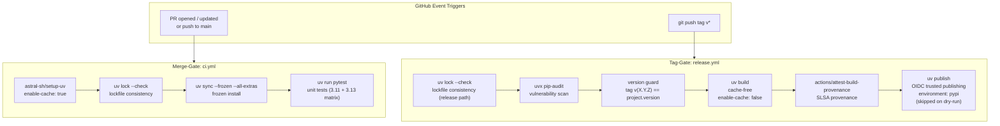
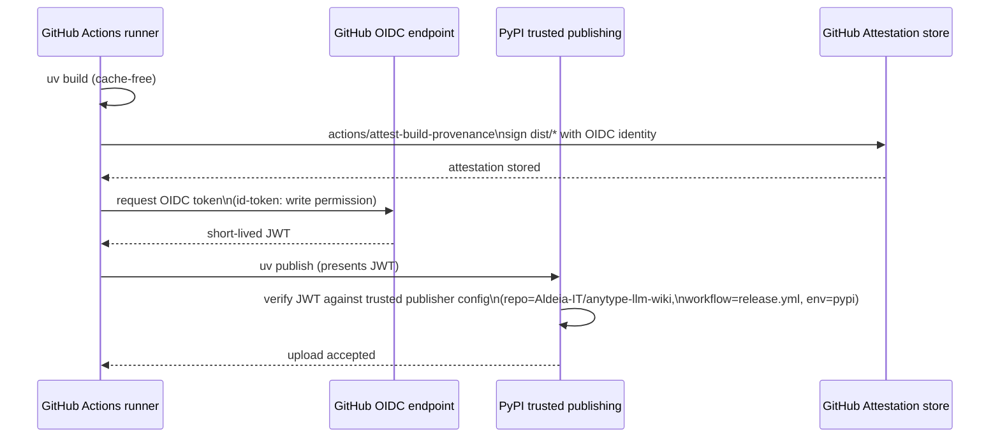

# Supply-Chain Security Hardening (rotki measures) — #231

**Status:** SPEC
**Date:** 2026-05-30
**Author:** spec-writer agent
**Review rounds:** 2

> **Round 2 re-review (2026-05-30): APPROVED.** Both specialist re-reviewers
> (infrastructure-lead, chief-technology-officer) returned APPROVED — B1 confirmed correctly
> resolved (`uv version --short` verified as a real current uv subcommand that reads
> `project.version` from `pyproject.toml`), all SF-1…SF-10 confirmed present in the spec body,
> SHA pins unchanged, no new contradictions. The lead applied the residual non-blocking R2
> items inline: SF2-1 (exact-match tagging contract note on the B1 guard), SF2-2
> (defense-in-depth note clarifying the `pypi` Environment — not the `if:` expression — is the
> publish security boundary), and the cosmetic step-6 self-reference fix. The release Mermaid
> diagram collapsing the two release jobs into one chain is accepted as cosmetic (the prose is
> authoritative and correct). Zero findings remain open.

> **Round 1 fixes applied (2026-05-30).** This revision addresses every finding in
> `review-r1.md` (1 BLOCKING, 10 SHOULD-FIX, 4 SUGGESTION) plus the underlying specialist
> reviews. Headline changes for the re-reviewer:
> - **B1:** added a tag-vs-`pyproject.toml` version guard step (fail-fast, before `uv build`).
> - **SF-1:** dropped the bogus `--dev` flag; canonical install is now
>   `uv sync --frozen --all-extras` everywhere (CI, release, CONTRIBUTING).
> - **SF-2 / SF-10:** release path now runs install-free `uv lock --check`; removed the
>   redundant `uv sync` before `uv build`.
> - **SF-3:** tag-gate prose/diagram/workflow reconciled — scope is `pip-audit` only;
>   bandit/pip-licenses/gitleaks explicitly deferred with rationale.
> - **SF-4:** `workflow_dispatch` + `skip_publish` promoted into the authored `release.yml`.
> - **SF-5:** `pypi` Environment protection elevated to a hard prerequisite AC with a
>   `gh api` verification step and a plan-tier note.
> - **SF-6 / SF-7:** weekly scheduled `pip-audit` added; build-backend deps pinned via
>   `[build-system] requires` with documented residual risk.
> - **SF-8:** partial-failure recovery path documented.
> - **SF-9:** Python version matrix (3.11 + 3.13) added to CI.
> - **SG-1:** `docs/releasing.md` runbook added as a deliverable.
> - All Open Questions are now resolved (none remain open).

---

## Problem Statement

`anytype-llm-wiki` has no CI at all — no `.github/` directory exists. Any future PyPI
release would be built and published without lockfile enforcement, reproducibility
guarantees, build provenance, or a vetted dependency review process. The rotki security
blog (2026-05-22) documented seven concrete supply-chain hardening measures that apply
directly to Python/uv projects. This ticket establishes CI from scratch with all seven
measures baked in from day one.

The immediate risks absent these controls:

1. A stale or drifted `uv.lock` could allow unexpected package versions to reach a
   release build if a contributor forgets to regenerate it.
2. GitHub Actions referenced by mutable tag (`@v4`) could be transparently replaced by
   a compromised upstream commit — the 2026 tj-actions/changed-files attack compromised
   >23,000 repositories through exactly this mechanism.
3. A cached uv download artifact from an earlier (potentially compromised) run could be
   reused during a release build without re-verification from PyPI.
4. Released wheels will have no cryptographic link to the source commit and workflow that
   produced them, making supply-chain audits impossible for downstream consumers.
5. A long-lived PyPI upload token stored as a GitHub secret could be exfiltrated from
   the repository's secret store.
6. There is no documented or enforced process for evaluating new dependencies before they
   are added to the project.

---

## Research Summary

Research findings are in `.aldeia/231-supply-chain-security-hardening-apply-rotki-s-meas/research.md`
(verified 2026-05-30). Key findings:

**Lockfile semantics:** `uv lock --check` is the right fast gate — it verifies lockfile
consistency without installing anything. `uv sync --frozen` is the right install command
— it treats `uv.lock` as authoritative and skips re-running the resolver (faster than
`--locked`, appropriate after `--check` has already validated consistency).

**SHA pins (all verified via `git ls-remote` 2026-05-30):**

| Action | Version | Commit SHA |
|--------|---------|------------|
| `actions/checkout` | v6.0.2 | `de0fac2e4500dabe0009e67214ff5f5447ce83dd` |
| `astral-sh/setup-uv` | v8.1.0 | `08807647e7069bb48b6ef5acd8ec9567f424441b` |
| `actions/attest-build-provenance` | v4.1.0 | `a2bbfa25375fe432b6a289bc6b6cd05ecd0c4c32` |
| `pypa/gh-action-pypi-publish` | v1.14.0 | `cef221092ed1bacb1cc03d23a2d87d1d172e277b` |
| `actions/setup-python` | v5.6.0 | `a26af69be951a213d495a4c3e4e4022e16d87065` |

Note: `pypa/gh-action-pypi-publish` v1.14.0 is an annotated tag; the SHA above is the
dereferenced commit (`^{}` value). The other four are lightweight tags where the SHA is
the commit directly.

**Publishing approach:** `uv publish` with OIDC trusted publishing is preferred over
`pypa/gh-action-pypi-publish`. See Proposed Solution §5.

**Dependency audit:** `pip-audit` (via `uvx`) is recommended over `uv audit` for now.
`uv audit` exists but remains preview-quality as of 2026-05-30 — its flags and output
format may change without a deprecation cycle. Switch to `uv audit` once it exits
preview status.

**Dependabot:** Supports `github-actions` and `uv` ecosystems natively. There is a known
bug (dependabot/dependabot-core#13426) where `uv` security updates occasionally fall
back to the pip resolver; track this issue and add a `pip` fallback entry if needed.

---

## Applicability Matrix (rotki measures → this repo)

| # | Rotki measure | Applies? | Notes |
|---|---------------|----------|-------|
| 1 | Frozen lockfile installs | **Yes — uv only** | `uv lock --check` + `uv sync --frozen` |
| 2 | Prefer pnpm over npm | **Not Applicable** | No Node ecosystem in this repo |
| 3 | Cache-free release builds | **Yes** | `enable-cache: false` on tag-triggered release job |
| 4 | SHA-pin all GitHub Actions | **Yes** | All `uses:` lines pinned to 40-char commit SHAs |
| 5 | Build-provenance attestations | **Yes — tag-gated** | `actions/attest-build-provenance` on sdist+wheel |
| 6 | OIDC Trusted Publishing | **Yes — tag-gated** | `uv publish` with `id-token: write` |
| 7 | Dependency-intake review | **Yes** | `docs/dependency-intake.md` checklist |

**Cargo/Rust (measure #1 cargo half):** Not Applicable — no Rust code in this repo.

---

## Proposed Solution

### Design Principle: Merge-Gate vs Tag-Gate Split

Two distinct event models govern which checks run when:

- **MERGE-GATE** (every PR and push to `main`): fast feedback loop — lockfile consistency
  check, frozen install, unit tests. Caching enabled for speed. Must complete in under
  2 minutes. Does not run security audits or publish anything.

- **TAG-GATE** (push of a `v*` version tag): heavier security and release checks —
  dependency vulnerability audit (`pip-audit`), tag-vs-manifest version guard, cache-free
  build, provenance attestation, OIDC publish to PyPI. Runs only on controlled,
  reviewed code.

This split prevents security audit failures (which require human triage) from blocking
routine development, while ensuring every release artifact is thoroughly vetted.

**Scope decision — tag-gate security tooling (resolves SF-3 / tech SF-2):** The tag-gate
implements exactly ONE security-analysis tool: `uvx pip-audit` (dependency vulnerability
scan). The earlier research (`research.md` §Q7) lists `bandit` (static analysis),
`pip-licenses` (license compliance), and `gitleaks` (secret scan) as candidate tag-gating
steps. **These three are deliberately deferred to a follow-up CI-hardening ticket** and
are NOT part of this spec's `release.yml`. Rationale: (1) this ticket's mandate is the
seven rotki supply-chain measures, of which dependency auditing is measure-adjacent;
bandit/gitleaks/pip-licenses are general OSS hygiene, not rotki measures; (2) keeping the
first release pipeline minimal reduces the surface that must be correct before the first
publish; (3) each tool adds a human-triage failure mode that is better introduced once the
release path itself is proven. The prose, the Mermaid diagram, and the authored
`release.yml` below all agree: tag-gate security scanning == `pip-audit` only. A weekly
scheduled `pip-audit` (see §6a) additionally shrinks the merge-window risk.



The `audit` job runs `uv lock --check` then `pip-audit`; the `build-and-publish` job
(`needs: audit`) re-runs `uv lock --check`, then the version guard, build, attest, and
publish. Both jobs assert lockfile consistency on the release path so a tag pushed to a
commit that bypassed the merge-gate cannot build from a drifted lockfile.

### 1. Lockfile-Frozen Installs (merge-gate)

Every CI job that installs the project must use frozen installs. The pattern is:

```yaml
- name: Check lockfile consistency
  run: uv lock --check

- name: Install dependencies (frozen)
  run: uv sync --frozen --all-extras
```

`uv lock --check` exits non-zero if `uv.lock` is inconsistent with `pyproject.toml` —
this catches PRs that modify dependencies without regenerating the lockfile.

`uv sync --frozen` skips the resolver and treats `uv.lock` as the source of truth,
making installs deterministic and fast. The `--all-extras` flag installs every entry in
`[project.optional-dependencies]` (which is where `dev = ["pytest>=8.0.0"]` lives) — so
pytest is present after the sync.

**Canonical install command (resolves SF-1 / Open Question #2).** This project's `dev`
deps are declared as a PEP 621 **extra** under `[project.optional-dependencies]`, NOT as
a PEP 735 `[dependency-groups]` entry, and there is no `[tool.uv]` table. The uv `--dev`
flag targets a dependency *group*, which does not exist here — so `--dev` is at best a
silent no-op and at worst misleading. The single canonical install command across
`ci.yml`, `release` audit/test usage, and CONTRIBUTING.md is therefore:

```
uv sync --frozen --all-extras        # CI / reproducible installs
uv sync --all-extras                 # local dev (lockfile may be intentionally updated)
```

and the canonical test invocation is `uv run pytest`. If the project later migrates `dev`
to a `[dependency-groups]` table (PEP 735), that is an explicit future change at which
point `--all-groups` would replace `--all-extras` — do not pre-emptively pass `--dev`.

**Developer workflow note:** Contributors must run `uv lock` after modifying
`pyproject.toml`, and commit the updated `uv.lock`. CONTRIBUTING.md documents this
requirement (see Implementation Plan step 6).

### 2. SHA-Pinned GitHub Actions

Every `uses:` line in every workflow file is pinned to a full 40-character commit SHA
with a trailing `# vX.Y.Z` version comment:

```yaml
uses: actions/checkout@de0fac2e4500dabe0009e67214ff5f5447ce83dd  # v6.0.2
uses: astral-sh/setup-uv@08807647e7069bb48b6ef5acd8ec9567f424441b  # v8.1.0
uses: actions/attest-build-provenance@a2bbfa25375fe432b6a289bc6b6cd05ecd0c4c32  # v4.1.0
```

**Rationale:** Mutable tags (`@v4`, `@main`) allow an upstream repository owner (or an
attacker with push access) to silently replace the action code that runs in your
workflow. A commit SHA is immutable — the only way to change what code runs is to push
a new commit with a new SHA.

**Note on `actions/checkout`:** The current latest is v6.0.2. Older documentation
examples commonly show v4 — v6 is the current release.

**Note on `actions/attest-build-provenance`:** GitHub internally recommends `actions/attest`
as the lower-level action; `attest-build-provenance` v4 is a wrapper around it. The
wrapper is simpler and fully supported. This spec uses the wrapper.

**Composite-action transitive caveat (security SG-3):** SHA-pinning a composite/wrapper
action pins only its *top layer*. `actions/attest-build-provenance@v4` internally invokes
`actions/attest` and Sigstore tooling via its own `uses:` lines, which our pin does not
control. This is an accepted, GitHub-maintained transitive dependency — but the pinning
guarantee is shallow, and the same caveat applies to any wrapper action. Choosing
`uv publish` over `pypa/gh-action-pypi-publish` (§5) is partly motivated by this: it
removes one composite action (and its internal `uses:` surface) from the trust boundary
entirely.

**Refreshing SHAs:** When a new action release is published, resolve the new commit SHA:

```bash
# For lightweight tags (one line returned — SHA is the commit directly)
git ls-remote https://github.com/OWNER/ACTION.git refs/tags/vX.Y.Z

# For annotated tags (two lines returned — use the ^{} line, which is the commit SHA)
git ls-remote https://github.com/OWNER/ACTION.git refs/tags/vX.Y.Z 'refs/tags/vX.Y.Z^{}'
```

Update the workflow `uses:` line with the new SHA and update the version comment.
Dependabot (§6) handles this automatically via weekly PRs.

### 3. Cache-Free Release Builds (tag-gate)

The release workflow uses `enable-cache: false` on `astral-sh/setup-uv`:

```yaml
- uses: astral-sh/setup-uv@08807647e7069bb48b6ef5acd8ec9567f424441b  # v8.1.0
  with:
    enable-cache: false
```

This forces fresh downloads from PyPI for every release build. If an attacker has
poisoned the GitHub Actions cache (via a cache-key collision or a compromised earlier
run), a cache-free build ensures the poisoned artifact cannot reach the release.

Dev and test jobs (`ci.yml`) retain `enable-cache: true` for speed. The risk of a
poisoned cache in a test job is limited — the worst outcome is a flaky test, not a
compromised release artifact.

### 3b. Pinning the Build Backend (SF-7)

`uv build` builds the sdist/wheel in an **isolated** build environment and resolves the
build backend (`hatchling`) and its transitive build-time deps fresh from PyPI at release
time. Those build-time requirements are **not in `uv.lock`** and are therefore neither
frozen by `--frozen` nor scanned by the release `pip-audit` (which audits the runtime
lockfile, not the build environment). Yet the build backend executes arbitrary code to
produce the very artifact that is then attested and published — it is inside the
release-artifact trust perimeter.

**Decision: pin `[build-system] requires` to an exact version.** Change `pyproject.toml`:

```toml
[build-system]
requires = ["hatchling==1.27.0"]   # exact pin; was: ["hatchling"]
build-backend = "hatchling.build"
```

(The implementer pins to the current latest `hatchling` at authoring time, verified the
same way as the action SHAs; `1.27.0` is illustrative.) This makes the build backend
version-locked and reviewable, and lets Dependabot's `uv`/`pip` ecosystem propose bumps
through the normal reviewed PR flow.

**Residual risk accepted:** an exact `==` pin locks the version but not a hash, and
hatchling's own transitive build deps are still resolved fresh. Full hash-locking of the
build environment (`--no-build-isolation` against a separately locked build venv) is out
of scope for this ticket — it is a larger change with ongoing maintenance cost. The
accepted residual is bounded: `hatchling` is a small, widely-used, PyPA-maintained backend,
and the version pin plus Dependabot review covers the most likely drift vector. See
Security Considerations for the explicit risk statement.

### 4. Build Provenance Attestation (tag-gate)

The release job generates a SLSA-style provenance attestation signed with the GitHub
OIDC identity of the workflow run:

```yaml
- name: Build distributions
  run: uv build

- name: Attest build provenance
  uses: actions/attest-build-provenance@a2bbfa25375fe432b6a289bc6b6cd05ecd0c4c32  # v4.1.0
  with:
    subject-path: dist/*
```

Required permissions (set at job level for least privilege):

```yaml
permissions:
  id-token: write      # obtain OIDC token for signing
  attestations: write  # write attestation to GitHub's attestation store
  contents: read       # read the repository
```

**GitHub-hosted runner requirement:** Attestation generation requires a GitHub-hosted
runner (or a runner with network access to GitHub's OIDC endpoint). The release job
must use `runs-on: ubuntu-latest` (a GitHub-hosted runner).

**Consumer verification:** After a wheel is published to PyPI, a downstream consumer
can verify its provenance:

```bash
gh attestation verify anytype_llm_wiki-0.1.0-py3-none-any.whl \
  --repo Aldeia-IT/anytype-llm-wiki
```

Note: `gh attestation verify` does not accept globs — each artifact file must be
verified individually.

### 5. OIDC Trusted Publishing (tag-gate) — Recommended Approach

**Recommendation: use `uv publish` with native OIDC trusted publishing.**

Rationale over `pypa/gh-action-pypi-publish`:
1. This is a uv-first project — keeping the full build/publish pipeline in uv reduces
   the number of SHA-pinned action dependencies.
2. Astral publishes a reference example (`trusted-publishing-examples`) specifically for
   `uv publish`, confirming it is the current uv-native recommended pattern.
3. `uv publish` composes cleanly with `actions/attest-build-provenance` in a single
   job: build, attest, then publish.
4. Signed attestations are generated automatically by PyPI for all trusted-publishing
   uploads (via Sigstore), regardless of which upload method is used.

The publish step requires only `id-token: write` — no long-lived PyPI token stored as a
GitHub secret. It is guarded by the `skip_publish` dry-run input (SF-4) so the
build+attest path can be exercised without a live upload:

```yaml
- name: Publish to PyPI
  if: ${{ inputs.skip_publish != true }}
  run: uv publish
```

uv detects the GitHub Actions OIDC environment automatically when `id-token: write` is
set, exchanges the OIDC token for a short-lived upload credential from PyPI, and uploads
the built distributions from `dist/`. On a `workflow_dispatch` run with
`skip_publish: true`, this step is skipped entirely (the `if:` evaluates false). The
`skip_publish` input defaults to `false` and only exists on the manual `workflow_dispatch`
trigger, so a real `v*` tag push (where `inputs.skip_publish` is null) always publishes —
the dry-run path cannot be used to silently bypass a real release, and the
`environment: pypi` reviewer gate still applies to the dispatch run.

**OIDC trust flow:**



**One-time manual prerequisite — PyPI pending publisher setup:**

Before the first tag/release push, the project maintainer must configure a pending
publisher on PyPI. This cannot be done by CI:

1. Log into PyPI → Account sidebar → Publishing → "Add a new pending publisher"
2. Fill in:
   - PyPI project name: `anytype-llm-wiki`
   - GitHub owner: `Aldeia-IT`
   - GitHub repository: `anytype-llm-wiki`
   - Workflow filename: `release.yml` (exact filename, case-sensitive)
   - Environment name: `pypi` (must match the `environment:` value in the workflow)
3. On the first successful publish, the pending publisher converts to a standard
   trusted publisher automatically.

**GitHub Environment guardrail (load-bearing control — see SF-5):**

The publish job uses `environment: pypi` to link it to a named GitHub environment. This is
the *primary* defense against a malicious or erroneous `v*` tag triggering an unreviewed
publish. **`environment: pypi` is a fail-OPEN control**: if the environment is created
without protections (or auto-created on first reference), the label becomes a no-op and any
`v*` tag push from anyone with push access publishes to PyPI with the workflow's OIDC
identity. The protection is therefore a hard prerequisite (AC5), not an operational
footnote.

In `Settings → Environments → pypi`, configure:
- **Required reviewers:** at least one maintainer must approve before the publish job runs.
- **Deployment branch/tag rule:** set "Deployment branches and tags" to "Selected
  branches and tags" and add a **tag** rule `v*` (GitHub supports tag rules in this list,
  not only branch rules — select the tag pattern type explicitly so it does not silently
  fall back to "all branches"). The exact UI is: Environment → "Deployment branches and
  tags" → "Add deployment branch or tag rule" → choose **Tag** → pattern `v*`.

Pair this with repository-level **restricted tag protection** (Settings → Rules →
Rulesets, or the classic "Protected tags" setting) for `v*` so only maintainers can
create release tags in the first place.

**Plan-tier dependency:** GitHub Environment protection rules (required reviewers and
deployment branch/tag restrictions) are **free for public repositories** on all plans, and
require GitHub Pro/Team/Enterprise for **private** repositories. `Aldeia-IT/anytype-llm-wiki`
is a public open-source repo (MIT), so Environment protection is available at no cost — the
free-tier path applies here. If the repo were ever made private on the free plan, the
Environment gate would silently stop enforcing and an alternative control (e.g., a manual
approval job or org-level tag protection) would be required.

This control's presence is verified, not assumed — see AC5 and the Operational
Considerations first-release checklist for the `gh api` verification step.

### 6. Dependabot — Keeping SHAs and Dependencies Current

`.github/dependabot.yml` configures Dependabot to open weekly PRs for:
- GitHub Actions SHA-pin updates (parses trailing `# vX.Y.Z` comments, updates both the
  SHA and the version comment)
- Python dependency updates (reads `pyproject.toml` + `uv.lock`)

Known issue: Dependabot `uv` ecosystem (dependabot/dependabot-core#13426) may fall back
to the pip resolver for security updates. If this affects the project, add a
`package-ecosystem: pip` entry for security-update scanning alongside the `uv` entry.

**7-day cooldown convention:** The rotki blog recommends waiting 7 days after a new
dependency release before applying it. Dependabot has no native cooldown setting.
Enforce this as a manual convention: do not merge Dependabot PRs for new package
releases until 7 days after the release date. (Renovate supports `minimumReleaseAge`
natively, but Dependabot is the lower-friction choice for a single-maintainer project.)

**Cooldown is convention, not control (security SG-4 — accepted residual risk):** The
7-day cooldown is enforced by human discipline, not by tooling, because Dependabot cannot
enforce it. This is an explicitly accepted residual risk. It is reversible: adopting
Renovate (`minimumReleaseAge: "7 days"`) later would convert the convention into an
enforced control. See Security Considerations.

**Dependabot PRs are a write-path into `main` (security SG-5):** Dependabot opens PRs
against `main`. Those PRs run only `ci.yml` (merge-gate = lockfile check + tests); they do
NOT run `pip-audit` (by design — audits are tag-gated). A malicious/compromised dependency
update could therefore merge after passing only tests. Mitigations: (1) **Dependabot
auto-merge is explicitly disabled** — every Dependabot PR requires human review and merge;
(2) Dependabot dependency-version PRs are subject to the same §7 intake-checklist and
7-day-cooldown discipline as any manual dependency change; (3) the weekly scheduled
`pip-audit` (§6a) will surface a known-vulnerable dependency within a week even if it
merged via a Dependabot PR. This shares the merge-window risk surface named in Security
Considerations.

### 6a. Weekly Scheduled Dependency Audit (SF-6 mitigation)

A third workflow, `.github/workflows/audit.yml`, runs `pip-audit` on a weekly `cron`
schedule (and on `workflow_dispatch`) independent of the release cadence. This shrinks the
merge-window during which a vulnerable or malicious dependency can sit on `main`
undetected between releases — without blocking PRs (audits stay off the merge-gate, per
prior council guidance). It does NOT publish or build; it only reports.

```yaml
name: Scheduled audit

on:
  schedule:
    - cron: "0 6 * * 1"   # Mondays 06:00 UTC
  workflow_dispatch:

permissions:
  contents: read

jobs:
  audit:
    name: Weekly dependency audit
    runs-on: ubuntu-latest
    steps:
      - uses: actions/checkout@de0fac2e4500dabe0009e67214ff5f5447ce83dd  # v6.0.2
      - uses: astral-sh/setup-uv@08807647e7069bb48b6ef5acd8ec9567f424441b  # v8.1.0
        with:
          enable-cache: false
      - name: Check lockfile consistency
        run: uv lock --check
      # Full-tree audit (includes dev/test deps that run on CI runners), pinned tool.
      - name: Export full lockfile for audit
        run: uv export --format requirements-txt --all-extras > /tmp/requirements-audit-full.txt
      - name: Audit dependencies
        run: uvx pip-audit@2.10.0 -r /tmp/requirements-audit-full.txt
```

Note the scheduled audit uses `--all-extras` (full tree, including dev/test deps that
execute on CI runners), whereas the *release* audit uses `--no-dev` (only what ships in
the wheel). This is intentional — see §Operational Considerations and §Security
Considerations.

### 7. Dependency-Intake Checklist

`docs/dependency-intake.md` is committed to the repository with a structured checklist
(from research.md §Q8). The checklist covers:
1. Necessity — can we implement this ourselves? Is vendoring appropriate?
2. Maintainer health — reputation, activity, succession
3. Release history — recent advisories, suspicious releases
4. Transitive impact — `uv add --dry-run`, CVE scan
5. License compatibility — MIT-compatible check
6. Cooldown — defer if released < 7 days ago
7. Decision record — document the outcome in the PR

`CONTRIBUTING.md` is updated to reference `docs/dependency-intake.md` and to document
the frozen-install dev workflow (`uv lock` after modifying `pyproject.toml`).

---

## Deliverables and AC Traceability

| Deliverable | File | Acceptance Criteria covered |
|-------------|------|-----------------------------|
| Merge-gate workflow | `.github/workflows/ci.yml` | AC1 (lockfile enforcement), AC2 (SHA-pinned actions), AC7 (Python version matrix) |
| Release workflow | `.github/workflows/release.yml` | AC1 (release-path lockfile check), AC2 (SHA pins), AC3 (cache-free), AC4 (provenance), AC5 (OIDC publish + Environment), AC8 (version guard) |
| Scheduled audit workflow | `.github/workflows/audit.yml` | AC2 (SHA pins), audit-perimeter mitigation (SF-6) |
| Dependabot config | `.github/dependabot.yml` | AC2 (keep SHA pins current) |
| Build-backend pin | `pyproject.toml` (`[build-system] requires`) | build-backend hardening (SF-7) |
| Intake checklist | `docs/dependency-intake.md` | AC6 (checklist documented in repo) |
| Release runbook | `docs/releasing.md` | AC5 (Environment + pending-publisher setup), SF-8 recovery path |
| CONTRIBUTING.md edit | `CONTRIBUTING.md` | AC6 (checklist referenced from repo), canonical install command |
| README snippet | `README.md` | AC4 (consumer-facing provenance verification snippet — promoted from optional to required, security SG-6) |

### Acceptance Criteria Detail

**AC1 — Lockfile-frozen installs enforced in CI**
- Satisfied by: `ci.yml` runs `uv lock --check` then `uv sync --frozen --all-extras`;
  `release.yml` runs `uv lock --check` on the release path (in BOTH the `audit` job and
  the `build-and-publish` job) so a tag pushed to a commit that bypassed the merge-gate
  cannot build from a drifted lockfile (resolves SF-2).
- Verification: open a PR that modifies `pyproject.toml` without running `uv lock`; the
  `uv lock --check` step must exit non-zero and block the merge. Additionally confirm
  `release.yml` contains `uv lock --check` before `uv build`.
- Ecosystem scope: Python/uv only. pnpm (Node) and cargo (Rust) are Not Applicable —
  no such ecosystems exist in this repo.

**AC2 — All GitHub Actions pinned to full commit SHAs**
- Satisfied by: every `uses:` line in `ci.yml`, `release.yml`, and `dependabot.yml`
  uses `@<40-char-sha>` format with `# vX.Y.Z` comment.
- Verification: `grep -r 'uses:' .github/workflows/ | grep -v '@[0-9a-f]\{40\}'` must
  return no lines (zero un-SHA-pinned actions).

**AC3 — Release workflows build cache-free**
- Satisfied by: `release.yml` sets `enable-cache: false` on `astral-sh/setup-uv`.
- Verification: inspect `release.yml` for `enable-cache: false`; confirm `ci.yml` uses
  `enable-cache: true` (cache enabled for dev speed).

**AC4 — Build-provenance attestation on published artifacts**
- Satisfied by: `release.yml` runs `actions/attest-build-provenance` with
  `subject-path: dist/*` after `uv build`.
- Verification: after a test release tag, run
  `gh attestation verify dist/anytype_llm_wiki-0.1.0-py3-none-any.whl --repo Aldeia-IT/anytype-llm-wiki`
  and expect exit code 0.

**AC5 — OIDC Trusted Publishing configured for PyPI, with verified Environment protection**
- Satisfied by: `release.yml` uses `uv publish` with `id-token: write` permission and
  `environment: pypi`; PyPI pending-publisher setup documented in `docs/releasing.md`;
  the `pypi` GitHub Environment is configured with at least one required reviewer AND a
  `v*` tag deployment rule (a HARD prerequisite, not an operational footnote — SF-5).
- Verification (in-repo / greppable): no `PYPI_TOKEN` or equivalent secret exists;
  `release.yml` greppably contains `id-token: write` and `environment: pypi`.
- Verification (Environment protection — fail-open control made verifiable, SF-5): before
  the first release, run
  ```bash
  gh api repos/Aldeia-IT/anytype-llm-wiki/environments/pypi \
    --jq '{reviewers: .protection_rules, branch_policy: .deployment_branch_policy}'
  ```
  and confirm (a) a `required_reviewers` protection rule with at least one reviewer and
  (b) a deployment-branch policy with `custom_branch_policies: true` plus a `v*` tag rule
  (listed via `gh api repos/.../environments/pypi/deployment-branch-policies`). If either
  is absent, the publish gate is OPEN and the release must not proceed. This check is part
  of the first-release checklist and the `docs/releasing.md` runbook.

**AC6 — Dependency-intake review checklist documented in the repo**
- Satisfied by: `docs/dependency-intake.md` committed with full checklist; `CONTRIBUTING.md`
  links to it.
- Verification: both files exist and `CONTRIBUTING.md` contains a reference to
  `docs/dependency-intake.md`.

**AC7 — Tests run against a Python version matrix (SF-9)**
- Satisfied by: `ci.yml` `test` job declares `strategy.matrix.python-version: ["3.11", "3.13"]`
  (minimum supported per `requires-python = ">=3.11"` plus current latest) and runs the
  test suite on each.
- Verification: `ci.yml` greppably contains a `matrix` with both `3.11` and `3.13`; the
  PR check shows two `test` matrix legs.

**AC8 — Tag version is guarded against `pyproject.toml` version (B1)**
- Satisfied by: `release.yml` `build-and-publish` job runs a version-guard step BEFORE
  `uv build` that fails the workflow if the pushed `v<X.Y.Z>` tag does not equal
  `project.version`.
- Verification: in a `workflow_dispatch` dry-run or a test tag, push `v9.9.9` against a
  `pyproject.toml` still at `0.1.0`; the guard step must exit non-zero before any build,
  attest, or publish step runs.

---

## Workflow File Specifications

### `.github/workflows/ci.yml` (merge-gate)

```yaml
name: CI

on:
  push:
    branches: [main]
  pull_request:
    branches: [main]

permissions:
  contents: read

jobs:
  test:
    name: Lockfile check + tests
    runs-on: ubuntu-latest
    strategy:
      fail-fast: false
      matrix:
        python-version: ["3.11", "3.13"]   # min supported + current latest (AC7 / SF-9)
    steps:
      - uses: actions/checkout@de0fac2e4500dabe0009e67214ff5f5447ce83dd  # v6.0.2

      - uses: astral-sh/setup-uv@08807647e7069bb48b6ef5acd8ec9567f424441b  # v8.1.0
        with:
          enable-cache: true

      - name: Install Python ${{ matrix.python-version }}
        run: uv python install ${{ matrix.python-version }}

      - name: Check lockfile consistency
        run: uv lock --check

      - name: Install dependencies (frozen)
        run: uv sync --frozen --all-extras --python ${{ matrix.python-version }}

      - name: Run tests
        run: uv run --python ${{ matrix.python-version }} pytest
```

The matrix runs the suite on Python 3.11 (the declared minimum, `requires-python = ">=3.11"`)
and 3.13 (current latest at authoring time) so a version-specific regression at either
endpoint is caught. `fail-fast: false` lets both legs report independently. The implementer
bumps the upper bound when a newer stable Python is released.

### `.github/workflows/release.yml` (tag-gate)

```yaml
name: Release

on:
  push:
    tags:
      - "v*"
  workflow_dispatch:           # manual dry-run path (SF-4)
    inputs:
      skip_publish:
        description: "Run audit + build + attest but skip uv publish (dry-run)"
        type: boolean
        default: false

permissions:
  contents: read

jobs:
  audit:
    name: Dependency audit
    runs-on: ubuntu-latest
    steps:
      - uses: actions/checkout@de0fac2e4500dabe0009e67214ff5f5447ce83dd  # v6.0.2

      - uses: astral-sh/setup-uv@08807647e7069bb48b6ef5acd8ec9567f424441b  # v8.1.0
        with:
          enable-cache: false

      # Release-path lockfile gate: tags can be pushed to commits that bypassed the
      # merge-gate, so re-assert lock/manifest consistency here (SF-2). Install-free, ~1s.
      - name: Check lockfile consistency
        run: uv lock --check

      # Audit the SHIPPED surface only (--no-dev). Dev/test deps are audited separately
      # by the weekly audit.yml (--all-extras). See Security Considerations.
      - name: Export lockfile for audit
        run: uv export --format requirements-txt --no-dev > /tmp/requirements-audit.txt

      - name: Audit dependencies
        run: uvx pip-audit@2.10.0 -r /tmp/requirements-audit.txt

  build-and-publish:
    name: Build, attest, and publish
    runs-on: ubuntu-latest
    needs: audit
    environment: pypi
    permissions:
      id-token: write
      attestations: write
      contents: read
    steps:
      - uses: actions/checkout@de0fac2e4500dabe0009e67214ff5f5447ce83dd  # v6.0.2

      - uses: astral-sh/setup-uv@08807647e7069bb48b6ef5acd8ec9567f424441b  # v8.1.0
        with:
          enable-cache: false

      # Re-assert lock consistency on the release path before any build side effect (SF-2).
      - name: Check lockfile consistency
        run: uv lock --check

      # B1 GUARD: abort BEFORE build/attest/publish if the tag does not match the manifest.
      # Skipped on workflow_dispatch (no v* tag to compare against on a manual dry-run).
      - name: Verify tag matches pyproject version
        if: ${{ github.event_name == 'push' }}
        run: |
          tag_version="${GITHUB_REF_NAME#v}"
          proj_version="$(uv version --short)"
          echo "tag=${tag_version}  pyproject=${proj_version}"
          if [ "${tag_version}" != "${proj_version}" ]; then
            echo "::error::Tag v${tag_version} does not match pyproject version ${proj_version}. Aborting before build/publish."
            exit 1
          fi

      # NOTE: no `uv sync` here. `uv build` creates its own isolated build environment and
      # does not need the project synced — keeping it out reduces install surface on this
      # privileged (OIDC/attestation) job (SF-10 / tech SF-3).
      - name: Build distributions
        run: uv build

      - name: Attest build provenance
        uses: actions/attest-build-provenance@a2bbfa25375fe432b6a289bc6b6cd05ecd0c4c32  # v4.1.0
        with:
          subject-path: dist/*

      - name: Publish to PyPI
        if: ${{ inputs.skip_publish != true }}
        run: uv publish
```

**Notes on `release.yml`:**
- **B1 version guard:** the `Verify tag matches pyproject version` step runs before
  `uv build`. `uv version --short` reads `project.version` from `pyproject.toml`;
  `${GITHUB_REF_NAME#v}` strips the leading `v` from the tag (`v0.2.0` → `0.2.0`). A
  mismatch fails the job before any artifact is built, attested, or published — turning the
  most likely operational mistake (tag/version drift) into a clean pre-build failure
  instead of a poisoned or partial PyPI release. The guard is gated to
  `github.event_name == 'push'` because a `workflow_dispatch` dry-run has no `v*` tag to
  compare against.
  - **Tagging contract (R2 SF2-1):** the comparison is an exact string match with no PEP 440
    normalization. Release tags MUST be exactly `v<project.version>` (e.g. `pyproject.toml`
    `version = "0.2.0"` → tag `v0.2.0`). Equivalent-but-non-identical forms (`v0.2`,
    `v0.2.0.0`, `0.2.0`, pre-release suffixes formatted differently) fail closed with the
    `::error::` message above — this is intentional (fail-closed), but maintainers should
    follow the exact-match contract to avoid surprise aborts. Documented in `docs/releasing.md`.
- **SF-2 lockfile gate:** `uv lock --check` runs in BOTH jobs so a tag pushed to a commit
  that never passed the merge-gate cannot build/audit from a drifted lockfile.
- **SF-10:** the previous redundant `uv sync` before `uv build` is removed — `uv build`
  builds in its own isolated environment.
- **SF-4 dry-run:** `workflow_dispatch` with `skip_publish: true` exercises
  audit + build + attest without publishing, so the publish path is testable before the
  first real tag. On a real `v*` tag push `inputs.skip_publish` is null, and
  `null != true` evaluates true, so the publish step runs — the intended behavior.
  - **Defense-in-depth note (R2 SF2-2):** the `if: ${{ inputs.skip_publish != true }}`
    expression is a convenience guard, NOT the security boundary. The `if:` guard on the
    publish step cannot bypass the `environment: pypi` reviewer gate (the gate applies to
    the whole job). Even if a future edit weakened or removed the `if:`, the Environment
    required-reviewer + restricted-tag rules (AC5 prerequisite) remain the load-bearing
    control. Implementers must not rely on the `if:` expression alone to prevent an
    unintended publish.
- Elevated permissions (`id-token: write`, `attestations: write`) are scoped to the
  `build-and-publish` job only, following least-privilege.
- `environment: pypi` links this job to the GitHub Environment with required-reviewer
  approval and the `v*` tag protection rule (verified per AC5).
- `pip-audit` is pinned (`pip-audit@2.10.0`) so the audit tool is itself reproducible and
  not a moving network-fetched input (security SG-2). Bump it like any other pin.
- `actions/setup-python` is not needed — `astral-sh/setup-uv` manages the Python
  version and the `uv python install` path covers any version pinning needed.

### `.github/dependabot.yml`

```yaml
version: 2
updates:
  # Keep GitHub Actions SHA-pinned references up to date
  - package-ecosystem: "github-actions"
    directory: "/"
    schedule:
      interval: "weekly"
    groups:
      actions:
        patterns: ["*"]

  # Keep Python dependencies in uv.lock up to date
  - package-ecosystem: "uv"
    directory: "/"
    schedule:
      interval: "weekly"
```

If dependabot/dependabot-core#13426 (uv ecosystem security-update regression) affects
this project, add:

```yaml
  # Fallback for security-only updates until uv ecosystem bug is resolved
  - package-ecosystem: "pip"
    directory: "/"
    schedule:
      interval: "daily"
```

**Open Question #3 resolution (Dependabot uv fallback):** The implementer must check
issue #13426's status when authoring `dependabot.yml`. If it is **still open/unresolved**,
add the `pip` fallback entry above (security-update coverage). If it is **resolved**, ship
only the `github-actions` + `uv` entries and omit the `pip` block. Default action: include
the `uv` + `github-actions` entries unconditionally; add `pip` only if #13426 is confirmed
still open at authoring time.

**Caveat if the `pip` fallback is enabled (infra G4):** `dependabot.yml` cannot scope a
`pip` ecosystem entry to *security-only* updates — Dependabot opens both version and
security PRs for an enabled ecosystem. Because the `pip` and `uv` entries both point at
`pyproject.toml`, expect some overlapping/duplicate version-update PRs (the `pip` entry
proposes manifest bumps without touching `uv.lock`). This is a known, low-stakes noise
tradeoff: the operator should expect to close non-security `pip` PRs and merge `uv` PRs.
Do NOT set `open-pull-requests-limit: 0` (that disables version PRs entirely, including the
ones you want from `uv`).

---

## Resource Impact

Negligible for the 32GB Mac Mini — all CI runs on GitHub-hosted runners. No local
infrastructure changes, no launchd/Docker/service changes (infra-lead confirmed zero
steady-state host load). The three new workflow files (`ci.yml`, `release.yml`,
`audit.yml`) plus one Dependabot config add trivial storage overhead. `docs/dependency-intake.md`
and `docs/releasing.md` are text documents.

GitHub Actions usage: merge-gate runs are fast (<2 minutes target) and now run a 2-leg
Python matrix (3.11, 3.13) — still well within budget on GitHub-hosted runners. Release
runs are longer (dependency audit adds 30-90 seconds) but are infrequent (tag-triggered
only). The weekly scheduled audit (`audit.yml`) is one short run per week. All use
`ubuntu-latest` (GitHub-provided, free for public OSS repos).

---

## Security Considerations

**Trust model for the release workflow:**

The `release.yml` workflow acquires elevated permissions (`id-token: write`,
`attestations: write`). These are scoped to the `build-and-publish` job only. The
`environment: pypi` gate plus GitHub Environment required-reviewer protection means a
malicious tag push cannot trigger an unreviewed publish.

**OIDC token scope:** The OIDC token issued to the workflow is scoped to the specific
run. PyPI validates it against the trusted-publisher configuration (repo, workflow
filename, environment name). A token cannot be reused after the run ends.

**No secrets stored:** The publish path stores no long-lived secrets. If a secret were
exfiltrated from the repo's secret store, it would have no PyPI upload capability.

**Cache poisoning surface:** Merge-gate jobs use the uv cache — the attack surface is
limited to test/dev dependencies, not release artifacts. Release jobs use `enable-cache:
false`, eliminating the cache poisoning vector for published artifacts.

**Self-hosted runner warning:** The `build-and-publish` job must run on a GitHub-hosted
runner (`ubuntu-latest`). Self-hosted runners with network egress restrictions may be
unable to reach GitHub's OIDC endpoint to sign attestations.

**Dependabot PRs:** Dependabot PRs update SHA pins and dependency versions. Treat them
as you would any dependency update — apply the 7-day cooldown convention and review the
diff before merging. Auto-merge is explicitly disabled; Dependabot PRs are a write-path
into `main` that runs only the merge-gate (no audit), so human review is mandatory
(security SG-5).

**Environment protection is a fail-open control (SF-5):** The defense against a malicious
or erroneous `v*` tag triggering an unreviewed publish rests entirely on the `pypi` GitHub
Environment having required reviewers + a `v*` tag rule. If misconfigured (or auto-created
without protections), the gate is OPEN. This is mitigated by making the protection a hard
AC5 prerequisite with an explicit `gh api` verification step (run before the first
release) rather than an operational assumption. Plan-tier note: Environment protection is
free for this public repo; it would require a paid tier if the repo were made private.

### Accepted residual risks (explicitly named)

- **Merge-window for vulnerable/malicious deps (SF-2 / SG-5):** By design (prior council
  guidance), `pip-audit` is tag-gated, not on every PR. A vulnerable or malicious
  dependency introduced via a PR (including a Dependabot PR) can merge to `main` and sit
  undetected until the next release tag. **Compensating controls:** (1) the weekly
  scheduled `pip-audit` (§6a) shrinks this window to at most ~7 days; (2) the manual
  dependency-intake checklist (§7) screens new deps at PR time; (3) auto-merge disabled.
  Residual accepted: a same-week zero-day in an already-merged dep is not caught until the
  next weekly audit or release. Acceptable for this release cadence.
- **Release audit excludes dev/test deps (SF-2 / SG-2):** The *release* `pip-audit` runs
  `--no-dev` (audits only what ships in the wheel). Dev/test deps that execute on the
  privileged release runner are not scanned by the release gate. **Compensating control:**
  the weekly `audit.yml` runs `--all-extras` (full tree, including dev/test deps). Residual
  accepted: a dev-dep vuln introduced and released within the same week is not caught by
  the release gate itself, only by the next weekly full-tree audit.
- **Build-backend deps outside the lockfile/audit perimeter (SF-7):** `[build-system]
  requires` is pinned to an exact `hatchling==X.Y.Z` version (reviewable, Dependabot-bumped),
  but hatchling's transitive build deps are still resolved fresh from PyPI at build time
  and are not hash-locked or audited. **Residual accepted:** hatchling is a small,
  reputable, PyPA-maintained backend; the exact version pin + Dependabot review covers the
  most likely drift. Full build-env hash-locking is deferred (see §3b).
- **7-day cooldown is convention, not control (SG-4):** Dependabot cannot enforce the
  cooldown; it is human discipline. Reversible by adopting Renovate (`minimumReleaseAge`)
  later.

**Dependency confusion:** Not applicable in practice — the project resolves from the single
public PyPI index only. No private/internal index URLs are configured in `pyproject.toml`
or `uv.lock`, so there is no public-vs-private name-shadowing surface. The implementer must
not add an `[tool.uv.index]` / extra-index URL without revisiting this.

---

## Operational Considerations

> The authoritative version of this section lives in the committed `docs/releasing.md`
> runbook (SG-1). The summary below must stay in sync with it.

**First release checklist (manual, one-time):**

Before pushing the first `v*` tag:
1. Create the `pypi` GitHub Environment in repo Settings → Environments.
2. Add at least one required reviewer to the `pypi` environment.
3. Restrict deployments: add a `v*` **tag** rule under "Deployment branches and tags"
   (see §5 for the exact UI path — choose the Tag pattern type, not Branch).
4. Configure the PyPI pending publisher (see §5 for exact fields).
5. **Verify the gate is actually closed (SF-5)** before tagging:
   ```bash
   gh api repos/Aldeia-IT/anytype-llm-wiki/environments/pypi \
     --jq '{rules: .protection_rules, branch_policy: .deployment_branch_policy}'
   gh api repos/Aldeia-IT/anytype-llm-wiki/environments/pypi/deployment-branch-policies
   ```
   Confirm a `required_reviewers` rule with ≥1 reviewer AND a `v*` tag policy. If either is
   missing, the publish gate is OPEN — do not tag until fixed.
6. Confirm `pyproject.toml` `version` matches the tag you are about to push (the B1 guard
   will abort the release otherwise — the guard is the automated safety net, not a substitute
   for this manual pre-tag check).

If steps 1-4 are skipped, the first `release.yml` run will fail at the publish step (or,
worse, publish without review if the Environment is a no-op label) — step 5 catches this.

**Release failure recovery (SF-8) — PyPI uploads are not transactional and PyPI is immutable:**

`uv build → attest → uv publish` runs in one job, but `uv publish` uploads per-file
(sdist, then wheel) and PyPI is immutable per `(name, version)`. Failure modes and the
recovery path:

- **Guard step failed (tag ≠ manifest):** nothing was built/published. Fix `pyproject.toml`
  (or delete the bad tag), commit, and re-tag with the matching version. No recovery cost.
- **Attest succeeded, publish failed before any upload:** safe to re-run the workflow
  (`workflow_dispatch` re-run or re-push the tag). An attestation may exist in the GitHub
  store for artifacts never published — benign; no action needed.
- **Partial upload (e.g., sdist uploaded, wheel failed; or a retry hits an already-present
  file):** the version is now **burned** on PyPI — it cannot be deleted/overwritten. A
  plain re-run will `400` (file already exists), and `uv publish` treats existing-file as
  an error by default (this is desirable — it surfaces the collision rather than masking
  it; do NOT add a skip-existing flag). **Recovery:** bump the patch version in
  `pyproject.toml` (e.g., `0.2.0 → 0.2.1`), commit, and push a new matching tag
  (`v0.2.1`). The B1 guard plus this bump-and-retag procedure is the documented, supported
  path. There is no way to reclaim the burned version number.

The B1 version guard prevents the most common cause of a burned version (tag/manifest
drift) in the first place.

**Dependabot PR workflow:**
- Dependabot opens PRs on the `main` branch (or the default branch) — not on feature
  branches.
- **Auto-merge is disabled** (SG-5); every Dependabot PR requires human review and merge.
- Review and merge Dependabot dependency PRs after the 7-day cooldown convention, applying
  the §7 intake checklist.
- Action SHA-pin PRs can generally be merged immediately after CI passes, since actions
  are already pinned — the risk window is narrow.

**`uv audit` migration path:** When `uv audit` exits preview status, replace the export +
`pip-audit` pair in both `release.yml` (`--no-dev`) and `audit.yml` (`--all-extras`):
```yaml
- run: uv export --format requirements-txt --no-dev > /tmp/requirements-audit.txt
- run: uvx pip-audit@2.10.0 -r /tmp/requirements-audit.txt
```
with the native command:
```yaml
- run: uv audit            # release: scope to shipped deps when uv audit supports it
```
There is no hard timeline for this — wait for Astral's announcement that `uv audit` is
stable, and keep the `pip-audit` version pin until then.

---

## Test Plan

### Testing Without a Real PyPI Publish

**Primary validation path (preferred — SG-2): `workflow_dispatch` dry-run on GitHub.**
The authored `release.yml` defines `workflow_dispatch` with a `skip_publish` input. Trigger
it with `skip_publish: true` to exercise the full audit + lockfile-check + build + attest
pipeline on real GitHub-hosted runners without any PyPI upload:
```bash
gh workflow run release.yml -f skip_publish=true
gh run watch          # observe audit → build → attest, publish step skipped
```
This is the recommended way to validate the release path before the first real tag — it
uses the actual runner environment and OIDC/attestation plumbing, and adds zero load to the
shared Mac Mini.

**Local merge-gate validation with `act` (secondary, host-aware — SG-2 / infra G3):**
`act` requires Docker, which on the shared Mac Mini runs under Colima with a ~2GB RAM cap.
Pulling/running the large `ubuntu-latest` runner image can exceed that and contend with
co-located services. Therefore:
- Prefer `act --dry-run` (parses/plans the workflow, no container execution) on the Mini.
- Run full `act` (actual container execution) **off the shared host** — on a developer
  workstation — not on the Mac Mini.
```bash
# Plan-only (safe on the Mini; no container exec):
act push --workflows .github/workflows/ci.yml --dry-run

# Full local run — DEVELOPER WORKSTATION ONLY, not the shared Mini:
act push --workflows .github/workflows/ci.yml
```

**Validate lockfile-check gate:** In a test branch, add a dummy dependency to
`pyproject.toml` without running `uv lock`. Open a PR — the `uv lock --check` step
should fail with a non-zero exit code. Then run `uv lock` and push the updated
`uv.lock` — the check should pass.

**Validate SHA-pin coverage:**
```bash
grep -r 'uses:' .github/workflows/ | grep -v '@[0-9a-f]\{40\}'
```
This must return zero lines.

**Test build and attestation without publishing:**
```bash
# Build locally
uv build

# Verify dist/ contains sdist and wheel
ls dist/

# (After pushing a test release tag and running the workflow without the publish step)
# Verify attestation was created:
gh attestation verify dist/anytype_llm_wiki-0.1.0-py3-none-any.whl \
  --repo Aldeia-IT/anytype-llm-wiki
```

**Test release workflow with publish skipped:** The `workflow_dispatch` + `skip_publish`
input is part of the authored `release.yml` (not an afterthought). With `skip_publish:
true`, the publish step's `if: ${{ inputs.skip_publish != true }}` evaluates false and the
step is skipped while audit + build + attest run normally. Confirm in the run logs that
the `Publish to PyPI` step shows as skipped.

**Test the B1 version guard (AC8):** Trigger a test path where the tag/version disagree —
either push an ephemeral tag `v9.9.9` to a throwaway branch while `pyproject.toml` is still
`0.1.0`, or temporarily edit `GITHUB_REF_NAME` handling locally. The
`Verify tag matches pyproject version` step must exit non-zero BEFORE the build step, and
no attestation or publish must occur. Confirm the error message names both versions.

**Verify no long-lived secrets required:**
```bash
grep -r 'PYPI_TOKEN\|pypi_token\|password:' .github/workflows/
```
Must return zero lines.

**Verify cache-free release build:** Inspect `release.yml` and confirm `enable-cache:
false` is present in the `astral-sh/setup-uv` step of the release job.

**Verify `environment: pypi`:**
```bash
grep 'environment:' .github/workflows/release.yml
```
Must show `environment: pypi`.

**Verify Environment protection is actually configured (AC5 / SF-5) — fail-open control:**
```bash
gh api repos/Aldeia-IT/anytype-llm-wiki/environments/pypi \
  --jq '{rules: .protection_rules, branch_policy: .deployment_branch_policy}'
gh api repos/Aldeia-IT/anytype-llm-wiki/environments/pypi/deployment-branch-policies
```
Must show a `required_reviewers` protection rule (≥1 reviewer) and a `v*` tag policy. Run
this BEFORE the first release; an empty/absent result means the publish gate is open.

**Verify the version guard (AC8):** confirm `release.yml` contains the
`Verify tag matches pyproject version` step and that it runs before `Build distributions`.

**Verify Python matrix (AC7):**
```bash
grep -A2 'matrix:' .github/workflows/ci.yml   # must list "3.11" and "3.13"
```

---

## Implementation Plan

Ordered steps (all can be done in a single PR on the feature branch):

1. **Create `.github/` directory structure.**
   ```
   .github/
   ├── workflows/
   │   ├── ci.yml
   │   ├── release.yml
   │   └── audit.yml
   └── dependabot.yml
   ```

2. **Author `.github/workflows/ci.yml`** (merge-gate) per §Workflow File Specifications.
   Verify SHA pins match the table in §Research Summary, the Python matrix (`3.11`,
   `3.13`) is present (AC7), and the install command is `uv sync --frozen --all-extras`
   (no `--dev`).

3. **Author `.github/workflows/release.yml`** (tag-gate) per §Workflow File Specifications.
   Verify: `workflow_dispatch` + `skip_publish` input (SF-4); `uv lock --check` in both
   jobs (SF-2); the `Verify tag matches pyproject version` guard before `uv build` (B1);
   NO `uv sync` before `uv build` (SF-10); pinned `pip-audit@2.10.0` (SG-2);
   `enable-cache: false`, `environment: pypi`, job-level permissions.

4. **Author `.github/workflows/audit.yml`** (weekly scheduled `pip-audit`, SF-6) per
   §6a. Confirm `--all-extras` (full-tree) and pinned tool.

5. **Author `.github/dependabot.yml`** per §Workflow File Specifications. Check issue
   #13426 status and add the `pip` fallback entry only if still open (resolves OQ#3 — see
   Security Considerations).

6. **Pin the build backend in `pyproject.toml`** (SF-7): change
   `requires = ["hatchling"]` to `requires = ["hatchling==<latest>"]`, resolving the
   current latest hatchling version at authoring time. Run `uv lock` afterward and commit
   the updated `uv.lock` (so `uv lock --check` stays green).

7. **Create `docs/dependency-intake.md`** with the full checklist from research.md §Q8.
   The `docs/` directory may need to be created.

8. **Create `docs/releasing.md`** (SG-1, resolves OQ#1) — the committed release runbook
   covering: (a) PyPI pending-publisher setup; (b) `pypi` GitHub Environment creation +
   required reviewers + `v*` tag rule, with the `gh api` verification command (AC5/SF-5);
   (c) the SF-8 partial-failure recovery path (bump patch + retag). OQ#1 is resolved to
   `docs/releasing.md` (NOT CONTRIBUTING.md): release operations are a distinct concern
   from contribution guidance, and a dedicated runbook is the operationally-correct home
   for the fail-open Environment control.

9. **Edit `CONTRIBUTING.md`** to:
   - Add a "Dependency intake" section that links to `docs/dependency-intake.md`.
   - Update "Getting started" step 3 to `uv sync --all-extras` (replacing
     `uv sync --extra dev`) for consistency with CI's `--all-extras` (resolves OQ#2).
   - Update the test command to `uv run pytest` (matching CI), or keep
     `uv run --extra dev pytest tests/ -v` but note the canonical CI form is `uv run
     pytest` after `uv sync --all-extras`.
   - Add a note: "After modifying `pyproject.toml`, run `uv lock` and commit the updated
     `uv.lock`. CI enforces this via `uv lock --check`."
   - Add a one-line pointer to `docs/releasing.md` for maintainers.

10. **Edit `README.md`** (now REQUIRED, not optional — security SG-6): add a consumer-facing
    provenance verification snippet in the "Install" section. Keep it version-generic:
    ```bash
    # Verify provenance of a downloaded wheel
    gh attestation verify anytype_llm_wiki-X.Y.Z-py3-none-any.whl \
      --repo Aldeia-IT/anytype-llm-wiki
    ```
    Note: `gh attestation verify` does not accept globs — verify each artifact individually.

11. **Verify SHA-pin coverage** using the grep command in §Test Plan before committing.

12. **Open PR** on the feature branch. The new `ci.yml` (with the matrix) triggers on the
    PR itself and serves as the first live validation of the merge-gate.

> The one-time PyPI Environment + pending-publisher setup (step 8's runbook content) is a
> manual maintainer action performed OUTSIDE this PR, before the first `v*` tag. The
> implementer authors the runbook here; the maintainer executes it later.

### Parallelization

Steps 2, 3, 4, 5 (workflow + dependabot files) and step 6 (`pyproject.toml` pin) can be
authored in any order — no dependencies between them. Steps 7 and 8
(`docs/dependency-intake.md`, `docs/releasing.md`) are independent of the workflow files.
Step 9 (`CONTRIBUTING.md`) depends on steps 7 and 8 (needs the file paths to link).
Step 10 (`README.md`) is parallel with everything else.

---

## Open Questions

**None open.** All three Open Questions from round 0 are resolved (round-1 fixes):

- **OQ#1 — runbook location (was `docs/releasing.md` vs `CONTRIBUTING.md`):** RESOLVED →
  `docs/releasing.md` (Implementation Plan step 8, deliverable in §Deliverables). Release
  operations are a distinct concern from contribution guidance, and the fail-open
  Environment control (SF-5) warrants a dedicated, reviewable runbook.
- **OQ#2 — `--all-extras` vs `--extra dev` install command:** RESOLVED → canonical command
  is `uv sync --frozen --all-extras` (CI) / `uv sync --all-extras` (local), with `--dev`
  dropped entirely (it targets a non-existent dependency-group). See §1 and SF-1.
- **OQ#3 — Dependabot uv bug #13426:** RESOLVED into a concrete decision rule (not left
  dangling): include `github-actions` + `uv` entries unconditionally; add the `pip`
  fallback entry only if #13426 is confirmed still open when `dependabot.yml` is authored.
  See Security Considerations + Implementation Plan step 5.

---

## Round 1 Review Findings — Disposition

Every finding in `review-r1.md` and the three specialist reviews is acknowledged below.
"Fixed" = addressed in this spec revision; "Accepted risk" = documented residual.

| Finding | Disposition | Where |
|---------|-------------|-------|
| **B1** tag-vs-manifest version guard | Fixed (guard-step approach chosen over hatch-vcs; simpler, deterministic) | §release.yml `Verify tag matches pyproject version`, AC8 |
| **SF-1** drop `--dev`, canonical install | Fixed — `uv sync --frozen --all-extras` everywhere; OQ#2 resolved | §1, ci.yml, release/audit usage, Impl step 9 |
| **SF-2** release-path lockfile check | Fixed — `uv lock --check` in both release jobs | §release.yml, §audit.yml, AC1 |
| **SF-3** tag-gate prose vs workflow | Fixed — scoped to `pip-audit` only; bandit/pip-licenses/gitleaks explicitly deferred | §Design Principle scope decision |
| **SF-4** `workflow_dispatch` + `skip_publish` in real workflow | Fixed — promoted into authored `release.yml` | §release.yml, §5 |
| **SF-5** Environment protection as hard prereq | Fixed — AC5 + `gh api` verification + plan-tier note | §5, AC5, Operational checklist, Test Plan |
| **SF-6** audit perimeter / merge window | Fixed — weekly `audit.yml` cron (full-tree) + named accepted risk | §6a, Security Considerations |
| **SF-7** build backend not frozen | Fixed — `[build-system] requires` pinned + accepted residual | §3b, Security Considerations |
| **SF-8** partial-failure recovery | Fixed — bump-patch-and-retag documented | §Operational Considerations |
| **SF-9** Python version matrix | Fixed — 3.11 + 3.13 matrix | ci.yml, AC7 |
| **SF-10** redundant `uv sync` before build | Fixed — removed | §release.yml |
| **SG-1** `docs/releasing.md` runbook | Fixed — added as deliverable; OQ#1 resolved | §Deliverables, Impl step 8 |
| **SG-2** prefer dry-run over `act`; pin pip-audit; act off-host | Fixed | §Test Plan, §release.yml |
| **SG-3** README consumer snippet lands | Fixed — promoted to required deliverable | §Deliverables, Impl step 10 |
| **SG-4** carry specialist suggestions | Addressed individually below | see per-item |
| sec-SG-1 owner/repo naming consistency | Fixed — confirmed live remote is `Aldeia-IT/anytype-llm-wiki`; added verification expectation | §5, AC5 |
| sec-SG-2 pin `uvx pip-audit` | Fixed — `pip-audit@2.10.0` | §release.yml, §audit.yml |
| sec-SG-3 composite-action transitive pinning caveat | Fixed — caveat added | §2 |
| sec-SG-4 cooldown is convention, not control | Fixed — named accepted risk | §6, Security Considerations |
| sec-SG-5 Dependabot PR write-path | Fixed — auto-merge disabled + intake discipline + weekly audit | §6, Security Considerations |
| sec-SG-6 promote README snippet from optional | Fixed — now required | §Deliverables, Impl step 10 |
| infra-G2 wheel filename normalization | Acknowledged — example `anytype_llm_wiki-*` is correct PEP 503/427 normalization; no change | §4 |
| infra-G4 pip fallback PR noise | Fixed — caveat documented; do not set `open-pull-requests-limit: 0` | §Dependabot |
| tech-SG-1 resolve Open Questions | Fixed — all three resolved | §Open Questions |
| tech-SG-2 `--no-dev` audit scope intentional | Fixed — stated intentional + full-tree weekly audit | §release.yml comment, Security Considerations |
| tech-SG-3 orphaned Mermaid CACHE node | Fixed — connected `CACHE --> LC` | §Mermaid diagram |
| tech-SG-4 README version-generic snippet | Fixed — README uses `X.Y.Z` | Impl step 10 |
| sec dependency-confusion sentence | Fixed — single-index confirmation added | Security Considerations |

No findings deferred without rationale. The only deliberately *deferred* scope is the
bandit/pip-licenses/gitleaks tag-gate tooling (SF-3 decision), the `uv audit` migration,
SECURITY.md, and Renovate — all documented in §Deferred Items with rationale.

---

## Deferred Items

- **SECURITY.md:** Out of scope for this ticket. Per prior council guidance
  (mem0 c942da7e), SECURITY.md is expected at first public tag. This spec does not
  create SECURITY.md — it is a separate deliverable.

- **`uv audit` migration:** Deferred until `uv audit` exits preview status. The spec
  documents the migration path in §Operational Considerations.

- **Renovate as Dependabot replacement:** Renovate is more capable (native cooldown
  enforcement via `minimumReleaseAge`, stronger uv support), but adds operational
  complexity for a single-maintainer project. Deferred — revisit if Dependabot's uv
  ecosystem bug (issue #13426) proves problematic.

- **`npm / PyPI publishing` roadmap item (README):** The README lists this as a future
  roadmap item. The release workflow created by this spec covers the PyPI side. The npm
  side is Not Applicable (no Node ecosystem) and remains deferred.

- **bandit / pip-licenses / gitleaks tag-gate steps (SF-3 decision):** Deferred to a
  follow-up CI-hardening ticket. Rationale: this ticket's mandate is the seven rotki
  supply-chain measures (of which dependency auditing is the relevant one); static
  analysis, license compliance, and secret scanning are general OSS hygiene rather than
  rotki measures, and each adds a human-triage failure mode best introduced after the
  release path itself is proven. The tag-gate scope is explicitly `pip-audit` only, and
  the prose/diagram/workflow now agree on that.

- **Full build-environment hash-locking (`--no-build-isolation` + locked build venv):**
  Deferred (SF-7). The exact `[build-system] requires` pin covers the most likely drift
  vector at far lower maintenance cost; full hash-locking of the build env is a larger
  change to revisit if the build backend's transitive surface becomes a concern.

---

## Alternatives Considered

**Tag-driven dynamic versioning (`hatch-vcs`) instead of a tag-vs-manifest guard step (B1):**
`hatch-vcs` (or `uv-dynamic-versioning`) would make the git tag the single source of truth,
eliminating tag/manifest drift by construction. Rejected for this spec in favor of the
guard-step approach because: (1) it is a smaller, contained change — no build-backend
plugin, no `pyproject.toml` dynamic-version migration, no `uv.lock` churn; (2) it keeps
`version` static and human-reviewable in `pyproject.toml`; (3) the guard turns the most
likely operational mistake into a clean pre-build failure with a clear error message. The
dynamic-versioning route remains a reasonable longer-term option and is noted as such.


**`uv sync --locked` instead of `uv lock --check` + `uv sync --frozen`:** `uv sync
--locked` combines the consistency check and install in one command. Rejected in favor
of the two-step pattern because: (1) `uv lock --check` is faster (no install) and fails
fast; (2) `uv sync --frozen` makes it explicit that the install is deterministic. The
two-step pattern is clearer and maps directly to the semantic distinction between
validation and installation.

**`pypa/gh-action-pypi-publish` instead of `uv publish`:** Both work correctly with
OIDC trusted publishing. Rejected in favor of `uv publish` because it eliminates a
third-party action dependency (one fewer SHA to pin and maintain) and aligns with the
uv-first philosophy of the project. See Proposed Solution §5 for full rationale.

**Renovate instead of Dependabot:** Renovate supports `minimumReleaseAge` for native
7-day cooldown enforcement and has stronger uv/lockfile support. Rejected (for now)
because Dependabot is zero-configuration for a GitHub-hosted repo and Renovate requires
the GitHub App or self-hosted runner setup. The 7-day cooldown is enforced as a
convention instead.
