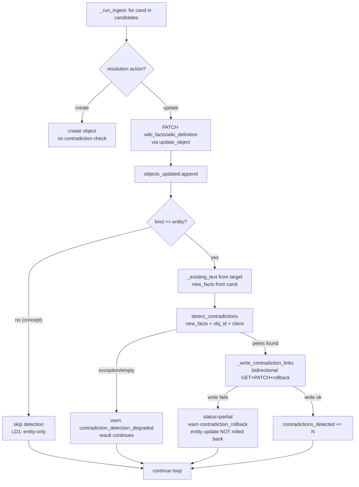
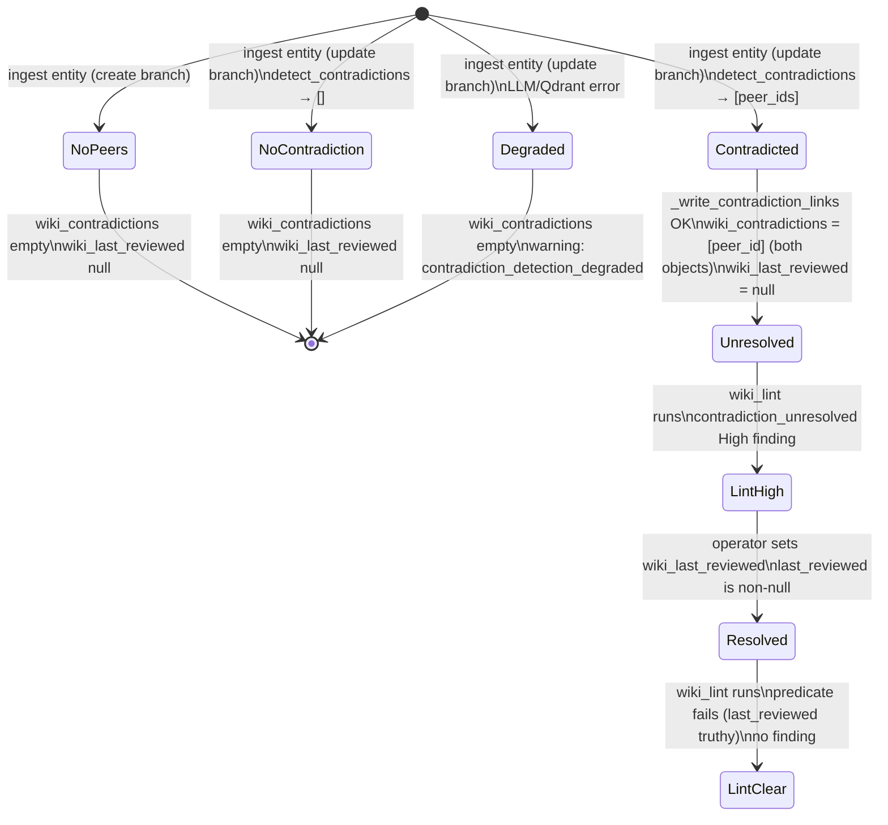

# anytype-llm-wiki v0.6.0 — Automated Cross-Object Contradiction Detection

**Status:** DRAFT
**Date:** 2026-06-05
**Author:** spec-writer agent
**Ticket:** Aldeia-IT/aldeia-box#287
**Parent spec:** `.aldeia/284-anytype-llm-wiki-v0-3-0-wiki-ingest-compile-pipeli/spec.md`
**Sibling specs referenced:**
- `#286` `.aldeia/286-anytype-llm-wiki-v0-5-0-wiki-lint-structural-healt/spec.md` (lint)
- `#289` `.aldeia/289-anytype-llm-wiki-wiki-remember-llm-assisted-agent/spec.md` (wiki_remember boundary)

---

## 1. Problem Statement

Schema v0.4.1 ships `wiki_contradictions` (format `objects`) and `wiki_last_reviewed` (format `date`) on `wiki_entity`, and the v0.5.0 lint check `contradiction_unresolved` reads them correctly. However:

- `wiki_contradictions` is never populated by the pipeline — the check is passive and always returns zero findings (lint.py:79-83 `_PASSIVE_CONTRADICTION_NOTE`, lint.py:172 `_empty_report` notes).
- The finding detail carries `"(PASSIVE check — see #287)"` (lint.py:429), so operators cannot trust a green result.

Master spec OQ#8 deferred contradiction detection to v0.6.0. This spec closes that deferral: the ingest pipeline detects cross-object contradictions at ingest time, writes `wiki_contradictions` bidirectionally, and the lint check is activated.

The Hermes contradiction policy (master spec, spec.md:204) governs this feature verbatim:

> "**Hermes' design decisions are the operational blueprint.** … contradiction handling (document both positions, flag for review, never silently overwrite) … These are portable verbatim — only the storage mechanism changes."

For cross-object contradictions specifically:
- BOTH objects retain their existing `wiki_facts` / `wiki_definition` — never overwritten.
- `wiki_contradictions` is set on BOTH objects (bidirectional) to record the link.
- `wiki_last_reviewed` is left NULL on both — signals awaiting operator review.
- No auto-merge. The system records and surfaces; humans resolve.

---

## 2. Research Summary

Full research findings are in `.aldeia/287-anytype-llm-wiki-v0-6-0-automated-contradiction-de/research.md` (questions A–H, wire-contract table, fold-in dispositions, schema findings). This section records only the five locked decisions derived from that research.

### Locked Decisions

#### LD1 — Scope: entity-only for v0.6.0

`wiki_last_reviewed` (format `date`) exists on `wiki_entity` (types_schema.py:97) only. It is absent from `wiki_concept` (types_schema.py:100-113). The lint check is already scoped to `wiki_entity` (lint.py:417 `if tk == "wiki_entity"`). Contradiction detection is therefore entity-only in this release. Extending to Concept (which requires adding `wiki_last_reviewed` to the Concept type) is a v0.6.x follow-on — see Deferred Items.

#### LD2 — No schema-property changes; WIKI_SCHEMA_VERSION stays at 0.4.1

Detection uses existing properties (`wiki_contradictions`, `wiki_last_reviewed`) — no type or property definitions change. The `resumed_partial_ingest` marker is a WikiLog `notes` string value, not a schema property, and does not require a bump. `WIKI_SCHEMA_VERSION` remains `"0.4.1"` (types_schema.py:27).

#### LD3 — Hook point: update branch of `_run_ingest`, after PATCH

The insertion point is `ingest.py:_run_ingest`, inside the `for cand in candidates:` loop, after `result["objects_updated"].append(...)` (ingest.py:542-544), in the `resolution["action"] == "update"` branch only. The create branch is skipped — no existing facts to compare against. Detection MUST NOT block ingest: on LLM or Qdrant failure degrade with warning `contradiction_detection_degraded`.

#### LD4 — Detection: new `detect_contradictions()` + `prompts/contradiction.md`

A new dedicated function `detect_contradictions(new_facts, obj_id, space_id, client, read_client)` in `ingest.py` calls `_call_ollama_prompt` (extraction.py:99-152) with a new prompt file at `src/anytype_llm_wiki/wiki/prompts/contradiction.md`. Candidate peers are bounded by objects already linked via `wiki_relations` on the target object (O(relations), not O(wiki)). Qdrant semantic pre-filter is an optional enhancement; the MVP uses only the already-linked set. Returns `list[dict]` of `{"object_id": str, "reason": str}`.

#### LD5 — `_existing_text` must move to `util.py`

`_existing_text` is defined at `remember.py:629-642`. `ingest.py` needs the same helper, but `remember.py` imports from `ingest.py` (not the reverse), so importing `_existing_text` from `remember.py` into `ingest.py` would create a circular import. Move `_existing_text` to `util.py`; update both `remember.py` and `ingest.py` to import from `util`.

### Fold-in Dispositions

| Item | Disposition |
|------|-------------|
| **E1** Ingest SLO `<2 min p95` | Aspirational budget note only — not a release gate. Record observed wall-clock in live smoke output. CI cannot measure p95. |
| **E2** Partial-state idempotency resume (#284 AC#18) | Shipped in v0.6.0. `_create_source` returns `(source_id, was_resumed: bool)`. When `was_resumed=True`, append `"resumed_partial_ingest"` to WikiLog `notes` (ingest.py:576). |
| **E3** Backlinks O(1) OQ#7 | Already resolved by v0.5.0 D1 (`lint.py:126-136 _backlinks_inbound`). No v0.6.0 action. Closed. |

---

## 3. Proposed Solution

### 3.1 Architecture Overview

Three existing files are modified; one new file is added:

| File | Change |
|------|--------|
| `wiki/ingest.py` | Hook in `_run_ingest` update branch; new `detect_contradictions()`; new `_write_contradiction_links()`; update `_create_source` for `was_resumed`; import `_existing_text` from `util` |
| `wiki/extraction.py` | No change — `_call_ollama_prompt` reused as-is |
| `wiki/lint.py` | Remove `_PASSIVE_CONTRADICTION_NOTE` (lines 79-83); update `_empty_report` notes (line 172); strip passive detail from finding (line 429); update docstrings (lines 20-22, 211-214) |
| `wiki/util.py` | Add `_existing_text` (moved from `remember.py:629`) |
| `wiki/remember.py` | Update import of `_existing_text` to use `util._existing_text` |
| `wiki/prompts/contradiction.md` | New — contradiction detection prompt (I/O contract in §3.3) |

`WIKI_SCHEMA_VERSION` is unchanged at `"0.4.1"`.

### 3.2 Ingest Hook Flow



### 3.3 Contradiction Detection: `detect_contradictions()`

**Signature:**
```python
def detect_contradictions(
    new_facts: str,
    obj_id: str,
    space_id: str,
    client: WikiClient,
    read_client: AnytypeReadClient,
) -> list[dict]:
    """Return [{object_id, reason}] for objects whose facts contradict new_facts.

    Candidates: objects already linked via wiki_relations on obj_id (O(relations)).
    Returns [] on any error — caller must treat empty as 'no contradictions detected'.
    """
```

**Algorithm:**
1. GET obj_id via `read_client.get_object(space_id, obj_id)` to read `wiki_relations`.
2. Parse linked peer ids via `_parse_relation_elements` (query.py:72).
3. For each peer id, GET via `read_client.get_object` to read `wiki_facts`.
4. Build prompt from `_load_contradiction_prompt()` + template substitution (new_facts, peer list).
5. Call `_call_ollama_prompt(ollama_base, prompt)` (extraction.py:99).
6. Parse response: expect `{"contradictions": [{"object_id": str, "reason": str}]}`.
7. Filter to object_ids in the candidate set (prevent hallucinated ids).
8. On any exception: return `[]` (caller handles degraded path).

**Prompt file:** `src/anytype_llm_wiki/wiki/prompts/contradiction.md`

I/O contract (prompt takes template vars; do NOT paste full prompt body inline):
- Input vars: `{new_claim}` (string), `{candidates}` (JSON array of `{object_id, name, facts}`)
- Output JSON shape: `{"contradictions": [{"object_id": "<id>", "reason": "<1-sentence explanation>"}]}`
- Output when no contradictions: `{"contradictions": []}`
- The prompt MUST include the anti-injection preamble pattern from `extraction.md`

**Prompt loader:**
```python
_CONTRADICTION_PROMPT_PATH = Path(__file__).parent / "prompts" / "contradiction.md"

def _load_contradiction_prompt() -> str:
    try:
        return _CONTRADICTION_PROMPT_PATH.read_text(encoding="utf-8")
    except OSError:
        return (
            "You are a contradiction detector. Given new_claim and candidates, "
            "output JSON {\"contradictions\": [{\"object_id\": str, \"reason\": str}]}.\n"
            "<new_claim>\n{new_claim}\n</new_claim>\n"
            "<candidates>\n{candidates}\n</candidates>"
        )
```

### 3.4 Bidirectional Contradiction Write: `_write_contradiction_links()`

**Signature:**
```python
def _write_contradiction_links(
    client: WikiClient,
    read_client: AnytypeReadClient,
    space_id: str,
    obj_id: str,
    peer_ids: list[str],
) -> tuple[int, list[str]]:
    """Write wiki_contradictions bidirectionally using A/B rollback pattern.

    For each peer_id:
    1. GET obj_id → read existing wiki_contradictions list → append peer_id (dedup).
    2. PATCH obj_id wiki_contradictions (A-side).
    3. GET peer_id → read existing wiki_contradictions list → append obj_id (dedup).
    4. PATCH peer_id wiki_contradictions (B-side).
    5. If B fails: revert A by PATCHing back prior A-side list. Log contradiction_rollback.

    Returns (links_written, rollback_notes).
    """
```

**Critical difference from `_write_bidirectional_relations` (ingest.py:296-351):** the existing helper does not GET current values before patching (it accumulates within a run only). `_write_contradiction_links` MUST GET each object's existing `wiki_contradictions` first to preserve previously written links.

**A/B rollback pattern** (mirrors ingest.py:340-351):
- Track `prior_a_list` before the A-side PATCH.
- If B-side PATCH raises, revert A-side to `prior_a_list`.
- Append `f"contradiction_rollback: reverted {obj_id}.wiki_contradictions (-> {peer_id}) after B-side failed: {exc}"` to rollback notes.

**Ingest status on failure:** downgrade to `"partial"`, extend `result["warnings"]` with rollback notes. Do NOT roll back the entity update — the fact write already succeeded.

**`wiki_last_reviewed` is never touched** by this function (or anywhere in the contradiction path). It remains null, signalling the contradiction awaits operator review.

### 3.5 Result Dict Extension

`_empty_result()` gains one new key:
```python
"contradictions_detected": 0,
```
Incremented by `len(peer_ids)` for each entity processed by `_write_contradiction_links` on success. This key is present in all result dicts (zero on create path, degraded path, and concept path).

### 3.6 `_create_source` Partial-Resume Signal (E2)

`_create_source` (ingest.py:613) currently returns `str | None`. Change to return `tuple[str | None, bool]` where `bool` is `was_resumed`.

```python
# In _create_source: detect reuse
if existing.get("action") == "update":
    sid = existing["target"].get("id")
    if sid:
        ...
        return sid, True   # was_resumed=True

# On create:
return obj.get("id"), False
```

In `_run_ingest` step 9:
```python
source_id, was_resumed = _create_source(client, space_id, source, markdown, result)
result["source_object_id"] = source_id
```

In step 12 (WikiLog notes, ingest.py:576):
```python
notes_parts = list(rollback_notes)
if was_resumed:
    notes_parts.append("resumed_partial_ingest")
notes = "; ".join(notes_parts) if notes_parts else "ingest"
```

### 3.7 Lint Activation Changes

Four targeted edits to `lint.py` — no predicate or severity changes:

1. **Remove `_PASSIVE_CONTRADICTION_NOTE`** (lines 79-83): delete the constant entirely.
2. **Update `_empty_report()` notes** (line 172): change `"notes": [_PASSIVE_CONTRADICTION_NOTE]` to `"notes": []`. (An empty list is the correct post-v0.6.0 default — no advisory caveat needed once the check is active.)
3. **Strip passive suffix from finding detail** (line 429): change `f"... (PASSIVE check — see #287)"` to `f"{len(contradictions)} unresolved contradiction(s) — set wiki_last_reviewed to resolve"`.
4. **Update docstrings** (lines 20-22 and 211-214): remove "The `contradiction_unresolved` check is PASSIVE until v0.6.0/#287" from both the module docstring and `wiki_lint` docstring.

The predicate (`contradictions and not last_reviewed`) and severity (`"high"`) are already correct — no logic change.

### 3.8 Wire Contract Table

Every Anytype and Ollama endpoint touched by this feature:

| Client Method | Verb | Path | Respx mock to mirror | Note |
|---|---|---|---|---|
| `WikiClient.search(space_id, query)` | **POST** | `/v1/spaces/{sid}/search` | `respx.post(f"{ANYTYPE_BASE}/v1/spaces/{sid}/search")` in `test_ingest.py capture_search` | **POST landmine — not GET.** Returns `{"data": [...], "pagination": {"has_more": false}}` |
| `WikiClient.list_tags(space_id, property_id)` | GET | `/v1/spaces/{sid}/properties/{pid}/tags` | `respx.get()` matching both `/properties/` AND `/tags` in `test_lint.py _standard_mocks:315-322` | **Property-scoped two-step landmine** — always path `/properties/{id}/tags`, NEVER space-level `/tags` alone |
| `AnytypeReadClient.get_object(space_id, obj_id)` | GET | `/v1/spaces/{sid}/objects/{oid}?format=md` | `respx.get()` matching `/objects/` AND `?` in URL in `test_lint.py _standard_mocks:328-332` | **New for #287**: read existing `wiki_contradictions` + `wiki_relations` before contradiction write |
| `WikiClient.update_object(space_id, obj_id, patch)` | PATCH | `/v1/spaces/{sid}/objects/{oid}` | `respx.patch(f"{ANYTYPE_BASE}/v1/spaces/{sid}/objects/{oid}")` in `test_ingest.py mock_patch` | Bidirectional `wiki_contradictions` write (A-side and B-side) |
| `WikiClient.create_object(space_id, ...)` | POST | `/v1/spaces/{sid}/objects` | `respx.post()` matching `/objects` (not `/search`) in `test_ingest.py` | Source, entity, WikiLog creates — inherited, no change |
| `WikiClient.list_objects(space_id)` | GET | `/v1/spaces/{sid}/objects?offset=N&limit=100` | `respx.get()` in `test_lint.py _standard_mocks` | Schema pre-check — inherited, no change |
| Ollama generate | POST | `{WIKI_EXTRACT_ENDPOINT}/api/generate` | `respx.post(f"{OLLAMA_BASE}/api/generate")` — mirror `test_extraction.py:66` | New contradiction prompt call |
| Ollama chat (fallback) | POST | `{WIKI_EXTRACT_ENDPOINT}/api/chat` | `respx.post(f"{OLLAMA_BASE}/api/chat")` — mirror `test_extraction.py:72` | Fallback if generate returns non-200 |

**WIRE LANDMINE 1 — `search` is POST:** The `WikiClient.search` method calls `POST /v1/spaces/{sid}/search`. Tests that mock this as `respx.get(...)` produce an unsatisfiable suite. Mirror `test_ingest.py capture_search` exactly. (This defect caused two extra review rounds in #289.)

**WIRE LANDMINE 2 — `list_tags` is property-scoped:** The path is `/v1/spaces/{sid}/properties/{pid}/tags`. A space-level mock at `/v1/spaces/{sid}/tags` returns 404 and is explicitly asserted as "must not be called" (test_lint.py:347-348). Always match BOTH `/properties/` AND `/tags` in the same path pattern.

### 3.9 #289 → #287 Scope Boundary

The boundary between `wiki_remember` (#289) and `wiki_ingest` (#287) is:

| Dimension | #289 `wiki_remember` | #287 `wiki_ingest` |
|---|---|---|
| Surface | Same-object (intra-entity) conflict | Cross-object contradiction |
| Trigger | `consolidate()` returns non-empty `conflicts[]` | `detect_contradictions()` finds semantic conflict between different entity objects |
| Signal written | `wiki_status = "needs-review"` | `wiki_contradictions` (objects link, bidirectional) |
| `wiki_last_reviewed` | NOT set | NOT set |
| Code surface | `remember.py:_flag_conflict_status` | New `ingest.py:_write_contradiction_links` |
| Auto-merge | No | No |

From #289 spec (spec.md:1607-1609):
> "`wiki_remember` flags intra-entity conflicts only. Cross-object contradiction detection (linking two entity objects that carry contradictory facts) is the scope of ticket #287, planned for v0.6.0. #289 MUST NOT write `wiki_contradictions` object-links as a precursor or approximation."

### 3.10 Contradiction State Machine



---

## 4. Resource Impact

**Ollama calls per ingest:** up to `1 + len(wiki_relations)` additional Ollama calls per entity on the update path. For typical entities with 0-5 existing relations, this adds at most one batch contradiction call. The contradiction prompt is sent in a single `_call_ollama_prompt` call (not one per peer) — the peer list is embedded in the prompt.

**Anytype API calls per entity:** `1 GET` (read target's wiki_relations) + `1 GET` per contradicting peer (read their `wiki_contradictions`) + `1 PATCH` per contradicting peer (write A-side) + `1 PATCH` per contradicting peer (write B-side). In practice: at most a handful of additional calls for entities with few relations.

**Ingest SLO (E1 — aspirational):** The v0.3.0 master spec noted a `<2 min p95` aspirational budget for a 10k-word source (spec.md:1624). Contradiction detection adds at most 1-3 extra Ollama calls. This is expected to stay within the budget but cannot be CI-measured (Ollama latency varies by hardware). Record observed wall-clock in the live smoke test output. Not a blocking AC.

**Memory:** negligible — one additional object dict in scope per entity during detection.

---

## 5. Security Considerations

The remote-extraction consent boundary (AC-P1/AC-S1 from #284 — inherited) already exists: `check_remote_endpoint_consent()` gates any remote Anytype URL ingest. The contradiction detection LLM call reuses the same Ollama endpoint already in use for extraction — no new remote surface.

The `wiki_relations` peer lookup reads only objects already linked within the same space by the same pipeline — no cross-space data access is introduced.

`_call_ollama_prompt` takes a pre-rendered prompt string. Peer facts passed to the contradiction prompt are read from Anytype objects (wiki_facts field), which have already passed through `sanitize_property_value`. No raw user input is interpolated into the prompt outside of already-sanitized pipeline values.

The contradiction prompt file (`contradiction.md`) MUST include the same anti-injection preamble pattern as `extraction.md` (no `{source}` injection vulnerability — the `{new_claim}` and `{candidates}` vars are system-controlled values, not raw external content).

---

## 6. Operational Considerations

**Failure modes:**
- LLM unavailable or malformed response → `detect_contradictions()` returns `[]` → `contradiction_detection_degraded` warning in result → ingest continues at `status: ok`.
- B-side PATCH fails → A-side reverted via rollback → `contradiction_rollback` warning → `status: partial`.
- Peer GET fails → that peer skipped → no rollback needed (no write attempted).

**WikiLog:** `resumed_partial_ingest` appears in `wiki_notes` when a Source is reused on re-ingest. Contradiction rollback notes appear in `wiki_notes` via the existing rollback aggregation path (ingest.py:576).

**Idempotency:** re-ingesting the same source after a contradiction was already written produces a dedup no-op: `_write_contradiction_links` GETs the existing `wiki_contradictions` list and appends+dedups before patching, so a second run does not duplicate the link.

**Monitoring:** `result["contradictions_detected"]` count is available to callers. The `contradiction_detection_degraded` warning key allows operators to detect silent failures in the detection layer.

**`doctor` green:** no new config variables or schema changes, so `doctor` requires no update.

---

## 7. Test Plan

### AC → Test Map

| # | Acceptance Criterion | Test type | Test location | Seam / mock strategy |
|---|---|---|---|---|
| **AC-1** | Ingest update of an entity whose new facts contradict an existing entity → `wiki_contradictions` set bidirectionally, `wiki_last_reviewed` NOT written | CI seam | `tests/wiki/test_ingest.py::TestContradictionDetection::test_contradiction_bidirectional_write` | respx mocks for search (POST), get_object (GET×2), update_object (PATCH×2); monkeypatch `detect_contradictions` to return `[{"object_id": "peer-id", "reason": "..."}]` |
| **AC-2** | Ingest create branch → no contradiction check, `contradictions_detected: 0` | CI seam | `tests/wiki/test_ingest.py::TestContradictionDetection::test_no_detection_on_create` | Same respx setup; search returns no existing object |
| **AC-3** | `wiki_lint` reports `contradiction_unresolved` as High finding (no passive caveat in detail or notes) | CI seam | `tests/wiki/test_lint.py::TestContradictionCheck::test_contradiction_check_active` | Seed entity with `wiki_contradictions=["obj-ref"]`, `wiki_last_reviewed=None`; assert finding severity==high, detail has no "PASSIVE", `report["notes"]` does not contain `_PASSIVE_CONTRADICTION_NOTE` string |
| **AC-4** | Setting `wiki_last_reviewed` on contradicted entity → `contradiction_unresolved` finding does NOT fire | CI seam | `tests/wiki/test_lint.py::TestContradictionCheck::test_contradiction_cleared_by_review` | Seed entity with `wiki_contradictions=["obj-ref"]` and `wiki_last_reviewed="2026-06-05T00:00:00+00:00"`; assert finding absent |
| **AC-5** | LLM failure during contradiction detection → ingest continues, `contradiction_detection_degraded` warning, `contradictions_detected: 0` | CI seam | `tests/wiki/test_ingest.py::TestContradictionDetection::test_detection_degraded` | Monkeypatch `detect_contradictions` to raise `httpx.ConnectError`; assert `result["status"] != "error"`, `"contradiction_detection_degraded"` in warnings |
| **AC-6** | Re-ingest of same source reuses existing Source; WikiLog notes contain `"resumed_partial_ingest"` | CI seam | `tests/wiki/test_ingest.py::TestReingestIdempotency::test_resumed_partial_ingest_wikilog` | respx mocks: search returns existing wiki_source; assert WikiLog PATCH/create payload contains `"resumed_partial_ingest"` in notes |
| **AC-7** | `doctor` exits 0 after v0.6.0 changes | CI | `tests/wiki/test_doctor.py` (existing) | No change needed — no new config vars |
| **AC-8** | Live: ingest two conflicting sources → `wiki_contradictions` bidirectionally set; `wiki_lint` reports High finding | Live smoke (skip-gated) | `tests/wiki/test_live.py::test_contradiction_smoke` | `@pytest.mark.live` skip guard; live Anytype space; real Ollama |
| **AC-9** | Live SLO observation: wall-clock of v0.6.0 ingest on pinned Wikipedia fixture printed to output | Live smoke (skip-gated) | `tests/wiki/test_live.py::test_ingest_slo_observation` | `@pytest.mark.live`; `time.monotonic()` bracketing; assert is informational print only |

### Existing test changes required

- `test_lint.py::TestContradictionCheck::test_contradiction_check_passive` — remove assertion that `report["notes"]` contains `_PASSIVE_CONTRADICTION_NOTE`; rename to `test_contradiction_check_active`; assert notes is empty list.
- Any test that asserts `_create_source` returns a bare `str` must be updated for the new `(str, bool)` return type.

### Seam test pattern (applies to AC-1 through AC-6)

All CI seam tests follow the #284 lesson: fake WikiClient via respx + monkeypatched `extract`, `consolidate`, and `detect_contradictions`. No live Anytype connection. Core promise is CI-runnable, not skip-gated.

---

## 8. Implementation Plan

Ordered steps; each step is independently committable:

1. **Move `_existing_text` to `util.py`** — copy `remember.py:629-642` into `util.py`; update `remember.py` to `from .util import _existing_text`; add import to `ingest.py`. Verify `test_remember.py` and `test_ingest.py` still pass.

2. **`_create_source` returns `(source_id, was_resumed)`** — change return type to `tuple[str | None, bool]`; update all callers in `ingest.py` (two sites: the result assignment and the empty-source early-return path). Update `test_ingest.py` assertions.

3. **WikiLog `resumed_partial_ingest` note** — in `_run_ingest` step 12, add `was_resumed` to notes assembly. Add `test_resumed_partial_ingest_wikilog` seam test (AC-6).

4. **New prompt file `prompts/contradiction.md`** — write the contradiction detection prompt (anti-injection preamble, `{new_claim}`, `{candidates}` template vars, JSON output schema). Keep it short and deterministic (`_DETERMINISTIC_OPTS` will be used by `_call_ollama_prompt` automatically).

5. **`detect_contradictions()` in `ingest.py`** — implement the function per §3.3; add `_load_contradiction_prompt()`; add `_CONTRADICTION_PROMPT_PATH` module-level constant.

6. **`_write_contradiction_links()` in `ingest.py`** — implement per §3.4 with GET-before-PATCH and A/B rollback.

7. **Hook in `_run_ingest` update branch** — insert the entity-only detection call after `ingest.py:544`; extend `_empty_result()` with `contradictions_detected: 0`; wire `was_resumed` from step 3.

8. **Lint activation** — four targeted edits to `lint.py` per §3.7.

9. **Seam tests** — implement AC-1 through AC-6 in `tests/wiki/test_ingest.py` and `tests/wiki/test_lint.py`; update existing `TestContradictionCheck` per §7.

10. **Live smoke tests** — add `test_contradiction_smoke` and `test_ingest_slo_observation` to `tests/wiki/test_live.py` (skip-gated with `@pytest.mark.live`).

11. **Docs sweep** — update `README.md` ingest + lint sections, feature matrix, version table. Update `CHANGELOG.md` v0.6.0 entry. Update master spec OQ#8 resolution note.

---

## 9. Open Questions

None. All questions from research.md (A–H) are resolved by the locked decisions above. The spec is complete as of 2026-06-05.

---

## 10. Deferred Items

### DI-1: Concept-scope contradiction detection

`wiki_contradictions` exists on `wiki_concept` (types_schema.py:111) but `wiki_last_reviewed` does not (types_schema.py:100-113). Extending contradiction detection and the lint check to Concepts requires:
1. Adding `wiki_last_reviewed` to the `wiki_concept` type definition in `types_schema.py`.
2. Bumping `WIKI_SCHEMA_VERSION` (e.g., to `0.5.0`) and adding a migration entry.
3. Removing the `if tk == "wiki_entity":` guard from `lint.py:417`.

Deferred to v0.6.x. Not a v0.6.0 delivery item.

### DI-2: Hard ingest SLO gate

A p95 `<2 min` blocking AC requires CI infrastructure with consistent hardware and a live Ollama instance. Not feasible in the current test suite. Revisit as a hard gate in v0.7.0+ if the CI environment gains a stable Ollama fixture. For v0.6.0: aspirational budget only, observed via live smoke test output.

### DI-3: Qdrant semantic pre-filter for contradiction candidates

The MVP bounds candidates to already-linked peers (via `wiki_relations`). A Qdrant semantic pre-filter (ANN search over embedded `wiki_facts`) would catch contradictions between unrelated entities. This requires the Qdrant index to be populated and adds one embedding call per entity update. Deferred to v0.6.x as an enhancement to `detect_contradictions()`.

---

## Alternatives Considered

- **Extend `consolidate.md` for cross-object detection** (research §B Option 1): rejected — requires passing all other objects' facts to the LLM, expensive and noisy at O(wiki) scale.
- **Reuse `consolidate()` per peer** (research §B Option 3): rejected — N calls per updated object with the full consolidate overhead; new dedicated prompt is cleaner and cheaper.
- **WIKI_SCHEMA_VERSION bump to 0.5.0**: rejected — no type or property definitions change in v0.6.0 (detection uses existing properties; `resumed_partial_ingest` is a notes string value). Version stays at `0.4.1`.
- **Insert hook before PATCH** (research §A alt): rejected — complicates "degraded detection must not block ingest" requirement; after-PATCH insertion is simpler.
