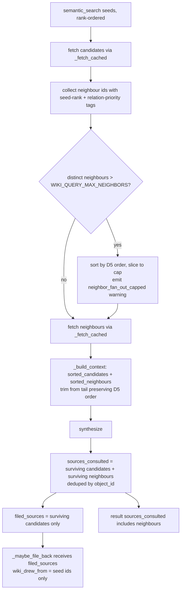

# wiki_query #324 — Relationship-Aware Retrieval (delta over v0.4.0)

**Status:** SPEC
**Date:** 2026-06-11
**Author:** spec-writer agent
**Review rounds:** 0
**Ticket:** #324 (Aldeia-IT/aldeia-box)
**Epic:** #140
**Parent spec:** `.aldeia/285-anytype-llm-wiki-v0-4-0-wiki-query-tiered-retrieva/spec.md` (status: SPEC)

---

## Nature of This Spec

DELTA spec over #285. `wiki_query` already does 1-hop neighbour traversal
(v0.4.0). This document describes only what changes. All locked #285 invariants
(SF1–SF11, QA#25, QA#30, Decisions 1–4, the error/status table, deeplink format,
the injection-amplifier bound) remain in force and are referenced by ID below
rather than recopied.

---

## Problem Statement

Four gaps remain after v0.4.0:

| # | Current behaviour | #324 desired |
|---|-------------------|--------------|
| 1 | Neighbours feed synthesis context but are not in `sources_consulted` (query.py:738-740). | Surviving neighbours that fed synthesis are cited in `sources_consulted`. |
| 2 | `_RELATION_KEYS` missing `wiki_sources`; relation set is under-specified. | Explicit final set of 5 keys with rationale. |
| 3 | Over-budget trim drops neighbours in discovery order (no relation priority). | Deterministic trim: seed rank, then relation priority. |
| 4 | Neighbour get_object fan-out is unbounded; added API calls are not logged. | Configurable global cap before fetching; cap-trigger warning; debug log. |

The net effect of gap #1 is citation dishonesty: the model's answer may draw on
neighbour content but the caller sees only seeds in `sources_consulted`. Gap #4
is a latency/availability risk flagged by #287 (HIGH): Anytype SEARCH does not
hydrate relation arrays; every neighbour requires a real HTTP `get_object`.

---

## Proposed Solution

### D1 — Cite surviving neighbours

Redefine `sources_consulted` in the result: surviving candidates **and**
surviving neighbours that were included in synthesis context, deduped by
`object_id`. Each entry is built identically via the existing helpers:

```python
{
    "title":    obj.get("name", ""),
    "type":     _short_type(_type_of(obj)),
    "object_id": oid,
    "deeplink": _bootstrap._object_deeplink(space_id, oid),
}
```

`_short_type` and `_object_deeplink` are reused unchanged (research Q3,
query.py:255-262, bootstrap.py:83-84).

The change is in `_build_context` (query.py:738-740): extend `contributing` to
include surviving neighbours alongside surviving candidates. The call site
(query.py:562-573) iterates `contributing` to build `sources_consulted`;
no new helpers are required.

### D2 — File-back stays seed-only (preserving #285 SF1 injection-amplifier bound)

`_maybe_file_back` must continue to operate on **candidates only**, not on
neighbours. The mechanism: introduce a separate `filed_sources` list (= surviving
candidates after `_build_context`) and pass it to `_maybe_file_back` in place of
the combined `sources_consulted`. The result's `sources_consulted` carries all
surviving contributing objects (seeds + neighbours). The `_maybe_file_back`
signature acquires one new parameter:

```python
def _maybe_file_back(write_client, read_client, space_id, question, answer,
                     sources_consulted, filed_sources, file_back, cache, enum_map=None):
```

`filed_sources` is used for the min-sources gate count, the SF4
`_refetch_for_writeback` loop, and the `wiki_drew_from` write. `sources_consulted`
is returned in the result but does NOT feed the gate or `wiki_drew_from`.

Rationale: the min-sources(3) gate and the `wiki_drew_from` provenance edge were
designed for seeds (#285 SF1). Routing neighbours through the gate changes its
calibration; routing them through the SF4 `_refetch_for_writeback` loop adds
O(surviving neighbours) fresh `get_object` calls at write time on top of the
already-added fetch-phase calls. More critically, the injection-amplifier bound
(#285 SF1 note at query.py:18-22) is formally grounded on seeds only; expanding
it to neighbours is a scope change that belongs to a dedicated ticket, not a
delta.

### D3 — Relation set: 5 keys (wiki_subjects retained)

Final `_RELATION_KEYS` constant:

```python
_RELATION_KEYS = (
    "wiki_relations",   # entity → related entities
    "wiki_related",     # concept → related concepts
    "wiki_sources",     # entity/concept/comparison → source objects (NEW)
    "wiki_drew_from",   # query → cited sources
    "wiki_subjects",    # comparison → compared subjects (RETAINED — see note)
)
```

`wiki_sources` is **added**: it is a property on `wiki_entity`, `wiki_concept`,
and `wiki_comparison` (types_schema.py:93, 109, 124) and represents the
"citations a fact was drawn from" edge. Its absence from v0.4.0 was confirmed
a gap by research (research.md Gap Verification).

`wiki_subjects` is **retained** despite not appearing in the #324 four-key spec
brief. It is a real `wiki_comparison`-only relation (types_schema.py:121) that
links compared subjects; dropping it silently breaks comparison→subject traversal
that v0.4.0 shipped. This is a deliberate deviation from the four-key spec brief.
**Reviewers/Jan: please confirm or veto `wiki_subjects` retention before
implementation begins.**

Relation priority order (used by D5 deterministic ordering):
`wiki_relations > wiki_related > wiki_sources > wiki_drew_from > wiki_subjects`

### D4 — Bounded fan-out (new config knob)

New knob `WIKI_QUERY_MAX_NEIGHBORS` in `config.py`:

```python
DEFAULT_WIKI_QUERY_MAX_NEIGHBORS = 32

def query_max_neighbors() -> int:
    return _positive_int("WIKI_QUERY_MAX_NEIGHBORS", DEFAULT_WIKI_QUERY_MAX_NEIGHBORS)
```

`_positive_int` is the existing SF10 guard (config.py:50-62); rejects 0/negative,
returns default on non-numeric input. Resolved per-call (not cached at import).

Semantics: **global cap** on the total distinct neighbour ids assembled (after
dedup vs. seeds, **before** the `get_object` fetch loop). When the distinct set
exceeds the cap, neighbours are ordered by D5 and the tail is dropped with a
`result["warnings"]` entry:

```
neighbor_fan_out_capped: {original} -> {capped}
```

This is machine-readable and consistent with the existing `synthesis_context_trimmed`
warning pattern (#285 B5). Seeds are already bounded at `limit=10` by
`semantic_search_core`; the cap bounds neighbours only.

### D5 — Deterministic ordering (single total order)

One ordering is defined and reused in two places: (a) selecting which neighbours
survive the D4 fan-out cap, and (b) ordering neighbours within `_build_context`
for the trim (replacing the current `list(neighbors)` append).

Total order over neighbours:

1. **Primary: seed rank** — the 0-indexed position of the seed that first
   discovered this neighbour in the `candidate_entries` list. Tier-2: rank by
   score-descending order from `semantic_search_core` (research Q1 confirms
   results are in rank order). Tier-1: enumeration order. Lower rank index =
   higher priority.
2. **Secondary: relation priority** — `wiki_relations` (0) > `wiki_related` (1)
   > `wiki_sources` (2) > `wiki_drew_from` (3) > `wiki_subjects` (4). Lower
   priority index = higher priority.
3. **Tie-break: `object_id`** (lexicographic, ascending) for full determinism.

During seed-fetch (query.py:520-522), each neighbour id is tagged with the rank
of the seed that first discovered it and the priority of the relation key it was
found under. The `neighbor_ids` list is assembled in this order so both the
fan-out cap (slice from tail) and `_build_context` ordering drop from the least
relevant end.

`_build_context` is updated: replace `list(neighbors)` with
`sorted_neighbors` (already in D5 order from assembly), preserving the
`sorted_candidates + sorted_neighbors` concatenation. The trim-from-tail (#285
B5) naturally drops lowest-priority neighbours first, then weakest candidates.

### D6 — Measurability

Emit `logger.debug` immediately before the neighbour fetch loop:

```python
logger.debug(
    "neighbor_fanout: seeds=%d distinct_neighbours=%d fetching=%d cap=%d",
    len(candidates), len(distinct_neighbor_ids), fetch_count, cap,
)
```

Where `fetching` = `min(distinct, cap)`. This is observable with
`WIKI_LOG_LEVEL=debug` without polluting the result dict. The cap-trigger
warning in `result["warnings"]` is the operator-visible signal.

---

## Flow Summary



---

## Wire Contract

Unchanged from #285. Both seed and neighbour reads share one code path:

| Call | Verb + Path | Mock to mirror |
|------|-------------|----------------|
| `AnytypeReadClient.get_object` (seeds + neighbours) | `GET /v1/spaces/{space_id}/objects/{object_id}?format=md` | `test_query_fetch_paths.py` single-dispatcher pattern; `_obj_id_from_request` strips `?format=md` |
| `WikiClient.list_objects` | `GET /v1/spaces/{space_id}/objects?offset=N&limit=N` | `_is_list_request` branch in dispatcher |
| `WikiClient.create_object` | `POST /v1/spaces/{space_id}/objects` | `respx.post().mock(return_value=...)` |
| `WikiClient.update_object` | `PATCH /v1/spaces/{space_id}/objects/{object_id}` | `respx.patch().mock(side_effect=track_patch)` |

New tests go in `tests/wiki/test_query_fetch_paths.py` (single-dispatcher
pattern — research Q5). Do NOT add route-ordering-dependent tests to
`test_query.py`; the catch-all GET there shadows specific `get_object` routes
(test_query.py:566-574 skipped tests, pointer to this file).

---

## Configuration

Add to `src/anytype_llm_wiki/wiki/config.py`:

```python
DEFAULT_WIKI_QUERY_MAX_NEIGHBORS = 32

def query_max_neighbors() -> int:
    """Resolve WIKI_QUERY_MAX_NEIGHBORS — global cap on distinct neighbour ids
    fetched per query (default 32). Applied after seed-dedup, before fetch loop.
    Rejects 0/negative (SF10 _positive_int guard)."""
    return _positive_int("WIKI_QUERY_MAX_NEIGHBORS", DEFAULT_WIKI_QUERY_MAX_NEIGHBORS)
```

Add to `.env.example` under the `# --- v0.4.0 wiki_query` block:

```
# WIKI_QUERY_MAX_NEIGHBORS=32   # global cap on neighbour get_object calls per query
```

Default 32: covers ~10 seeds × 3-4 neighbours each; provides 8 slots of headroom
above `WIKI_SYNTH_MAX_OBJECTS=24`; empirically bounded for a local-device Anytype
install (research Q6).

---

## Resource Impact

**Added API calls per query:** at most `min(distinct_neighbours, WIKI_QUERY_MAX_NEIGHBORS)`
additional `get_object` calls. At the default cap of 32, worst case is 32 extra
GETs on top of the 10 seed GETs already present in v0.4.0.

**Per-call latency:** each `get_object` to local Anytype is a localhost loopback
HTTP call. At an observed ~5–20ms per call on a Mac Mini M4, 32 calls ≈ 160–640ms
added latency. Acceptable for an interactive MCP tool. The per-run object cache
(#285 QA-12) prevents duplicate fetches; a neighbour shared by two seeds is
fetched once.

**Write-time impact (D2):** `_maybe_file_back` uses only seeds (`filed_sources`),
so the SF4 `_refetch_for_writeback` loop size is unchanged from v0.4.0 (≤ 10
seeds). No additional write-time GETs are added.

**No QueryResult schema change:** `sources_consulted` already accepts any number
of entries; the entry structure is unchanged. No new required fields.

---

## Security Considerations

All inherited #285 security invariants remain in force. Specifically:

**SF1 injection-amplifier bound:** `_maybe_file_back` receives `filed_sources`
(seeds only), so the `wiki_drew_from` provenance edge and the min-sources gate
remain seed-scoped. Neighbour content enters `sources_consulted` for answer
transparency but not the filed Query object.

**No new attacker surface:** neighbours are fetched by object ID (server-controlled
IDs from the vault, not user-supplied). No SSRF risk. All neighbour object names
and content pass through the existing `<context>` fence and `_safe_object_name`
policy unchanged.

---

## Acceptance Criteria

**AC1 — Neighbour citation.** `sources_consulted` in the result includes entries
for surviving neighbours that fed synthesis, built identically to candidate entries
(`title`, `type`, `object_id`, `deeplink`). A test with one seed + one neighbour
asserts the neighbour appears in `sources_consulted`.

**AC2 — Relation set (5 keys).** `_RELATION_KEYS = ("wiki_relations",
"wiki_related", "wiki_sources", "wiki_drew_from", "wiki_subjects")`. A test
seeding a `wiki_comparison` with `wiki_sources` objects asserts those objects are
traversed. A test seeding a `wiki_comparison` with `wiki_subjects` objects asserts
those subjects are also traversed.

**AC3 — Dedup by object_id.** An object that is both a seed and a neighbour of
another seed appears exactly once in `sources_consulted` and counts once toward
any gate. No object id appears twice in `sources_consulted`. (Existing dedup
behaviour from #285 is preserved and extended to cover the combined set.)

**AC4 — Deterministic trim order.** When synthesis context exceeds the budget,
neighbours are dropped from the tail in D5 order (lowest seed-rank and
lowest relation-priority dropped last). A test with candidates and neighbours of
mixed seed ranks asserts that a higher-rank-seed neighbour survives while a
lower-rank-seed neighbour is dropped.

**AC5 — Bounded fan-out with cap warning.** When distinct neighbour ids exceed
`WIKI_QUERY_MAX_NEIGHBORS`, the excess is dropped before fetching and
`result["warnings"]` contains `"neighbor_fan_out_capped: {original} -> {capped}"`.
A test with more than cap neighbours (cap monkeypatched to a small value) asserts
the warning and the correct number of neighbours fetched.

**AC6 — Fan-out measurability.** A `logger.debug` line is emitted with seeds,
distinct-neighbours, fetching, and cap counts. Test via `caplog` or monkeypatch of
the logger.

**AC7 — File-back seed-only (D2 guard).** When neighbours are cited in
`sources_consulted`, the filed Query's `wiki_drew_from` contains only seed
(candidate) object ids. The min-sources gate counts only seeds. A test with 2
seeds (meets gate with min=2) + 3 neighbours (would exceed gate if counted)
asserts the PATCH payload for `wiki_drew_from` contains exactly the 2 seed ids.

**AC8 — get_object hydration.** Neighbour objects are fetched via `_fetch_cached`
→ `AnytypeReadClient.get_object` → `GET /v1/spaces/{space_id}/objects/{nid}?format=md`.
The dispatcher in `test_query_fetch_paths.py` records fetch counts; assert each
neighbour id is fetched at most once (per-run cache invariant from #285 QA-12).

**AC9 — Budget trim order (seeds last).** The existing `test_synthesis_context_budget_trims_neighbors_first` (test_query.py) must be extended to assert that
neighbours are still dropped before candidates, and that within neighbours the D5
order governs which are retained.

**AC10 — Config knob validation.** `WIKI_QUERY_MAX_NEIGHBORS=0` and
`WIKI_QUERY_MAX_NEIGHBORS=-1` both fall back to 32 (SF10 `_positive_int` guard).
Non-numeric input falls back to 32.

---

## Test Plan

All new tests go in `tests/wiki/test_query_fetch_paths.py` using the
single-dispatcher respx pattern (research Q5). Tests asserting result-dict shape
with no fetch-count assertions may go in `tests/wiki/test_query.py` but only
with the existing catch-all GET mock.

| AC | Test name | File | What it asserts |
|----|-----------|------|-----------------|
| AC1 | `TestNeighbourCitation::test_surviving_neighbour_in_sources_consulted` | `test_query_fetch_paths.py` | 1 seed + 1 neighbour → neighbour entry in `sources_consulted` with correct `object_id` and `deeplink` |
| AC1, AC3 | `TestNeighbourCitation::test_sources_consulted_deduped_seed_and_neighbour` | `test_query_fetch_paths.py` | object shared as seed + neighbour appears once in `sources_consulted` |
| AC2 | `test_wiki_sources_relation_traversed` | `test_query.py` | seed with `wiki_sources` objects → those objects fetched |
| AC2 | `test_wiki_subjects_relation_traversed` | `test_query.py` | comparison seed with `wiki_subjects` objects → those objects fetched |
| AC4 | `TestDeterministicTrimOrder::test_higher_rank_seed_neighbour_survives_trim` | `test_query_fetch_paths.py` | budget-exceeded context; neighbour from seed-rank-0 survives; neighbour from seed-rank-1 dropped |
| AC5 | `TestFanOutCap::test_cap_warning_emitted_when_exceeded` | `test_query_fetch_paths.py` | `WIKI_QUERY_MAX_NEIGHBORS=2`, 5 distinct neighbours → `neighbor_fan_out_capped: 5 -> 2` in warnings; `fetch_counts` shows at most 2 neighbour ids fetched |
| AC6 | `test_fanout_debug_logged` | `test_query_fetch_paths.py` | `caplog` at DEBUG level contains `neighbor_fanout:` line with correct counts |
| AC7 | `TestFileBackSeedOnly::test_drew_from_excludes_neighbours` | `test_query_fetch_paths.py` | 2 seeds + 3 neighbours; `WIKI_FILE_BACK_MIN_SOURCES=2`; PATCH for `wiki_drew_from` contains only the 2 seed ids |
| AC8 | `TestNeighbourCacheReplacement::test_shared_neighbour_fetched_once` | `test_query_fetch_paths.py` | already exists; verify it covers the new code path post-D5 ordering |
| AC9 | `test_synthesis_context_budget_trims_neighbors_first` (extended) | `test_query.py` | extend existing test to assert D5 ordering within neighbours |
| AC10 | `test_query_max_neighbors_config_rejects_zero_and_negative` | `test_query.py` | monkeypatch env vars; assert `query_max_neighbors()` returns 32 for 0, -1, `"bad"` |

**Note on get_object wire path for new tests:**
`GET http://127.0.0.1:31012/v1/spaces/{space_id}/objects/{object_id}?format=md`
Use `_obj_id_from_request` (strips `?format=md` via `split("?")[0]`) and
`_is_list_request` (ends with `/objects`) from the existing helper block at
`test_query_fetch_paths.py:56-70`. Reuse without modification.

**Note on PATCH tracking:**
`respx.patch().mock(side_effect=track_patch)` pattern (test_query_fetch_paths.py:149-157).
For AC7, extract `objects` from the `wiki_drew_from` property in the PATCH payload
and assert it contains only seed ids.

---

## Implementation Plan

### Files changed

| File | Change |
|------|--------|
| `src/anytype_llm_wiki/wiki/query.py` | Change `_RELATION_KEYS`; update `_neighbor_ids_of` tagging; reorder neighbour assembly in D5 order; apply cap + warning; update `_build_context` contributing set; split `filed_sources`; update `_maybe_file_back` signature; add debug log |
| `src/anytype_llm_wiki/wiki/config.py` | Add `DEFAULT_WIKI_QUERY_MAX_NEIGHBORS = 32` and `query_max_neighbors()` accessor |
| `.env.example` | Add `# WIKI_QUERY_MAX_NEIGHBORS=32` under v0.4.0 block |
| `tests/wiki/test_query_fetch_paths.py` | Add `TestNeighbourCitation`, `TestFanOutCap`, `TestDeterministicTrimOrder`, `TestFileBackSeedOnly` classes; extend `TestNeighbourhoodCacheReplacement` |
| `tests/wiki/test_query.py` | Add AC2, AC9 (extend), AC10 tests |
| `README.md` | Update roadmap line for #324 → shipped |

### Ordering

1. `config.py`: add `DEFAULT_WIKI_QUERY_MAX_NEIGHBORS` + `query_max_neighbors()`.
2. `query.py` — `_RELATION_KEYS`: add `wiki_sources`, retain `wiki_subjects`.
3. `query.py` — neighbour assembly: tag each id with `(seed_rank, relation_priority, object_id)`; sort; apply cap + warning; emit debug log.
4. `query.py` — `_build_context`: update `contributing` to include surviving neighbours; the `sorted_candidates + sorted_neighbours` list is already in trim-safe order.
5. `query.py` — split `filed_sources = [c for c in ordered if c["object_id"] in candidate_id_set_before_trim]`; update `_maybe_file_back` call site.
6. `query.py` — `_maybe_file_back`: add `filed_sources` parameter; use it for gate + SF4 loop + `wiki_drew_from`; leave `sources_consulted` parameter for any callers that inspect it (result dict only).
7. Tests: write `test_query_fetch_paths.py` additions first (they verify wire behaviour); then `test_query.py` additions.
8. `.env.example` + `README.md`.

---

## Alternatives Considered

| Option | Rejected because |
|--------|-----------------|
| Full provenance: neighbours enter `wiki_drew_from` + min-sources gate (option b, research Q4) | Expands the #285 SF1 injection-amplifier surface; adds O(neighbours) `_refetch_for_writeback` GETs at write time; gate calibration changes. Simpler code but wrong scope for a delta ticket. |
| Strict four-key set (drop `wiki_subjects`) | `wiki_subjects` is a real v0.4.0 traversal edge on `wiki_comparison`; silent regression on comparison→subject 1-hop. Dropping it is out of scope for a correctness ticket. |
| Per-seed cap instead of global cap | More complex (inner counter per seed); no material difference at default budget of 32; global cap is simpler and sufficient given D5 ordering ensures relevant neighbours survive. |
| Both per-seed + global cap | Over-engineered; two knobs; defer if a single over-linked seed causes problems in practice. |
| Add `neighbour_fetch_count` to result dict | Bloats the result contract unnecessarily; `logger.debug` + cap warning are sufficient for observability without a schema change. |

---

## Open Questions

**OQ1 — `wiki_subjects` retention (flag for Jan/lead):** The spec retains
`wiki_subjects` as a deliberate deviation from the four-key #324 brief. If the
intent is strict four-key alignment, drop `wiki_subjects` from `_RELATION_KEYS`
and AC2 shrinks by one case. No other spec change needed. Reviewers must confirm
before implementation.

---

## Deferred Items

- Per-seed neighbour cap: deferred pending evidence that a single over-linked
  object dominates fan-out in practice.
- Citing neighbours in `wiki_drew_from`: full provenance deferred to a dedicated
  graph-provenance ticket; the current split (cite in result, file seeds only)
  is the conservative baseline.
- Multi-hop (>1) traversal: explicitly out of scope (#285 deferred item, still
  deferred).
