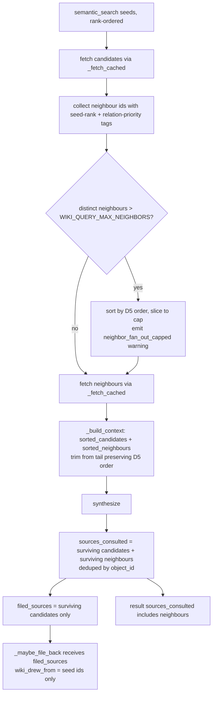

# wiki_query #324 — Relationship-Aware Retrieval (delta over v0.4.0)

**Status:** SPEC
**Date:** 2026-06-11
**Author:** spec-writer agent
**Review rounds:** 1
**Ticket:** #324 (Aldeia-IT/aldeia-box)
**Epic:** #140
**Parent spec:** `.aldeia/285-anytype-llm-wiki-v0-4-0-wiki-query-tiered-retrieva/spec.md` (status: SPEC)

---

## Nature of This Spec

DELTA spec over #285. `wiki_query` already does 1-hop neighbour traversal
(v0.4.0). This document describes only what changes. All locked #285 invariants
(SF1–SF11, QA#25, QA#30, Decisions 1–4, the error/status table, deeplink format,
the injection-amplifier bound) remain in force and are referenced by ID below
rather than recopied.

---

## Problem Statement

Four gaps remain after v0.4.0:

| # | Current behaviour | #324 desired |
|---|-------------------|--------------|
| 1 | Neighbours feed synthesis context but are not in `sources_consulted` (query.py:738-740). | Surviving neighbours that fed synthesis are cited in `sources_consulted`. |
| 2 | `_RELATION_KEYS` missing `wiki_sources`; relation set is under-specified. | Explicit final set of 5 keys with rationale. |
| 3 | Over-budget trim drops neighbours in discovery order (no relation priority). | Deterministic trim: seed rank, then relation priority. |
| 4 | Neighbour get_object fan-out is unbounded; added API calls are not logged. | Configurable global cap before fetching; cap-trigger warning; debug log. |

The net effect of gap #1 is citation dishonesty: the model's answer may draw on
neighbour content but the caller sees only seeds in `sources_consulted`. Gap #4
is a latency/availability risk flagged by #287 (HIGH): Anytype SEARCH does not
hydrate relation arrays; every neighbour requires a real HTTP `get_object`.

---

## Proposed Solution

### D1 — Cite surviving neighbours

Redefine `sources_consulted` in the result: surviving candidates **and**
surviving neighbours that were included in synthesis context, deduped by
`object_id`.

**`_build_context` return-shape change (B2).** Today `_build_context`
(query.py:690-742) returns `(context_objects, contributing, trim_warnings)`
where `contributing` is the surviving *candidates only*. It changes to return
**four** values:

```python
def _build_context(candidates, neighbors, warnings_sink):
    # ... existing trim logic over `ordered` ...
    return context_objects, surviving_candidates, surviving_neighbours, trim_warnings
```

The candidate/neighbour split is determined by membership, **not** by the
`score == -1.0` sentinel or list position (both fragile). After the trim,
compute `surviving_ids = {e["obj"].get("id") for e in ordered}`, then partition
against the existing `candidate_id_set` (query.py:525) / `candidate_id_order`
(query.py:508):

```python
surviving_candidates  = [c for c in candidates if c["object_id"] in surviving_ids]
surviving_neighbours  = [n for n in neighbors  if n["object_id"] in surviving_ids]
```

The caller (query.py:553-573) then builds:

- `sources_consulted` = entries for `surviving_candidates + surviving_neighbours`
  (D1).
- `filed_sources` = `surviving_candidates` only, passed to `_maybe_file_back`
  (D2).

Each `sources_consulted` entry is built via the existing helpers
(`_short_type`, `_object_deeplink` — query.py:255-262, bootstrap.py:83-84),
with the citation `title` routed through `_safe_object_name` (see SF-B):

```python
{
    "title":    _safe_object_name(obj, result["warnings"]),
    "type":     _short_type(_type_of(obj)),
    "object_id": oid,
    "deeplink": _bootstrap._object_deeplink(space_id, oid),
}
```

No new helpers beyond the signature change are required.

### D2 — File-back stays seed-only (preserving #285 SF1 injection-amplifier bound)

`_maybe_file_back` must continue to operate on **candidates only**, not on
neighbours. Post-D1, the combined `sources_consulted` includes neighbours, so the
filed-source set must be passed separately. Because *only* the filed set feeds the
gate, the SF4 loop, and the `wiki_drew_from` write — `sources_consulted` is no
longer read inside `_maybe_file_back` at all — the cleanest change is to **replace**
the `sources_consulted` parameter with `filed_sources` rather than add a second
one (SF-I).

```python
# before (query.py:777-778)
def _maybe_file_back(write_client, read_client, space_id, question, answer,
                     sources_consulted, file_back, cache, enum_map=None):
# after
def _maybe_file_back(write_client, read_client, space_id, question, answer,
                     filed_sources, file_back, cache, enum_map=None):
```

The body uses `filed_sources` everywhere the old `sources_consulted` appeared
(gate count query.py:802, SF4 `_refetch_for_writeback` loop query.py:808-817,
`wiki_drew_from` write); the sole caller (query.py:595-597) passes
`surviving_candidates`. The result dict's `sources_consulted` never enters
`_maybe_file_back`.

Rationale: the min-sources(3) gate and `wiki_drew_from` were designed for seeds
(#285 SF1). Routing neighbours through them would change gate calibration, add
O(neighbours) write-time `_refetch_for_writeback` GETs, and — critically — expand
the injection-amplifier bound (query.py:18-22), which is formally grounded on seeds
only. That is a dedicated-ticket scope change, not a delta. The split is
**behaviour-preserving** for the gate (SG-2): pre-#324 only candidates reached
`_maybe_file_back`, so passing `surviving_candidates` reproduces the v0.4.0 input —
a refactor forced by D1, not a new safeguard.

### D3 — Relation set: 5 keys (wiki_subjects retained)

Final `_RELATION_KEYS` constant:

```python
_RELATION_KEYS = (
    "wiki_relations",   # entity → related entities
    "wiki_related",     # concept → related concepts
    "wiki_sources",     # entity/concept/comparison → source objects (NEW)
    "wiki_drew_from",   # query → cited sources
    "wiki_subjects",    # comparison → compared subjects (RETAINED — see note)
)
```

`wiki_sources` is **added**: it is a property on `wiki_entity`, `wiki_concept`,
and `wiki_comparison` (types_schema.py:93, 109, 124) and represents the
"citations a fact was drawn from" edge. Its absence from v0.4.0 was confirmed
a gap by research (research.md Gap Verification).

`wiki_subjects` is **retained** despite not appearing in the #324 four-key spec
brief. It is a real `wiki_comparison`-only relation (types_schema.py:121) that
links compared subjects; dropping it silently breaks comparison→subject traversal
that v0.4.0 shipped. This is a deliberate deviation from the four-key spec brief.
**Reviewers/Jan: please confirm or veto `wiki_subjects` retention before
implementation begins** (OQ1 — genuine product-intent call).

`wiki_contradictions` is **deliberately deferred, not added** (SF-C) — giving it
the same explicit treatment as `wiki_subjects`. It is an `objects`-format relation
on `wiki_entity` (types_schema.py:95) and `wiki_concept` (types_schema.py:111) that
qualifies mechanically, but unlike the four relevance edges above it is
*adversarial* context: co-locating a contradicting source with its seed in one
`<context>` fence and filing the synthesis back conflates provenance against the
#285 SF1 bound. Surfacing contradictions is a distinct retrieval feature, not a
1-hop relevance expansion — see Deferred Items.

Relation priority order (used by D5 deterministic ordering):
`wiki_relations > wiki_related > wiki_sources > wiki_drew_from > wiki_subjects`

### D4 — Bounded fan-out (new config knob)

New knob `WIKI_QUERY_MAX_NEIGHBORS` in `config.py`:

```python
DEFAULT_WIKI_QUERY_MAX_NEIGHBORS = 16

def query_max_neighbors() -> int:
    return _positive_int("WIKI_QUERY_MAX_NEIGHBORS", DEFAULT_WIKI_QUERY_MAX_NEIGHBORS)
```

`_positive_int` is the existing SF10 guard (config.py:50-62); rejects 0/negative,
returns default on non-numeric input. Resolved per-call (not cached at import).

Semantics: **global cap** on the total distinct neighbour ids assembled (after
dedup vs. seeds, **before** the `get_object` fetch loop). When the distinct set
exceeds the cap, neighbours are ordered by D5 and the tail is dropped with a
`result["warnings"]` entry (note: the separator is ASCII `->`, not Unicode `→` —
SG-1; tests assert the exact string):

```
neighbor_fan_out_capped: {original} -> {capped}
```

This is machine-readable and consistent with the existing `synthesis_context_trimmed`
warning pattern (#285 B5). Seeds are already bounded at `limit=10` by
`semantic_search_core`; the cap bounds neighbours only.

**Default = 16 — a pure fan-out ceiling (SF-A).** The cap is a fetch-side bound on
`get_object` round-trips, **decoupled from** the `_build_context` synthesis trim.
At 16 it sits at or below `WIKI_SYNTH_MAX_OBJECTS=24` (config.py:46), so it never
authorises fetching neighbours synthesis is guaranteed to discard. A value *above*
`synth_max_objects` is legal but wasteful. (The earlier "8 slots of headroom above
24" framing was inverted — headroom above the synthesis ceiling is wasted serial
GETs, not safety margin — and is dropped.)

**Cap bounds fetch *attempts*, not successes (SF-H).** The cap is applied to the
ordered distinct-id list *before* the fetch loop. A neighbour whose `get_object`
fails (existing `neighbor_fetch_failed` warning → `partial` status) still consumes
a cap slot and is excluded from `sources_consulted` (it has no `obj`). This
preserves #285 partial-status semantics: a failed neighbour does not silently
promote a lower-priority one into its slot.

### D5 — Deterministic ordering (single total order)

One ordering is defined and reused in two places: (a) selecting which neighbours
survive the D4 fan-out cap, and (b) ordering neighbours within `_build_context`
for the trim (replacing the current `list(neighbors)` append).

Total order over neighbours (sort key `(seed_rank, relation_priority, object_id)`):

1. **Primary: seed rank** — the 0-indexed position of the seed that first
   discovered this neighbour in the `candidate_entries` list. Tier-2: rank by
   score-descending order from `semantic_search_core` (research Q1 confirms
   results are in rank order). Tier-1: enumeration order, **pinned by sorting
   `candidate_entries` by `object_id`** (SF-D, see below). Lower rank = higher
   priority.
2. **Secondary: relation priority** — the index of the matching key in
   `_RELATION_KEYS`: `wiki_relations` (0) > `wiki_related` (1) > `wiki_sources`
   (2) > `wiki_drew_from` (3) > `wiki_subjects` (4). Lower index = higher priority.
3. **Tie-break: `object_id`** (lexicographic, ascending) for full determinism.

**`_neighbor_ids_of` return-shape change (B1).** Today it returns a flat
`list[str]` (query.py:679-687), `extend`-ing all relation keys into one list — the
relation key (and thus `relation_priority`) is lost before the caller sees it. It
changes to return `(id, relation_priority)` pairs, where `relation_priority` is the
index of the matching key in `_RELATION_KEYS`:

```python
def _neighbor_ids_of(obj: dict) -> list[tuple[str, int]]:
    pairs: list[tuple[str, int]] = []
    for prop in obj.get("properties", []) or []:
        if not isinstance(prop, dict):
            continue
        key = prop.get("key")
        if key in _RELATION_KEYS:
            prio = _RELATION_KEYS.index(key)
            for nid in _parse_relation_elements(prop.get("objects")):
                pairs.append((nid, prio))
    return pairs
```

**Caller tags each neighbour and list order is the SOLE carrier of priority
(B1/B3).** In the candidate loop (query.py:512-522) the enumerate index of the
current `candidate_entries` entry is the seed rank; for each `(nid, prio)` from
`_neighbor_ids_of` the loop records the *first* discovery only (dedup vs.
candidates and earlier neighbours) as `(nid, seed_rank, prio)`. The distinct list
is **sorted by `(seed_rank, relation_priority, object_id)` BEFORE the D4 cap slice
and the fetch loop**, and the fetch loop preserves that order into `neighbors`.
Neighbour dicts carry no rank/priority field (the entry is just `{"object_id",
"score": -1.0, "obj"}`, query.py:535), so **list order is the only carrier of D5
priority**: `_build_context` does NOT re-sort neighbours — replace `list(neighbors)`
(query.py:706-707) with `neighbors` verbatim in the `sorted_candidates + neighbors`
concatenation. Both the D4 cap (slice from tail) and the `_build_context`
trim-from-tail (#285 B5) consume this one ordering, dropping least-relevant
neighbours first in both places.

**Tier-1 determinism (SF-D).** Tier-1 builds `candidate_entries` from the unsorted
`list_objects` output (query.py:478-485), so seed rank would otherwise depend on
unverified Anytype pagination stability. Pin it by sorting Tier-1
`candidate_entries` by `object_id` before the fetch loop. (Tier-2 already arrives
in deterministic score-rank order.) This makes the entire D5 order reproducible.

### D6 — Measurability

Emit `logger.debug` immediately before the neighbour fetch loop:

```python
logger.debug(
    "neighbor_fanout: seeds=%d distinct_neighbours=%d fetching=%d cap=%d",
    len(candidates), len(distinct_neighbor_ids), fetch_count, cap,
)
```

Where `fetching` = `min(distinct, cap)`. DEBUG is off by default, leaving steady-
state fan-out cost invisible (AC#5 "measurable" would fail). **So, observable at
the default INFO level without a new result-dict field (SF-E):** when `fetching >
synth_max_objects // 2`, also append `neighbor_fanout: fetched=N` to
`result["warnings"]` — an entry on the existing optional list field, not a contract
change. The D4 `neighbor_fan_out_capped` warning remains the cap-binding signal;
this surfaces the normal high-fan-out case where the cap never trips.

---

## Flow Summary



---

## Wire Contract

Unchanged from #285. Both seed and neighbour reads share one code path:

| Call | Verb + Path | Mock to mirror |
|------|-------------|----------------|
| `AnytypeReadClient.get_object` (seeds + neighbours) | `GET /v1/spaces/{space_id}/objects/{object_id}?format=md` | `test_query_fetch_paths.py` single-dispatcher pattern; `_obj_id_from_request` strips `?format=md` |
| `WikiClient.list_objects` | `GET /v1/spaces/{space_id}/objects?offset=N&limit=N` | `_is_list_request` branch in dispatcher |
| `WikiClient.create_object` | `POST /v1/spaces/{space_id}/objects` | `respx.post().mock(return_value=...)` |
| `WikiClient.update_object` | `PATCH /v1/spaces/{space_id}/objects/{object_id}` | `respx.patch().mock(side_effect=track_patch)` |

New tests go in `tests/wiki/test_query_fetch_paths.py` (single-dispatcher
pattern — research Q5). Do NOT add route-ordering-dependent tests to
`test_query.py`; the catch-all GET there shadows specific `get_object` routes
(test_query.py:566-574 skipped tests, pointer to this file).

---

## Configuration

Add to `src/anytype_llm_wiki/wiki/config.py`:

```python
DEFAULT_WIKI_QUERY_MAX_NEIGHBORS = 16

def query_max_neighbors() -> int:
    """Resolve WIKI_QUERY_MAX_NEIGHBORS — global cap on distinct neighbour ids
    fetched per query (default 16). Applied after seed-dedup, before fetch loop.
    Rejects 0/negative (SF10 _positive_int guard)."""
    return _positive_int("WIKI_QUERY_MAX_NEIGHBORS", DEFAULT_WIKI_QUERY_MAX_NEIGHBORS)
```

Add the `WIKI_QUERY_MAX_NEIGHBORS=16` entry to `.env.example` under the
`# --- v0.4.0 wiki_query` block, using the sibling-knob multi-line comment style
(SF-J): a comment noting that each neighbour is a separate `get_object` round-trip,
that raising the knob increases per-query latency and Anytype API pressure, and
that values above `WIKI_SYNTH_MAX_OBJECTS` (24) fetch discarded neighbours. (This
spec's accompanying `.env.example` edit already lands that block.) Default 16 is
the SF-A fan-out ceiling rationale above; it covers ~10 seeds × ~1-2 surviving
neighbours and is empirically bounded for a local-device install (research Q6).

---

## Resource Impact

**Added API calls per query:** at most `min(distinct_neighbours, WIKI_QUERY_MAX_NEIGHBORS)`
additional `get_object` calls. At the default cap of 16, worst case is 16 extra
GETs on top of the 10 seed GETs already present in v0.4.0.

**Per-call latency:** each `get_object` to local Anytype is a localhost loopback
HTTP call. At an observed ~5–20ms per call on a Mac Mini M4, 16 calls ≈ 80–320ms
added latency. Acceptable for an interactive MCP tool. The per-run object cache
(#285 QA-12) prevents duplicate fetches; a neighbour shared by two seeds is
fetched once. The `cap × per-call` product is a real worst-case latency bound
because `AnytypeReadClient` applies a finite 30s per-call read timeout
(`_TIMEOUT = 30`, `wiki/_base_client.py:24`) — a hung Anytype cannot make the
fetch loop run unbounded (SG-6). The cap also bounds the total per-session Anytype
API pressure when multiple Claude Code workers query concurrently (SG-4).

**Write-time impact (D2):** `_maybe_file_back` uses only seeds (`filed_sources`),
so the SF4 `_refetch_for_writeback` loop size is unchanged from v0.4.0 (≤ 10
seeds). No additional write-time GETs are added.

**No QueryResult schema change:** `sources_consulted` already accepts any number
of entries; the entry structure is unchanged. No new required fields.

---

## Security Considerations

All inherited #285 security invariants remain in force. Specifically:

**SF1 injection-amplifier bound:** `_maybe_file_back` receives `filed_sources`
(seeds only), so the `wiki_drew_from` provenance edge and the min-sources gate
remain seed-scoped. Neighbour content enters `sources_consulted` for answer
transparency but not the filed Query object.

**Citation-title sanitization (SF-B).** Pre-#324, `sources_consulted` titles used
raw `obj.get("name", "")` (query.py:567-572) — the name policy applied only to the
synthesis-context copy via `_truncate_object_content`/`_safe_object_name`. #324
widens the blast radius: attacker-influenceable *neighbour* titles now appear in
`sources_consulted` and are returned to the calling LLM outside the `<context>`
fence for the first time. This delta closes the asymmetry by routing **all**
citation titles (candidates *and* neighbours) through `_safe_object_name`
(query.py:265-275): a rejected name becomes `[REDACTED]` and emits
`synthesis_name_rejected: {original}`. This corrects the previously inaccurate
claim that "all neighbour object names pass through `_safe_object_name`" — now true
for the citation path as well as the context path.

**No new attacker surface:** neighbours are fetched by server-controlled object ID
(not user-supplied) — no SSRF risk. Neighbour content passes through the existing
`<context>` fence unchanged.

**Accepted risk — no per-seed sub-cap (SG-3).** The single global cap has no
per-seed sub-cap, and D5 makes the rank-0 seed win all ties, so an over-linked
rank-0 seed can dominate the entire neighbour budget. Accepted under the local
single-tenant trust model (the vault owner controls all linked objects); a
per-seed cap is deferred.

---

## Acceptance Criteria

**AC1 — Neighbour citation.** `sources_consulted` in the result includes entries
for surviving neighbours that fed synthesis, built identically to candidate entries
(`title`, `type`, `object_id`, `deeplink`). A test with one seed + one neighbour
asserts the neighbour appears in `sources_consulted`. **Edge (SF-G):** when seeds
alone meet/exceed `synth_max_objects` so no neighbour survives the budget trim,
`sources_consulted` contains seeds only, with no warning beyond the existing
`synthesis_context_trimmed`.

**AC2 — Relation set (5 keys).** `_RELATION_KEYS = ("wiki_relations",
"wiki_related", "wiki_sources", "wiki_drew_from", "wiki_subjects")`. A test
seeding a `wiki_comparison` with `wiki_sources` objects asserts those objects are
traversed. A test seeding a `wiki_comparison` with `wiki_subjects` objects asserts
those subjects are also traversed.

**AC3 — Dedup by object_id.** An object that is both a seed and a neighbour of
another seed appears exactly once in `sources_consulted` and counts once toward
any gate. No object id appears twice in `sources_consulted`. (Existing dedup
behaviour from #285 is preserved and extended to cover the combined set.)

**AC4 — Deterministic trim order.** When synthesis context exceeds the budget,
neighbours are dropped from the tail in D5 order (lowest seed-rank and
lowest relation-priority dropped last). A test with candidates and neighbours of
mixed seed ranks asserts that a higher-rank-seed neighbour survives while a
lower-rank-seed neighbour is dropped.

**AC5 — Bounded fan-out with cap warning.** When distinct neighbour ids exceed
`WIKI_QUERY_MAX_NEIGHBORS`, the excess is dropped before fetching and
`result["warnings"]` contains the exact ASCII string
`"neighbor_fan_out_capped: {original} -> {capped}"`. The cap is a deterministic
slice to exactly `min(distinct, cap)`, so the test asserts **exactly**
`min(distinct, cap)` distinct neighbour ids are fetched (not "at most") **and that
they are the D5-top N** — i.e. it asserts *which* ids survive, binding the ordering
contract (SF-F). The fetch-count dispatcher in `test_query_fetch_paths.py` records
the ids fetched.

**AC6 — Fan-out measurability.** A `logger.debug` line is emitted with seeds,
distinct-neighbours, fetching, and cap counts (test via `caplog` at DEBUG).
Additionally (SF-E), when `fetching > synth_max_objects // 2`,
`result["warnings"]` contains an informational `"neighbor_fanout: fetched=N"`
entry visible at the default INFO level; a test asserts its presence above the
threshold and its absence below it.

**AC7 — File-back seed-only (D2 guard).** When neighbours are cited in
`sources_consulted`, the filed Query's `wiki_drew_from` contains only seed
(candidate) object ids. The min-sources gate counts only seeds. A test with 2
seeds (meets gate with min=2) + 3 neighbours (would exceed gate if counted)
asserts the PATCH payload for `wiki_drew_from` contains exactly the 2 seed ids.
This is a **behaviour-preserving** refactor of the v0.4.0 gate (SG-2): pre-#324
only candidates reached `_maybe_file_back`, so passing `surviving_candidates`
reproduces the old gate input — D2 is the no-op-preserving consequence of D1, not
a new safeguard.

**AC8 — get_object hydration.** Neighbour objects are fetched via `_fetch_cached`
→ `AnytypeReadClient.get_object` → `GET /v1/spaces/{space_id}/objects/{nid}?format=md`.
The dispatcher in `test_query_fetch_paths.py` records fetch counts; assert each
neighbour id is fetched at most once (per-run cache invariant from #285 QA-12).

**AC9 — Budget trim order (seeds last).** The existing
`test_synthesis_context_budget_trims_neighbors_first` (test_query.py:1613) is
extended to assert neighbours are still dropped before candidates AND that within
neighbours the D5 order governs which are retained. **Caveat for the implementer
(B3):** the test's existing `len(sources) <= 2` assertion
(test_query.py:1678-1682) changes MEANING under D1 — `sources_consulted` now counts
candidates **+** surviving neighbours, where pre-#324 it counted candidates only.
The old assertion still passes at cap=2 but no longer validates the old
candidates-only invariant; do not treat its green state as proof the old behaviour
is preserved. The extension must add explicit assertions on neighbour identity and
D5 order, not lean on the inherited bound.

**AC10 — Config knob validation.** `WIKI_QUERY_MAX_NEIGHBORS=0` and
`WIKI_QUERY_MAX_NEIGHBORS=-1` both fall back to 16 (SF10 `_positive_int` guard).
Non-numeric input falls back to 16.

**AC11 — Citation title sanitization (SF-B).** A neighbour whose object `name`
fails `sanitize_name` produces a `sources_consulted` entry with `title ==
"[REDACTED]"` and a `synthesis_name_rejected: {original}` warning. A test with a
seed plus one neighbour bearing a policy-rejected name asserts the redacted title
in `sources_consulted` (not just in the synthesis context).

**AC12 — Partial status under mixed neighbour fetch with D5 active (SG-5).** With
D5 ordering active, a query with one neighbour whose `get_object` fails and one
that succeeds yields `status == "partial"`, a `neighbor_fetch_failed: {id}`
warning, the succeeded neighbour in `sources_consulted`, and the failed neighbour
absent (SF-H). Because D5 reorders the very loop that produces these failures, this
is a dedicated regression test.

---

## Test Plan

All new tests go in `tests/wiki/test_query_fetch_paths.py` using the
single-dispatcher respx pattern (research Q5). Tests asserting result-dict shape
with no fetch-count assertions may go in `tests/wiki/test_query.py` but only
with the existing catch-all GET mock.

New test classes and methods use **American** spelling (`Neighbor`, not
`Neighbour`) to match the existing convention in `test_query_fetch_paths.py`
(B4) — the file already has `TestNeighborhoodCacheReplacement` /
`test_shared_neighbor_fetched_once` (test_query_fetch_paths.py:73,75).

| AC | Test name | File | What it asserts |
|----|-----------|------|-----------------|
| AC1 | `TestNeighborCitation::test_surviving_neighbor_in_sources_consulted` | `test_query_fetch_paths.py` | 1 seed + 1 neighbour → neighbour entry in `sources_consulted` with correct `object_id` and `deeplink` |
| AC1 | `TestNeighborCitation::test_all_neighbors_trimmed_sources_seeds_only` | `test_query_fetch_paths.py` | seeds alone fill the budget → `sources_consulted` = seeds only, only `synthesis_context_trimmed` warning (SF-G) |
| AC1, AC3 | `TestNeighborCitation::test_sources_consulted_deduped_seed_and_neighbor` | `test_query_fetch_paths.py` | object shared as seed + neighbour appears once in `sources_consulted` |
| AC11 | `TestNeighborCitation::test_rejected_neighbor_name_redacted_in_sources` | `test_query_fetch_paths.py` | neighbour with policy-rejected name → `title == "[REDACTED]"` in `sources_consulted` + `synthesis_name_rejected` warning (SF-B) |
| AC2 | `test_wiki_sources_relation_traversed` | `test_query.py` | seed with `wiki_sources` objects → those objects fetched |
| AC2 | `test_wiki_subjects_relation_traversed` | `test_query.py` | comparison seed with `wiki_subjects` objects → those objects fetched |
| AC4 | `TestDeterministicTrimOrder::test_higher_rank_seed_neighbor_survives_trim` | `test_query_fetch_paths.py` | budget-exceeded context; neighbour from seed-rank-0 survives; neighbour from seed-rank-1 dropped |
| AC5 | `TestFanOutCap::test_cap_warning_and_d5_top_n_fetched` | `test_query_fetch_paths.py` | `WIKI_QUERY_MAX_NEIGHBORS=2`, 5 distinct neighbours → exact `neighbor_fan_out_capped: 5 -> 2`; `fetch_counts` shows **exactly** the 2 D5-top neighbour ids fetched (SF-F) |
| AC6 | `test_fanout_debug_logged` | `test_query_fetch_paths.py` | `caplog` at DEBUG has `neighbor_fanout:` line; high fan-out adds `neighbor_fanout: fetched=N` to `warnings`, low fan-out does not (SF-E) |
| AC7 | `TestFileBackSeedOnly::test_drew_from_excludes_neighbors` | `test_query_fetch_paths.py` | 2 seeds + 3 neighbours; `WIKI_FILE_BACK_MIN_SOURCES=2`; PATCH for `wiki_drew_from` contains only the 2 seed ids |
| AC8 | `TestNeighborhoodCacheReplacement::test_shared_neighbor_fetched_once` | `test_query_fetch_paths.py` | EXISTS (test_query_fetch_paths.py:73,75); verify it still covers the path post-D5 ordering |
| AC9 | `test_synthesis_context_budget_trims_neighbors_first` (extended) | `test_query.py` | extend (test_query.py:1613) for D5 ordering within neighbours; do not rely on the now-ambiguous `len(sources) <= 2` (B3) |
| AC10 | `test_query_max_neighbors_config_rejects_zero_and_negative` | `test_query.py` | monkeypatch env vars; assert `query_max_neighbors()` returns 16 for 0, -1, `"bad"` |
| AC12 | `TestFanOutCap::test_partial_status_one_failed_one_succeeded_neighbor` | `test_query_fetch_paths.py` | D5 active; one neighbour fetch fails, one succeeds → `status == partial`, failed id absent / succeeded id present in `sources_consulted` (SG-5/SF-H) |

**Note on get_object wire path for new tests:**
`GET http://127.0.0.1:31012/v1/spaces/{space_id}/objects/{object_id}?format=md`
Use `_obj_id_from_request` (strips `?format=md` via `split("?")[0]`) and
`_is_list_request` (ends with `/objects`) from the existing helper block at
`test_query_fetch_paths.py:56-70`. Reuse without modification.

**Note on PATCH tracking:**
`respx.patch().mock(side_effect=track_patch)` pattern (test_query_fetch_paths.py:149-157).
For AC7, extract `objects` from the `wiki_drew_from` property in the PATCH payload
and assert it contains only seed ids.

---

## Implementation Plan

### Files changed

| File | Change |
|------|--------|
| `src/anytype_llm_wiki/wiki/query.py` | All of D1–D6 (see Ordering steps 2–7) |
| `src/anytype_llm_wiki/wiki/config.py` | Add `DEFAULT_WIKI_QUERY_MAX_NEIGHBORS = 16` and `query_max_neighbors()` accessor |
| `.env.example` | Add the `WIKI_QUERY_MAX_NEIGHBORS=16` block under v0.4.0 (multi-line comment style) |
| `tests/wiki/test_query_fetch_paths.py` | Add `TestNeighborCitation`, `TestFanOutCap`, `TestDeterministicTrimOrder`, `TestFileBackSeedOnly` (American spelling, B4); extend `TestNeighborhoodCacheReplacement` |
| `tests/wiki/test_query.py` | Add AC2, AC9 (extend), AC10 tests |
| `README.md` | Update roadmap line for #324 → shipped |

### Ordering

1. `config.py`: add `DEFAULT_WIKI_QUERY_MAX_NEIGHBORS = 16` + `query_max_neighbors()`.
2. `query.py` — `_RELATION_KEYS`: add `wiki_sources`, retain `wiki_subjects` (no `wiki_contradictions`).
3. `query.py` — `_neighbor_ids_of`: return `list[tuple[str, int]]` of `(id, relation_priority)` (B1).
4. `query.py` — Tier-1: sort `candidate_entries` by `object_id` (SF-D). Neighbour assembly: in the candidate loop record first-discovery `(nid, seed_rank, prio)`; sort distinct neighbours by `(seed_rank, relation_priority, object_id)`; apply cap + `neighbor_fan_out_capped` warning; emit debug log + conditional INFO `neighbor_fanout: fetched=N` warning.
5. `query.py` — `_build_context`: replace `list(neighbors)` with `neighbors` (preserves D5 order); return `(context_objects, surviving_candidates, surviving_neighbours, trim_warnings)`, partitioning on `candidate_id_set` membership (B2).
6. `query.py` — caller: `sources_consulted` = entries for `surviving_candidates + surviving_neighbours` with titles via `_safe_object_name` (SF-B); `filed_sources = surviving_candidates`; pass `filed_sources` to `_maybe_file_back`.
7. `query.py` — `_maybe_file_back`: replace the `sources_consulted` param with `filed_sources` (SF-I); use it for gate + SF4 loop + `wiki_drew_from`.
8. Tests: write `test_query_fetch_paths.py` additions first (they verify wire behaviour); then `test_query.py` additions.
9. `.env.example` + `README.md`.

---

## Alternatives Considered

| Option | Rejected because |
|--------|-----------------|
| Full provenance: neighbours enter `wiki_drew_from` + min-sources gate (option b, research Q4) | Expands the #285 SF1 injection-amplifier surface; adds O(neighbours) `_refetch_for_writeback` GETs at write time; gate calibration changes. Simpler code but wrong scope for a delta ticket. |
| Strict four-key set (drop `wiki_subjects`) | `wiki_subjects` is a real v0.4.0 traversal edge on `wiki_comparison`; silent regression on comparison→subject 1-hop. Dropping it is out of scope for a correctness ticket. |
| Per-seed cap instead of global cap | More complex (inner counter per seed); no material difference at the default budget of 16; global cap is simpler and sufficient given D5 ordering ensures relevant neighbours survive. Accepted-risk of rank-0 dominance documented in Security (SG-3). |
| Both per-seed + global cap | Over-engineered; two knobs; defer if a single over-linked seed causes problems in practice. |
| Include `wiki_contradictions` in `_RELATION_KEYS` (SF-C) | Adversarial-context edge; co-locating a contradicting source with its seed in one fence and filing the synthesis back conflates provenance against the SF1 bound. A distinct "show disputes" feature, not a 1-hop relevance expansion. Deferred. |
| Add `neighbor_fetch_count` to result dict | Bloats the result contract unnecessarily; `logger.debug` + the (existing-field) `warnings` entries are sufficient for observability without a schema change. |

---

## Open Questions

**OQ1 — `wiki_subjects` retention (flag for Jan/lead):** The spec retains
`wiki_subjects` as a deliberate deviation from the four-key #324 brief. If the
intent is strict four-key alignment, drop `wiki_subjects` from `_RELATION_KEYS`
and AC2 shrinks by one case. No other spec change needed. Reviewers must confirm
before implementation.

---

## Deferred Items

- Per-seed neighbour cap: deferred pending evidence that a single over-linked
  object dominates fan-out in practice (accepted-risk surfaced in Security, SG-3).
- `wiki_contradictions` traversal (SF-C): a contradiction-surfacing retrieval mode
  is a distinct feature with its own provenance handling; deferred to a dedicated
  ticket rather than folded into this relevance-traversal delta.
- Citing neighbours in `wiki_drew_from`: full provenance deferred to a dedicated
  graph-provenance ticket; the current split (cite in result, file seeds only)
  is the conservative baseline.
- Multi-hop (>1) traversal: explicitly out of scope (#285 deferred item, still
  deferred).
