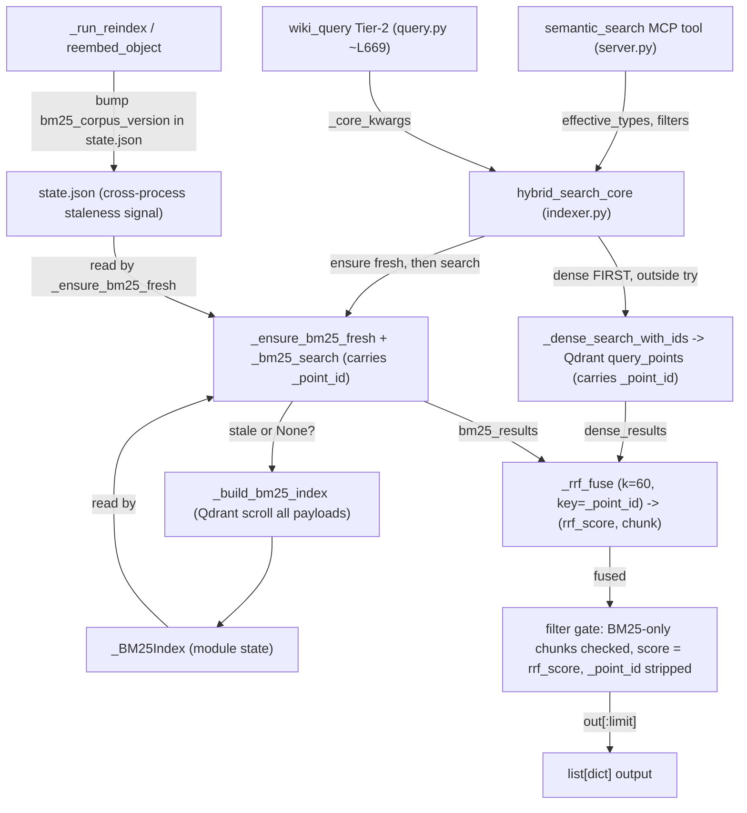

# Retrieval: Lexical / Hybrid Dense+Sparse Fusion (#327)

**Status:** SPEC
**Date:** 2026-06-25
**Author:** spec-writer agent
**Review rounds:** 2 (R2: APPROVED WITH CONDITIONS — conditions SF-A/SF-B/SF-C/SG-α/SG-β applied inline)
**Epic:** aldeia-box#140 | **Depends on:** #323 (metadata filters), #336 (source_type/domain_tags) — both merged on this branch

---

## 1. Problem Statement

Dense (bge-m3, 1024-dim) retrieval ranks by cosine similarity. Queries containing exact names or technical keywords that differ only in phrasing from the stored text score poorly when the surface form diverges from the semantic neighborhood. The live reproduction case (`"What is the contradiction detection capability and its limitations?"`) confirmed that the correct objects are not recalled at top-5 because the query embedding has low cosine similarity to the precise chunk text containing "contradiction detection" — the term appears but not in a semantically proximate cluster.

Adding a lexical (BM25) signal surfaces exact-match and near-exact-match results that dense retrieval misses, then fuses the two ranked lists via Reciprocal Rank Fusion (RRF) so that results strong on either signal rank high in the combined output.

No new cloud dependencies, no egress: all retrieval runs locally.

---

## 2. Scope

### In Scope

| File | Nature |
|------|--------|
| `src/anytype_llm_wiki/indexer.py` | New `_BM25Index` module state, `_build_bm25_index`, `_bm25_search`, `_rrf_fuse`, `_ensure_bm25_fresh`, `_dense_search_with_ids`, `hybrid_search_core`; `bm25_corpus_version` stamp into `state.json` on every upsert path |
| `src/anytype_llm_wiki/server.py` | Switch `semantic_search` call site from `semantic_search_core` → `hybrid_search_core` |
| `src/anytype_llm_wiki/wiki/query.py` | Switch Tier-2 call site (line ~669) from `indexer.semantic_search_core` → `indexer.hybrid_search_core` |
| `pyproject.toml` + `uv.lock` | Add `rank-bm25>=0.2.2,<1.0.0`; regenerate lockfile |
| `tests/test_indexer.py` | BM25, RRF, `hybrid_search_core`, staleness, and version-stamp unit tests; extended fake client |
| `tests/wiki/test_query.py`, `tests/wiki/test_query_fetch_paths.py` | Caller-switch regression; retarget Tier-2 monkeypatches |
| `tests/eval/test_retrieval_quality.py` + `tests/eval/fixtures/retrieval_quality_cases.json` | New; `@pytest.mark.live` aggregate recall eval + curated fixture |

### Out of Scope

- `semantic_search_core` body — unchanged (invariant; see §4 D1). A thin internal sibling `_dense_search_with_ids` is added alongside it; `semantic_search_core` itself is byte-identical.
- Qdrant collection schema change — no sparse vector field added in v1.
- `PAYLOAD_SCHEMA_VERSION` bump — v1 adds no new payload field. (The `bm25_corpus_version` stamp lives under its own state.json key and is independent of the schema marker.)
- `_ensure_payload_indexes` — no new indexes.
- Native Qdrant `FusionQuery(Fusion.RRF)` — deferred to v2 (§19).
- BM25 index persistence to disk across server restarts — lazy rebuild on first query (see D3); the index lives in RAM only.
- Stopword removal or stemming in BM25 tokenizer — simple lowercased whitespace split in v1 (D4).
- `wiki_lint` retrieval — `lint.py:616` keeps calling `semantic_search_core` directly; it is NOT switched to hybrid (out of scope; see SF-4 / §11.2 AC-H11).

---

## 3. Research Summary

Research (`research.md`) evaluated three sparse-signal options:

- **Option A (FastEmbed + Qdrant `Document`/BM25):** Rejected. Requires `fastembed` (onnxruntime ~200 MB), which the local Docker Qdrant cannot bypass; Qdrant Cloud Inference is required for server-side inference. Too heavy for this project's supply-chain posture.
- **Option B (precomputed sparse vectors in Qdrant, native `FusionQuery`):** Sound architecture at scale, but requires `create_vector_name` schema migration and full backfill. Deferred to v2.
- **Option C (`rank-bm25`, app-level RRF):** Recommended. 8.6 kB wheel, numpy-only (already a transitive dep of qdrant-client). Zero additional package downloads. No collection schema change. Offline.

Key confirmed facts from research:
- `uv pip install --dry-run rank-bm25` → resolves exactly 1 new package (rank-bm25==0.2.2). Numpy already present.
- Qdrant's own RRF k constant is 2 (not the academic standard 60). App-level RRF uses k=60.
- `create_vector_name` works in qdrant-client 1.18.0 for the v2 in-place migration path (verified via in-memory client).
- For native `FusionQuery`, filters must be placed on each `Prefetch`, not the outer `query_filter` — verified in `local_collection.py:814-848`.

---

## 4. Design Decisions

### D1 — `semantic_search_core` Is Unchanged (Invariant)

`semantic_search_core` (`indexer.py:71-161`) is NOT modified. It remains the single dense retrieval path used by the public `semantic_search` MCP tool, by `wiki_lint`, and by the no-filter regression guard. This preserves:

- The `test_no_filter_regression` assertion that `query_filter is None` when `semantic_search_core(query="test")` is called bare (AC-H-REG1 — guard test, must fail-before-impl if the function is modified).
- The OD-B default-type-exclusion constraint inherited from #336: `server.py:semantic_search` computes `effective_types` and passes it to `hybrid_search_core`, which threads it to the dense path unchanged.

`hybrid_search_core` needs the Qdrant `point.id` of each dense hit (BL-1) — which `semantic_search_core`'s result dict deliberately omits. Rather than alter `semantic_search_core`, a thin internal sibling `_dense_search_with_ids` (§5.4) reproduces its query but adds an internal `_point_id` key. `_dense_search_with_ids` factors out the shared filter-construction helper so the two never drift; the public `semantic_search_core` is unchanged.

### D2 — New Public Function `hybrid_search_core` in `indexer.py`

`hybrid_search_core` has the identical signature to `semantic_search_core`. It calls `_dense_search_with_ids` for the dense ranked list (carrying `_point_id`), calls `_bm25_search` for the sparse ranked list (also carrying `_point_id`), calls `_rrf_fuse` to merge on the shared point id, and returns the same `list[dict]` shape (internal keys stripped). Both callers (`server.py:semantic_search` and `query.py` Tier-2) switch from `semantic_search_core` to `hybrid_search_core`.

### D3 — BM25 Index Lifecycle: Lazy Build + Cross-Process Staleness Stamp

**Resolved BL-4, BL-5, and the original open question A. This supersedes the earlier "eager, no-lazy" decision.**

The MCP server is a long-lived single process (`server.py:346 mcp.run(transport="stdio")`). The launchd cron (`docs/samples/com.aldeia.anytype-llm-wiki-reindex.plist`) runs `reindex()` in a **separate, short-lived interpreter**. Therefore module-level BM25 state mutated inside `_run_reindex`/`reembed_object` can NEVER reach the server process, and an eager-only design serves silent dense-only after every restart and never sees cron-indexed objects. The fix has two coupled parts:

1. **Lazy build on first use.** `hybrid_search_core` calls `_ensure_bm25_fresh()` before searching. If the in-process index is `None` or stale, it (re)builds by scrolling Qdrant. After a server restart the very first hybrid query builds the index — absorbing a sub-100 ms cost (§16) that is dwarfed by the ~100–500 ms Ollama embed already on the path.

2. **Cross-process staleness stamp.** Every upsert path writes a monotonic `bm25_corpus_version` integer into `state.json`. `_run_reindex` increments it once per run (after `_save_state`'s body, in the same write); `reembed_object` increments it after its upsert. The server caches the version it last built against (`_bm25_built_version`). `_ensure_bm25_fresh()` reads the on-disk version cheaply (a small JSON read) and rebuilds when it differs from the cached value. This is what lets a cron-process reindex invalidate the server's index across the process boundary — the next hybrid query in the server sees the bumped on-disk version and rebuilds.

**No eager rebuild inside `_run_reindex`/`reembed_object`.** With staleness invalidation, the upsert paths only bump the version stamp; they do NOT build the index. This (a) keeps `reembed_object` O(1) in corpus size — it no longer does a full scroll on the `wiki_ingest`/`wiki_remember` hot path (resolves SF-1 / the O(1)→O(corpus) regression) and (b) makes the cron path work, because a cron-process build would be thrown away anyway. The index is built exactly once per corpus-version, lazily, in whichever process next serves a hybrid query.

**Thread safety:** the server is single-process stdio with no concurrent request handling, so module-level state needs no lock. `_ensure_bm25_fresh` and the build are not reentrant-safe, which is acceptable under that invariant (matches the existing `_reindex_lock` reasoning that the server never handles two requests at once).

State the module holds:

```python
# indexer.py module level
_bm25_index: "_BM25Index | None" = None
_bm25_built_version: int = -1   # corpus version this process's index was built against
```

```python
@dataclasses.dataclass
class _BM25Index:
    bm25: object              # rank_bm25.BM25Okapi instance
    point_ids: list[str]      # str(point.id), parallel to corpus — the fusion key
    object_ids: list[str]     # payload["object_id"]
    object_names: list[str]   # payload["object_name"]
    type_keys: list[str]      # payload["type_key"]
    headings: list[str]       # payload["heading"]
    texts: list[str]          # payload["text"][:500]
    space_ids: list[str]      # payload["space_id"]
    source_types: list[str]   # payload["source_type"] ("" if absent)
    domain_tags: list[list[str]]  # payload["domain_tags"] ([] if absent)
```

Per SG-1 the index stores only the fields actually used downstream (the fusion key, the six output fields, and the three filter fields), not the whole payload — roughly one truncated copy of each chunk text rather than two.

### D4 — BM25 Tokenizer: Lowercased Whitespace Split

For v1, tokenize as `text.lower().split()`. No stopwords, no stemming. Technical wiki content benefits from exact token preservation (e.g., `BM25`, `contradiction`). A known limitation: underscore identifiers (`wiki_entity`) are NOT split, so `wiki_entity` matches only the literal token. The eval fixture (§10.2) includes at least one underscore-identifier case so the decision to defer non-alphanumeric splitting (Open Question §18.1) is data-driven (SG-2). The query is tokenized identically to the corpus.

### D5 — BM25 Filter Scope: `space_id` In-Memory; Type/Source/Tag Filters via Post-Fusion Gate

`_bm25_search` applies only the `space_id` filter in-memory (the primary safety filter — results from other spaces never enter the fused output). All other filters are enforced AFTER fusion by `_passes_inline_filters` (§7.3), because BM25-only chunks bypass Qdrant's filter.

For a BM25-only chunk to be admitted under a `source_type` or `domain_tags` filter, `_bm25_search` MUST surface those payload values in its result dict (BL-2) so the gate can evaluate them. The gate reads real `source_type` / `domain_tags` from each chunk; matching chunks survive, non-matching chunks are dropped.

**Date filters and BM25-only chunks (resolves SF-5 contradiction).** Date range (`ingested_after`/`ingested_before`) is NOT replicated inline. The chosen, pinned behavior: **a BM25-only chunk is dropped whenever any date filter is active.** This is consistent with Qdrant's "missing field never matches a range" semantics and is conservative (it sacrifices some keyword recall on date-scoped queries, which are not the queries #327 targets). Dense hits are unaffected — they were already date-filtered by Qdrant. §6.5 and §7.3 implement exactly this; D5 prose, §6.5, and §7.3 now agree, and AC-H14 pins it.

### D6 — RRF Formula and k=60

Standard Reciprocal Rank Fusion (Cormack et al. 2009):

```
score(d) = sum_r  1 / (k + rank_r(d))
```

where `rank_r(d)` is the 0-based position of document `d` in retriever `r`'s list. Use `k=60` (academic standard). Qdrant's own RRF uses `k=2`, which gives much stronger rank-1 weighting (0.5 vs 0.016 at k=60) and is not appropriate for app-level fusion.

### D7 — Fetch Limit: `limit * 2` Per Signal

Each signal fetches `limit * 2` candidates before fusion. For `limit=10`: dense fetches 20, BM25 returns up to 20, RRF fuses up to 40 unique chunks, final output truncated to 10.

### D8 — Score Semantics: Output `score` IS the RRF Score (resolves BL-3)

After fusion, every returned dict's `score` is the **RRF score** that determined its rank — not the original cosine or raw-BM25 value. This makes list order and `score` agree and comparable across signals. It matters because `wiki_query` Tier-2 copies `score` into `candidate_entries` and the object cap sorts/caps by it (`query.py:1009`); a heterogeneous score would let a raw-BM25 2.0 outrank a cosine 0.8 even when RRF ranked the dense chunk higher, dropping the better seed. `_rrf_fuse` returns `(score, chunk)` pairs; `hybrid_search_core` sets `chunk["score"] = round(rrf_score, 6)`. When BM25 is unavailable and the function returns dense-only, the original cosine `score` is preserved unchanged (no fusion happened). §5.1 documents this cosine→RRF semantics change.

### D9 — Graceful Degradation

`hybrid_search_core` wraps the BM25 path (`_ensure_bm25_fresh` + `_bm25_search`) in `try/except Exception`. Any BM25 failure (index `None`/stale-rebuild error, `rank_bm25` import error, corrupt index, Qdrant scroll failure during build) falls back to dense-only (the dense list with original cosine scores, `_point_id` stripped). Each fallback logs one WARN line (SF-10). The caller receives the same `list[dict]` shape.

Qdrant unavailability from the DENSE path (`httpx.HTTPError` raised by `_dense_search_with_ids`) is NOT caught — it propagates to `wiki_query` Tier-2, which catches it as `qdrant_unavailable` (existing behavior at `query.py:682`). The dense call is therefore made OUTSIDE the BM25 try/except.

### D10 — Dedup at Chunk Level by Point ID

`_rrf_fuse` deduplicates on `_point_id` (the Qdrant point UUID, shared by both lists — BL-1). A chunk found by both retrievers gets its reciprocal ranks summed and appears exactly once. `hybrid_search_core` returns chunk-level results (multiple chunks per object), matching `semantic_search_core`; the existing `wiki_query` Tier-2 object-level dedup (`seen` set over `object_id`) is unchanged.

---

## 5. API Surface

### 5.1 `hybrid_search_core` (new, `indexer.py`)

Wire contract: replaces `semantic_search_core` at the two switched call sites. Returns `list[dict]` with identical keys: `object_name`, `object_id`, `type`, `heading`, `text` (truncated to 500 chars), `score`.

**Semantics change (D8):** in the hybrid path the `score` is the RRF score (≈ 0.01–0.05 range at k=60), not cosine. Callers must treat `score` as an opaque "higher is better" ordering signal, which `wiki_query` Tier-2 already does. In the dense-only fallback path the cosine score is preserved.

```python
def hybrid_search_core(
    query: str,
    space_id: str | None = None,
    types: list[str] | None = None,
    ingested_after: str | None = None,
    ingested_before: str | None = None,
    source_type: list[str] | None = None,
    domain_tags: list[str] | None = None,
    limit: int = 10,
) -> list[dict]: ...
```

Edge cases (SG-4): `if limit <= 0: return []` before any work; an empty/whitespace `query` produces no BM25 tokens (`get_scores([])` → all-zero, no BM25 candidates) and the dense path behaves exactly as `semantic_search_core` does today.

### 5.2 `server.py:semantic_search` (changed call site only)

Import changes from `from .indexer import reindex, semantic_search_core` to `from .indexer import reindex, hybrid_search_core`; the final call changes from `semantic_search_core(query=query, ...)` to `hybrid_search_core(query=query, ...)`. All validation, `effective_types` computation, and OD-B default-type-exclusion are unchanged.

### 5.3 `query.py` Tier-2 call site (changed call site only)

Line ~669 changes from `raw = indexer.semantic_search_core(**_core_kwargs)` to `raw = indexer.hybrid_search_core(**_core_kwargs)`. `_core_kwargs` construction and the `seen`-set dedup are unchanged.

### 5.4 `_dense_search_with_ids` (new internal, `indexer.py`)

Identical query/filter logic to `semantic_search_core`, but its result dicts carry an internal `_point_id = str(r.id)` alongside the public keys. To avoid drift, the filter-construction block is extracted into a shared private helper `_build_search_filter(...)` that both `semantic_search_core` and `_dense_search_with_ids` call. `semantic_search_core`'s observable behavior (and the AC-H-REG1 `query_filter is None` contract) is unchanged because the extracted helper returns `None` for a bare call exactly as the inline code does today.

```python
def _dense_search_with_ids(**kwargs) -> list[dict]:
    """Like semantic_search_core but each dict also carries _point_id = str(r.id)."""
    # ... same embed_query + client.query_points(query_filter=_build_search_filter(...)) ...
    return [
        {
            "_point_id": str(r.id),
            "object_name": r.payload.get("object_name", ""),
            "object_id": r.payload.get("object_id", ""),
            "type": r.payload.get("type_key", ""),
            "heading": r.payload.get("heading", ""),
            "text": r.payload.get("text", "")[:500],
            "score": round(r.score, 4),
        }
        for r in results.points
    ]
```

### 5.5 `semantic_search_core` (unchanged)

Signature and behavior locked. Referenced by the `test_no_filter_regression` guard test and by `wiki_lint`.

---

## 6. BM25 Index Design

### 6.1 Module-Level State

```python
# indexer.py (module level, after imports)
import dataclasses, logging
logger = logging.getLogger(__name__)

_bm25_index: "_BM25Index | None" = None
_bm25_built_version: int = -1
# _BM25Index dataclass: see §4 D3 (stores only the used fields, per SG-1)
```

### 6.2 Corpus Version Stamp

```python
def _bump_bm25_corpus_version(state: dict) -> int:
    """Increment the monotonic corpus version inside an already-loaded state dict."""
    state["bm25_corpus_version"] = int(state.get("bm25_corpus_version", 0)) + 1
    return state["bm25_corpus_version"]

def _read_bm25_corpus_version() -> int:
    """Cheap on-disk read of the corpus version (0 if absent / unreadable)."""
    try:
        return int(_load_state().get("bm25_corpus_version", 0))
    except Exception:  # noqa: BLE001 — never let a state read break a query
        return 0
```

Write sites:
- `_run_reindex`: after the per-space loop, in the SAME state write — `_bump_bm25_corpus_version(state)` then `_save_state(state)`. One increment per reindex run, regardless of how many objects changed.
- `reembed_object`: after the upsert succeeds — `state = _load_state(); _bump_bm25_corpus_version(state); _save_state(state)`. (`reembed_object` does not otherwise touch state today; this is the only state write it gains, and it stays O(1) — no scroll.)

**Missing-`space_id` / delete-between-rebuilds consistency (SG-6):** the version is bumped on EVERY reindex and reembed (including object deletions, which go through `_run_reindex`'s removal branch). A delete therefore invalidates the server's index on the next query, which rebuilds from the now-smaller corpus. A scoped (single-space) reindex also bumps the version, so changes confined to one space still invalidate the whole in-memory index (the index is global, not per-space).

### 6.3 `_ensure_bm25_fresh() -> None`

```python
def _ensure_bm25_fresh() -> None:
    """Build or rebuild the module-level BM25 index iff it is missing or stale.

    Stale = the on-disk bm25_corpus_version differs from the version this process
    last built against. Cheap (one small JSON read) on the hot path; the actual
    scroll+build runs only on a version change or cold start.
    """
    global _bm25_built_version
    on_disk = _read_bm25_corpus_version()
    if _bm25_index is not None and _bm25_built_version == on_disk:
        return
    _build_bm25_index(_qdrant())          # may raise; caller wraps in try/except
    _bm25_built_version = on_disk         # only advance after a successful build
```

**Staleness guarantee (SF-A).** The version is read *before* the scroll and stamped as
`_bm25_built_version` only after a successful build. The build scrolls live Qdrant, so it may
capture a corpus slightly *newer* than `on_disk` reflects (a cron bump landing during the
scroll). The guarantee is therefore **monotonic eventual consistency with an at-most-one-extra-
rebuild window**: any version bump strictly greater than the stamped value triggers exactly one
rebuild on the next query; the worst case is a single redundant rebuild or a one-version skew that
the next bump heals. This is acceptable because (a) the server is single-writer per process, (b) a
rebuild is <100 ms (§16), and (c) recall is never wrong — only at most one query-interval stale.
The version read is `_load_state()`-backed, so it scales with `state.json` size (per-space/object
maps); at the current corpus this is sub-millisecond (SG-α), and a future sidecar-file split is
noted in §19 if state grows large.

### 6.4 `_build_bm25_index(client: QdrantClient) -> None`

```python
def _build_bm25_index(client: QdrantClient) -> None:
    """Scroll all Qdrant chunks and (re)build the in-memory BM25 index.

    Replaces the prior index only when the new corpus is non-empty; on a
    transient empty scroll it leaves the prior index intact and logs a warning
    (SF-3). Silently no-ops if rank_bm25 is not importable (graceful degradation).
    """
    global _bm25_index
    import time
    try:
        from rank_bm25 import BM25Okapi
    except ImportError:
        logger.warning("bm25_fallback: rank_bm25 not importable")
        return

    t0 = time.monotonic()
    point_ids, object_ids, object_names, type_keys = [], [], [], []
    headings, texts, space_ids, source_types, domain_tags = [], [], [], [], []
    corpus: list[list[str]] = []

    offset = None
    while True:
        results, next_offset = client.scroll(
            collection_name=config.QDRANT_COLLECTION,
            limit=1000, offset=offset, with_payload=True, with_vectors=False,
        )
        for point in results:
            p = point.payload or {}
            point_ids.append(str(point.id))
            object_ids.append(p.get("object_id", ""))
            object_names.append(p.get("object_name", ""))
            type_keys.append(p.get("type_key", ""))
            headings.append(p.get("heading", ""))
            texts.append((p.get("text", "") or "")[:500])
            space_ids.append(p.get("space_id", ""))
            source_types.append(p.get("source_type", "") or "")
            domain_tags.append(p.get("domain_tags", []) or [])
            corpus.append((p.get("text", "") or "").lower().split())
        if next_offset is None:
            break
        offset = next_offset

    if not corpus:
        # Distinguish transient-empty from genuinely-empty: never null a good
        # index on an empty scroll. If we have never built one, stay None.
        if _bm25_index is not None:
            logger.warning("bm25_build: empty scroll; keeping prior index (%d chunks)",
                           len(_bm25_index.point_ids))
        return

    _bm25_index = _BM25Index(
        bm25=BM25Okapi(corpus), point_ids=point_ids, object_ids=object_ids,
        object_names=object_names, type_keys=type_keys, headings=headings,
        texts=texts, space_ids=space_ids, source_types=source_types,
        domain_tags=domain_tags,
    )
    logger.info("bm25_index_built chunks=%d ms=%d",
                len(corpus), int((time.monotonic() - t0) * 1000))
```

Per SG-5/SG-7: at most one log line per build; chunk texts are never logged. The `scroll` call uses keyword args matching the real client signature, so `FakeQdrantClientWithSearch.scroll` must accept `collection_name`, `limit`, `offset`, `with_payload`, `with_vectors` as keywords.

### 6.5 `_bm25_search(query, space_id, limit) -> list[dict]`

```python
def _bm25_search(query: str, space_id: str | None = None, limit: int = 20) -> list[dict]:
    """Top-limit BM25-scored chunks as result dicts carrying _point_id and the
    payload fields the post-fusion filter gate needs (BL-2). Raises if no index."""
    idx = _bm25_index
    if idx is None:
        raise RuntimeError("BM25 index not built")
    tokens = query.lower().split()
    scores = idx.bm25.get_scores(tokens)  # ndarray, len == corpus
    pairs = [
        (scores[i], i) for i in range(len(scores))
        if (space_id is None or idx.space_ids[i] == space_id)
    ]
    pairs.sort(key=lambda x: x[0], reverse=True)
    out = []
    for score, i in pairs[:limit]:
        if score <= 0.0:
            break  # 0 == no token match; ranked list ends here
        out.append({
            "_point_id": idx.point_ids[i],
            "object_name": idx.object_names[i],
            "object_id": idx.object_ids[i],
            "type": idx.type_keys[i],
            "heading": idx.headings[i],
            "text": idx.texts[i],
            "score": round(float(score), 4),   # raw BM25; overwritten by RRF in fuse path
            "source_type": idx.source_types[i],   # BL-2: surfaced for the filter gate
            "domain_tags": idx.domain_tags[i],    # BL-2: surfaced for the filter gate
        })
    return out
```

### 6.6 `_rrf_fuse(dense_results, bm25_results, k=60) -> list[tuple[float, dict]]`

```python
def _rrf_fuse(dense_results, bm25_results, k=60):
    """RRF (Cormack et al. 2009) over two ranked lists, keyed on _point_id.

    Returns (rrf_score, chunk) pairs ordered by descending RRF score so the
    caller can stamp score = rrf_score (D8). Dedups by _point_id (D10).
    """
    scores: dict[str, float] = {}
    chunks: dict[str, dict] = {}
    for rank, r in enumerate(dense_results):
        cid = r["_point_id"]
        scores[cid] = scores.get(cid, 0.0) + 1.0 / (k + rank + 1)
        chunks.setdefault(cid, r)
    for rank, r in enumerate(bm25_results):
        cid = r["_point_id"]
        scores[cid] = scores.get(cid, 0.0) + 1.0 / (k + rank + 1)
        chunks.setdefault(cid, r)
    ordered = sorted(scores, key=lambda cid: scores[cid], reverse=True)
    return [(scores[cid], chunks[cid]) for cid in ordered]
```

Both lists are guaranteed to carry `_point_id` (dense from `_dense_search_with_ids`, BM25 from `_bm25_search`), so the key is never synthesized and the two key spaces always collide on a shared chunk. Edge cases tested: both-empty → `[]`; one-empty → the non-empty list's order.

### 6.7 `hybrid_search_core` Implementation

```python
def hybrid_search_core(query, space_id=None, types=None, ingested_after=None,
                       ingested_before=None, source_type=None, domain_tags=None,
                       limit=10):
    if limit <= 0:
        return []
    fetch_limit = limit * 2

    # Dense FIRST and OUTSIDE the try: Qdrant outage must propagate (D9).
    dense_results = _dense_search_with_ids(
        query=query, space_id=space_id, types=types,
        ingested_after=ingested_after, ingested_before=ingested_before,
        source_type=source_type, domain_tags=domain_tags, limit=fetch_limit,
    )

    try:
        _ensure_bm25_fresh()
        bm25_results = _bm25_search(query, space_id=space_id, limit=fetch_limit)
    except Exception as e:  # noqa: BLE001
        logger.warning("bm25_fallback: %s", e)
        bm25_results = []

    if not bm25_results:
        for r in dense_results:
            r.pop("_point_id", None)
        return dense_results[:limit]   # dense-only: original cosine scores kept (D8)

    fused = _rrf_fuse(dense_results, bm25_results, k=60)  # [(rrf_score, chunk)]

    dense_ids = {r["_point_id"] for r in dense_results}
    date_active = bool(ingested_after or ingested_before)
    meta_active = bool(types or source_type or domain_tags)

    out = []
    for rrf_score, r in fused:
        bm25_only = r["_point_id"] not in dense_ids
        if bm25_only and date_active:
            continue                                  # D5: drop BM25-only under date filter
        if bm25_only and meta_active and not _passes_inline_filters(
                r, types=types, source_type=source_type, domain_tags=domain_tags):
            continue
        r["score"] = round(rrf_score, 6)              # D8: RRF score IS the output score
        r.pop("_point_id", None)
        out.append(r)
        if len(out) >= limit:
            break
    return out
```

`_passes_inline_filters` (§7.3) reads the real `type`, `source_type`, `domain_tags` keys now populated by `_bm25_search` (BL-2). Dense chunks are exempt from the gate (Qdrant already filtered them).

**Result-count note (SF-B).** Each signal fetches only `fetch_limit = limit*2` candidates (D7), and BM25-only chunks dropped by the date/filter gate consume no output slot. Under aggressive filtering the hybrid path can therefore return slightly **fewer** than `limit` results even when more dense candidates exist beyond the fused-and-gated window. This is acceptable (the dense hits that pass Qdrant's filter are always present and ranked); it is a recall-coverage trade of the app-level fusion, not a correctness bug. If it proves limiting in practice, raise `fetch_limit` per signal.

---

## 7. Filter Interaction

### 7.1 Dense Path (unchanged)

Filters flow through `_dense_search_with_ids` (which reuses `semantic_search_core`'s exact filter construction): `space_id`, `types`, `ingested_after`, `ingested_before`, `source_type`, `domain_tags` → Qdrant `Filter(must=[...])`. No change.

### 7.2 BM25 Path

`_bm25_search` applies only the `space_id` filter in-memory. All other filters are deferred to the post-fusion gate, which can evaluate them because `_bm25_search` now surfaces `type`, `source_type`, and `domain_tags` (BL-2).

### 7.3 Post-Fusion Filter Gate

```python
def _passes_inline_filters(r, types, source_type, domain_tags) -> bool:
    if types and r.get("type") not in types:
        return False
    if source_type and r.get("source_type") not in (source_type or []):
        return False
    if domain_tags:
        obj_tags = r.get("domain_tags") or []
        if not any(t in obj_tags for t in domain_tags):
            return False
    return True
```

Applied only to BM25-only chunks (dense chunks already passed Qdrant). Date filters are handled separately in `hybrid_search_core` (D5): a BM25-only chunk is dropped whenever a date filter is active. This is the single, consistent date behavior — D5, §6.5/§6.7, and this section now agree (resolves SF-5), and AC-H14 pins it.

### 7.4 `wiki_query` Tier-2 Filter Contract

`wiki_query` Tier-2 passes `types=sorted(effective_types_set)` and threads `domain_tags` (and date bounds when set). After the switch to `hybrid_search_core`, those filters reach the dense path AND the post-fusion gate, so a BM25-only `wiki_source` chunk cannot leak into a `wiki_entity`-scoped query.

---

## 8. New Dependency

```toml
# pyproject.toml [project.dependencies]
"rank-bm25>=0.2.2,<1.0.0",
```

**Justification (supply-chain posture):** `rank-bm25` is 8.6 kB, depends only on `numpy` (already present as a transitive dep of `qdrant-client`). Zero new packages download. No network calls. Next-major cap (`<1.0.0`) matches the project's pin style. FastEmbed (the alternative) requires onnxruntime (~200 MB) and was rejected on supply-chain grounds. `uv.lock` MUST be regenerated and committed (SF-9): it is a required artifact, and any test importing `rank_bm25` (AC-H1) fails until the dependency is locked and synced.

---

## 9. Call-Path Diagram



The diagram is hand-validated against the GitHub Mermaid pitfalls in `.claude/commands/diagram.md`: all node labels are quoted, no `\n` (replaced by plain text), no `;` in labels, no unmatched brackets. (`mmdc` is unavailable in this environment, so validation is by inspection per the repair-loop fallback.) Note the version stamp (M→N→E) is the cross-process bridge: the cron's `_run_reindex` writes the stamp in its own process; the server's `_ensure_bm25_fresh` reads it.

---

## 10. Evaluation Methodology

**Resolved BL-6 (fixture + ownership) and the original open question B.**

### 10.1 Eval Design (Non-Flaky Aggregate)

The per-query `assert hybrid_recall >= dense_recall` approach is brittle. The spec mandates an **aggregate** metric plus a per-case assertion on the reproduction query:

- `Recall@5` per query: `|expected_ids ∩ top5_ids| / |expected_ids|`.
- `MRR@5` per query: `1 / rank_of_first_expected_id` (0 if none in top 5).
- Assert `mean_hybrid_recall@5 >= mean_dense_recall@5` AND `mean_hybrid_mrr@5 >= mean_dense_mrr@5` across all cases.
- Assert the #327 reproduction case (`"id": "repro-327"`) improves individually: `hybrid_recall >= dense_recall` for that case (SF-7) — the ticket's reason for existing must not regress while the mean improves.
- Emit a per-query diagnostic table regardless of pass/fail.

### 10.2 Fixture Format and Ownership

`tests/eval/fixtures/retrieval_quality_cases.json`. **Ownership (BL-6): the implementer creates this fixture in Step 8, as a gate before PR.** Each case carries production-shaped `types`/`space_id` (SF-7) so the eval exercises the real `wiki_query` shape, not a no-filter shortcut:

```json
[
  {
    "id": "repro-327",
    "query": "contradiction detection limitations",
    "space_id": "<live_space_id>",
    "types": ["wiki_entity", "wiki_concept"],
    "expected_ids": ["<object_id_1>", "<object_id_2>"],
    "note": "live reproduction case from ticket #327 comment 2026-06-25"
  }
]
```

**Minimum fixture size: ≥5 cases** (SF-7) for statistical validity, including the `repro-327` case and at least one underscore-identifier case (e.g. a query whose target text contains `wiki_entity`) so D4's deferral is data-driven (SG-2). `expected_ids` are Anytype object IDs (UUIDs), captured via the curation procedure in Step 8.

### 10.3 Test Implementation

```python
# tests/eval/test_retrieval_quality.py
import json, statistics
from pathlib import Path
import pytest

FIXTURE_FILE = Path(__file__).parent / "fixtures" / "retrieval_quality_cases.json"

def _recall_at_k(expected, results, k=5):
    top = {r["object_id"] for r in results[:k]}
    return len(set(expected) & top) / len(expected) if expected else 0.0

def _mrr_at_k(expected, results, k=5):
    es = set(expected)
    for rank, r in enumerate(results[:k], start=1):
        if r["object_id"] in es:
            return 1.0 / rank
    return 0.0

@pytest.mark.live
def test_hybrid_recall_aggregate():
    from anytype_llm_wiki.indexer import hybrid_search_core, semantic_search_core
    cases = json.loads(FIXTURE_FILE.read_text())
    assert len(cases) >= 5, "fixture must have >=5 cases for statistical validity"
    d_rec, h_rec, d_mrr, h_mrr, report = [], [], [], [], []
    repro = {}
    for c in cases:
        q, exp = c["query"], c["expected_ids"]
        kw = {"limit": 5}
        if c.get("space_id"): kw["space_id"] = c["space_id"]
        if c.get("types"):    kw["types"] = c["types"]
        dense = semantic_search_core(query=q, **kw)
        hybrid = hybrid_search_core(query=q, **kw)
        dr, hr = _recall_at_k(exp, dense), _recall_at_k(exp, hybrid)
        dm, hm = _mrr_at_k(exp, dense), _mrr_at_k(exp, hybrid)
        d_rec.append(dr); h_rec.append(hr); d_mrr.append(dm); h_mrr.append(hm)
        report.append(f"  {q!r}: d_recall={dr:.2f} h_recall={hr:.2f} d_mrr={dm:.2f} h_mrr={hm:.2f}")
        if c.get("id") == "repro-327":
            repro = {"dr": dr, "hr": hr}
    rpt = "\n".join(report)
    assert statistics.mean(h_rec) >= statistics.mean(d_rec), f"Recall@5 regressed\n{rpt}"
    assert statistics.mean(h_mrr) >= statistics.mean(d_mrr), f"MRR@5 regressed\n{rpt}"
    assert repro and repro["hr"] >= repro["dr"], f"repro-327 regressed\n{rpt}"
```

Run with `uv run python -m pytest tests/eval/ -m live -v`. Skip with `-m 'not live'`.

**Dense baseline procedure (resolves SF-6).** The earlier "run the eval before implementing `hybrid_search_core`" plan was infeasible — the test imports `hybrid_search_core` (absent pre-impl), and once it exists it already uses BM25, so it cannot be a dense baseline. Instead: between Step 4 (impl) and Step 6 (call-site switch), capture the dense baseline directly with `semantic_search_core` per case (a one-off scratch run or the diagnostic table from a first eval run), record those numbers, then run the full eval after Step 6 and compare. The committed assertion compares `hybrid_search_core` vs `semantic_search_core` in the SAME run, so the baseline is always reproducible without a separate pre-impl run.

### 10.4 Completion Gate (replaces Open Question #3)

The fixture is DONE when `uv run python -m pytest tests/eval/ -m live` exits 0 against the live stack with a ≥5-case fixture that includes `repro-327` and an underscore-identifier case. This is a Step-8 PR gate owned by the implementer.

---

## 11. Test Plan

Tests live in `tests/test_indexer.py` (BM25/RRF/`hybrid_search_core`/staleness/version-stamp units), `tests/wiki/test_query.py` + `tests/wiki/test_query_fetch_paths.py` (caller switch), and `tests/eval/test_retrieval_quality.py` (live aggregate eval). Every AC below has a runnable, fail-before-impl test.

### 11.1 Extended Fake Qdrant Client

`FakeQdrantClientWithSearch` in `tests/test_indexer.py` (from #323) gains a `scroll` accepting the real keyword-arg shape (SG-7):

```python
def scroll(self, collection_name, limit=1000, offset=None,
           with_payload=True, with_vectors=False):
    # Single page: return all upserted points, next_offset=None.
    return list(self.upserted_points), None
```

### 11.2 Acceptance Criteria Tests

**AC-H1 — BM25 tokenization and scoring**

```python
def test_bm25_scores_keyword_match():
    from rank_bm25 import BM25Okapi
    corpus = [["contradiction", "detection", "capability"],
              ["semantic", "search", "dense"], ["knowledge", "graph", "entity"]]
    scores = BM25Okapi(corpus).get_scores(["contradiction", "detection"])
    assert scores[0] > scores[1] and scores[0] > scores[2]
```

**AC-H2 — `_rrf_fuse`: dual-list chunk outranks single-list; dedup by `_point_id`; returns `(score, chunk)` pairs**

```python
def test_rrf_fuse_order_and_scores():
    from anytype_llm_wiki.indexer import _rrf_fuse
    dense = [{"_point_id": "p1", "object_id": "o1"},
             {"_point_id": "p2", "object_id": "o2"}]
    bm25 = [{"_point_id": "p2", "object_id": "o2"},   # p2 in both
            {"_point_id": "p3", "object_id": "o3"}]
    fused = _rrf_fuse(dense, bm25, k=60)
    assert fused[0][1]["_point_id"] == "p2"           # summed RRF → top
    pids = [c["_point_id"] for _, c in fused]
    assert len(pids) == len(set(pids))                # no dup
    assert fused[0][0] > fused[1][0]                  # scores descend

def test_rrf_fuse_both_empty():
    from anytype_llm_wiki.indexer import _rrf_fuse
    assert _rrf_fuse([], [], k=60) == []

def test_rrf_fuse_one_empty():
    from anytype_llm_wiki.indexer import _rrf_fuse
    d = [{"_point_id": "p1", "object_id": "o1"}]
    assert [c["_point_id"] for _, c in _rrf_fuse(d, [], 60)] == ["p1"]
    assert [c["_point_id"] for _, c in _rrf_fuse([], d, 60)] == ["p1"]
```

**AC-H2b — END-TO-END fusion via the real keying (BL-1, SF-8).** Monkeypatch ONLY `_qdrant`/`embed_query`; the dense and BM25 lists are keyed on the real `_point_id`, never hand-set, and a dual-retriever chunk outranks single-retriever ones and appears exactly once.

```python
def test_hybrid_fusion_end_to_end(monkeypatch):
    import anytype_llm_wiki.indexer as ix
    from anytype_llm_wiki import config
    # Build a real BM25 index over 3 chunks; p_shared also matches dense top-1.
    def mk(pid, text, oid):
        return type("P", (), {"id": pid, "payload": {
            "text": text, "object_id": oid, "object_name": oid,
            "type_key": "wiki_entity", "heading": "", "space_id": "sp"}})()
    pts = [mk("p_shared", "contradiction detection", "o1"),
           mk("p_bm25",   "contradiction only here", "o2"),
           mk("p_dense",  "unrelated dense neighbor", "o3")]
    class FC:
        def scroll(self, collection_name, limit=1000, offset=None,
                   with_payload=True, with_vectors=False):
            return pts, None
        def query_points(self, collection_name, query, query_filter=None,
                         limit=10, with_payload=True):
            # Dense ranks p_shared then p_dense (NOT p_bm25).
            order = [pts[0], pts[2]]
            res = [type("R", (), {"id": p.id, "score": 0.9 - i*0.1, "payload": p.payload})()
                   for i, p in enumerate(order)]
            return type("Res", (), {"points": res})()
    monkeypatch.setattr(ix, "_qdrant", lambda: FC())
    monkeypatch.setattr(ix, "embed_query", lambda q: [0.1] * config.EMBED_DIMS)
    monkeypatch.setattr(ix, "_read_bm25_corpus_version", lambda: 1)
    ix._bm25_index = None; ix._bm25_built_version = -1
    out = ix.hybrid_search_core(query="contradiction detection", limit=3)
    ids = [r["object_id"] for r in out]
    assert ids[0] == "o1"               # found by both → ranks first
    assert ids.count("o1") == 1         # appears exactly once
    assert "o2" in ids                  # BM25-only chunk recalled
    assert all("_point_id" not in r for r in out)
    # RRF scores, not cosine: dual-retriever o1 ≈ 1/61 + 1/61 ≈ 0.0328; the
    # single-list chunks are ≈ 1/61 ≈ 0.0164. Pin the value, not just "< 0.1" (SG-β).
    assert out[0]["score"] == pytest.approx(2 / 61, rel=1e-3)
    assert all(r["score"] < out[0]["score"] for r in out[1:])
```

**AC-H3 — fallback to dense-only when BM25 raises (cosine score preserved)**

```python
def test_hybrid_fallback_to_dense(monkeypatch):
    import anytype_llm_wiki.indexer as ix
    dense = [{"_point_id": "p1", "object_name": "X", "object_id": "o1",
              "type": "wiki_entity", "heading": "", "text": "b", "score": 0.9}]
    monkeypatch.setattr(ix, "_dense_search_with_ids", lambda **kw: [dict(d) for d in dense])
    monkeypatch.setattr(ix, "_ensure_bm25_fresh",
                        lambda: (_ for _ in ()).throw(RuntimeError("no index")))
    out = ix.hybrid_search_core(query="t", limit=10)
    assert out[0]["object_id"] == "o1" and out[0]["score"] == 0.9   # cosine kept
    assert all("_point_id" not in r for r in out)
```

**AC-H4 — output shape; no internal keys**

```python
def test_hybrid_output_shape(monkeypatch):
    import anytype_llm_wiki.indexer as ix
    dense = [{"_point_id": "p1", "object_name": "N", "object_id": "o1",
              "type": "wiki_entity", "heading": "H", "text": "T", "score": 0.8}]
    bm25 = [{"_point_id": "p1", "object_name": "N", "object_id": "o1",
             "type": "wiki_entity", "heading": "H", "text": "T", "score": 1.2,
             "source_type": "", "domain_tags": []}]
    monkeypatch.setattr(ix, "_dense_search_with_ids", lambda **kw: [dict(d) for d in dense])
    monkeypatch.setattr(ix, "_ensure_bm25_fresh", lambda: None)
    monkeypatch.setattr(ix, "_bm25_search", lambda *a, **kw: [dict(b) for b in bm25])
    out = ix.hybrid_search_core(query="t", limit=10)
    for k in ("object_name", "object_id", "type", "heading", "text", "score"):
        assert all(k in r for r in out)
    # Only the fusion key must be stripped; the six public keys must remain.
    assert all("_point_id" not in r for r in out)
```

**AC-H5 — `limit` respected**

```python
def test_hybrid_respects_limit(monkeypatch):
    import anytype_llm_wiki.indexer as ix
    dense = [{"_point_id": f"p{i}", "object_name": f"N{i}", "object_id": f"o{i}",
              "type": "wiki_entity", "heading": "", "text": "", "score": 1.0-i*0.05}
             for i in range(20)]
    bm25 = [{"_point_id": f"q{i}", "object_name": f"M{i}", "object_id": f"x{i}",
             "type": "wiki_entity", "heading": "", "text": "", "score": 1.0-i*0.03,
             "source_type": "", "domain_tags": []} for i in range(20)]
    monkeypatch.setattr(ix, "_dense_search_with_ids", lambda **kw: [dict(d) for d in dense])
    monkeypatch.setattr(ix, "_ensure_bm25_fresh", lambda: None)
    monkeypatch.setattr(ix, "_bm25_search", lambda *a, **kw: [dict(b) for b in bm25])
    assert len(ix.hybrid_search_core(query="t", limit=5)) <= 5

def test_hybrid_limit_zero(monkeypatch):
    import anytype_llm_wiki.indexer as ix
    assert ix.hybrid_search_core(query="t", limit=0) == []
```

**AC-H6 — type filter honored; BM25-only excluded-type chunk dropped via REAL keying (SF-8: dense input has no preset `_point_id` collision with BM25's leaking chunk)**

```python
def test_hybrid_filter_prevents_type_leak(monkeypatch):
    import anytype_llm_wiki.indexer as ix
    dense = [{"_point_id": "pE", "object_name": "E", "object_id": "o1",
              "type": "wiki_entity", "heading": "", "text": "", "score": 0.8}]
    bm25 = [{"_point_id": "pS", "object_name": "S", "object_id": "o2",
             "type": "wiki_source", "heading": "", "text": "", "score": 2.0,
             "source_type": "doc", "domain_tags": []},           # BM25-only, wrong type
            {"_point_id": "pE", "object_name": "E", "object_id": "o1",
             "type": "wiki_entity", "heading": "", "text": "", "score": 1.5,
             "source_type": "", "domain_tags": []}]
    monkeypatch.setattr(ix, "_dense_search_with_ids", lambda **kw: [dict(d) for d in dense])
    monkeypatch.setattr(ix, "_ensure_bm25_fresh", lambda: None)
    monkeypatch.setattr(ix, "_bm25_search", lambda *a, **kw: [dict(b) for b in bm25])
    out = ix.hybrid_search_core(query="t", types=["wiki_entity"], limit=10)
    assert "wiki_source" not in {r["type"] for r in out}
```

**AC-H6b — BM25-only chunk with matching `domain_tags` SURVIVES; non-matching DROPPED (BL-2)**

```python
def test_hybrid_bm25_only_domain_tags_gate(monkeypatch):
    import anytype_llm_wiki.indexer as ix
    dense = [{"_point_id": "pD", "object_name": "D", "object_id": "od",
              "type": "wiki_entity", "heading": "", "text": "", "score": 0.7}]
    bm25 = [{"_point_id": "pM", "object_name": "M", "object_id": "om",
             "type": "wiki_entity", "heading": "", "text": "", "score": 2.0,
             "source_type": "", "domain_tags": ["ml"]},          # matches
            {"_point_id": "pN", "object_name": "N", "object_id": "on",
             "type": "wiki_entity", "heading": "", "text": "", "score": 1.9,
             "source_type": "", "domain_tags": ["finance"]}]     # does not match
    monkeypatch.setattr(ix, "_dense_search_with_ids", lambda **kw: [dict(d) for d in dense])
    monkeypatch.setattr(ix, "_ensure_bm25_fresh", lambda: None)
    monkeypatch.setattr(ix, "_bm25_search", lambda *a, **kw: [dict(b) for b in bm25])
    ids = {r["object_id"] for r in ix.hybrid_search_core(
        query="t", domain_tags=["ml"], limit=10)}
    assert "om" in ids and "on" not in ids
```

**AC-H7 — `_build_bm25_index` from scroll; only used fields retained (SG-1)**

```python
def test_build_bm25_index_from_scroll():
    import anytype_llm_wiki.indexer as ix
    from anytype_llm_wiki.indexer import _BM25Index
    p = type("P", (), {"id": "u1", "payload": {
        "text": "contradiction detection", "space_id": "sp", "object_id": "o1",
        "object_name": "X", "type_key": "wiki_entity", "heading": "",
        "source_type": "doc", "domain_tags": ["ml"]}})()
    fc = type("FC", (), {"scroll": lambda self, **kw: ([p], None)})()
    ix._bm25_index = None
    ix._build_bm25_index(fc)
    assert isinstance(ix._bm25_index, _BM25Index)
    assert ix._bm25_index.point_ids == ["u1"]
    assert ix._bm25_index.source_types == ["doc"]
    assert ix._bm25_index.domain_tags == [["ml"]]
```

**AC-H8 — empty scroll keeps a prior good index; never nulls it (SF-3)**

```python
def test_build_bm25_empty_keeps_prior(monkeypatch):
    import anytype_llm_wiki.indexer as ix
    from anytype_llm_wiki.indexer import _BM25Index
    prior = _BM25Index(bm25=object(), point_ids=["u1"], object_ids=["o"],
        object_names=["n"], type_keys=["t"], headings=[""], texts=["x"],
        space_ids=["sp"], source_types=[""], domain_tags=[[]])
    ix._bm25_index = prior
    fc = type("FC", (), {"scroll": lambda self, **kw: ([], None)})()
    ix._build_bm25_index(fc)
    assert ix._bm25_index is prior          # not nulled on transient empty

def test_build_bm25_empty_cold_stays_none():
    import anytype_llm_wiki.indexer as ix
    ix._bm25_index = None
    fc = type("FC", (), {"scroll": lambda self, **kw: ([], None)})()
    ix._build_bm25_index(fc)
    assert ix._bm25_index is None
```

**AC-H9 — staleness: rebuild only when on-disk version changes (BL-4/BL-5)**

```python
def test_ensure_bm25_fresh_rebuilds_on_version_change(monkeypatch):
    import anytype_llm_wiki.indexer as ix
    calls = {"n": 0}
    monkeypatch.setattr(ix, "_qdrant", lambda: object())
    def fake_build(client):
        calls["n"] += 1
        ix._bm25_index = object()
    monkeypatch.setattr(ix, "_build_bm25_index", fake_build)
    ix._bm25_index = None; ix._bm25_built_version = -1
    monkeypatch.setattr(ix, "_read_bm25_corpus_version", lambda: 5)
    ix._ensure_bm25_fresh(); assert calls["n"] == 1   # cold build
    ix._ensure_bm25_fresh(); assert calls["n"] == 1   # same version → no rebuild
    monkeypatch.setattr(ix, "_read_bm25_corpus_version", lambda: 6)
    ix._ensure_bm25_fresh(); assert calls["n"] == 2   # version bumped → rebuild
```

**AC-H10 — version stamp bumped by `reindex` and `reembed_object`, written to state.json (cross-process signal)**

```python
def test_reindex_bumps_corpus_version(monkeypatch, tmp_path):
    import anytype_llm_wiki.indexer as ix
    from anytype_llm_wiki import config
    fake = FakeQdrantClientWithSearch()
    monkeypatch.setattr(ix, "_qdrant", lambda: fake)
    monkeypatch.setattr(ix, "list_spaces", lambda: [])
    monkeypatch.setattr(config, "INDEX_STATE_FILE", tmp_path / "state.json")
    monkeypatch.setattr(config, "INDEX_STATE_DIR", tmp_path)
    ix.reindex()
    v1 = ix._read_bm25_corpus_version()
    ix.reindex()
    assert ix._read_bm25_corpus_version() == v1 + 1   # monotonic across runs

def test_reembed_bumps_corpus_version(monkeypatch, tmp_path):
    import anytype_llm_wiki.indexer as ix
    from anytype_llm_wiki import config
    fake = FakeQdrantClientWithSearch()
    monkeypatch.setattr(ix, "_qdrant", lambda: fake)
    monkeypatch.setattr(ix, "embed", lambda texts: [[0.1]*config.EMBED_DIMS for _ in texts])
    monkeypatch.setattr(config, "INDEX_STATE_FILE", tmp_path / "state.json")
    monkeypatch.setattr(config, "INDEX_STATE_DIR", tmp_path)
    before = ix._read_bm25_corpus_version()
    ix.reembed_object("sp", "obj-1", {"id": "obj-1", "space_id": "sp", "name": "X",
        "type": {"key": "wiki_entity"}, "markdown": "# H\nbody", "properties": []})
    assert fake.upserted_points, "reembed must upsert chunks for the bump path (SF-C)"
    assert ix._read_bm25_corpus_version() == before + 1
```

**AC-H11 — caller switch + Tier-2 monkeypatch retarget (SF-4)**

The two switched callers must route through `hybrid_search_core`; the existing Tier-2 monkeypatch sites must be retargeted; `wiki_lint` is explicitly out of scope.

Exact retarget sites (from `grep -n "semantic_search_core" tests/wiki/test_query.py tests/wiki/test_query_fetch_paths.py`):
- `tests/wiki/test_query.py`: the Tier-2 stub sites at lines ~469, ~1015, ~1062, ~1093, ~2382, ~2484, ~2939, ~3227, ~3268 (each `monkeypatch.setattr(_idx_mod/query_mod.indexer, "semantic_search_core", ...)` that drives a Tier-2 path) retarget to `hybrid_search_core`. The `semantic_search_core`-in-isolation tests at ~1810/~1855 (AC#5 nested-filter, calling `semantic_search_core` DIRECTLY) and the importability test at ~153 stay on `semantic_search_core`.
- `tests/wiki/test_query_fetch_paths.py`: all ten `stub_search` sites (lines 263, 702, 796, 898, 1000, 1124, 1185, 1248, 1416, 1506) are Tier-2 stubs → retarget to `hybrid_search_core`.
- **OUT OF SCOPE:** `src/anytype_llm_wiki/wiki/lint.py:616` keeps `semantic_search_core` — `wiki_lint` is not switched. Do NOT find/replace it.

Two new assertions pin the switch:

```python
def test_server_semantic_search_calls_hybrid(monkeypatch):
    import anytype_llm_wiki.indexer as ix
    seen = {}
    monkeypatch.setattr(ix, "hybrid_search_core",
                        lambda **kw: seen.setdefault("kw", kw) or [])
    from anytype_llm_wiki.server import semantic_search
    semantic_search(query="test")
    assert seen["kw"]["query"] == "test"
```

```python
def test_wiki_query_tier2_calls_hybrid(monkeypatch):
    """Tier-2 routes through hybrid_search_core. Built on the existing
    @respx.mock + monkeypatched-synthesize harness (test_query.py ~L455-490),
    NOT a nonexistent anytype_enum_fixture (BL-7)."""
    import respx, httpx
    import anytype_llm_wiki.wiki.query as query_mod
    import anytype_llm_wiki.indexer as _idx_mod
    from tests.wiki.test_query import (
        _make_schema_ok_response, _make_get_object_response, FAKE_SPACE_ID, ANYTYPE_BASE)
    called = {}
    with respx.mock:
        # >= threshold objects so Tier-2 fires (threshold patched to 1)
        objs = [{"id": f"obj-{i}", "type": {"key": "wiki_entity"}} for i in range(2)]
        schema = _make_schema_ok_response()["data"][0]
        list_resp = {"data": [schema] + objs, "pagination": {"has_more": False}}
        respx.get().mock(return_value=httpx.Response(200, json=list_resp))
        respx.get(url__regex=rf"{ANYTYPE_BASE}/v1/spaces/{FAKE_SPACE_ID}/objects/obj-").mock(
            side_effect=lambda request, **kw: httpx.Response(
                200, json=_make_get_object_response(
                    str(request.url).rstrip("/").split("/")[-1].split("?")[0])))
        respx.post().mock(return_value=httpx.Response(201, json={"object": {"id": "log-1"}}))
        respx.patch().mock(return_value=httpx.Response(200, json={"object": {"id": "obj-0"}}))
        monkeypatch.setattr(query_mod.config, "index_threshold", lambda: 1)
        monkeypatch.setattr(_idx_mod, "hybrid_search_core",
                            lambda **kw: called.setdefault("hit", True) or [])
        monkeypatch.setattr(_idx_mod, "semantic_search_core",
                            lambda **kw: (_ for _ in ()).throw(
                                AssertionError("semantic_search_core called in Tier-2")))
        monkeypatch.setattr(query_mod, "synthesize", lambda q, ctx: "X")
        query_mod.wiki_query(question="q", space_id=FAKE_SPACE_ID)
    assert called.get("hit"), "hybrid_search_core was not called in Tier-2"
```

(The exact helper names mirror `tests/wiki/test_query.py`; the implementer adapts the import line to whatever those helpers are actually named in the suite. The pattern — `@respx.mock`, a list response carrying a schema object + `wiki_entity` objects, monkeypatched `synthesize` and `index_threshold` — is the established Tier-2 harness, so no new fixture is introduced. BL-7 resolved: `anytype_enum_fixture` is removed entirely.)

**AC-H12 — mixed-origin ordering by RRF score (BL-3)**

```python
def test_mixed_origin_ordering(monkeypatch):
    import anytype_llm_wiki.indexer as ix
    # Dense top has cosine 0.8; a BM25-only chunk has raw 5.0. Post-fusion the
    # dual/dense chunk must not be displaced by raw BM25 magnitude.
    dense = [{"_point_id": "pA", "object_name": "A", "object_id": "oA",
              "type": "wiki_entity", "heading": "", "text": "", "score": 0.8},
             {"_point_id": "pB", "object_name": "B", "object_id": "oB",
              "type": "wiki_entity", "heading": "", "text": "", "score": 0.7}]
    bm25 = [{"_point_id": "pA", "object_name": "A", "object_id": "oA",
             "type": "wiki_entity", "heading": "", "text": "", "score": 5.0,
             "source_type": "", "domain_tags": []},   # pA in both → top
            {"_point_id": "pC", "object_name": "C", "object_id": "oC",
             "type": "wiki_entity", "heading": "", "text": "", "score": 4.0,
             "source_type": "", "domain_tags": []}]   # BM25-only raw 4.0
    monkeypatch.setattr(ix, "_dense_search_with_ids", lambda **kw: [dict(d) for d in dense])
    monkeypatch.setattr(ix, "_ensure_bm25_fresh", lambda: None)
    monkeypatch.setattr(ix, "_bm25_search", lambda *a, **kw: [dict(b) for b in bm25])
    out = ix.hybrid_search_core(query="t", limit=3)
    assert out[0]["object_id"] == "oA"                # dual-retriever wins
    assert [r["score"] for r in out] == sorted((r["score"] for r in out), reverse=True)
```

**AC-H13 — Qdrant outage on the dense path propagates (not swallowed)**

```python
def test_qdrant_outage_propagates(monkeypatch):
    import anytype_llm_wiki.indexer as ix
    import httpx
    def boom(**kw):
        raise httpx.HTTPError("qdrant down")
    monkeypatch.setattr(ix, "_dense_search_with_ids", boom)
    try:
        ix.hybrid_search_core(query="t", limit=5)
        assert False, "expected HTTPError to propagate"
    except httpx.HTTPError:
        pass
```

**AC-H14 — date filter drops BM25-only chunks (pins D5)**

```python
def test_date_filter_drops_bm25_only(monkeypatch):
    import anytype_llm_wiki.indexer as ix
    dense = [{"_point_id": "pD", "object_name": "D", "object_id": "od",
              "type": "wiki_entity", "heading": "", "text": "", "score": 0.7}]
    bm25 = [{"_point_id": "pX", "object_name": "X", "object_id": "ox",
             "type": "wiki_entity", "heading": "", "text": "", "score": 9.0,
             "source_type": "", "domain_tags": []}]   # BM25-only
    monkeypatch.setattr(ix, "_dense_search_with_ids", lambda **kw: [dict(d) for d in dense])
    monkeypatch.setattr(ix, "_ensure_bm25_fresh", lambda: None)
    monkeypatch.setattr(ix, "_bm25_search", lambda *a, **kw: [dict(b) for b in bm25])
    ids = {r["object_id"] for r in ix.hybrid_search_core(
        query="t", ingested_after="2026-01-01", limit=10)}
    assert "ox" not in ids and "od" in ids
```

**AC-H-REG1 — `semantic_search_core` bare call still yields `query_filter is None` (unchanged contract)**

```python
def test_no_filter_regression_unchanged(monkeypatch):
    import anytype_llm_wiki.indexer as ix
    from anytype_llm_wiki import config
    fake = FakeQdrantClientWithSearch()
    monkeypatch.setattr(ix, "_qdrant", lambda: fake)
    monkeypatch.setattr(ix, "embed_query", lambda q: [0.1] * config.EMBED_DIMS)
    ix.semantic_search_core(query="test")
    assert fake.query_calls[-1]["query_filter"] is None
```

Inherited from #323; must pass unmodified (it guards that the `_build_search_filter` extraction did not change `semantic_search_core`'s behavior).

---

## 12. Acceptance Criteria Checklist

- [ ] **AC-H1** `BM25Okapi` scores keyword-matching chunks higher. Test: `test_bm25_scores_keyword_match`.
- [ ] **AC-H2** `_rrf_fuse` returns `(score, chunk)` pairs; dual-list chunk ranks first; dedup by `_point_id`; both-/one-empty edges. Tests: `test_rrf_fuse_order_and_scores`, `test_rrf_fuse_both_empty`, `test_rrf_fuse_one_empty`.
- [ ] **AC-H2b** End-to-end fusion via real `_point_id` keying (monkeypatch only `_qdrant`/`embed_query`); dual-retriever chunk outranks, appears once; RRF scores. Test: `test_hybrid_fusion_end_to_end`.
- [ ] **AC-H3** BM25 raises → dense-only, cosine score preserved, no error. Test: `test_hybrid_fallback_to_dense`.
- [ ] **AC-H4** Output `list[dict]` shape; `_point_id` stripped. Test: `test_hybrid_output_shape`.
- [ ] **AC-H5** `limit` respected; `limit<=0` → `[]`. Tests: `test_hybrid_respects_limit`, `test_hybrid_limit_zero`.
- [ ] **AC-H6** Type filter honored; BM25-only excluded-type chunk dropped. Test: `test_hybrid_filter_prevents_type_leak`.
- [ ] **AC-H6b** BM25-only matching `domain_tags` survives, non-matching dropped (BL-2). Test: `test_hybrid_bm25_only_domain_tags_gate`.
- [ ] **AC-H7** `_build_bm25_index` builds from scroll; stores only used fields incl. `source_type`/`domain_tags`. Test: `test_build_bm25_index_from_scroll`.
- [ ] **AC-H8** Empty scroll keeps a prior good index; cold empty stays `None`. Tests: `test_build_bm25_empty_keeps_prior`, `test_build_bm25_empty_cold_stays_none`.
- [ ] **AC-H9** `_ensure_bm25_fresh` rebuilds only on corpus-version change. Test: `test_ensure_bm25_fresh_rebuilds_on_version_change`.
- [ ] **AC-H10** `reindex` and `reembed_object` bump `bm25_corpus_version` in state.json (cross-process signal). Tests: `test_reindex_bumps_corpus_version`, `test_reembed_bumps_corpus_version`.
- [ ] **AC-H11** `server.py` and `query.py` Tier-2 call `hybrid_search_core`; Tier-2 monkeypatches retargeted; `wiki_lint` unchanged. Tests: `test_server_semantic_search_calls_hybrid`, `test_wiki_query_tier2_calls_hybrid`; full `test_query*.py` green.
- [ ] **AC-H12** Mixed-origin output ordered by RRF score; raw BM25 magnitude does not displace a dual/dense chunk. Test: `test_mixed_origin_ordering`.
- [ ] **AC-H13** Qdrant outage on the dense path propagates (not swallowed). Test: `test_qdrant_outage_propagates`.
- [ ] **AC-H14** Date filter drops BM25-only chunks, keeps dense (pins D5). Test: `test_date_filter_drops_bm25_only`.
- [ ] **AC-H-REG1** `semantic_search_core` bare call → `query_filter is None` (unchanged). Test: `test_no_filter_regression_unchanged`.
- [ ] **AC-EVAL** Aggregate Recall@5 & MRR@5 (hybrid ≥ dense) AND `repro-327` improves individually, on a ≥5-case fixture. Test: `test_hybrid_recall_aggregate` (`@pytest.mark.live`). Fixture ownership = implementer, Step 8.

---

## 13. Implementation Plan

**Step 1 — Add `rank-bm25` (must precede any test importing `rank_bm25`).** Add `"rank-bm25>=0.2.2,<1.0.0"` to `[project.dependencies]`; run `uv lock` and `uv sync`. `uv.lock` is a required committed artifact (SF-9). AC-H1 and the eval depend on this; Step 3 cannot run before Step 1.

**Step 2 — Indexer helpers.** Add `_BM25Index`, module state (`_bm25_index`, `_bm25_built_version`), `_build_bm25_index`, `_ensure_bm25_fresh`, `_bm25_search`, `_rrf_fuse`, `_bump_bm25_corpus_version`, `_read_bm25_corpus_version`, `logger`. Import `dataclasses`/`logging`. The `rank_bm25` import stays inside `_build_bm25_index` (`try/except ImportError`).

**Step 3 — Unit tests for Step 2 (fail-before-impl).** AC-H1, AC-H2, AC-H7, AC-H8, AC-H9. Extend `FakeQdrantClientWithSearch.scroll`. (Depends on Step 1 for the `rank_bm25` import.)

**Step 4 — `hybrid_search_core` + `_dense_search_with_ids` + `_build_search_filter` extraction + version-stamp writes.** Add `hybrid_search_core`, `_dense_search_with_ids`, `_passes_inline_filters`; extract `_build_search_filter` from `semantic_search_core` (behavior-preserving); wire `_bump_bm25_corpus_version` into `_run_reindex` (after the loop, same state write) and `reembed_object` (after upsert). No eager build anywhere.

**Step 5 — Unit tests for Step 4 (fail-before-impl).** AC-H2b, AC-H3, AC-H4, AC-H5, AC-H6, AC-H6b, AC-H10, AC-H12, AC-H13, AC-H14, and AC-H-REG1 (verify it still passes after the `_build_search_filter` extraction).

**Step 6 — Switch call sites.** `server.py` import + call; `query.py` Tier-2 call. Retarget the Tier-2 monkeypatch sites enumerated in AC-H11 in `test_query.py` and `test_query_fetch_paths.py`. Leave `lint.py:616` and the `semantic_search_core`-in-isolation tests untouched.

**Step 7 — Caller-switch tests.** AC-H11 assertions; run the full suite — zero regressions.

**Step 8 — Eval fixture (implementer-owned gate) + live test.** Curate ≥5 cases (the `repro-327` reproduction plus an underscore-identifier case and three more), capturing `expected_ids` from a live `semantic_search` + manual inspection, each with production `types`/`space_id`. Write `test_hybrid_recall_aggregate`. Completion gate: `uv run python -m pytest tests/eval/ -m live` exits 0 (§10.4).

**Step 9 — Docs.** `.aldeia/context/technical.md` note on hybrid retrieval; README note that retrieval is now hybrid (no signature change); CHANGELOG entry.

---

## 14. Open Decisions for Jan (Decide Gate)

### OD-327-A: Accept App-Level BM25 as v1 (No Schema Change)

**Question:** Accept the v1 architecture (app-level `rank-bm25`, in-memory BM25 index, lazy build + cross-process version stamp, no Qdrant collection schema change, no `PAYLOAD_SCHEMA_VERSION` bump) as the ship target?

**Recommendation:** Yes. Proves the retrieval improvement with zero schema risk. v2 (native Qdrant sparse) is a separate ticket after validation.

**Alternative:** Go straight to v2 (native Qdrant sparse + `FusionQuery`). Requires `create_vector_name` migration and a full corpus backfill.

### OD-327-B: Lazy Build + Version Stamp vs Eager Rebuild on Reembed (resolved by the BL-4/BL-5 redesign)

**Question:** Accept lazy-build + cross-process version-stamp invalidation, with NO eager `_build_bm25_index` inside `_run_reindex`/`reembed_object`?

**Recommendation:** Yes. This is the only design that works across the cron's process boundary (BL-4), activates hybrid retrieval after a cold restart on the first query (BL-5), and keeps `reembed_object` O(1) on the `wiki_ingest`/`wiki_remember` hot path (SF-1 — no per-reembed full scroll). The earlier eager-rebuild proposal is withdrawn: a cron-process build is discarded at process exit, and an in-server eager build on reembed would reintroduce the O(corpus) regression. The build happens exactly once per corpus version, lazily, in whichever process serves the next hybrid query.

**Alternative (rejected):** keep an eager in-process rebuild as a warm-cache optimization in addition to lazy build. Rejected: it cannot help the cron path, adds O(corpus) cost to the reembed hot path, and the lazy first-query cost is already <100 ms (§16).

---

## 15. (reserved)

(Section intentionally folded into §16 Resource Impact during R1 consolidation.)

---

## 16. Resource Impact

**`rank-bm25` footprint:** 8.6 kB wheel, zero new packages (numpy present). Negligible.

**BM25 index memory (SG-1 re-estimate):** the index stores, per chunk, the `point_id`, six output fields, `space_id`, `source_type`, `domain_tags`, the truncated `text` (`[:500]`), and the tokenized corpus row (~one `text` copy as a token list). At ~500 chunks × ~100 words this is roughly ONE truncated copy of each chunk text plus token lists — on the order of 1–3 MB RAM (vs the prior "<1 MB" estimate, which understated it by retaining full payloads twice; the dataclass now keeps only the used fields). Well within the 32 GB Mac Mini.

**Build cost (per rebuild, lazy):** Qdrant scroll 500 chunks ~10–50 ms; `BM25Okapi(corpus)` ~5–20 ms; total <100 ms. Runs on the first hybrid query after a corpus-version change or restart, NOT on every query (the staleness check is one small JSON read, sub-millisecond).

**Query-time BM25 scoring:** `get_scores(tokens)` over 500 chunks <5 ms — negligible vs the Ollama embed (~100–500 ms).

**No change to:** embedding dimensions, Qdrant schema, payload size, Anytype API call count, or reindex wall time (no eager scroll added to reindex; only a single integer write).

---

## 17. Security Considerations

**No egress:** BM25 scoring is in-process; the Qdrant scroll is local Docker. No new external calls.

**Input handling:** query strings feed `text.lower().split()` → list of strings; no code-execution surface. BM25 scores are floats; no injection vector.

**In-memory state:** `_bm25_index` holds chunk texts already in Qdrant and already reachable via `semantic_search_core`. No privilege escalation. Logs never include chunk texts (SG-5).

**Trust model unchanged:** local stdio MCP server; callers are the local AI assistant.

---

## 18. Operational Considerations

**Deployment steps:**
1. Install the new version (`uv tool install --upgrade .` or `uv sync` for the source/cron install).
2. No schema migration; no `PAYLOAD_SCHEMA_VERSION` bump.
3. First hybrid query after install/restart lazily builds the BM25 index (sub-100 ms). Until the first hybrid query (or if `rank_bm25` is somehow absent / the scroll fails), retrieval is dense-only — logged as `bm25_fallback`.

**Cross-process freshness (the BL-4 fix in operation):** the launchd cron runs `reindex()` in its own interpreter; it does NOT build the server's index, it only bumps `bm25_corpus_version` in `state.json`. The next hybrid query in the long-lived server reads the bumped version and rebuilds in-process. There is NO "cron keeps the server's index fresh" claim — the freshness path is: cron writes the stamp → server reads the stamp on the next query → server rebuilds. New objects indexed by the cron become BM25-visible on the server's next hybrid query, not before.

**Cold start:** after a server restart, `_bm25_index` is `None` and `_bm25_built_version = -1`; the first hybrid query builds it. No reindex is required to activate hybrid retrieval (resolves BL-5).

**Observability (SF-10):** one INFO line per successful build (`bm25_index_built chunks=N ms=M`); one WARN line per fallback (`bm25_fallback: <reason>`), distinguishing "index None / rebuild failed" from "rank_bm25 raised". At most one log line per build (SG-5); chunk texts are never logged; stays within the existing 10 MB log rotation.

**Rollback:** trivial — `hybrid_search_core` is new; downgrading restores prior behavior with no data migration. The `bm25_corpus_version` key in `state.json` is ignored by the old code.

**Failure modes:**
- BM25 build/scoring raises → dense-only (AC-H3), logged.
- Qdrant scroll fails during build → prior index kept if present (SF-3), else dense-only until the next successful build.
- Qdrant unavailable during the dense call → `httpx.HTTPError` propagates to `wiki_query` Tier-2 `qdrant_unavailable` (unchanged; AC-H13).

---

## 18a. Review R1 Resolution

| Finding | Resolution |
|---|---|
| **BL-1** Fusion key incompatible | Fixed. Both lists keyed on Qdrant `_point_id`; dense carries it via new `_dense_search_with_ids` (§5.4), BM25 via `_bm25_search` (§6.5). End-to-end test AC-H2b monkeypatches only `_qdrant`/`embed_query`. |
| **BL-2** Filter gate keys never populated | Fixed. `_bm25_search` surfaces `source_type`/`domain_tags` from the index (§6.5); gate reads real values (§7.3). AC-H6b pins matching-survives / non-matching-dropped. |
| **BL-3** Heterogeneous `score` corrupts Tier-2 cap | Fixed. `_rrf_fuse` returns `(rrf_score, chunk)`; output `score` = RRF score (D8/§5.1). AC-H12 mixed-origin ordering. |
| **BL-4** Cron rebuild never reaches server | Fixed. Cross-process `bm25_corpus_version` stamp in state.json + lazy `_ensure_bm25_fresh` (D3/§6.2-6.3, §18). AC-H9, AC-H10. |
| **BL-5** Cold-start inert | Fixed. Lazy build on first hybrid query (D3). AC-H9; §18 cold-start. |
| **BL-6** Eval fixture/ownership | Fixed. Implementer owns fixture in Step 8 (≥5 cases incl. repro-327); OQ#3 replaced by completion gate §10.4; baseline procedure rewritten (SF-6) and production `types`/`space_id` (SF-7). |
| **BL-7** `anytype_enum_fixture` missing | Fixed. AC-H10/AC-H11 rewritten on the real `@respx.mock` + monkeypatched-`synthesize` Tier-2 harness; fixture removed. Runnable code in §11.2. |
| **SF-1** reembed O(1)→O(corpus) | Fixed. No eager rebuild on reembed; only a version-stamp bump (D3/OD-327-B). |
| **SF-2** build before `_save_state` + isolation | Fixed (superseded). No eager build; the version bump is part of the single `_save_state` write and reembed writes state after a successful upsert. |
| **SF-3** nulls good index on empty scroll | Fixed. `_build_bm25_index` keeps prior index on empty (§6.4). AC-H8. |
| **SF-4** undefined monkeypatch scope | Fixed. Exact sites enumerated; `wiki_lint` explicitly excluded (§11.2 AC-H11, §2 Out of Scope). |
| **SF-5** D5/§7.3 date contradiction | Fixed. Single pinned rule: BM25-only dropped under any date filter (D5/§6.7/§7.3). AC-H14. |
| **SF-6** infeasible baseline | Fixed. Baseline captured via `semantic_search_core` between Steps 4–6; committed test self-compares in one run (§10.3). |
| **SF-7** eval not production-shaped | Fixed. Fixture cases carry `types`/`space_id`; repro-327 asserted individually; ≥5 cases (§10.2). |
| **SF-8** AC-H6 hand-set `_chunk_id` | Fixed. AC-H6/H6b use real keying with no preset collision; AC-H2b exercises the proxy-free path. |
| **SF-9** Steps 1&3 dependency | Fixed. Step 1 precedes any `rank_bm25` import; `uv.lock` a required artifact (§8, §13). |
| **SF-10** silent failure | Fixed. INFO on build, WARN on each fallback (§6.4, §18, D9). |
| **SG-1** memory estimate | Fixed. Index stores only used fields; re-estimated 1–3 MB (§16). |
| **SG-2** underscore tokenizer | Fixed. Eval fixture includes an underscore-identifier case (D4, §10.2). |
| **SG-3** in-place dict mutation | Addressed. `_rrf_fuse` no longer mutates dense dicts to attach the key (the key already exists from `_dense_search_with_ids`); `score`/`_point_id` are written on the dicts the caller owns (copies of retriever output), not on shared state. Tests pass copies. A pure side-map was considered but rejected as more complex than necessary given each retriever already returns fresh dicts. |
| **SG-4** empty query / limit<=0 | Fixed. `limit<=0 → []`; empty query → no BM25 tokens, dense behaves as today (§5.1). AC-H5 `test_hybrid_limit_zero`. |
| **SG-5** log volume | Fixed. ≤1 log line/build; no chunk texts; within 10 MB rotation (§6.4, §17, §18). |
| **SG-6** missing-space_id / delete consistency | Fixed. Version bumped on every reindex/reembed incl. deletes and scoped runs (§6.2). |
| **SG-7** scroll mock shape | Fixed. `FakeQdrantClientWithSearch.scroll` matches the real keyword-arg call shape (§6.4, §11.1). |

Preserved verified-good parts (per review "What Aligns Well"): rank-bm25 choice and v2 deferral (§3, §19), `semantic_search_core` invariant + OD-B (D1), Qdrant-error propagation boundary (D9, AC-H13), aggregate eval metric (§10.1), `_rrf_fuse` edge tests (AC-H2).

### R2 verdict: APPROVED WITH CONDITIONS — conditions applied inline

The R2 architecture re-review confirmed all seven R1 BLOCKING findings genuinely resolved (no new BLOCKING). The remaining SHOULD-FIX/SUGGESTION conditions were applied to this spec by the lead:

| Finding | Resolution |
|---|---|
| **SF-A** Staleness-stamp skew window | Documented the monotonic-eventual-consistency / at-most-one-extra-rebuild guarantee in §6.3 (recall never wrong; next bump heals a one-version skew). |
| **SF-B** Hybrid may return < `limit` under aggressive filtering | Documented as an accepted recall-coverage trade in §6.7 (dense filter-passing hits always present; raise `fetch_limit` if limiting). |
| **SF-C** reembed bump test depends on chunk production | Added `assert fake.upserted_points` to `test_reembed_bumps_corpus_version` so a no-chunk early-return fails legibly. |
| **SG-α** state read scales with state size | Noted in §6.3; future sidecar-file split referenced. |
| **SG-β** AC-H2b loose `< 0.1` score proxy | Tightened to pin the dual-retriever RRF value `≈ 2/61` and strict descending order. |

---

## 19. Deferred Items

### v2: Native Qdrant Sparse Vectors + `FusionQuery` (Future)

Confirmed feasible in qdrant-client 1.18.0 (`create_vector_name` works in-place; `FusionQuery(Fusion.RRF)` end-to-end tested). Migration path:

1. `_ensure_collection` detects unnamed-dense-only → `create_vector_name('sparse', SparseVectorNameConfig(sparse=SparseVectorConfig(modifier=None)))` (idempotent).
2. Bump `PAYLOAD_SCHEMA_VERSION` 3→4 to trigger the forced-backfill migration (D3 pattern from #323).
3. In the full pass, upsert `vector={'': dense_vec, 'sparse': SparseVector(indices=..., values=...)}` (app-level BM25 term-frequency sparse).
4. Replace the dense `client.query_points(query=vector, ...)` with a `Prefetch`-based `FusionQuery(Fusion.RRF)` call. **Critical:** filters go on each `Prefetch`, not the outer `query_filter` (verified `local_collection.py:814-848`).
5. Remove `_BM25Index`, `_build_bm25_index`, `_ensure_bm25_fresh`, `_bm25_search`, `_rrf_fuse`, and the `bm25_corpus_version` machinery.

This eliminates the in-memory index, uses server-side scoring, and scales to large corpora. Real-Qdrant-Docker behavior (unnamed dense + named sparse with `Prefetch`) must be verified against the running local instance before v2 (only the in-memory client was tested). OD-327-A covers the v1-vs-v2 choice at the Decide gate.

### Other deferred follow-ups

- **Tokenizer tuning (non-alphanumeric split for underscore identifiers).** Deferred until the §10.2 underscore eval case shows a measurable miss — the decision is data-driven by design (D4/SG-2), so deferring without that data avoids guessing at a tokenizer change.
- **Incremental BM25 update at scale (>5k chunks).** Deferred: at ~500 chunks a full lazy rebuild on version change is <100 ms; an incremental add/remove path only pays off once the scroll dominates, which is not the current corpus.
