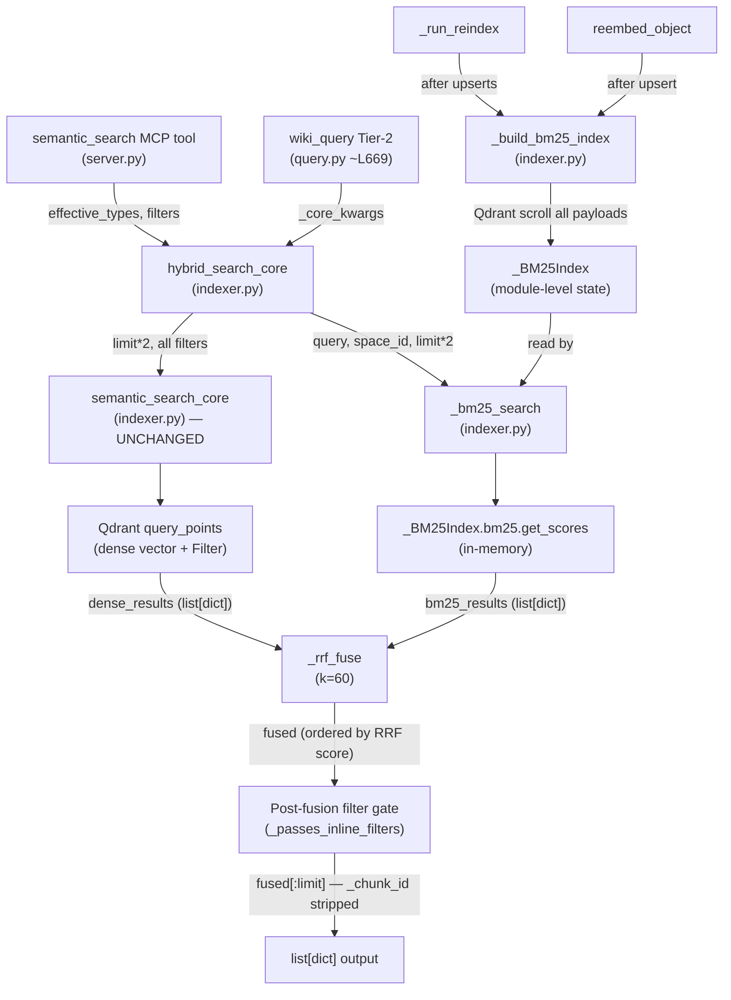

# Retrieval: Lexical / Hybrid Dense+Sparse Fusion (#327)

**Status:** DRAFT
**Date:** 2026-06-25
**Author:** spec-writer agent
**Review rounds:** 0
**Epic:** aldeia-box#140 | **Depends on:** #323 (metadata filters), #336 (source_type/domain_tags) — both merged on this branch

---

## 1. Problem Statement

Dense (bge-m3, 1024-dim) retrieval ranks by cosine similarity. Queries containing exact names or technical keywords that differ only in phrasing from the stored text score poorly when the surface form diverges from the semantic neighborhood. The live reproduction case (`"What is the contradiction detection capability and its limitations?"`) confirmed that the correct objects are not recalled at top-5 because the query embedding has low cosine similarity to the precise chunk text containing "contradiction detection" — the term appears but not in a semantically proximate cluster.

Adding a lexical (BM25) signal surfaces exact-match and near-exact-match results that dense retrieval misses, then fuses the two ranked lists via Reciprocal Rank Fusion (RRF) so that results strong on either signal rank high in the combined output.

No new cloud dependencies, no egress: all retrieval runs locally.

---

## 2. Scope

### In Scope

| File | Nature |
|------|--------|
| `src/anytype_llm_wiki/indexer.py` | New `_BM25Index` module state, `_build_bm25_index`, `_bm25_search`, `_rrf_fuse`, `hybrid_search_core` |
| `src/anytype_llm_wiki/server.py` | Switch `semantic_search` call site from `semantic_search_core` → `hybrid_search_core` |
| `src/anytype_llm_wiki/wiki/query.py` | Switch Tier-2 call site (line ~669) from `indexer.semantic_search_core` → `indexer.hybrid_search_core` |
| `pyproject.toml` | Add `rank-bm25>=0.2.2,<1.0.0` |
| `tests/test_indexer.py` | BM25, RRF, and `hybrid_search_core` unit tests; extended fake client |
| `tests/wiki/test_query.py` | Caller-switch regression; fixture seeds as `wiki_entity`-typed objects |
| `tests/eval/test_retrieval_quality.py` | New file; `@pytest.mark.live` aggregate recall eval |

### Out of Scope

- `semantic_search_core` — unchanged (invariant; see §4 D1)
- Qdrant collection schema change — no sparse vector field added in v1
- `PAYLOAD_SCHEMA_VERSION` bump — v1 adds no new payload field
- `_ensure_payload_indexes` — no new indexes
- Native Qdrant `FusionQuery(Fusion.RRF)` — deferred to v2 (§12)
- BM25 index persistence to disk across server restarts — cold-start rebuild acceptable at ≤500 chunks
- Stopword removal or stemming in BM25 tokenizer — simple lowercased whitespace split in v1

---

## 3. Research Summary

Research (`research.md`) evaluated three sparse-signal options:

- **Option A (FastEmbed + Qdrant `Document`/BM25):** Rejected. Requires `fastembed` (onnxruntime ~200 MB), which the local Docker Qdrant cannot bypass; Qdrant Cloud Inference is required for server-side inference. Too heavy for this project's supply-chain posture.
- **Option B (precomputed sparse vectors in Qdrant, native `FusionQuery`):** Sound architecture at scale, but requires `create_vector_name` schema migration and full backfill. Deferred to v2.
- **Option C (`rank-bm25`, app-level RRF):** Recommended. 8.6 kB wheel, numpy-only (already a transitive dep of qdrant-client). Zero additional package downloads. No collection schema change. Offline.

Key confirmed facts from research:
- `uv pip install --dry-run rank-bm25` → resolves exactly 1 new package (rank-bm25==0.2.2). Numpy already present.
- Qdrant's own RRF k constant is 2 (not the academic standard 60). App-level RRF uses k=60.
- `create_vector_name` works in qdrant-client 1.18.0 for the v2 in-place migration path (verified via in-memory client).
- For native `FusionQuery`, filters must be placed on each `Prefetch`, not the outer `query_filter` — verified in `local_collection.py:814-848`.

---

## 4. Design Decisions

### D1 — `semantic_search_core` Is Unchanged (Invariant)

`semantic_search_core` (`indexer.py:71-161`) is NOT modified. It remains the single dense retrieval path. All fusion logic lives in a new wrapper `hybrid_search_core`. This preserves:

- The `test_no_filter_regression` assertion that `query_filter is None` when `semantic_search_core(query="test")` is called bare (AC-H-REG1 — guard test, must fail-before-impl if the function is modified).
- The OD-B default-type-exclusion constraint inherited from #336: `server.py:semantic_search` computes `effective_types` and passes it to `hybrid_search_core`, which passes it straight to `semantic_search_core`. The logic does not move.

### D2 — New Public Function `hybrid_search_core` in `indexer.py`

`hybrid_search_core` has the identical signature to `semantic_search_core`. It calls `semantic_search_core` internally for the dense ranked list, calls `_bm25_search` for the sparse ranked list, calls `_rrf_fuse` to merge, and returns the same `list[dict]` shape. Both callers (`server.py:semantic_search` and `query.py` Tier-2) switch from `semantic_search_core` to `hybrid_search_core`.

Signature (final):

```python
def hybrid_search_core(
    query: str,
    space_id: str | None = None,
    types: list[str] | None = None,
    ingested_after: str | None = None,
    ingested_before: str | None = None,
    source_type: list[str] | None = None,
    domain_tags: list[str] | None = None,
    limit: int = 10,
) -> list[dict]:
    """Hybrid (dense + BM25) search with RRF fusion. Falls back to dense-only if BM25 fails."""
```

### D3 — BM25 Index: Eager Build on Reindex, In-Memory, Module-Level State

**Resolved open question A from the task brief.**

The BM25 index is built eagerly at the end of every `_run_reindex` call (after all upserts complete) and after every `reembed_object` call. It is stored as module-level state in `indexer.py`. It is NOT persisted to disk; it rebuilds on server restart.

**Rationale for eager over lazy:**
- Lazy-on-first-query forces the first user query to absorb the Qdrant scroll + BM25 build latency with no warning. Eager build absorbs it during reindex (which the user already expects to be a batch operation).
- On the launchd cron path, eager build keeps the server warm so the next query finds a ready index.
- Testing is simpler: tests can monkeypatch the module-level index directly rather than triggering a lazy build path.

**Cold-start cost:** At ~500 chunks, a Qdrant scroll with `limit=1000` (single page) takes milliseconds. `BM25Okapi` construction over 500 tokenized texts is sub-100ms. The total cold-start rebuild is negligible on the 32GB Mac Mini.

**Thread safety:** The MCP server runs as a single-process stdio transport (`mcp.run(transport="stdio")`). No concurrent request handling. Module-level state is safe without a lock.

**State owning module:** `indexer.py`. The module holds:

```python
# Module-level BM25 index state — rebuilt after each reindex / reembed_object.
# None means "not yet built"; hybrid_search_core falls back to dense-only.
_bm25_index: "_BM25Index | None" = None
```

A `_BM25Index` dataclass (or named tuple) holds:

```python
@dataclasses.dataclass
class _BM25Index:
    bm25: "BM25Okapi"          # rank_bm25.BM25Okapi instance
    chunk_ids: list[str]       # Qdrant point IDs, parallel to bm25 corpus
    payloads: list[dict]       # Full payloads, parallel to bm25 corpus
    space_ids: list[str]       # payload["space_id"] for each entry (filter support)
```

**Source of chunk texts:** `_build_bm25_index` scrolls all Qdrant payloads from the collection using `client.scroll(collection_name, limit=1000, with_payload=True, with_vectors=False)`. It iterates all pages (`next_page_offset` until `None`). This reuses the already-running Qdrant client and means no second data store is needed.

**Build trigger detail:**
- `_run_reindex`: call `_build_bm25_index(client)` after the main upsert loop and before `_save_state`. The `client` is the same `_qdrant()` instance already in scope.
- `reembed_object`: call `_build_bm25_index(_qdrant())` at the end, after the upsert completes.
- Both calls silently no-op if the `rank_bm25` import fails (guarded with `try/except ImportError` inside `_build_bm25_index`).

**Tests reset the module state** by directly assigning `indexer._bm25_index = None` or by injecting a pre-built `_BM25Index` fixture. No test should exercise the actual Qdrant scroll path unless marked `@pytest.mark.live`.

### D4 — BM25 Tokenizer: Lowercased Whitespace Split

For v1, tokenize as `text.lower().split()`. No stopwords, no stemming. Technical wiki content benefits from exact token preservation (e.g., `BM25`, `wiki_entity`, `contradiction`). Stopword removal can be added in a follow-up if precision suffers.

### D5 — BM25 Filter Scope: `space_id` Filter Applied; Type/Date Filters Applied Post-Fusion

**Resolved open question #3 from task brief.**

`_bm25_search` accepts a `space_id` parameter. When set, it restricts the BM25 search to chunks whose `payload["space_id"]` matches. This is the primary safety filter: results from other spaces never enter the fused output.

Type, date, `source_type`, and `domain_tags` filters are already enforced by the dense path via `semantic_search_core`. The BM25 candidate set is additionally constrained post-fusion: after `_rrf_fuse` produces the ordered list, the caller (`hybrid_search_core`) uses the dense-filtered result set. Specifically:

- `_bm25_search` returns chunks from the BM25 index filtered by `space_id`.
- `_rrf_fuse` merges the dense list (already type/date/tag filtered by Qdrant) with the BM25 list (space-only filtered).
- The merged output is ordered by RRF score. A chunk present only in the BM25 list (not in the dense list) will appear in the fused output regardless of type/date/tag filters.

To prevent a BM25-only chunk from violating a type/date/tag filter, `_rrf_fuse` returns only chunks that appear in **at least one of the two lists**; chunks that appear only in the BM25 list must be validated against the active filters before inclusion. The safe implementation: after `_rrf_fuse`, iterate the fused list and keep only entries that either appear in the dense set OR pass a lightweight in-memory filter check (type in `types`, date in range). See §7.3 for the filter-gate design.

This is simpler than running two separate Qdrant filter queries and avoids the complexity of duplicating Qdrant filter logic in Python. It ensures the fused output never surfaces an object excluded by a filter the caller passed.

### D6 — RRF Formula and k=60

Standard Reciprocal Rank Fusion (Cormack et al. 2009):

```
score(d) = sum_r  1 / (k + rank_r(d))
```

where `rank_r(d)` is the 0-based position of document `d` in retriever `r`'s list.

Use `k=60` (academic standard, empirically validated for diverse retrieval combinations). Qdrant's own RRF implementation uses `k=2`, which gives much stronger rank-1 weighting (0.5 vs 0.016 at k=60) and is not appropriate for app-level fusion.

### D7 — Fetch Limit: `limit * 2` Per Signal

Each signal fetches `limit * 2` candidates before fusion. For a `limit=10` call: dense fetches 20, BM25 returns up to 20, RRF fuses up to 40 unique chunks, final output truncated to 10. This gives RRF sufficient coverage to reorder correctly.

### D8 — Graceful Degradation

`hybrid_search_core` wraps the BM25 call in `try/except Exception`. Any BM25 failure (index not built, `rank_bm25` import error, corrupt index) silently falls back to `dense_results[:limit]`. The caller receives the same `list[dict]` shape. No error is surfaced.

Qdrant unavailability (`httpx.HTTPError` from `semantic_search_core`) is NOT caught by `hybrid_search_core` — it propagates to `wiki_query` Tier-2, which catches it as `qdrant_unavailable` (existing behavior at `query.py:682`).

### D9 — Dedup at Object Level in the Caller, Not in `hybrid_search_core`

`hybrid_search_core` returns chunk-level results (multiple chunks per object), matching `semantic_search_core`. The existing `wiki_query` Tier-2 dedup (`seen` set over `object_id`) is unchanged. `_rrf_fuse` deduplicates at the **chunk ID** level (Qdrant point UUID), not object ID. This preserves the existing dedup contract.

---

## 5. API Surface

### 5.1 `hybrid_search_core` (new, `indexer.py`)

Wire contract: replaces `semantic_search_core` at both call sites. Returns `list[dict]` with identical keys: `object_name`, `object_id`, `type`, `heading`, `text` (truncated to 500 chars), `score`.

```python
def hybrid_search_core(
    query: str,
    space_id: str | None = None,
    types: list[str] | None = None,
    ingested_after: str | None = None,
    ingested_before: str | None = None,
    source_type: list[str] | None = None,
    domain_tags: list[str] | None = None,
    limit: int = 10,
) -> list[dict]: ...
```

### 5.2 `server.py:semantic_search` (changed call site only)

The import line changes from:

```python
from .indexer import reindex, semantic_search_core
```

to:

```python
from .indexer import reindex, hybrid_search_core
```

The body of `semantic_search` changes only the final call:

```python
# Before:
return semantic_search_core(query=query, ...)
# After:
return hybrid_search_core(query=query, ...)
```

All validation logic, `effective_types` computation, and OD-B default-type-exclusion remain unchanged in `server.py`.

### 5.3 `query.py` Tier-2 call site (changed call site only)

Line ~669 changes from:

```python
raw = indexer.semantic_search_core(**_core_kwargs)
```

to:

```python
raw = indexer.hybrid_search_core(**_core_kwargs)
```

The `_core_kwargs` construction and `seen`-set dedup are unchanged.

### 5.4 `semantic_search_core` (unchanged)

Signature and behavior locked. Referenced by the `test_no_filter_regression` guard test.

---

## 6. BM25 Index Design

### 6.1 Module-Level State

```python
# indexer.py (module level, after imports)
import dataclasses
_bm25_index: "_BM25Index | None" = None

@dataclasses.dataclass
class _BM25Index:
    bm25: object              # BM25Okapi instance (typed as object to avoid import at module level)
    chunk_ids: list[str]      # Qdrant point UUID strings, parallel to corpus
    payloads: list[dict]      # Full Qdrant payloads, parallel to corpus
    space_ids: list[str]      # payload["space_id"] per entry, for fast space filter
```

### 6.2 `_build_bm25_index(client: QdrantClient) -> None`

```python
def _build_bm25_index(client: QdrantClient) -> None:
    """Scroll all Qdrant chunks and build the in-memory BM25 index.

    Called after reindex and reembed_object. Silently no-ops if rank_bm25
    is not importable (graceful degradation). Sets the module-level
    _bm25_index; replaces any prior instance atomically.
    """
    global _bm25_index
    try:
        from rank_bm25 import BM25Okapi
    except ImportError:
        return

    chunk_ids: list[str] = []
    payloads: list[dict] = []
    space_ids: list[str] = []
    corpus: list[list[str]] = []

    offset = None
    while True:
        results, next_offset = client.scroll(
            collection_name=config.QDRANT_COLLECTION,
            limit=1000,
            offset=offset,
            with_payload=True,
            with_vectors=False,
        )
        for point in results:
            p = point.payload or {}
            text = p.get("text", "") or ""
            chunk_ids.append(str(point.id))
            payloads.append(p)
            space_ids.append(p.get("space_id", ""))
            corpus.append(text.lower().split())
        if next_offset is None:
            break
        offset = next_offset

    if not corpus:
        _bm25_index = None
        return

    _bm25_index = _BM25Index(
        bm25=BM25Okapi(corpus),
        chunk_ids=chunk_ids,
        payloads=payloads,
        space_ids=space_ids,
    )
```

### 6.3 `_bm25_search(query: str, space_id: str | None, limit: int) -> list[dict]`

```python
def _bm25_search(
    query: str,
    space_id: str | None = None,
    limit: int = 20,
) -> list[dict]:
    """Return top-limit BM25-scored chunks in result-dict format.

    Raises if _bm25_index is None (caller wraps in try/except).
    """
    idx = _bm25_index
    if idx is None:
        raise RuntimeError("BM25 index not built")

    tokens = query.lower().split()
    scores = idx.bm25.get_scores(tokens)  # ndarray, length == len(corpus)

    # Build (score, i) pairs filtered by space_id, sorted descending.
    pairs = [
        (scores[i], i)
        for i in range(len(scores))
        if (space_id is None or idx.space_ids[i] == space_id)
    ]
    pairs.sort(key=lambda x: x[0], reverse=True)

    results = []
    for score, i in pairs[:limit]:
        if score <= 0.0:
            break  # BM25 scores are 0 for no-token-match; stop early
        p = idx.payloads[i]
        results.append({
            "_chunk_id": idx.chunk_ids[i],
            "object_name": p.get("object_name", ""),
            "object_id": p.get("object_id", ""),
            "type": p.get("type_key", ""),
            "heading": p.get("heading", ""),
            "text": p.get("text", "")[:500],
            "score": round(float(score), 4),
        })
    return results
```

Note: `_bm25_search` results carry an extra `_chunk_id` key used by `_rrf_fuse` for dedup. This key is stripped from `hybrid_search_core`'s output before returning.

### 6.4 `_rrf_fuse(dense_results, bm25_results, k=60) -> list[dict]`

```python
def _rrf_fuse(
    dense_results: list[dict],
    bm25_results: list[dict],
    k: int = 60,
) -> list[dict]:
    """Reciprocal Rank Fusion (Cormack et al. 2009) over two ranked lists.

    Deduplicates by _chunk_id. k=60 is the academic standard.
    Returns the merged list ordered by descending RRF score.
    """
    scores: dict[str, float] = {}
    chunks: dict[str, dict] = {}

    for rank, r in enumerate(dense_results):
        cid = r.get("_chunk_id", r.get("object_id", str(rank)))
        scores[cid] = scores.get(cid, 0.0) + 1.0 / (k + rank + 1)
        chunks.setdefault(cid, r)

    for rank, r in enumerate(bm25_results):
        cid = r.get("_chunk_id", r.get("object_id", str(rank)))
        scores[cid] = scores.get(cid, 0.0) + 1.0 / (k + rank + 1)
        chunks.setdefault(cid, r)

    ordered = sorted(scores, key=lambda cid: scores[cid], reverse=True)
    return [chunks[cid] for cid in ordered]
```

Edge cases tested: both-empty → `[]`; one-empty → identical to the non-empty list's order.

### 6.5 `hybrid_search_core` Implementation

```python
def hybrid_search_core(
    query: str,
    space_id: str | None = None,
    types: list[str] | None = None,
    ingested_after: str | None = None,
    ingested_before: str | None = None,
    source_type: list[str] | None = None,
    domain_tags: list[str] | None = None,
    limit: int = 10,
) -> list[dict]:
    """Hybrid (dense + BM25) search with RRF fusion (k=60).

    Falls back to dense-only if BM25 is unavailable or raises.
    Qdrant unavailability propagates (not caught here).
    """
    fetch_limit = limit * 2

    try:
        bm25_results = _bm25_search(query, space_id=space_id, limit=fetch_limit)
    except Exception:  # noqa: BLE001
        bm25_results = []

    dense_results = semantic_search_core(
        query=query,
        space_id=space_id,
        types=types,
        ingested_after=ingested_after,
        ingested_before=ingested_before,
        source_type=source_type,
        domain_tags=domain_tags,
        limit=fetch_limit,
    )

    # Attach _chunk_id to dense results for RRF dedup (dense results have no _chunk_id).
    # Use object_id + heading as a stable proxy for chunk identity.
    for i, r in enumerate(dense_results):
        if "_chunk_id" not in r:
            r["_chunk_id"] = f"{r.get('object_id', '')}:{r.get('heading', '')}:{i}"

    if not bm25_results:
        # Strip internal key before returning
        for r in dense_results:
            r.pop("_chunk_id", None)
        return dense_results[:limit]

    fused = _rrf_fuse(dense_results, bm25_results, k=60)

    # Post-fusion filter gate (D5): keep only chunks present in the dense
    # set OR passable through the active filters. The dense set is already
    # filter-compliant; BM25-only entries need a guard.
    dense_chunk_ids = {r.get("_chunk_id") for r in dense_results}
    if types or ingested_after or ingested_before or source_type or domain_tags:
        fused = [
            r for r in fused
            if r.get("_chunk_id") in dense_chunk_ids
               or _passes_inline_filters(r, types=types, source_type=source_type,
                                         domain_tags=domain_tags)
        ]

    # Strip internal key
    for r in fused:
        r.pop("_chunk_id", None)

    return fused[:limit]
```

`_passes_inline_filters` is a private helper that checks `type`, `source_type`, and `domain_tags` against the chunk payload dict. Date range filtering is not replicated inline — BM25-only chunks without a date are excluded when a date filter is active (consistent with Qdrant's missing-field-never-matches semantics). This is acceptable: the dense path already returns date-filtered results; the BM25-only additions are the keyword-precision gains, which are most valuable for name/type-precise queries rather than date-filtered queries.

---

## 7. Filter Interaction

### 7.1 Dense Path (unchanged)

Filters flow through `semantic_search_core` exactly as today: `space_id`, `types`, `ingested_after`, `ingested_before`, `source_type`, `domain_tags` are translated to Qdrant `Filter(must=[...])` conditions. No change.

### 7.2 BM25 Path

`_bm25_search` applies only the `space_id` filter in-memory (iterating `_BM25Index.space_ids`). All other filters are not applied during BM25 scoring.

### 7.3 Post-Fusion Filter Gate

After `_rrf_fuse`, `hybrid_search_core` applies a filter gate (D5) to ensure no BM25-only chunk violates an active filter:

```python
def _passes_inline_filters(
    r: dict,
    types: list[str] | None,
    source_type: list[str] | None,
    domain_tags: list[str] | None,
) -> bool:
    if types and r.get("type") not in types:
        return False
    if source_type and r.get("source_type") not in source_type:
        return False
    if domain_tags:
        obj_tags = r.get("domain_tags") or []
        if not any(t in obj_tags for t in domain_tags):
            return False
    return True
```

Date filters (`ingested_after`, `ingested_before`) are not checked inline. A BM25-only chunk is excluded from the fused output when any of `types`, `source_type`, or `domain_tags` filters are active and the chunk does not pass the inline check. This is conservative (some BM25 recall is sacrificed) but correct.

### 7.4 `wiki_query` Tier-2 Filter Contract

`wiki_query` Tier-2 passes `types=sorted(effective_types_set)` in `_core_kwargs`. After the caller switch from `semantic_search_core` to `hybrid_search_core`, the types filter flows to both the dense path (via `semantic_search_core`) and the post-fusion filter gate. This is the correct behavior for keyword-name queries: a query for "contradiction detection" scoped to `wiki_entity` should not surface `wiki_source` chunks even if BM25 scores them highly.

---

## 8. New Dependency

```toml
# pyproject.toml [project.dependencies]
"rank-bm25>=0.2.2,<1.0.0",
```

**Justification (supply-chain posture):** `rank-bm25` is 8.6 kB, depends only on `numpy` (already present as a transitive dep of `qdrant-client`). Zero new packages download. No network calls. Next-major cap (`<1.0.0`) matches the project's compatible-release pin style. The alternative (FastEmbed) requires onnxruntime (~200 MB) and was rejected on supply-chain grounds.

---

## 9. Call-Path Diagram



---

## 10. Evaluation Methodology

**Resolved open question B from task brief.**

### 10.1 Eval Design (Non-Flaky Aggregate)

The per-query `assert hybrid_recall >= dense_recall` approach is brittle (a single query regression fails the suite). The spec mandates an **aggregate** metric:

- Compute `Recall@5` for each query: `|expected_ids ∩ top5_ids| / |expected_ids|`
- Compute `MRR@5` for each query: `1 / rank_of_first_expected_id` (0 if none in top 5)
- Assert `mean_hybrid_recall@5 >= mean_dense_recall@5` (across all queries)
- Assert `mean_hybrid_mrr@5 >= mean_dense_mrr@5` (across all queries)
- A small tolerance is not applied: if the hybrid mean equals the dense mean on a multi-query fixture, it means BM25 helped some queries and hurt none, which is the correct pass condition.
- Emit a per-query diagnostic table regardless of pass/fail so regressions are diagnosable.

### 10.2 Fixture Format

`tests/eval/fixtures/retrieval_quality_cases.json`:

```json
[
  {
    "query": "contradiction detection limitations",
    "expected_ids": ["<object_id_1>", "<object_id_2>"],
    "note": "live reproduction case from ticket #327 comment 2026-06-25"
  }
]
```

`expected_ids` are Anytype object IDs (UUIDs). The fixture is populated once from a live `semantic_search` + manual inspection pass. At least two keyword-precise cases must be included (the reproduction case plus one additional).

### 10.3 Test Implementation

```python
# tests/eval/test_retrieval_quality.py

import json, statistics
from pathlib import Path

import pytest

FIXTURE_FILE = Path(__file__).parent / "fixtures" / "retrieval_quality_cases.json"


def _recall_at_k(expected: list[str], results: list[dict], k: int = 5) -> float:
    top_ids = {r["object_id"] for r in results[:k]}
    return len(set(expected) & top_ids) / len(expected) if expected else 0.0


def _mrr_at_k(expected: list[str], results: list[dict], k: int = 5) -> float:
    expected_set = set(expected)
    for rank, r in enumerate(results[:k], start=1):
        if r["object_id"] in expected_set:
            return 1.0 / rank
    return 0.0


@pytest.mark.live
def test_hybrid_recall_aggregate():
    from anytype_llm_wiki.indexer import hybrid_search_core, semantic_search_core

    cases = json.loads(FIXTURE_FILE.read_text())
    dense_recalls, hybrid_recalls = [], []
    dense_mrrs, hybrid_mrrs = [], []
    per_query_report = []

    for case in cases:
        query = case["query"]
        expected = case["expected_ids"]
        dense = semantic_search_core(query=query, limit=5)
        hybrid = hybrid_search_core(query=query, limit=5)
        dr = _recall_at_k(expected, dense)
        hr = _recall_at_k(expected, hybrid)
        dm = _mrr_at_k(expected, dense)
        hm = _mrr_at_k(expected, hybrid)
        dense_recalls.append(dr)
        hybrid_recalls.append(hr)
        dense_mrrs.append(dm)
        hybrid_mrrs.append(hm)
        per_query_report.append(
            f"  {query!r}: dense_recall={dr:.2f} hybrid_recall={hr:.2f} "
            f"dense_mrr={dm:.2f} hybrid_mrr={hm:.2f}"
        )

    report = "\n".join(per_query_report)
    mean_dr = statistics.mean(dense_recalls)
    mean_hr = statistics.mean(hybrid_recalls)
    mean_dm = statistics.mean(dense_mrrs)
    mean_hm = statistics.mean(hybrid_mrrs)

    assert mean_hr >= mean_dr, (
        f"Aggregate Recall@5: hybrid ({mean_hr:.3f}) < dense ({mean_dr:.3f})\n{report}"
    )
    assert mean_hm >= mean_dm, (
        f"Aggregate MRR@5: hybrid ({mean_hm:.3f}) < dense ({mean_dm:.3f})\n{report}"
    )
```

Run with `uv run python -m pytest tests/eval/ -m live -v`. Skip with `-m 'not live'`.

Baseline procedure: run the test BEFORE implementing `hybrid_search_core` (both `hybrid_search_core` and `semantic_search_core` return dense results) to capture the baseline numbers in CI output. Then implement and re-run.

---

## 11. Test Plan

Tests live in `tests/test_indexer.py` (BM25 unit tests, RRF unit tests, `hybrid_search_core` behavior), `tests/wiki/test_query.py` (caller-switch regression), and `tests/eval/test_retrieval_quality.py` (live aggregate eval).

### 11.1 Extended Fake Qdrant Client

`FakeQdrantClientWithSearch` in `tests/test_indexer.py` (already introduced in #323) must be extended with a `scroll` method:

```python
def scroll(self, collection_name, limit=10, offset=None,
           with_payload=True, with_vectors=False):
    # Return all upserted points as if scrolled; next_offset=None (single page).
    return list(self.upserted_points), None
```

Also add `create_vector_name` (no-op) for forward-compatibility with v2 tests.

### 11.2 Acceptance Criteria Tests

**AC-H1 — BM25 tokenization and scoring (deterministic, no live services)**

```python
def test_bm25_scores_keyword_match():
    from rank_bm25 import BM25Okapi
    corpus = [
        ["contradiction", "detection", "capability"],
        ["semantic", "search", "dense"],
        ["knowledge", "graph", "entity"],
    ]
    bm25 = BM25Okapi(corpus)
    scores = bm25.get_scores(["contradiction", "detection"])
    assert scores[0] > scores[1]
    assert scores[0] > scores[2]
    assert scores[1] == pytest.approx(0.0, abs=1e-6) or scores[1] < scores[0]
```

**AC-H2 — `_rrf_fuse`: correct fusion order, k=60, dedup by `_chunk_id`**

```python
def test_rrf_fuse_order():
    from anytype_llm_wiki.indexer import _rrf_fuse
    dense = [
        {"_chunk_id": "c1", "object_id": "o1", "score": 0.9},
        {"_chunk_id": "c2", "object_id": "o2", "score": 0.8},
    ]
    bm25 = [
        {"_chunk_id": "c2", "object_id": "o2", "score": 1.5},  # c2 appears in both
        {"_chunk_id": "c3", "object_id": "o3", "score": 1.2},
    ]
    fused = _rrf_fuse(dense, bm25, k=60)
    # c2 appears in both lists → highest RRF score
    assert fused[0]["_chunk_id"] == "c2"
    assert len({r["_chunk_id"] for r in fused}) == len(fused)  # no duplicates

def test_rrf_fuse_both_empty():
    from anytype_llm_wiki.indexer import _rrf_fuse
    assert _rrf_fuse([], [], k=60) == []

def test_rrf_fuse_one_empty_dense():
    from anytype_llm_wiki.indexer import _rrf_fuse
    dense = [{"_chunk_id": "c1", "object_id": "o1", "score": 0.9}]
    fused = _rrf_fuse(dense, [], k=60)
    assert len(fused) == 1
    assert fused[0]["_chunk_id"] == "c1"

def test_rrf_fuse_one_empty_bm25():
    from anytype_llm_wiki.indexer import _rrf_fuse
    bm25 = [{"_chunk_id": "c1", "object_id": "o1", "score": 1.0}]
    fused = _rrf_fuse([], bm25, k=60)
    assert len(fused) == 1

def test_rrf_fuse_k60_formula():
    """Verify the k=60 formula: score = 1/(60 + rank + 1)."""
    from anytype_llm_wiki.indexer import _rrf_fuse
    dense = [{"_chunk_id": "c1", "object_id": "o1", "score": 0.9}]
    # c1 is rank 0 in dense only → score = 1/(60+0+1) = 1/61
    fused = _rrf_fuse(dense, [], k=60)
    # We can't directly inspect scores from the return value, but we can verify
    # ordering for a two-item case.
    dense2 = [
        {"_chunk_id": "c1", "object_id": "o1", "score": 0.9},
        {"_chunk_id": "c2", "object_id": "o2", "score": 0.8},
    ]
    bm25_2 = [{"_chunk_id": "c2", "object_id": "o2", "score": 1.5}]
    # c1: 1/61; c2: 1/62 + 1/61 = 2/61 > 1/61 → c2 first
    fused2 = _rrf_fuse(dense2, bm25_2, k=60)
    assert fused2[0]["_chunk_id"] == "c2"
```

**AC-H3 — `hybrid_search_core`: fallback to dense-only when BM25 raises**

```python
def test_hybrid_fallback_to_dense_on_bm25_failure(monkeypatch):
    import anytype_llm_wiki.indexer as _indexer
    _indexer._bm25_index = None  # ensure BM25 will raise

    fake_dense = [{"object_name": "X", "object_id": "o1", "type": "wiki_entity",
                   "heading": "", "text": "body", "score": 0.9}]
    monkeypatch.setattr(_indexer, "semantic_search_core", lambda **kw: fake_dense)

    result = _indexer.hybrid_search_core(query="test", limit=10)
    assert result == fake_dense
    assert all("_chunk_id" not in r for r in result)  # internal key stripped
```

**AC-H4 — `hybrid_search_core`: returns dense `list[dict]` shape; no `_chunk_id` key**

```python
def test_hybrid_output_shape(monkeypatch):
    import anytype_llm_wiki.indexer as _indexer
    dense = [{"object_name": "N", "object_id": "o1", "type": "wiki_entity",
              "heading": "H", "text": "T", "score": 0.8}]
    bm25 = [{"_chunk_id": "c1", "object_name": "N", "object_id": "o1",
              "type": "wiki_entity", "heading": "H", "text": "T", "score": 1.2}]
    monkeypatch.setattr(_indexer, "semantic_search_core", lambda **kw: dense)
    monkeypatch.setattr(_indexer, "_bm25_search", lambda *a, **kw: bm25)

    result = _indexer.hybrid_search_core(query="test", limit=10)
    assert isinstance(result, list)
    assert all(isinstance(r, dict) for r in result)
    for key in ("object_name", "object_id", "type", "heading", "text", "score"):
        assert all(key in r for r in result), f"key {key!r} missing"
    assert all("_chunk_id" not in r for r in result)
```

**AC-H5 — `hybrid_search_core`: `limit` respected (at most `limit` results)**

```python
def test_hybrid_respects_limit(monkeypatch):
    import anytype_llm_wiki.indexer as _indexer
    dense = [{"object_name": f"N{i}", "object_id": f"o{i}", "type": "wiki_entity",
              "heading": "", "text": "", "score": 1.0 - i*0.05}
             for i in range(20)]
    bm25 = [{"_chunk_id": f"c{i}", "object_name": f"N{i}", "object_id": f"o{i}",
              "type": "wiki_entity", "heading": "", "text": "", "score": 1.0 - i*0.03}
             for i in range(20)]
    monkeypatch.setattr(_indexer, "semantic_search_core", lambda **kw: dense)
    monkeypatch.setattr(_indexer, "_bm25_search", lambda *a, **kw: bm25)
    result = _indexer.hybrid_search_core(query="test", limit=5)
    assert len(result) <= 5
```

**AC-H6 — `hybrid_search_core`: filter honored in fused output (no cross-type leak)**

```python
def test_hybrid_filter_prevents_type_leak(monkeypatch):
    import anytype_llm_wiki.indexer as _indexer
    # Dense returns only wiki_entity (filter-compliant)
    dense = [{"_chunk_id": "c1", "object_name": "E", "object_id": "o1",
              "type": "wiki_entity", "heading": "", "text": "", "score": 0.8}]
    # BM25 returns a wiki_source chunk (would violate a types=["wiki_entity"] filter)
    bm25 = [
        {"_chunk_id": "c2", "object_name": "S", "object_id": "o2",
         "type": "wiki_source", "heading": "", "text": "", "score": 2.0},
        {"_chunk_id": "c1", "object_name": "E", "object_id": "o1",
         "type": "wiki_entity", "heading": "", "text": "", "score": 1.5},
    ]
    monkeypatch.setattr(_indexer, "semantic_search_core", lambda **kw: dense)
    monkeypatch.setattr(_indexer, "_bm25_search", lambda *a, **kw: bm25)

    result = _indexer.hybrid_search_core(
        query="test", types=["wiki_entity"], limit=10)
    types_in_result = {r["type"] for r in result}
    assert "wiki_source" not in types_in_result
```

**AC-H7 — `_build_bm25_index`: builds from Qdrant scroll payloads**

```python
def test_build_bm25_index_from_scroll(monkeypatch):
    import anytype_llm_wiki.indexer as _indexer
    from anytype_llm_wiki.indexer import _BM25Index

    fake_point = type("P", (), {
        "id": "uuid-1",
        "payload": {"text": "contradiction detection", "space_id": "sp-1",
                    "object_id": "o1", "object_name": "X", "type_key": "wiki_entity",
                    "heading": ""},
    })()

    fake_client = type("FC", (), {
        "scroll": lambda self, **kw: ([fake_point], None)
    })()

    _indexer._bm25_index = None
    _indexer._build_bm25_index(fake_client)
    assert _indexer._bm25_index is not None
    assert isinstance(_indexer._bm25_index, _BM25Index)
    assert len(_indexer._bm25_index.chunk_ids) == 1
```

**AC-H8 — `_build_bm25_index`: silently no-ops when index is empty**

```python
def test_build_bm25_index_empty_collection(monkeypatch):
    import anytype_llm_wiki.indexer as _indexer
    fake_client = type("FC", (), {"scroll": lambda self, **kw: ([], None)})()
    _indexer._bm25_index = None
    _indexer._build_bm25_index(fake_client)
    assert _indexer._bm25_index is None
```

**AC-H-REG1 — Contract regression: `semantic_search_core` bare call still yields `query_filter is None` (unchanged)**

```python
def test_no_filter_regression_unchanged(monkeypatch):
    """semantic_search_core contract unchanged: bare call → query_filter is None."""
    import anytype_llm_wiki.indexer as _indexer
    from anytype_llm_wiki import config
    fake = FakeQdrantClientWithSearch()
    monkeypatch.setattr(_indexer, "_qdrant", lambda: fake)
    monkeypatch.setattr(_indexer, "embed_query", lambda q: [0.1] * config.EMBED_DIMS)
    _indexer.semantic_search_core(query="test")
    call = fake.query_calls[-1]
    assert call["query_filter"] is None
```

This test is inherited from #323 and must continue to pass without modification.

**AC-H9 — Caller switch: `server.py:semantic_search` routes through `hybrid_search_core`**

```python
def test_server_semantic_search_calls_hybrid(monkeypatch):
    import anytype_llm_wiki.indexer as _indexer
    called = {}
    def _fake_hybrid(**kw):
        called["kw"] = kw
        return []
    monkeypatch.setattr(_indexer, "hybrid_search_core", _fake_hybrid)
    from anytype_llm_wiki.server import semantic_search
    semantic_search(query="test")
    assert "kw" in called
    assert called["kw"]["query"] == "test"
```

**AC-H10 — Caller switch: `query.py` Tier-2 routes through `hybrid_search_core`**

```python
def test_wiki_query_tier2_calls_hybrid(monkeypatch, anytype_enum_fixture):
    """Tier-2 (count >= threshold) uses hybrid_search_core, not semantic_search_core."""
    import anytype_llm_wiki.wiki.query as query_mod
    import anytype_llm_wiki.indexer as _indexer
    called = {}
    def _fake_hybrid(**kw):
        called["invoked"] = True
        return []
    monkeypatch.setattr(query_mod.config, "index_threshold", lambda: 1)
    monkeypatch.setattr(_indexer, "hybrid_search_core", _fake_hybrid)
    # Prevent semantic_search_core from being called instead
    monkeypatch.setattr(_indexer, "semantic_search_core",
                        lambda **kw: (_ for _ in ()).throw(
                            AssertionError("semantic_search_core called directly")))
    monkeypatch.setattr(query_mod, "synthesize", lambda q, ctx: "SENTINEL")
    query_mod.wiki_query(question="q", space_id="sp-1")
    assert called.get("invoked"), "hybrid_search_core was not called"
```

Note: the `anytype_enum_fixture` must include at least one `wiki_entity`-typed object in the `list_objects` response and the schema marker, matching the existing `test_query.py` harness.

**AC-H11 — Mem0 test-fixture gotcha: monkeypatched Tier-2 tests target `hybrid_search_core`**

Any existing test in `test_query.py` or `test_query_fetch_paths.py` that monkeypatches `indexer.semantic_search_core` for Tier-2 behavior must be updated to monkeypatch `indexer.hybrid_search_core` instead. The test file must be reviewed and all such patches updated. After the caller switch, monkeypatching `semantic_search_core` for Tier-2 tests has no effect on the Tier-2 path.

Seeds in fixture responses must include `wiki_entity`-typed objects so schema checks and type-filter logic pass (inherited Mem0 gotcha).

**AC-H12 — `reindex` triggers BM25 rebuild**

```python
def test_reindex_rebuilds_bm25_index(monkeypatch, tmp_path):
    import anytype_llm_wiki.indexer as _indexer
    from anytype_llm_wiki import config

    _indexer._bm25_index = None
    built = {}
    def _fake_build(client):
        built["called"] = True
    monkeypatch.setattr(_indexer, "_build_bm25_index", _fake_build)

    fake = FakeQdrantClientWithSearch()
    monkeypatch.setattr(_indexer, "_qdrant", lambda: fake)
    monkeypatch.setattr(_indexer, "list_spaces", lambda: [])
    monkeypatch.setattr(config, "INDEX_STATE_FILE", tmp_path / "state.json")
    monkeypatch.setattr(config, "INDEX_STATE_DIR", tmp_path)

    _indexer.reindex()
    assert built.get("called"), "_build_bm25_index not called after reindex"
```

**AC-H13 — `reembed_object` triggers BM25 rebuild**

```python
def test_reembed_rebuilds_bm25_index(monkeypatch):
    import anytype_llm_wiki.indexer as _indexer
    from anytype_llm_wiki import config
    built = {}
    def _fake_build(client):
        built["called"] = True
    monkeypatch.setattr(_indexer, "_build_bm25_index", _fake_build)
    fake = FakeQdrantClientWithSearch()
    monkeypatch.setattr(_indexer, "_qdrant", lambda: fake)
    monkeypatch.setattr(_indexer, "embed",
                        lambda texts: [[0.1]*config.EMBED_DIMS for _ in texts])
    _indexer.reembed_object("sp-1", "obj-1", {
        "id": "obj-1", "space_id": "sp-1", "name": "X",
        "type": {"key": "wiki_entity"}, "markdown": "# H\nbody", "properties": [],
    })
    assert built.get("called")
```

---

## 12. Acceptance Criteria Checklist

- [ ] **AC-H1** `BM25Okapi` scores keyword-matching chunks higher than non-matching. Test: `test_bm25_scores_keyword_match`.
- [ ] **AC-H2** `_rrf_fuse`: chunks in both lists rank above single-list chunks; dedup by `_chunk_id`; both-empty → `[]`; one-empty → single-list order. Tests: `test_rrf_fuse_order`, `test_rrf_fuse_both_empty`, `test_rrf_fuse_one_empty_dense`, `test_rrf_fuse_one_empty_bm25`, `test_rrf_fuse_k60_formula`.
- [ ] **AC-H3** BM25 unavailable / raises → `hybrid_search_core` returns dense-only with no error. Test: `test_hybrid_fallback_to_dense_on_bm25_failure`.
- [ ] **AC-H4** `hybrid_search_core` output matches `list[dict]` shape; no `_chunk_id` key in output. Test: `test_hybrid_output_shape`.
- [ ] **AC-H5** `limit` param respected; output length ≤ `limit`. Test: `test_hybrid_respects_limit`.
- [ ] **AC-H6** Type filter honored in fused output; BM25-only chunks of excluded types are dropped. Test: `test_hybrid_filter_prevents_type_leak`.
- [ ] **AC-H7** `_build_bm25_index` constructs a `_BM25Index` from Qdrant scroll payloads. Test: `test_build_bm25_index_from_scroll`.
- [ ] **AC-H8** Empty collection → `_bm25_index` stays `None` (no error). Test: `test_build_bm25_index_empty_collection`.
- [ ] **AC-H-REG1** `semantic_search_core` bare call → `query_filter is None` (unchanged contract). Test: `test_no_filter_regression_unchanged`.
- [ ] **AC-H9** `server.py:semantic_search` calls `hybrid_search_core`. Test: `test_server_semantic_search_calls_hybrid`.
- [ ] **AC-H10** `query.py` Tier-2 calls `hybrid_search_core` (not `semantic_search_core`). Test: `test_wiki_query_tier2_calls_hybrid`.
- [ ] **AC-H11** Existing tests monkeypatching `semantic_search_core` for Tier-2 updated to target `hybrid_search_core`. No regressions in `test_query.py` / `test_query_fetch_paths.py`.
- [ ] **AC-H12** `reindex` triggers `_build_bm25_index`. Test: `test_reindex_rebuilds_bm25_index`.
- [ ] **AC-H13** `reembed_object` triggers `_build_bm25_index`. Test: `test_reembed_rebuilds_bm25_index`.
- [ ] **AC-EVAL** Aggregate Recall@5 and MRR@5 for `hybrid_search_core` ≥ `semantic_search_core` on the curated fixture. Test: `test_hybrid_recall_aggregate` (`@pytest.mark.live`). Fixture contains ≥2 keyword-precise cases.

---

## 13. Implementation Plan

Steps 1–3 are independent and can begin in parallel. Step 4 depends on 1. Step 5 depends on 1–4. Step 6 depends on 5.

**Step 1 — Add `rank-bm25` to `pyproject.toml`**

Add `"rank-bm25>=0.2.2,<1.0.0"` to `[project.dependencies]`. Run `uv lock` to update the lockfile.

**Step 2 — Implement `_BM25Index`, `_build_bm25_index`, `_bm25_search`, `_rrf_fuse` in `indexer.py`**

Add module-level state, the dataclass, and the three helper functions. Import `dataclasses` at the top of `indexer.py`. The `rank_bm25` import inside `_build_bm25_index` is deferred (inside the function body with `try/except ImportError`) so the module loads even if the package is somehow absent.

**Step 3 — Write unit tests for Step 2 (fail-before-impl)**

Add AC-H1, AC-H2 (all five sub-tests), AC-H7, AC-H8 to `tests/test_indexer.py`. Extend `FakeQdrantClientWithSearch` with `scroll`. Verify tests fail before Step 2 is merged.

**Step 4 — Implement `hybrid_search_core` and wire BM25 rebuild into `_run_reindex` + `reembed_object`**

Add `hybrid_search_core`, `_passes_inline_filters`. Add `_build_bm25_index(client)` call at the end of `_run_reindex` (before `_save_state`) and at the end of `reembed_object` (after `upsert`).

**Step 5 — Write unit tests for Step 4 (fail-before-impl)**

Add AC-H3, AC-H4, AC-H5, AC-H6, AC-H12, AC-H13. Add AC-H-REG1 (inherited; verify it still passes). All should fail before Step 4 is merged.

**Step 6 — Switch call sites in `server.py` and `query.py`**

In `server.py`: update import and call site. In `query.py`: update call site (`indexer.semantic_search_core` → `indexer.hybrid_search_core`). Review all tests in `test_query.py` and `test_query_fetch_paths.py` that monkeypatch `indexer.semantic_search_core` for Tier-2 behavior and update them to `indexer.hybrid_search_core` (AC-H11).

**Step 7 — Write caller-switch tests**

Add AC-H9, AC-H10. Run the full test suite; zero regressions expected.

**Step 8 — Curate eval fixture and write live eval test**

Manually run `semantic_search(query="contradiction detection limitations", limit=5)` on the live stack. Inspect results. Identify the correct object IDs. Add them to `tests/eval/fixtures/retrieval_quality_cases.json`. Add at least one more keyword-precise case. Write `test_hybrid_recall_aggregate` (AC-EVAL). Run with `-m live` to capture the baseline (before hybrid is wired). Then re-run after Step 6 to confirm improvement.

**Step 9 — Docs**

Update `.aldeia/context/technical.md` to note hybrid retrieval. Update README tool docs for `semantic_search` and `wiki_query` (no signature change; add a note that retrieval is now hybrid). Add CHANGELOG entry.

---

## 14. Open Decisions for Jan (Decide Gate)

### OD-327-A: Accept App-Level BM25 as v1 (No Schema Change)

**Question:** Accept the v1 architecture (app-level `rank-bm25`, in-memory BM25 index, no Qdrant collection schema change, no `PAYLOAD_SCHEMA_VERSION` bump) as the ship target for this ticket?

**Recommendation:** Yes. The v1 approach proves the retrieval improvement with zero schema risk and zero migration complexity. v2 (native Qdrant sparse) can be cut as a separate ticket after the improvement is validated.

**Alternative:** Go straight to v2 (native Qdrant sparse + `FusionQuery`). Requires `create_vector_name` migration and a full corpus backfill. More complex but eliminates the in-memory index.

### OD-327-B: BM25 Index Rebuild on `reembed_object` (Hot Path)

**Question:** Accept triggering `_build_bm25_index` (a Qdrant scroll) on every `reembed_object` call?

**Recommendation:** Yes at current corpus size (~500 chunks). A single-page scroll is fast and the MCP server is single-process. If corpus grows to tens of thousands of chunks, replace with an incremental update (update the one changed chunk in the BM25 index rather than full rebuild). Create a follow-up ticket at that point.

**Alternative:** Rebuild only on full `reindex`, not on `reembed_object`. The BM25 index then lags behind per-object updates from `wiki_ingest`/`wiki_remember` until the next full reindex. Less optimal for real-time recall; simpler.

---

## 15. Resource Impact

**`rank-bm25` package footprint:** 8.6 kB wheel. Zero additional packages (numpy already present). Negligible.

**BM25 index memory at 500 chunks:** `BM25Okapi` stores a tokenized corpus (list of list-of-strings) plus pre-computed term-frequency arrays. At ~100 words/chunk × 500 chunks, this is under 1 MB RAM. Well within the 32 GB Mac Mini's capacity.

**BM25 index build cost (per rebuild):**
- Qdrant scroll 500 chunks: ~10–50ms (single page, local Docker)
- `BM25Okapi(corpus)` construction: ~5–20ms at 500 chunks
- Total cold-start: <100ms. Triggered at reindex completion, not on query.

**Query-time BM25 scoring:** `get_scores(tokens)` over 500 chunks: <5ms. Negligible vs. the Ollama embed call (~100–500ms depending on GPU).

**No change to:** embedding dimensions (1024-dim bge-m3), Qdrant collection schema, payload size, Anytype API call count, or reindex wall time (scroll adds <100ms to an already multi-second batch operation).

---

## 16. Security Considerations

**No egress:** BM25 scoring is entirely in-process (Python arrays). The Qdrant scroll is local Docker. No new network calls to external services.

**Input handling:** query strings fed to `text.lower().split()` produce a list of strings; no code execution surface. BM25 scores are floats; no injection vector.

**In-memory state:** the `_bm25_index` module-level object contains chunk texts from the Qdrant collection. This is the same data already in Qdrant and accessible via `semantic_search_core`. No privilege escalation.

**Trust model unchanged:** local stdio MCP server. Callers are the local AI assistant.

---

## 17. Operational Considerations

**Deployment steps:**
1. Install the new version (`uv tool install --upgrade .`).
2. The next `reindex` (manual or cron) automatically builds the in-memory BM25 index. On cold start (server restart without a reindex), the first call to `hybrid_search_core` falls back to dense-only until a reindex completes.
3. No schema migration required. No `PAYLOAD_SCHEMA_VERSION` bump.

**Rollback:** trivial. The `hybrid_search_core` function is new; downgrading the package restores the prior behavior with no data migration. No Qdrant schema was changed.

**Cold-start behavior:** after server restart, `_bm25_index` is `None`. `hybrid_search_core` catches the `RuntimeError` from `_bm25_search` and falls back to dense-only. Retrieval degrades gracefully until the first reindex completes and rebuilds the index.

**Launchd cron behavior:** the existing `com.aldeia.anytype-llm-wiki-reindex.plist` cron fires `reindex()`, which calls `_build_bm25_index` at the end. The BM25 index is rebuilt on every cron run. This is intentional — it keeps the index fresh.

**Failure modes:**
- BM25 scoring raises for any reason → dense-only (AC-H3).
- Qdrant scroll fails during `_build_bm25_index` → `_bm25_index` remains `None` → next queries fall back to dense-only until the next reindex.
- Qdrant unavailable during `hybrid_search_core` → `semantic_search_core` raises `httpx.HTTPError` → propagates to `wiki_query` Tier-2 `qdrant_unavailable` handler (unchanged).

---

## 18. Open Questions

1. **Post-v1 BM25 tokenizer tuning.** If precision suffers on long technical names (e.g., `"wiki_entity"` with underscore), consider splitting on non-alphanumeric characters in addition to whitespace. Low priority; address in follow-up if eval fixture shows regression.

2. **Incremental BM25 rebuild at scale.** At >5,000 chunks, a full scroll on every `reembed_object` call may become noticeable. An incremental index-update path (add/remove single chunks) should be evaluated before the corpus grows significantly.

3. **Eval fixture seeding.** The live eval fixture requires manual curation from a live stack with the reproduction query. The implementer must run this before closing the ticket. Who is responsible for this curation step — the implementer or Jan?

---

## 19. Deferred Items

### v2: Native Qdrant Sparse Vectors + `FusionQuery` (Future)

The research confirmed this is feasible in qdrant-client 1.18.0 (verified: `create_vector_name` works in-place; `FusionQuery(Fusion.RRF)` end-to-end tested). The migration path is:

1. `_ensure_collection` detects the collection exists with unnamed dense only → calls `create_vector_name('sparse', SparseVectorNameConfig(sparse=SparseVectorConfig(modifier=None)))` (idempotent).
2. Bump `PAYLOAD_SCHEMA_VERSION` from 3 to 4 to trigger the forced-backfill migration (D3 pattern from #323).
3. In the full-pass loop, upsert with `vector={'': dense_vec, 'sparse': SparseVector(indices=..., values=...)}` where the sparse vector is produced by app-level BM25 term-frequency computation.
4. At query time, replace `semantic_search_core`'s `client.query_points(query=vector, ...)` with a `Prefetch`-based call using `FusionQuery(Fusion.RRF)`. **Critical:** filters must go on each `Prefetch`, not the outer `query_filter` (verified: `local_collection.py:814-848` confirms `query_filter` is ignored for `FusionQuery`).
5. The `_BM25Index` module-level state and `_build_bm25_index` / `_bm25_search` / `_rrf_fuse` helpers can be removed.

This path eliminates the in-memory index, uses server-side scoring, and scales to large corpora. The real Qdrant Docker server behavior (unnamed dense + named sparse mix with `Prefetch`) must be verified against the running local instance before v2 implementation, as only the in-memory client was tested.

Open Decision OD-327-A at the Decide gate covers the v1 vs. v2 choice.
