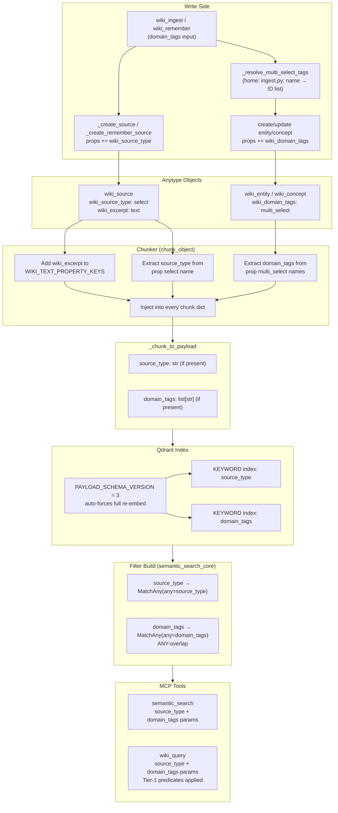

# Wiki: Persist domain_tags + Index Sources + Enable source_type/domain_tags Filters

**Status:** SPEC
**Date:** 2026-06-13
**Author:** spec-writer agent
**Review rounds:** 1
**Epic:** aldeia-box#140 | **Predecessor (hard dependency):** aldeia-box#323

---

## CRITICAL: Hard Dependency on #323

**This ticket is a strict delta to #323's implemented machinery and CANNOT be implemented before #323 merges to main.**

#323 (`aldeia/323-retrieval-metadata-filters-type-tag-scoping-for-wi`) is fully implemented and council-approved but NOT yet merged. This branch (`aldeia/336-...`) was cut from main and does NOT contain:

- `config.PAYLOAD_SCHEMA_VERSION = 2`
- `_chunk_to_payload` (shared payload builder, `#323:indexer.py:22-37`)
- `_ensure_payload_indexes` with `getattr` guard (`#323:indexer.py:41-57`)
- `semantic_search_core` `must`-list filter build (`#323:indexer.py:83-115`)
- The D3 version-marker migration in `reindex` (`#323:indexer.py:145-149`)
- Tier-1 predicates `_passes_type_filter`, `_passes_date_filter` (`#323:query.py:275-300`)
- `types`, `ingested_after`, `ingested_before` params on `wiki_query`/`semantic_search`

**Implementation sequencing:** the implementer MUST rebase this branch onto #323 (after it merges to main, or directly onto the #323 branch). All deltas below are described against #323's seams, not against main.

---

## 1. Problem Statement

#323 shipped `type` and `date` filters for `wiki_query`/`semantic_search` and deferred `source_type` and `domain_tags` with verified root causes (spec §3 D4/D5):

1. **`domain_tags` was never persisted.** `wiki_ingest` and `wiki_remember` validate `domain_hint`/`domain_tags` against the space taxonomy but never write `wiki_domain_tags` as a `multi_select` property on created objects (`ingest.py:659-666`, `remember.py:301-308`). The field is always absent from every object in the corpus.

2. **`wiki_source` objects produce zero chunks.** Sources are written body-less (properties only); `wiki_excerpt` is not in `WIKI_TEXT_PROPERTY_KEYS` (`#323:chunker.py:13-17`). Zero chunks reach Qdrant, so a `source_type` filter returns empty for every input.

Both gaps mean exposing the filters now would ship inert parameters that silently return nothing — explicitly avoided per Jan's Decide direction.

This ticket closes both gaps end to end: write side → chunk payload → Qdrant indexes/migration → filter params on both retrieval tools.

---

## 2. Scope

### In Scope

| File | Nature of Change |
|------|-----------------|
| `src/anytype_llm_wiki/config.py` | Bump `PAYLOAD_SCHEMA_VERSION` 2 → 3 |
| `src/anytype_llm_wiki/chunker.py` | Add `wiki_excerpt` to `WIKI_TEXT_PROPERTY_KEYS`; extract `source_type` + `domain_tags` from properties, inject into every chunk |
| `src/anytype_llm_wiki/indexer.py` | Extend `_chunk_to_payload` (source_type + domain_tags optional fields); extend `_ensure_payload_indexes` (two new KEYWORD indexes); extend `semantic_search_core` (source_type + domain_tags filter clauses, `MatchAny`) |
| `src/anytype_llm_wiki/server.py` | Add `source_type`, `domain_tags` params to `semantic_search` and `wiki_query`; thread through with validation |
| `src/anytype_llm_wiki/wiki/query.py` | Add `_passes_source_type_filter`, `_passes_domain_tags_filter` Tier-1 predicates; thread new params; add `wiki_query` validation |
| `src/anytype_llm_wiki/wiki/ingest.py` | Add `_resolve_multi_select_tags` helper (home module, alongside `_resolve_wiki_action_tag`); `_run_ingest`: resolve `wiki_domain_tags` once, write on entity/concept create+update; `_create_source`: write `wiki_source_type = "document"` |
| `src/anytype_llm_wiki/wiki/remember.py` | Import `_resolve_multi_select_tags` from `.ingest`; thread `domain_tags` into `meta` at `wiki_remember`; resolve in `_apply_batch`; write on entity/concept create+update; `_create_remember_source`: write a non-empty stub excerpt so agent sources produce a chunk |
| `.aldeia/context/technical.md` | Update payload-schema section to v3 (9 fields) |
| `README` tool docs | Document new `source_type`/`domain_tags` params |
| `tests/test_indexer.py` | Extend `FakeQdrantClientWithSearch`; new filter tests; `_chunk_to_payload` propagation test; update `test_reindex_creates_payload_indexes` |
| `tests/test_chunker.py` | Source chunk + payload field tests; **invert the four `wiki_excerpt`-excluded tests** (see §10.2) |
| `tests/wiki/test_query.py` | New Tier-1 predicate tests; threading tests |
| `tests/wiki/test_ingest.py` | domain_tags persistence on create+update |
| `tests/wiki/test_remember.py` | domain_tags threading + persistence on create+update |

### Out of Scope

- `type` and `date` filters — shipped in #323; inherited unchanged.
- Filtering by exact source URL/file path, or `wiki_last_reviewed`/`wiki_asked_at`.
- Any change to `_WIKI_TYPE_KEYS` — `wiki_source` stays excluded from `wiki_query` Tier-1 enumeration.

---

## 3. End-to-End Data Flow



---

## 4. Open Decisions for Jan (Decide Gate)

### OD-A: Backfill of wiki_domain_tags onto Existing Anytype Objects

**Status:** RECOMMENDATION ONLY — needs Jan's explicit acceptance.

**Question:** The ticket AC states "backfill existing objects where derivable." Is a forward-only approach acceptable?

**Finding:** The original `domain_hint` passed to `wiki_ingest` is stored nowhere in the corpus — not in WikiLog objects (`ingest.py:344-360`), not on source objects, not on entity/concept objects. The only call-time information is the caller-supplied string, which was validated and discarded. There is no derivation path from any stored artifact. **A one-time backfill of `wiki_domain_tags` onto existing Anytype objects is NOT achievable from stored data.**

**Two distinct operations (do not conflate):**
1. **Qdrant re-embed (automatic, triggered by version bump 2→3):** on next `reindex`, all objects are re-chunked and re-embedded. Any object that carries `wiki_domain_tags` at that moment gets `domain_tags` in its Qdrant payload. Objects without `wiki_domain_tags` get `domain_tags` absent from the payload (Qdrant filter miss — correct behavior).
2. **Anytype property backfill (NOT achievable):** writing `wiki_domain_tags` onto pre-existing objects would require the original `domain_hint`, which was never stored. No code path can recover it.

**Corpus-coverage caveat (Jan-facing):** forward-only means the **entire pre-#336 corpus stays un-filterable by `domain_tags`** until each object is re-touched. On a single-user wiki that is a material coverage gap, not a footnote — every entity/concept created before the upgrade returns nothing for any `domain_tags` filter.

**Manual backfill is available as an out-of-scope follow-on (not automated here).** The write path this ticket builds (`_resolve_multi_select_tags` + `update_object`) makes a bulk re-tag cheap: an operator can (a) re-ingest known sources with the correct `domain_hint`, or (b) bulk-tag existing objects via a one-off script using the same `update_object` write. Neither is in scope for #336; both are surfaced so Jan can weigh whether forward-only coverage is acceptable for now.

**Recommendation:** Accept forward-only behavior, with the manual-backfill follow-on noted above as the closure path for legacy coverage. Objects created or updated after the #336 deployment carry `wiki_domain_tags`. The Qdrant re-embed is automatic; the Anytype-property backfill is not viable from stored data.

**Decision required from Jan** (see Open Questions Q1).

### OD-B: Source Excerpts in semantic_search (OD-2 Carryover from #323)

**Status:** RECOMMENDATION ONLY — needs Jan's explicit acceptance.

**Question:** Indexing `wiki_excerpt` (chunking `wiki_source` objects) is required to make the `source_type` filter live — that part is settled ticket scope. The open question is purely about **surfacing**: should source excerpt chunks appear in `semantic_search`'s DEFAULT results (no `types` param)? Today `semantic_search` returns only entity/concept/comparison/query content. Indexing and surfacing are separable — #323's OD-2 deferred precisely the surfacing decision.

**Common to all options:** `wiki_query` is **unaffected** regardless of choice. The hardcoded `_WIKI_TYPE_KEYS = ("wiki_entity", "wiki_concept", "wiki_comparison", "wiki_query")` (`#323:query.py:50`) excludes `wiki_source` in both Tier-1 enumeration and the Tier-2 `types` filter. Also common: every payload/result dict carries `type_key`, so the assistant can always distinguish a source excerpt (`type_key == "wiki_source"`) from synthesized knowledge — which materially softens the noise concern under any option.

**Three options for Jan:**

| Option | Code | `semantic_search` default behavior | Tradeoff |
|--------|------|------------------------------------|----------|
| **1. Index + surface by default** | add `wiki_excerpt` to `WIKI_TEXT_PROPERTY_KEYS` only | source excerpts enter default results | Maximum recall; callers who want only synthesized knowledge must now pass `types`. Default semantics change. |
| **2. Index but default-exclude `wiki_source`** | add `wiki_excerpt`; also default `semantic_search`'s `types` to exclude `wiki_source` unless explicitly requested | default results unchanged; `source_type` filter and `types=["wiki_source"]` both work | Full ticket value (filter live) AND today's default result semantics preserved — symmetric with how `wiki_query` already excludes sources. Slightly more code (a default-types guard in `semantic_search`). |
| **3. Defer entirely** | do not add `wiki_excerpt` | unchanged | `source_type` filter ships **inert** — violates the "no inert filter" principle and the ticket's stated scope item 2. Not recommended. |

Source excerpts are 1000-char truncated markdown snippets (`ingest.py:934`) or short narration notes (`remember.py`). They are raw material, not synthesized knowledge.

**Recommendation:** Options 1 and 2 both deliver the full ticket value (the `source_type` filter works). Option 2 additionally preserves today's default `semantic_search` semantics at the cost of a small default-types guard. **This is Jan's product call — the spec does not pre-decide it.** The implementation steps in §11 note where Option 2's default-types guard slots in if chosen.

### OD-C: domain_tags Update Semantics (SET vs. MERGE)

**Status:** RECOMMENDATION ONLY — needs Jan's explicit acceptance.

**Question:** When updating an existing entity/concept, should `wiki_domain_tags` REPLACE (SET) the existing value or UNION with it (GET-then-PATCH)?

**Recommendation:** SET (replace). The existing `update_object` PATCH replaces property values; there is no current GET-then-PATCH cycle for any property. Consistency with how `wiki_facts`/`wiki_definition` are patched outweighs the merge convenience.

**Lossy caveat (SG1):** SET means re-ingesting/re-remembering an entity with a *different* `domain_hint` REPLACES its tags — lossy for a multi-domain entity (e.g. an entity tagged `["ai"]`, later re-ingested with `domain_hint="ml"`, ends up `["ml"]`, not `["ai","ml"]`). MERGE (the documented follow-on) would avoid this at the cost of a GET-then-PATCH read. Stated in the release note. **This is Jan's call** (see Open Questions Q3).

---

## 5. Design Decisions

### D1 — _resolve_multi_select_tags Helper (home: ingest.py)

Define `_resolve_multi_select_tags` in **`ingest.py`**, alongside the existing `_resolve_wiki_action_tag` (`#323:ingest.py:304`), and **import it into `remember.py`** — exactly matching the established precedent. There is NO duplication and NO circular-import problem.

**Why ingest.py is the home (dependency-arrow precedent):** `remember.py` already imports resolvers FROM `ingest.py` (`remember.py:39 from .ingest import (... _resolve_wiki_action_tag ...)`). The non-circular direction is **ingest → (remember imports from ingest)**. `_resolve_wiki_action_tag` is self-contained in `ingest.py` and `remember.py` reuses it; `_resolve_multi_select_tags` follows the same pattern. (Defining it in `remember.py` and having `ingest.py` import it would BE the circular import — which is precisely why the home is `ingest.py`.)

**`_resolve_select_tag` for source_type:** the generic single-select resolver (`_resolve_select_tag`, currently in `remember.py:124`) is also moved/colocated in `ingest.py` so that `_create_source` can call it for `wiki_source_type="document"` (D4) without importing from `remember.py`, and `remember.py` continues to use it via the `.ingest` import. The thin wrappers `_resolve_wiki_status_tag` / `_resolve_wiki_source_type_tag` (remember.py:148-157, still called at remember.py:534/829) STAY in `remember.py` and simply call the now-imported `_resolve_select_tag`. This keeps ALL tag resolvers in one home module behind the existing dependency arrow — no inline duplication anywhere.

**Signature (in `ingest.py`):**

```python
def _resolve_multi_select_tags(
    client: WikiClient,
    space_id: str,
    property_key: str,
    tag_names: list[str],
) -> tuple[list[str], bool]:
    """Resolve multi_select tag names to IDs. Returns (ids, degraded).

    degraded=True when the registry is unreachable. Silently skips unknown
    names (no-op, matching _resolve_select_tag / _resolve_wiki_action_tag
    convention). Never aborts.
    """
```

`remember.py` adds `_resolve_multi_select_tags` (and `_resolve_select_tag`, if not already imported) to its existing `from .ingest import (...)` block.

### D2 — domain_tags Persistence: Ingest

`_run_ingest` (`ingest.py:715+`) takes `domain_hint: str | None`. Resolution happens ONCE at the start of `_run_ingest` (not per-candidate — tag registry is stable per run):

```python
domain_tag_prop = None
if domain_hint:
    tag_ids, degraded = _resolve_multi_select_tags(
        client, space_id, "wiki_domain_tags", [domain_hint]
    )
    if degraded:
        result["warnings"].append("domain_tags_resolution_degraded")
    if tag_ids:
        domain_tag_prop = {"key": "wiki_domain_tags", "multi_select": tag_ids}
```

**Append placement (SF3 — be precise):** `props` is NOT a single module-level list — it is **rebuilt fresh on every iteration INSIDE the `for cand in candidates` loop** (`ingest.py:~811/815`). `domain_tag_prop` (resolved ONCE before the loop) must be appended to the per-candidate `props` list inside the loop body, for **both** branches:
- Entity/concept create branch: append `domain_tag_prop` to that iteration's `props` before `client.create_object` (`ingest.py:855`).
- Entity/concept update branch: append `domain_tag_prop` to that iteration's `props` before `client.update_object` (`ingest.py:823-826`).

Append only when `domain_tag_prop is not None`. Because `props` is reassigned each iteration, appending outside the loop would be lost — the append site is per-candidate, the resolution site is once-per-run.

**Source objects do NOT get `wiki_domain_tags`** — domain classification belongs to derived entities, not the raw source document.

### D3 — domain_tags Persistence: Remember

`domain_tags` is validated in `wiki_remember` (`remember.py:301-308`) but is NOT threaded into `meta` (`remember.py:336`) and therefore never reaches `_apply_batch`. This is a confirmed bug. Fix:

1. Add `domain_tags` to the `meta` dict at `remember.py:336`:
   ```python
   meta = {
       "relations": relations or [],
       "source": source,
       "subject": knowledge[:50],
       "domain_tags": domain_tags or [],   # NEW
   }
   ```
   The work-log serializer stores `meta` as JSON; a `list[str]` value is clean JSON.

2. In `_apply_batch`, resolve once per batch (one network call, not per-object):
   ```python
   domain_tag_ids: list[str] = []
   domain_tags_names = list(meta.get("domain_tags") or [])
   if domain_tags_names:
       domain_tag_ids, dt_degraded = _resolve_multi_select_tags(
           client, space_id, "wiki_domain_tags", domain_tags_names
       )
       if dt_degraded:
           result["warnings"].append("domain_tags_resolution_degraded")
   ```

3. Append `{"key": "wiki_domain_tags", "multi_select": domain_tag_ids}` to `create_props` (`remember.py:658-660`) and `patch_props` (`remember.py:639-648`) when `domain_tag_ids` is non-empty.

Entities and concepts receive `wiki_domain_tags`. Source objects (created via `_create_remember_source`) do NOT.

### D4 — source_type Persistence: Ingest Sources

`_create_source` (`ingest.py:924-971`) currently does NOT write `wiki_source_type`. This means ingest-created sources would never match a `source_type="document"` filter even after chunking is enabled — silently incomplete.

**Decision:** Write `wiki_source_type = "document"` on ingest-created sources. The seeded value `"document"` is in `bootstrap.py:60` (`_WIKI_SOURCE_TYPE_TAGS = ["document", "conversation", "agent"]`).

**Implementation:** In `_create_source`, call the in-module `_resolve_select_tag(client, space_id, "wiki_source_type", "document")` (the resolver colocated in `ingest.py` per D1 — no import from `remember.py`, no inline duplication), resolving best-effort / degrade-not-abort.

**Append to the SHARED `props` (SF4 — covers BOTH write paths):** `_create_source` builds one `props` list at `ingest.py:~935` and uses it on TWO branches — the dedup-reuse `update_object` path (`~954`) and the `create_object` path (`~962`). Append `{"key": "wiki_source_type", "select": tag_id}` (when `tag_id` resolves) to that shared `props` list, so **both** the reuse-update and the create path stamp `wiki_source_type`. Do not phrase this as "before the create_object call" only — the reuse path must be covered too (see test AC-S-REUSE in §10.3).

### D4b — Non-empty Stub Excerpt for Agent Sources (SF2 — close the inert-filter gap)

`_create_remember_source` (`remember.py:165-200`) writes `excerpt = ""` for agent-type sources that have no `source_note`. The chunker's `_chunk_properties` skips empty text, so such a source produces **zero chunks** → never reaches Qdrant → `source_type=["agent"]` returns empty despite `wiki_source_type="agent"` being correctly written. This is exactly the "no inert filter" footgun the ticket forbids — symmetric with the D4 ingest gap.

**Decision:** When `source_note` is empty, `_create_remember_source` writes a **minimal non-empty stub excerpt** so at least one chunk is produced. Use the source object's own name as the stub (it is already computed for the empty-note case, e.g. `"agent 2026-06-13"`):

```python
if source_note:
    excerpt = sanitize_property_value(scrub_credentials(source_note))[:500]
else:
    excerpt = name   # NEW: stub so the agent source is chunkable / filterable
```

This guarantees an agent source is reachable by a `source_type=["agent"]` filter. The stub is low-value text but `type_key == "wiki_source"` on the chunk lets the assistant identify it as a source rather than synthesized knowledge. Covered by test AC-S-AGENT (§10.3).

### D5 — Chunker Extension

Two changes to `chunker.py`:

**5a. Add `wiki_excerpt` to `WIKI_TEXT_PROPERTY_KEYS`** (and `WIKI_PROPERTY_HEADING`):
```python
WIKI_TEXT_PROPERTY_KEYS = frozenset({
    "wiki_facts", "wiki_description", "wiki_definition", "wiki_open_questions",
    "wiki_dimensions", "wiki_verdict", "wiki_question", "wiki_answer",
    "wiki_excerpt",   # NEW: enables wiki_source objects to be chunked
})
WIKI_PROPERTY_HEADING = {
    ...,
    "wiki_excerpt": "Excerpt",   # NEW
}
```

**5b. Extract `source_type` and `domain_tags` from properties** in `chunk_object`, then inject into every chunk (parallel to how `last_modified_date` is injected in `#323:chunker.py:44-56`):

```python
# After last_modified_date extraction:
source_type: str | None = None
domain_tags: list[str] = []
for prop in obj.get("properties", []):
    if not isinstance(prop, dict):
        continue
    k = prop.get("key")
    if k == "wiki_source_type":
        sel = prop.get("select")
        if isinstance(sel, dict):
            source_type = sel.get("name")   # HYDRATED: name is present inline
    elif k == "wiki_domain_tags":
        multi = prop.get("multi_select")
        if isinstance(multi, list):
            domain_tags = [
                t["name"] for t in multi
                if isinstance(t, dict) and t.get("name")
            ]
```

Read shape is verified in `prereq-verification.md` (RESOLVED 2026-06-13). Tags hydrate with `name` inline — no ID-to-name resolution needed at read time. Key/name can differ for renamed tags; always standardize on `name` (user-facing label).

Inject after the chunk list is built:
```python
if source_type is not None:
    for chunk in chunks:
        chunk["source_type"] = source_type
if domain_tags:
    for chunk in chunks:
        chunk["domain_tags"] = domain_tags
```

### D6 — _chunk_to_payload Extension

Extend the shared helper (`#323:indexer.py:22-37`) with two new optional fields:

```python
def _chunk_to_payload(chunk: dict) -> dict:
    payload = { ... }   # existing 6 base fields + last_modified_date (unchanged)
    if "last_modified_date" in chunk:
        payload["last_modified_date"] = chunk["last_modified_date"]
    if "source_type" in chunk:         # NEW
        payload["source_type"] = chunk["source_type"]
    if "domain_tags" in chunk:         # NEW
        payload["domain_tags"] = chunk["domain_tags"]
    return payload
```

Both fields are absent from the payload dict (not null) when not present — consistent with Qdrant's filter-miss-on-absent behavior. After v3, the payload is **up to 9 fields**: 6 base + optional `last_modified_date`, optional `source_type`, optional `domain_tags`.

### D7 — _ensure_payload_indexes Extension

Extend `#323:indexer.py:41-57` with two new KEYWORD indexes:

```python
for field, schema in [
    ("type_key",           PayloadSchemaType.KEYWORD),
    ("space_id",           PayloadSchemaType.KEYWORD),
    ("last_modified_date", PayloadSchemaType.DATETIME),
    ("source_type",        PayloadSchemaType.KEYWORD),   # NEW in #336
    ("domain_tags",        PayloadSchemaType.KEYWORD),   # NEW in #336
]:
    create_index(config.QDRANT_COLLECTION, field, field_schema=schema)
```

`domain_tags` is a list-valued KEYWORD field. Qdrant KEYWORD indexes support array payload fields natively; `MatchAny` works correctly against indexed array fields.

The `getattr(client, "create_payload_index", None)` guard from #323 is RETAINED. Older `FakeQdrantClient` instances at `main:tests/test_indexer.py:172, 283` lack `create_payload_index` — the guard prevents `AttributeError` on those test paths.

### D8 — PAYLOAD_SCHEMA_VERSION Bump: 2 → 3

```python
# config.py
PAYLOAD_SCHEMA_VERSION = 3  # v3 adds source_type and domain_tags payload fields
```

The D3 migration in `reindex` (`#323:indexer.py:145-149`) reads `stored = state.get("_payload_schema_version", 1)` and sets `force_full = config.PAYLOAD_SCHEMA_VERSION > stored`. With v3 bumped from v2, `3 > 2` triggers a one-time full re-embed. **No new migration code is needed** — the D3 mechanism from #323 is reused unchanged.

The `_payload_schema_version` marker is stamped only after a full (unscoped) `reindex()` (gated by `if space_id is None` in #323 — unchanged). An auto-fired single-space reindex does not advance the marker.

### D9 — Filter Build: MatchAny for source_type and domain_tags

Add `MatchAny` to the import block in `semantic_search_core` (`#323:indexer.py:88`):

```python
from qdrant_client.models import DatetimeRange, FieldCondition, Filter, MatchAny, MatchValue
```

Append two new clauses to the `must` list (after the existing `ingested_after`/`ingested_before` clause):

```python
if source_type:
    must.append(
        FieldCondition(key="source_type", match=MatchAny(any=source_type))
    )

if domain_tags:
    must.append(
        FieldCondition(key="domain_tags", match=MatchAny(any=domain_tags))
    )
```

`source_type` is a scalar string field in the payload; `MatchAny` matches if the scalar equals any element in the list. `domain_tags` is a list-valued field; `MatchAny` matches if the payload list contains ANY element from the filter list (ANY-overlap). Both behaviors are confirmed for Qdrant KEYWORD-indexed fields.

**No-filter guarantee preserved:** `source_type=[]` is falsy → no clause appended. `domain_tags=[]` is falsy → no clause appended. `search_filter = Filter(must=must) if must else None` is unchanged. The AC-F1 regression test from #323 continues to pass without modification.

**MatchAny availability:** verified in qdrant-client `>=1.18.0,<2.0.0` (the pinned constraint in this repo).

### D10 — Tier-1 Predicates in wiki_query

Add two module-level predicates to `query.py`, mirroring `_passes_type_filter` / `_passes_date_filter` (`#323:query.py:275-300`):

```python
def _passes_source_type_filter(obj: dict, source_types: list[str]) -> bool:
    """True if the object's wiki_source_type name is in source_types.

    Reads the hydrated select property (prereq-verification.md RESOLVED).
    Objects lacking wiki_source_type do NOT pass when source_types is non-empty
    (mirrors Qdrant: missing field != match).
    """
    if not source_types:
        return True
    for prop in obj.get("properties", []):
        if not isinstance(prop, dict):
            continue
        if prop.get("key") == "wiki_source_type":
            sel = prop.get("select")
            if isinstance(sel, dict):
                return sel.get("name") in source_types
            return False
    return False


def _passes_domain_tags_filter(obj: dict, domain_tags: list[str]) -> bool:
    """True if the object's wiki_domain_tags list has ANY overlap with domain_tags.

    Reads the hydrated multi_select property (prereq-verification.md RESOLVED).
    Objects lacking wiki_domain_tags do NOT pass when domain_tags is non-empty.
    """
    if not domain_tags:
        return True
    domain_tags_set = set(domain_tags)
    for prop in obj.get("properties", []):
        if not isinstance(prop, dict):
            continue
        if prop.get("key") == "wiki_domain_tags":
            multi = prop.get("multi_select")
            if isinstance(multi, list):
                obj_tags = {
                    t["name"] for t in multi
                    if isinstance(t, dict) and t.get("name")
                }
                return bool(obj_tags & domain_tags_set)
            return False
    return False
```

**`source_type` filter in `wiki_query` Tier-1 is effectively moot** — `wiki_objects` at `#323:query.py:511-514` is already filtered to `_WIKI_TYPE_KEYS` which excludes `wiki_source`. No `wiki_source` object ever enters the Tier-1 list, so `_passes_source_type_filter` will always return `True` for the surviving entities/concepts (which lack `wiki_source_type`). Both predicates are implemented for cross-tier consistency and API completeness; the moot behavior is noted in the docstring.

**SG3 — deliberate choice to KEEP `source_type` on `wiki_query`'s signature.** Considered: drop `source_type` from `wiki_query`'s public signature (a permanent no-op invites confusion). **Decision: keep it, with an unmissable no-op note in the docstring and §6.2.** Rationale: (1) API symmetry — both retrieval tools expose the same filter vocabulary, so a caller can move a query between tools without rewriting the parameter set; (2) future-proofing — if `_WIKI_TYPE_KEYS` ever admits `wiki_source`, the parameter already works; (3) the no-op is pinned by a test (AC-T1-ST-NOOP, §10.3) so a future reader cannot silently "fix" it into surprising behavior. The cost (a documented no-op) is lower than the churn of an asymmetric signature.

**`domain_tags` filter in `wiki_query` Tier-1 IS meaningful** — entities and concepts carry `wiki_domain_tags` after #336.

Tier-1 filter ordering (cheapest-first, matching #323 convention):
1. Type filter (existing, `#323:query.py:511-514`)
2. `domain_tags` filter (`_passes_domain_tags_filter` — list ANY-overlap)
3. `source_type` filter (`_passes_source_type_filter` — mostly moot, but implemented)
4. Date filter (existing, `#323:query.py`)

### D11 — Validation Rules

Mirrors #323 §9. New params added to `semantic_search` and `wiki_query`.

**`semantic_search` (raises `ValueError`):**

```python
# source_type: validate values against space taxonomy (degrade: unknown → zero matches documented, not runtime error)
# domain_tags: same
# Reject empty strings within lists:
if source_type is not None:
    if not isinstance(source_type, list) or not all(isinstance(s, str) and s for s in source_type):
        raise ValueError(
            f"source_type must be a non-empty list of non-empty strings; got {source_type!r}"
        )
if domain_tags is not None:
    if not isinstance(domain_tags, list) or not all(isinstance(s, str) and s for s in domain_tags):
        raise ValueError(
            f"domain_tags must be a non-empty list of non-empty strings; got {domain_tags!r}"
        )
```

Values are NOT validated against the space taxonomy at query time (no live Anytype call in `semantic_search`). Unknown values produce zero Qdrant matches — acceptable per the "no inert filter" principle (the filter runs, it just returns nothing for unrecognized names). This is documented in the tool docstring.

**`wiki_query` (returns error dict, never raises):**

Same structural validation; on failure returns `{"status": "error", "error": "...", "error_category": "config_error"}` consistent with the existing pattern (`#323:query.py`). Validation occurs before any client construction (early return, no WikiLog written).

**SF9 — optional taxonomy warning in `wiki_query` (decision: IN SCOPE, non-blocking, warning-only).** Unknown filter values produce zero matches with no error (the typo footgun). `wiki_query` constructs a live `WikiClient` (`#323:query.py:58`), so it CAN call `_domain_taxonomy(client, space_id)` (defined in `ingest.py`, currently called only from `wiki_ingest` — this would be a NEW call, not a reuse of an existing one). That makes a cheap improvement available: after structural validation, compare `domain_tags` / `source_type` values against the live taxonomy (`_domain_taxonomy` returns the set of valid `wiki_domain_tags` names; source-type tags are the seeded `_WIKI_SOURCE_TYPE_TAGS`) and append a **`schema_warnings`** entry for any out-of-taxonomy value (e.g. `"domain_tags value 'ai-ml' not in space taxonomy; will match nothing"`). This turns silent-empty into actionable feedback using the existing `schema_warnings` mechanism — NOT an error, NOT a raise. `semantic_search` does NOT get this (no live Anytype client at query time). Covered by AC-V-WARN (§10.3). If the implementer finds the taxonomy fetch adds meaningful latency on the hot query path, this warning may be deferred — but the unknown-value→zero-match/no-raise behavior (AC-V-ZERO) is mandatory regardless.

---

## 6. API Surface

### 6.1 semantic_search (delta from #323)

```python
@mcp.tool()
def semantic_search(
    query: str,
    space_id: str | None = None,
    types: list[str] | None = None,
    ingested_after: str | None = None,     # from #323
    ingested_before: str | None = None,    # from #323
    source_type: list[str] | None = None,  # NEW in #336
    domain_tags: list[str] | None = None,  # NEW in #336
    limit: int = 10,
) -> list[dict]:
```

**New docstring additions:**
```
    source_type: Optional list of source type tag names to filter by (e.g.
        ["document", "conversation"]). ANY match. Applies only to wiki_source
        chunks. Unknown values produce zero matches (no error).
    domain_tags: Optional list of domain tag names to filter by (e.g. ["ai",
        "ml"]). ANY-overlap: a chunk matches if its domain_tags list shares at
        least one name with this filter. Unknown values produce zero matches.
```

### 6.2 wiki_query (delta from #323)

```python
@mcp.tool()
def wiki_query(
    question: str,
    space_id: str,
    file_back: bool | None = None,
    types: list[str] | None = None,        # from #323
    ingested_after: str | None = None,     # from #323
    ingested_before: str | None = None,    # from #323
    source_type: list[str] | None = None,  # NEW in #336
    domain_tags: list[str] | None = None,  # NEW in #336
) -> dict:
```

**Behavior note (no-op — kept deliberately, SG3):** `source_type` filtering in `wiki_query` has NO EFFECT — no effect on Tier-1 (no `wiki_source` objects in enumeration) and no effect on Tier-2 (the hardcoded `_WIKI_TYPE_KEYS` types filter excludes `wiki_source` chunks from the vector search). It is accepted for API symmetry with `semantic_search` and documented as a permanent no-op for this tool; the docstring must say so unmissably (e.g. "`source_type`: accepted for API symmetry; NO EFFECT on `wiki_query` — `wiki_source` objects are never in scope here. Use `semantic_search` to filter by `source_type`."). The no-op is pinned by AC-T1-ST-NOOP (§10.3). `domain_tags` IS effective on `wiki_query` (entities/concepts carry it).

### 6.3 semantic_search_core (delta from #323)

```python
def semantic_search_core(
    query: str,
    space_id: str | None = None,
    types: list[str] | None = None,
    ingested_after: str | None = None,
    ingested_before: str | None = None,
    source_type: list[str] | None = None,  # NEW
    domain_tags: list[str] | None = None,  # NEW
    limit: int = 10,
) -> list[dict]:
```

The core does not validate inputs; validation is the caller's responsibility.

---

## 7. Wire Contracts

All Anytype write/read shapes are verified in `prereq-verification.md` (RESOLVED, 2026-06-13).

**Write (create/update properties):**
```jsonc
{"key": "wiki_domain_tags", "multi_select": ["<tag_id>", "<tag_id>"]}
{"key": "wiki_source_type", "select": "<tag_id>"}
```

**Read (get_object — fully hydrated):**
```jsonc
// select:
{"key": "wiki_source_type", "format": "select",
 "select": {"id": "bafy...", "key": "document", "name": "document", "color": "grey"}}

// multi_select:
{"key": "wiki_domain_tags", "format": "multi_select",
 "multi_select": [
   {"id": "bafy...", "key": "ai", "name": "ai", "color": "grey"},
   {"id": "bafy...", "key": "ml", "name": "ml", "color": "yellow"}
 ]}
```

**Chunker reads names directly** (`prop["select"]["name"]`, `[t["name"] for t in prop["multi_select"]]`). No ID-to-name resolution on read. Contrast with `objects` format properties (bare ID strings) — do NOT copy an objects-format reader.

**WikiClient call sites used in write path:**
- `WikiClient.list_properties(space_id)` → to find the property by `key`
- `WikiClient.list_tags(space_id, prop_id)` → to get name-to-ID mapping
- `WikiClient.create_object(space_id, type_key, name, properties)` → entity/concept create
- `WikiClient.update_object(space_id, object_id, {"properties": props})` → entity/concept update

All are existing `wiki_client.py` methods (`main:wiki_client.py:127-183`).

---

## 8. Migration Behavior (PAYLOAD_SCHEMA_VERSION 2 → 3)

The D3 mechanism from #323 (spec §3 D3) is reused unchanged. With `PAYLOAD_SCHEMA_VERSION = 3`:

1. On first post-upgrade `reindex()`, `state.get("_payload_schema_version", 1)` returns `2` (or `1` for pre-#323 installs). `3 > 2` → `force_full = True`.
2. Every object is re-fetched, re-chunked, re-embedded, and re-upserted — bypassing the unchanged-skip guard.
3. New payload fields (`source_type`, `domain_tags`) are present for objects that carry the corresponding Anytype properties. Objects without them have these fields absent from the payload.
4. After the loop completes, `state["_payload_schema_version"] = 3` is stamped and saved.
5. Subsequent reindexes return to incremental behavior (`3 > 3` is false).

**Objects without wiki_domain_tags set** (all pre-upgrade objects) will have `domain_tags` absent from their Qdrant payload after re-embed. This is correct — the `domain_tags` filter will not match them. This is the forward-only behavior described in OD-A.

---

## 9. Two-Tier Filter Semantics in wiki_query

Filters must behave consistently across both tiers. The new predicates follow the existing pattern from #323 §8.

**Before tier dispatch**, compute filter params (extending #323 §8.1):
```python
source_type_filter = list(source_type) if source_type else []
domain_tags_filter = list(domain_tags) if domain_tags else []
```

**Tier 1:** after the type filter at `#323:query.py:511-514`, apply in order:
```python
if domain_tags_filter:
    wiki_objects = [o for o in wiki_objects
                    if _passes_domain_tags_filter(o, domain_tags_filter)]
if source_type_filter:
    wiki_objects = [o for o in wiki_objects
                    if _passes_source_type_filter(o, source_type_filter)]
```

**Tier 2:** pass to `semantic_search_core`:
```python
semantic_search_core(
    query=..., space_id=space_id,
    types=sorted(effective_types_set),
    ingested_after=ingested_after, ingested_before=ingested_before,
    source_type=source_type_filter or None,
    domain_tags=domain_tags_filter or None,
)
```

---

## 10. Test Plan

Follows the `FakeQdrantClientWithSearch` approach from #323 §10. All new tests must be able to FAIL before implementation.

### 10.1 FakeQdrantClientWithSearch (update to #323 version)

The #323 version at `#323:tests/test_indexer.py:364` is used as-is. No structural changes needed — it already has `create_payload_index`. The `created_indexes` list will grow with the two new KEYWORD fields.

**SG4 — current-branch fakes verified safe under the getattr guard.** This branch's `tests/test_indexer.py` carries `FakeQdrantClient` (~line 172) and `FakeQdrantClientV2` (~line 283), neither of which defines `create_payload_index`. The `getattr(client, "create_payload_index", None)` guard in `_ensure_payload_indexes` (retained from #323, see D7) short-circuits for these — they will NOT raise `AttributeError` when a `reindex()` path runs through them. **No update needed to these fakes;** the implementer should confirm post-rebase (line numbers may drift) rather than pre-emptively edit them.

### 10.2 Updated/Inverted Existing Tests

Two clusters of existing tests encode contracts that #336 intentionally flips. ALL must be updated or the suite fails on a green implementation.

**10.2a — `tests/test_indexer.py`: payload-index assertion**

**`test_reindex_creates_payload_indexes`** (`#323:tests/test_indexer.py:562-580`) asserts `"source_type" not in fake.created_indexes`. **This assertion MUST be INVERTED in #336:**

```python
def test_reindex_creates_payload_indexes(monkeypatch, tmp_path):
    # ... same harness as #323 ...
    assert set(fake.created_indexes) >= {
        "type_key", "space_id", "last_modified_date",
        "source_type", "domain_tags",   # NEW: both must be indexed
    }, f"Missing indexes; got: {fake.created_indexes}"
    # The old `assert "source_type" not in fake.created_indexes` is REMOVED.
```

**10.2b — `tests/test_chunker.py`: four tests that encode the OLD "wiki_excerpt excluded / sources produce zero chunks" contract (B1, lead-verified present on this branch)**

Adding `wiki_excerpt` to `WIKI_TEXT_PROPERTY_KEYS` (D5) directly inverts these four. They are REQUIRED updates, not optional:

| Test (current) | Line | Current assertion | #336 action |
|----------------|------|-------------------|-------------|
| `test_wiki_text_property_keys_has_eight_entries` | ~159 | `len(WIKI_TEXT_PROPERTY_KEYS) == 8` | **Bump to 9** (rename to `...has_nine_entries`); the set now includes `wiki_excerpt`. |
| `test_wiki_text_property_keys_exact_set` | ~164 | exact 8-key frozenset | **Add `wiki_excerpt`** to the expected set. |
| `test_wiki_excerpt_not_in_allowlist` | ~179 | `"wiki_excerpt" not in WIKI_TEXT_PROPERTY_KEYS` | **Invert or delete** — directly contradicted by #336. Recommended: invert to `assert "wiki_excerpt" in WIKI_TEXT_PROPERTY_KEYS` (or delete, since AC-S1 covers the positive case). |
| `test_wiki_excerpt_excluded` | ~315 | a `wiki_source` with `wiki_excerpt` produces `chunks == []` | **Invert** to assert chunks ARE produced (rename to e.g. `test_wiki_excerpt_included` / `test_wiki_source_chunks_via_wiki_excerpt`) — this is AC-S1's sibling; keep one canonical positive test and remove the redundant inverted stub. |

**Two heading-map tests SURVIVE unchanged (no action — recorded so the implementer does not churn them):**
- `test_wiki_property_heading_maps_all_eight_keys` (~189) — still passes because D5 adds `"wiki_excerpt": "Excerpt"` to `WIKI_PROPERTY_HEADING` in lockstep with the allowlist entry, so every allowlist key still has a heading. (If this test hardcodes the count `8`, bump it to `9` like 10.2a's count test — verify post-rebase.)
- `test_wiki_property_heading_values` — asserts heading string values; unaffected by the new key beyond the added `wiki_excerpt → "Excerpt"` pair, which AC-S1 pins.

### 10.3 New Acceptance Criteria Tests

**AC-P1 — domain_tags written on entity create (ingest path)**
File: `tests/wiki/test_ingest.py`
```python
def test_ingest_writes_domain_tags_on_create(monkeypatch):
    # Arrange: mock _resolve_multi_select_tags → ["tag-id-1"]
    # Act: _run_ingest with domain_hint="ai"
    # Assert: client.create_object called with props containing
    #         {"key": "wiki_domain_tags", "multi_select": ["tag-id-1"]}
```

**AC-P2 — domain_tags written on entity update (ingest path)**
File: `tests/wiki/test_ingest.py`
```python
def test_ingest_writes_domain_tags_on_update(monkeypatch):
    # Arrange: existing object in space, _resolve_multi_select_tags → ["tag-id-1"]
    # Act: _run_ingest with domain_hint="ai" and a pre-existing entity
    # Assert: client.update_object called with props containing wiki_domain_tags
```

**AC-P3 — domain_tags threaded through meta in remember (bug fix)**
File: `tests/wiki/test_remember.py`

**SF7 — assert against the REAL seam, not `_apply_batch`.** `wiki_remember` does NOT call `_apply_batch` directly; it calls `worklog.begin(space_id, new_subjects, meta=meta)` (`remember.py:345`), and the drain path reconstructs `_meta` from the persisted JSON (`worklog.py:230`). Asserting on `_apply_batch` would mask whether `domain_tags` survives JSON serialization. Assert on the `meta` argument captured at `worklog.begin` (preferred) OR round-trip the drained `_meta` through the real serializer:
```python
def test_remember_domain_tags_in_meta(monkeypatch):
    # Arrange: capture the meta passed to worklog.begin (spy/monkeypatch begin)
    captured = {}
    def fake_begin(space_id, subjects, meta=None):
        captured["meta"] = meta
    monkeypatch.setattr(worklog, "begin", fake_begin)
    # Act:
    wiki_remember(..., domain_tags=["ai", "ml"])
    # Assert: the meta handed to the work-log carries domain_tags
    assert captured["meta"]["domain_tags"] == ["ai", "ml"]
    # And it survives JSON round-trip (the work-log serializes meta as JSON):
    import json
    assert json.loads(json.dumps(captured["meta"]))["domain_tags"] == ["ai", "ml"]
```

**AC-P4 — domain_tags written on entity create (remember path)**
File: `tests/wiki/test_remember.py`
```python
def test_remember_writes_domain_tags_on_create(monkeypatch):
    # Arrange: _resolve_multi_select_tags → ["tag-id-1", "tag-id-2"]
    # Act: _apply_batch with meta including domain_tags=["ai", "ml"]
    # Assert: create_object props contain wiki_domain_tags multi_select
```

**AC-P5 — domain_tags written on entity update (remember path)**
File: `tests/wiki/test_remember.py`

Same structure as AC-P4 but for the update path.

**AC-S1 — wiki_source objects produce chunks (wiki_excerpt indexed)**
File: `tests/test_chunker.py`
```python
def test_wiki_source_chunks_via_wiki_excerpt():
    from anytype_llm_wiki.chunker import chunk_object
    obj = {
        "id": "src-1", "space_id": "sp-1", "name": "Some Source",
        "type": {"key": "wiki_source"}, "markdown": "",
        "properties": [
            {"key": "wiki_excerpt", "text": "An excerpt from the original document."},
        ],
    }
    chunks = chunk_object(obj)
    assert chunks, "wiki_source with wiki_excerpt must produce at least one chunk"
    # SG2: assert the heading directly to pin WIKI_PROPERTY_HEADING["wiki_excerpt"]
    assert any(c.get("heading") == "Excerpt" for c in chunks)
```
(This is the canonical positive test replacing the inverted `test_wiki_excerpt_excluded` from §10.2b.)

**AC-S2 — chunk payload carries source_type (verified read shape)**
File: `tests/test_chunker.py`
```python
def test_chunk_payload_carries_source_type():
    from anytype_llm_wiki.chunker import chunk_object
    obj = {
        "id": "src-1", "space_id": "sp-1", "name": "S",
        "type": {"key": "wiki_source"}, "markdown": "",
        "properties": [
            {"key": "wiki_excerpt", "text": "Some text."},
            {"key": "wiki_source_type", "format": "select",
             "select": {"id": "bafy...", "key": "document", "name": "document"}},
        ],
    }
    chunks = chunk_object(obj)
    assert chunks
    assert all(c.get("source_type") == "document" for c in chunks)
```

**AC-S3 — chunk payload carries domain_tags (list of names)**
File: `tests/test_chunker.py`
```python
def test_chunk_payload_carries_domain_tags():
    from anytype_llm_wiki.chunker import chunk_object
    obj = {
        "id": "ent-1", "space_id": "sp-1", "name": "Neural Networks",
        "type": {"key": "wiki_entity"}, "markdown": "# Overview\nTransformers.",
        "properties": [
            {"key": "wiki_domain_tags", "format": "multi_select",
             "multi_select": [
                 {"id": "bafy1", "key": "ai", "name": "ai"},
                 {"id": "bafy2", "key": "ml", "name": "ml"},
             ]},
        ],
    }
    chunks = chunk_object(obj)
    assert chunks
    assert all(c.get("domain_tags") == ["ai", "ml"] for c in chunks)
```

**AC-S4 — source_type absent from payload when property is missing**
File: `tests/test_chunker.py`
```python
def test_chunk_payload_no_source_type_when_absent():
    from anytype_llm_wiki.chunker import chunk_object
    obj = {
        "id": "ent-1", "space_id": "sp-1", "name": "E",
        "type": {"key": "wiki_entity"}, "markdown": "# H\nBody.",
        "properties": [],
    }
    chunks = chunk_object(obj)
    assert chunks
    assert all("source_type" not in c for c in chunks)
    assert all("domain_tags" not in c for c in chunks)
```

**AC-S-REUSE — source_type written on the `_create_source` dedup-REUSE path (SF4)**
File: `tests/wiki/test_ingest.py`
```python
def test_create_source_writes_source_type_on_reuse_path(monkeypatch):
    # Arrange: resolve_entity returns an EXISTING source id (dedup hit) so
    #          _create_source takes the update_object branch (~954), not create.
    #          _resolve_select_tag → "doc-tag-id".
    # Act: _create_source(...)
    # Assert: client.update_object called with props containing
    #         {"key": "wiki_source_type", "select": "doc-tag-id"}
    #         (proves the shared props append covers the reuse-update branch,
    #          not just the create branch).
```

**AC-S-AGENT — agent source with no note produces a chunkable, source_type-filterable object (SF2)**
File: `tests/wiki/test_remember.py` (+ chunker assertion)
```python
def test_remember_agent_source_no_note_is_chunkable():
    # Arrange: _create_remember_source(..., source_note=None, source_type_tag_id="agent-id")
    # Assert (write): the wiki_excerpt prop value is NON-EMPTY (the stub name),
    #                 not "" — pins D4b.
    # Assert (chunk): chunk_object on the resulting source shape produces >=1 chunk
    #                 (an empty excerpt would yield zero chunks → inert filter).
```

**AC-PAYLOAD — `_chunk_to_payload` propagates source_type/domain_tags and OMITS when absent (SF8)**
File: `tests/test_indexer.py`
```python
def test_chunk_to_payload_propagates_and_omits():
    from anytype_llm_wiki.indexer import _chunk_to_payload
    # present → copied through
    p = _chunk_to_payload({
        "object_id": "o", "space_id": "s", "object_name": "n",
        "type_key": "wiki_source", "heading": "Excerpt", "text": "t",
        "source_type": "document", "domain_tags": ["ai", "ml"],
    })
    assert p["source_type"] == "document"
    assert p["domain_tags"] == ["ai", "ml"]
    # absent → KEY ABSENT from payload dict (not null), matching Qdrant filter-miss-on-absent
    p2 = _chunk_to_payload({
        "object_id": "o", "space_id": "s", "object_name": "n",
        "type_key": "wiki_entity", "heading": "Facts", "text": "t",
    })
    assert "source_type" not in p2
    assert "domain_tags" not in p2
```
(Closes the SF8 gap: AC-S2/S3 cover `chunk_object`'s output and AC-F-* cover filter build, but nothing else exercises the payload-builder copy/omit.)

**AC-RESOLVER — `_resolve_multi_select_tags` unit behavior (SF8)**
File: `tests/wiki/test_ingest.py` (resolver's home module)
```python
def test_resolve_multi_select_tags_unit(monkeypatch):
    from anytype_llm_wiki.wiki.ingest import _resolve_multi_select_tags
    # (a) success: known names → their ids, degraded=False
    # (b) unknown name silently skipped (no raise, missing from result), degraded=False
    # (c) httpx.HTTPError from list_properties/list_tags → ([], degraded=True)
    # Guards against a resolver that silently returns [] for valid names
    # (which would make every AC-P*/AC-S* mock-based test pass tautologically).
```

**AC-F-ST — source_type filter applied (MatchAny)**
File: `tests/test_indexer.py`
```python
def test_source_type_filter_applied(monkeypatch):
    from qdrant_client.models import FieldCondition
    fake = FakeQdrantClientWithSearch()
    monkeypatch.setattr(_indexer, "_qdrant", lambda: fake)
    monkeypatch.setattr(_indexer, "embed_query", lambda q: [0.1] * config.EMBED_DIMS)
    _indexer.semantic_search_core(query="test", source_type=["document"])
    must = fake.query_filter.must
    st_cond = next(
        (c for c in must if isinstance(c, FieldCondition) and c.key == "source_type"), None
    )
    assert st_cond is not None
    assert st_cond.match.any == ["document"]
```

**AC-F-DT — domain_tags filter applied (MatchAny, ANY-overlap)**
File: `tests/test_indexer.py`
```python
def test_domain_tags_filter_applied(monkeypatch):
    from qdrant_client.models import FieldCondition
    fake = FakeQdrantClientWithSearch()
    monkeypatch.setattr(_indexer, "_qdrant", lambda: fake)
    monkeypatch.setattr(_indexer, "embed_query", lambda q: [0.1] * config.EMBED_DIMS)
    _indexer.semantic_search_core(query="test", domain_tags=["ai", "ml"])
    must = fake.query_filter.must
    dt_cond = next(
        (c for c in must if isinstance(c, FieldCondition) and c.key == "domain_tags"), None
    )
    assert dt_cond is not None
    assert set(dt_cond.match.any) == {"ai", "ml"}
```

**AC-F-COMB — Combined AND filter (source_type + domain_tags + existing)**
File: `tests/test_indexer.py`
```python
def test_combined_filter_source_type_and_domain_tags(monkeypatch):
    from qdrant_client.models import FieldCondition
    fake = FakeQdrantClientWithSearch()
    monkeypatch.setattr(_indexer, "_qdrant", lambda: fake)
    monkeypatch.setattr(_indexer, "embed_query", lambda q: [0.1] * config.EMBED_DIMS)
    _indexer.semantic_search_core(
        query="test",
        types=["wiki_entity"],
        source_type=["document"],
        domain_tags=["ai"],
    )
    must = fake.query_filter.must
    assert any(isinstance(c, FieldCondition) and c.key == "source_type" for c in must)
    assert any(isinstance(c, FieldCondition) and c.key == "domain_tags" for c in must)
    assert any(hasattr(c, "should") and c.should for c in must)  # type group from #323
```

**AC-F-REG — No-filter regression (inherits #323 AC-F1, must still pass)**
File: `tests/test_indexer.py`

The existing `test_no_filter_regression` from #323 must pass unchanged. No modification needed — verified by running the full suite after implementation.

**AC-V-SS — Invalid source_type raises ValueError from semantic_search**
File: `tests/test_indexer.py` or `tests/wiki/test_query.py`
```python
def test_invalid_source_type_raises_value_error():
    import pytest
    from anytype_llm_wiki.server import semantic_search
    with pytest.raises(ValueError, match="source_type"):
        semantic_search(query="test", source_type=[""])   # empty string in list
```

**AC-V-WQ — Invalid domain_tags returns error dict from wiki_query**
File: `tests/wiki/test_query.py`
```python
def test_wiki_query_invalid_domain_tags_returns_error_dict():
    from anytype_llm_wiki.wiki.query import wiki_query
    out = wiki_query(question="q", space_id="sp-1", domain_tags=[""])
    assert out["status"] == "error"
    assert out["error_category"] == "config_error"
```

**AC-V-ZERO — unknown filter value → zero matches, NO raise (both tools) (SF9)**
File: `tests/test_indexer.py` (+ `tests/wiki/test_query.py`)
```python
def test_unknown_filter_value_yields_zero_no_raise(monkeypatch):
    # semantic_search_core with a structurally-valid but unknown value:
    # the filter IS built (MatchAny(any=["nonexistent-domain"])) and Qdrant
    # returns no matches — no exception. Assert: empty result, no raise.
    # Mirror at the wiki_query level: domain_tags=["nonexistent"] returns a
    # normal (empty-ish) result dict, status != "error".
```
Pins the documented unknown-value→zero-match/no-raise behavior (§D11/§14) — the typo footgun's only structural guarantee.

**AC-V-WARN — out-of-taxonomy filter value emits a schema_warning in wiki_query (SF9)**
File: `tests/wiki/test_query.py`
```python
def test_wiki_query_out_of_taxonomy_filter_warns():
    # Arrange: live client whose _domain_taxonomy returns {"ai", "ml"}.
    # Act: wiki_query(..., domain_tags=["ai", "typo-tag"])
    # Assert: result["schema_warnings"] mentions "typo-tag" (not in taxonomy);
    #         status is NOT "error" (warning-only, never raises).
    # If the taxonomy warning is deferred (see D11), this test is skipped with
    # an xfail/skip referencing the deferral rationale; AC-V-ZERO remains mandatory.
```

**AC-T1-DT — Tier-1 domain_tags predicate**
File: `tests/wiki/test_query.py`
```python
def test_tier1_domain_tags_predicate():
    from anytype_llm_wiki.wiki.query import _passes_domain_tags_filter
    obj_ai_ml = {"properties": [
        {"key": "wiki_domain_tags", "format": "multi_select",
         "multi_select": [{"name": "ai"}, {"name": "ml"}]}
    ]}
    obj_no_tags = {"properties": []}
    # ANY-overlap: "ai" matches
    assert _passes_domain_tags_filter(obj_ai_ml, ["ai"])
    assert _passes_domain_tags_filter(obj_ai_ml, ["ml", "nlp"])  # "ml" overlaps
    assert not _passes_domain_tags_filter(obj_ai_ml, ["nlp"])    # no overlap
    assert not _passes_domain_tags_filter(obj_no_tags, ["ai"])   # missing → no match
    assert _passes_domain_tags_filter(obj_no_tags, [])           # no filter → always True
```

**AC-T1-ST — Tier-1 source_type predicate**
File: `tests/wiki/test_query.py`
```python
def test_tier1_source_type_predicate():
    from anytype_llm_wiki.wiki.query import _passes_source_type_filter
    obj_doc = {"properties": [
        {"key": "wiki_source_type", "format": "select",
         "select": {"name": "document"}}
    ]}
    obj_no_st = {"properties": []}
    assert _passes_source_type_filter(obj_doc, ["document"])
    assert not _passes_source_type_filter(obj_doc, ["conversation"])
    assert not _passes_source_type_filter(obj_no_st, ["document"])  # missing → no match
    assert _passes_source_type_filter(obj_no_st, [])               # no filter → always True
```

**AC-T1-ST-NOOP — `source_type` on `wiki_query` is a documented no-op (SF10 / SG3)**
File: `tests/wiki/test_query.py`
```python
def test_wiki_query_source_type_is_noop():
    # Arrange: a space with entities/concepts (no wiki_source in _WIKI_TYPE_KEYS scope).
    # Act: out_plain = wiki_query(question="q", space_id="sp-1")
    #      out_st    = wiki_query(question="q", space_id="sp-1", source_type=["document"])
    # Assert: the entity/concept results are IDENTICAL — source_type does not
    #         drop or add anything on wiki_query (no-op pinned so a future reader
    #         cannot silently "fix" it into surprising behavior).
```

**AC-IDX — Version-bump forces re-embed (inherits #323 AC-F11 structure, updated version)**
File: `tests/test_indexer.py`
```python
def test_schema_version_3_bump_forces_full_reembed(monkeypatch, tmp_path):
    state = {"_payload_schema_version": 2, "sp-1": {"obj-1": "2026-01-01T00:00:00Z"}}
    # ... same harness as #323 AC-F11 ...
    monkeypatch.setattr(config, "PAYLOAD_SCHEMA_VERSION", 3)
    stats = _indexer.reindex()
    assert stats["objects_indexed"] == 1   # unchanged object STILL re-embedded
    new_state = json.loads(state_file.read_text())
    assert new_state["_payload_schema_version"] == 3
```

### 10.4 Test File Mapping

| Test | File |
|------|------|
| AC-P1, AC-P2, AC-S-REUSE, AC-RESOLVER | `tests/wiki/test_ingest.py` |
| AC-P3, AC-P4, AC-P5, AC-S-AGENT | `tests/wiki/test_remember.py` |
| AC-S1, AC-S2, AC-S3, AC-S4 | `tests/test_chunker.py` |
| AC-F-ST, AC-F-DT, AC-F-COMB, AC-F-REG (inherited), AC-IDX, AC-PAYLOAD, AC-V-ZERO | `tests/test_indexer.py` |
| AC-V-SS | `tests/test_indexer.py` or `tests/wiki/test_query.py` |
| AC-V-WQ, AC-V-ZERO, AC-V-WARN, AC-T1-DT, AC-T1-ST, AC-T1-ST-NOOP | `tests/wiki/test_query.py` |
| Four inverted chunker contract tests (§10.2b) | `tests/test_chunker.py` |
| `test_reindex_creates_payload_indexes` (updated, §10.2a) | `tests/test_indexer.py` |

---

## 11. Implementation Plan

**Prerequisite:** Rebase onto #323 after it merges to main (or onto the #323 branch directly). All steps below presuppose #323's seams are present.

Step 3 (remember) depends on step 2 (ingest — it imports the resolver from there). Steps 1, 2, 4 are otherwise independent. Step 5 depends on 1+4; step 6 depends on 2+3+5; step 7 depends on all prior.

**Step 1 — config.py:** `PAYLOAD_SCHEMA_VERSION = 3`.

**Step 2 — ingest.py (resolver home + persistence):** Define `_resolve_multi_select_tags` in `ingest.py` alongside `_resolve_wiki_action_tag` (D1). Colocate `_resolve_select_tag` here too (so `_create_source` can reuse it). Add `wiki_domain_tags` prop to the per-candidate `props` inside the loop, for entity/concept create (`ingest.py:855`) and update (`ingest.py:823-826`) (D2/SF3). Add `wiki_source_type = "document"` to the SHARED `props` in `_create_source` covering both the reuse-update and create branches (D4/SF4).

**Step 3 — remember.py:** Add `_resolve_multi_select_tags` (and `_resolve_select_tag` if needed) to the existing `from .ingest import (...)` block — NO duplication (SF1). Fix the `domain_tags`-not-in-`meta` bug at `remember.py:336`. Add resolution + prop append in `_apply_batch` for create and update paths. In `_create_remember_source`, write a non-empty stub excerpt (the source name) when `source_note` is empty (D4b/SF2).

**Step 4 — chunker.py:** Add `wiki_excerpt` to `WIKI_TEXT_PROPERTY_KEYS` + `WIKI_PROPERTY_HEADING` (in lockstep). Add `source_type` and `domain_tags` extraction and injection in `chunk_object`. **Invert the four existing chunker contract tests per §10.2b** (count 8→9, exact-set + `wiki_excerpt`, `not_in_allowlist` inverted/deleted, `excerpt_excluded` inverted to AC-S1).

**Step 5 — indexer.py:** Extend `_chunk_to_payload` with `source_type` and `domain_tags` optional fields. Extend `_ensure_payload_indexes` with two new KEYWORD entries. Add `MatchAny` import; add `source_type` and `domain_tags` filter clauses to `semantic_search_core`. Extend `semantic_search_core` signature with two new params.

**Step 6 — server.py + wiki/query.py:**
- `server.py`: add `source_type`, `domain_tags` to `semantic_search` + validation (§D11); add to `wiki_query` (keep `source_type` with the unmissable no-op docstring, SG3); thread through to core and `wiki_query` internal call. **If Jan picks OD-B Option 2** (index but default-exclude `wiki_source`): add the default-`types` guard in `semantic_search` here (when no `types` passed, default to the non-`wiki_source` type set unless `source_type`/`types=["wiki_source"]` is explicit).
- `wiki/query.py`: add `_passes_source_type_filter`, `_passes_domain_tags_filter`; add params to `wiki_query` function + validation; optional out-of-taxonomy `schema_warnings` (SF9/D11); compute filter lists before tier dispatch; apply Tier-1 predicates; pass to Tier-2 `semantic_search_core`.

**Step 7 — Tests:** implement all tests in §10.3; invert the chunker contract tests and `test_reindex_creates_payload_indexes` per §10.2; run full suite to confirm no regressions.

**Step 8 — Docs:** update `.aldeia/context/technical.md` payload-schema section to v3 (9 fields); update README tool docs for new params; add release note.

---

## 12. Acceptance Criteria Checklist

- [ ] **AC-P1** entity/concept created via `wiki_ingest` with `domain_hint` carries `wiki_domain_tags` as a populated `multi_select` (verified by test).
- [ ] **AC-P2** entity/concept updated via `wiki_ingest` with `domain_hint` carries `wiki_domain_tags` on the update patch.
- [ ] **AC-P3** `domain_tags` passed to `wiki_remember` is threaded into `meta` (bug fix at `remember.py:336`).
- [ ] **AC-P4/P5** entity/concept created or updated via `wiki_remember` with `domain_tags` carries `wiki_domain_tags`.
- [ ] **AC-S1** `wiki_source` objects with `wiki_excerpt` property produce chunks (`wiki_excerpt` in `WIKI_TEXT_PROPERTY_KEYS`).
- [ ] **AC-S2** chunk payload carries `source_type` (string tag name) when `wiki_source_type` is present on the object.
- [ ] **AC-S3** chunk payload carries `domain_tags` (list of tag names) when `wiki_domain_tags` is present on the object.
- [ ] **AC-S4** `source_type` and `domain_tags` are absent from the payload dict (not null) when the corresponding properties are absent.
- [ ] **AC-F-ST** `source_type` filter produces `FieldCondition(key="source_type", match=MatchAny(any=[...]))` in the Qdrant `must` list.
- [ ] **AC-F-DT** `domain_tags` filter produces `FieldCondition(key="domain_tags", match=MatchAny(any=[...]))` with ANY-overlap semantics.
- [ ] **AC-F-COMB** Multiple filters compose as AND (all clauses in `must`).
- [ ] **AC-F-REG** No filter params → `query_filter=None` (byte-identical to #323 behavior). `test_no_filter_regression` from #323 passes unchanged.
- [ ] **AC-V-SS** Invalid `source_type`/`domain_tags` (e.g. empty string in list) raises `ValueError` from `semantic_search`.
- [ ] **AC-V-WQ** Invalid `source_type`/`domain_tags` returns `{"status":"error","error_category":"config_error"}` from `wiki_query`; never raises.
- [ ] **AC-S-REUSE** `wiki_source_type` is written on the `_create_source` dedup-REUSE (`update_object`) path, not just create (SF4).
- [ ] **AC-S-AGENT** agent source with no note writes a non-empty stub excerpt → produces ≥1 chunk → `source_type=["agent"]` is not inert (SF2).
- [ ] **AC-PAYLOAD** `_chunk_to_payload` copies `source_type`/`domain_tags` when present and OMITS them (key absent, not null) when absent (SF8).
- [ ] **AC-RESOLVER** `_resolve_multi_select_tags` unit: success, unknown-name silent-skip, `degraded=True` on `httpx.HTTPError` (SF8).
- [ ] **AC-V-SS** Invalid `source_type`/`domain_tags` (e.g. empty string in list) raises `ValueError` from `semantic_search`.
- [ ] **AC-V-WQ** Invalid `source_type`/`domain_tags` returns `{"status":"error","error_category":"config_error"}` from `wiki_query`; never raises.
- [ ] **AC-V-ZERO** Unknown (but structurally valid) filter value → zero matches, no raise, on both tools (SF9).
- [ ] **AC-V-WARN** Out-of-taxonomy filter value emits a `schema_warnings` entry in `wiki_query` (warning-only, never raises); skipped-with-rationale if the warning is deferred per D11 (SF9).
- [ ] **AC-T1-DT** `_passes_domain_tags_filter` correctly implements ANY-overlap; missing property → False when filter non-empty.
- [ ] **AC-T1-ST** `_passes_source_type_filter` correctly reads hydrated `select.name`; missing property → False when filter non-empty.
- [ ] **AC-T1-ST-NOOP** `source_type` on `wiki_query` is a no-op — entity/concept results identical with and without it (SF10/SG3).
- [ ] **AC-IDX** `test_reindex_creates_payload_indexes` asserts `{"type_key","space_id","last_modified_date","source_type","domain_tags"} ⊆ created_indexes` (old `"source_type" not in` assertion removed).
- [ ] **Chunker contract inversions (§10.2b, B1)** the four `wiki_excerpt`-excluded tests in `tests/test_chunker.py` are updated: count 8→9, exact-set includes `wiki_excerpt`, `test_wiki_excerpt_not_in_allowlist` inverted/deleted, `test_wiki_excerpt_excluded` inverted to assert chunks ARE produced. The two heading-map tests still pass.
- [ ] **PAYLOAD_SCHEMA_VERSION** is `3`; version-bump triggers full re-embed (test mirrors #323 AC-F11 with version 3).
- [ ] All #323 AC-F tests pass without modification.

---

## 13. Resource Impact

**One-time forced re-embed (v2→v3 migration):** same mechanics as the v1→v2 migration in #323 (spec §13). On this corpus (~500 chunks) the full pass is on the order of seconds via bge-m3. Auto-fires on next `reindex`. No manual action.

**Two new payload indexes:** `create_payload_index` for KEYWORD fields is sub-second on a small collection, idempotent, and runs only on the `reindex` path (not the `reembed_object` hot path).

**Persistence calls (new):** `_resolve_multi_select_tags` adds a `list_properties` + `list_tags` call pair per `wiki_ingest` run (not per-candidate) and per `_apply_batch` call. Both calls are local Anytype HTTP API calls — consistent with the existing `_resolve_select_tag` pattern. No new external egress.

**No embedding dimension change. No new memory requirements.**

---

## 14. Security Considerations

**Local-first posture preserved:** all new operations are local (Anytype local HTTP API, local Qdrant container). No new external network calls.

**Input validation at the MCP boundary:** `source_type` and `domain_tags` are structural list-of-strings validation only (no Anytype API call at query time). Unknown values produce zero Qdrant matches — not a security issue.

**`MatchAny` inputs:** arbitrary strings passed to KEYWORD matching; Qdrant's equality semantics prevent injection. Unknown values return zero matches.

**Tag name reading:** tag names come from the Anytype GET response (`prop["select"]["name"]`, `prop["multi_select"][n]["name"]`). These are stored user data; standard string handling applies.

**Persistence:** `_resolve_multi_select_tags` calls the local `WikiClient` (same trust boundary as all other ingest/remember calls). Degrade-not-abort on error: if the tag registry is unreachable, the property is simply not written (warning recorded, no crash).

---

## 15. Operational Considerations

**Deployment steps:**
1. Ensure #323 is merged to main.
2. Rebase this branch onto main / merge.
3. Install the new version (`uv tool install --upgrade .`).
4. Run `reindex` (manual or let the launchd cron fire). `PAYLOAD_SCHEMA_VERSION = 3 > 2` → auto-forces full re-embed. Creates `source_type` and `domain_tags` payload indexes.
5. Subsequent reindexes return to incremental.

**Deployment ordering constraint:** do not run a manual `reindex` and the launchd cron reindex concurrently during migration (same sequencing concern as #323 §15 — state file has no lock).

**Post-deploy verification:**
1. `config.INDEX_STATE_FILE` contains `"_payload_schema_version": 3`.
2. Spot-check: create an entity via `wiki_ingest` with a `domain_hint`; `get_object` confirms `wiki_domain_tags` is populated.
3. Spot-check: a `semantic_search` with `domain_tags=["<tag>"]` returns the entity just created.

**Rollback (no schema/data migration; one EXPECTED re-embed):** the #323 code version simply ignores the `source_type`/`domain_tags` payload fields and the new filter params — there is no schema downgrade to perform and no data to migrate. The one operational consequence: #323 code reads `_payload_schema_version: 3` as "greater than my 2" only on the WRITE side it never reaches; on downgrade the next #323 `reindex` re-stamps version `2`, and because `2 < 3` was the prior marker, it forces ONE more full re-embed (~seconds on this corpus). **This is expected and benign, not an error** — it is the same idempotent one-time cost as the forward migration, simply run once more on the way down. The `wiki_domain_tags`/`wiki_source_type` Anytype properties and indexed payload fields remain on objects; they are inert under #323 and re-activate cleanly if #336 is re-deployed.

**Failure modes:**
- `_resolve_multi_select_tags` unreachable: degrade-not-abort; warning appended to result; `wiki_domain_tags` not written for this run.
- `_create_source` `wiki_source_type` resolution failure: degrade-not-abort; source created without `wiki_source_type`; source becomes source-type-absent in Qdrant (same as current behavior).
- Qdrant unavailable during filter: `semantic_search_core` raises `httpx.HTTPError` (unchanged handling).
- Interrupted forced reindex: marker not stamped; next `reindex` retries the full backfill (idempotent).

**Release note** (the source-excerpt scoping line depends on Jan's OD-B choice — Option 1 vs 2):
> v3 extends the Qdrant payload with `source_type` and `domain_tags`, and adds matching filter params on `semantic_search` and `wiki_query`. Ingest/remember now persist `wiki_domain_tags` on created/updated entities and concepts, and `wiki_source` objects are indexed via their `wiki_excerpt`.
>
> **Forward-only tagging:** existing objects are NOT retroactively tagged — only objects created or updated AFTER this upgrade carry `domain_tags`. The entire pre-upgrade corpus returns nothing for a `domain_tags` filter until re-touched (manual bulk re-tag / re-ingest is the available follow-on; see spec OD-A).
>
> **Re-ingesting with a different `domain_hint` REPLACES tags (SET, not merge):** an entity tagged `["ai"]`, later re-ingested with `domain_hint="ml"`, becomes `["ml"]` — lossy for multi-domain entities. Merge is a documented follow-on (spec OD-C).
>
> **Source-excerpt scoping** — *if OD-B Option 1 (surface by default):* `semantic_search` default results now include `wiki_source` excerpt chunks; to preserve prior behavior pass `types=["wiki_entity","wiki_concept","wiki_comparison","wiki_query"]` (every type EXCEPT `wiki_source`). *If OD-B Option 2 (default-exclude):* default results are unchanged; pass `types=["wiki_source"]` or `source_type=[...]` to retrieve source excerpts. `wiki_query` behavior is unchanged under either option.
>
> The first `reindex` after upgrade auto-runs a one-time full re-embed (seconds; no manual action).

---

## 16. Open Questions

1. **OD-A — forward-only accepted? (Jan's Decide-gate call.)** Backfill of `wiki_domain_tags` onto existing objects is NOT achievable from stored data (the original `domain_hint` was discarded). **Material caveat for Jan:** forward-only means the ENTIRE pre-#336 corpus stays un-filterable by `domain_tags` until each object is re-touched — on a single-user wiki this can be most of the corpus. Manual bulk re-tag / re-ingest (using the write path built here) is the available out-of-scope follow-on. Without acceptance, the ticket AC "backfill existing objects where derivable" stands as formally not-met (there is no derivable source).

2. **OD-B — source-excerpt surfacing: Option 1, 2, or 3? (Jan's Decide-gate call.)** Indexing `wiki_excerpt` is settled scope; the open question is whether source excerpts appear in `semantic_search` DEFAULT results. **Option 1** surface by default (max recall, default semantics change); **Option 2** index but default-exclude `wiki_source` (full filter value AND today's default semantics preserved — symmetric with `wiki_query`); **Option 3** defer entirely (ships an inert `source_type` filter — not recommended, violates ticket scope). See §OD-B for the tradeoff table. Every result carries `type_key`, so the assistant can always distinguish source excerpts from synthesized knowledge under any option.

3. **OD-C — SET vs MERGE for `wiki_domain_tags` update? (Jan's Decide-gate call.)** Recommendation is SET (replace), consistent with how all other properties patch. SET is lossy for multi-domain entities re-ingested with a different `domain_hint` (see SG1 caveat in §OD-C and the release note). MERGE is the documented follow-on if Jan prefers union semantics.

4. **QA-1 (advisory from #323 council):** CI assertion for a `space_id`-only filter `must`-clause is currently only indirectly covered. Fold a one-line CI-runnable assertion in as a non-blocking improvement on this touch (per aldeia-box#336#comment advisory from #323 post-impl council).

5. **Client-A1 (advisory from #323 council):** consider a one-line README clarification that `ingested_after`/`ingested_before` map to `last_modified_date` (not a creation date). Non-blocking.

---

## 17. Deferred Items

- **Manual backfill of `wiki_domain_tags` onto the pre-#336 corpus** (OD-A) — bulk re-tag or re-ingest-with-`domain_hint` using the write path built here. Out of scope for #336; available follow-on; gated on Jan's OD-A acceptance.
- **MERGE (union) semantics for `wiki_domain_tags` update** (OD-C) — the GET-then-PATCH alternative to the SET default, to avoid the lossy multi-domain overwrite. Follow-on if Jan prefers union.
- `wiki_source_type` filter effectiveness in `wiki_query` — DELIBERATELY KEPT on the signature as a documented no-op (SG3 decision; see §6.2/D10), pinned by AC-T1-ST-NOOP. Making it effective would require admitting `wiki_source` to `_WIKI_TYPE_KEYS` — a future scope change, not a defect.
- Filtering by exact source URL/file path.
- `wiki_last_reviewed` / `wiki_asked_at` date filters (trivial follow-on once the date pattern is established).

---

## Alternatives Considered

**`MatchValue` for `source_type` instead of `MatchAny`:** `source_type` is a scalar field; `MatchValue` would match a single value. Rejected in favor of `MatchAny` for API symmetry with `domain_tags` and to support multi-type filtering (e.g. `source_type=["document","conversation"]`). A single-element list `["document"]` is equivalent to `MatchValue(value="document")`.

**`Filter(should=[FieldCondition(MatchValue)])` for `domain_tags`:** the existing pattern for `types` in #323. Rejected in favor of `MatchAny` because `domain_tags` is a list-valued payload field and `MatchAny` directly expresses ANY-overlap semantics on array fields. Using nested `should` would also work but is less idiomatic for a multi-valued field.

**Define `_resolve_multi_select_tags` in `remember.py` and inline-duplicate in `ingest.py`:** rejected (was the R0 draft direction). It accepts duplication and runs AGAINST the codebase's own dependency arrow. The established precedent is `_resolve_wiki_action_tag` living in `ingest.py` with `remember.py` importing it (`remember.py:39 from .ingest import ...`). Defining the resolver in `remember.py` and importing into `ingest.py` would BE the circular import; defining it in `ingest.py` (D1) is non-circular AND eliminates the duplication. Adopted.

**Shared `tag_resolver.py` module:** a neutral module would also break any circular risk. Rejected as unnecessary — `ingest.py` is already the de-facto resolver home (it holds `_resolve_wiki_action_tag`), so colocating `_resolve_multi_select_tags` and `_resolve_select_tag` there needs no new file.
