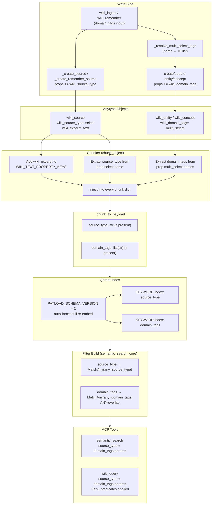

# Wiki: Persist domain_tags + Index Sources + Enable source_type/domain_tags Filters

**Status:** DRAFT
**Date:** 2026-06-13
**Author:** spec-writer agent
**Review rounds:** 0
**Epic:** aldeia-box#140 | **Predecessor (hard dependency):** aldeia-box#323

---

## CRITICAL: Hard Dependency on #323

**This ticket is a strict delta to #323's implemented machinery and CANNOT be implemented before #323 merges to main.**

#323 (`aldeia/323-retrieval-metadata-filters-type-tag-scoping-for-wi`) is fully implemented and council-approved but NOT yet merged. This branch (`aldeia/336-...`) was cut from main and does NOT contain:

- `config.PAYLOAD_SCHEMA_VERSION = 2`
- `_chunk_to_payload` (shared payload builder, `#323:indexer.py:22-37`)
- `_ensure_payload_indexes` with `getattr` guard (`#323:indexer.py:41-57`)
- `semantic_search_core` `must`-list filter build (`#323:indexer.py:83-115`)
- The D3 version-marker migration in `reindex` (`#323:indexer.py:145-149`)
- Tier-1 predicates `_passes_type_filter`, `_passes_date_filter` (`#323:query.py:275-300`)
- `types`, `ingested_after`, `ingested_before` params on `wiki_query`/`semantic_search`

**Implementation sequencing:** the implementer MUST rebase this branch onto #323 (after it merges to main, or directly onto the #323 branch). All deltas below are described against #323's seams, not against main.

---

## 1. Problem Statement

#323 shipped `type` and `date` filters for `wiki_query`/`semantic_search` and deferred `source_type` and `domain_tags` with verified root causes (spec §3 D4/D5):

1. **`domain_tags` was never persisted.** `wiki_ingest` and `wiki_remember` validate `domain_hint`/`domain_tags` against the space taxonomy but never write `wiki_domain_tags` as a `multi_select` property on created objects (`ingest.py:659-666`, `remember.py:301-308`). The field is always absent from every object in the corpus.

2. **`wiki_source` objects produce zero chunks.** Sources are written body-less (properties only); `wiki_excerpt` is not in `WIKI_TEXT_PROPERTY_KEYS` (`#323:chunker.py:13-17`). Zero chunks reach Qdrant, so a `source_type` filter returns empty for every input.

Both gaps mean exposing the filters now would ship inert parameters that silently return nothing — explicitly avoided per Jan's Decide direction.

This ticket closes both gaps end to end: write side → chunk payload → Qdrant indexes/migration → filter params on both retrieval tools.

---

## 2. Scope

### In Scope

| File | Nature of Change |
|------|-----------------|
| `src/anytype_llm_wiki/config.py` | Bump `PAYLOAD_SCHEMA_VERSION` 2 → 3 |
| `src/anytype_llm_wiki/chunker.py` | Add `wiki_excerpt` to `WIKI_TEXT_PROPERTY_KEYS`; extract `source_type` + `domain_tags` from properties, inject into every chunk |
| `src/anytype_llm_wiki/indexer.py` | Extend `_chunk_to_payload` (source_type + domain_tags optional fields); extend `_ensure_payload_indexes` (two new KEYWORD indexes); extend `semantic_search_core` (source_type + domain_tags filter clauses, `MatchAny`) |
| `src/anytype_llm_wiki/server.py` | Add `source_type`, `domain_tags` params to `semantic_search` and `wiki_query`; thread through with validation |
| `src/anytype_llm_wiki/wiki/query.py` | Add `_passes_source_type_filter`, `_passes_domain_tags_filter` Tier-1 predicates; thread new params; add `wiki_query` validation |
| `src/anytype_llm_wiki/wiki/ingest.py` | `_run_ingest`: resolve `wiki_domain_tags` once, write on entity/concept create+update; `_create_source`: write `wiki_source_type = "document"` |
| `src/anytype_llm_wiki/wiki/remember.py` | Thread `domain_tags` into `meta` at `wiki_remember`; resolve in `_apply_batch`; write on entity/concept create+update; add `_resolve_multi_select_tags` helper |
| `.aldeia/context/technical.md` | Update payload-schema section to v3 (9 fields) |
| `README` tool docs | Document new `source_type`/`domain_tags` params |
| `tests/test_indexer.py` | Extend `FakeQdrantClientWithSearch`; new filter tests; update `test_reindex_creates_payload_indexes` |
| `tests/test_chunker.py` | Source chunk + payload field tests |
| `tests/wiki/test_query.py` | New Tier-1 predicate tests; threading tests |
| `tests/wiki/test_ingest.py` | domain_tags persistence on create+update |
| `tests/wiki/test_remember.py` | domain_tags threading + persistence on create+update |

### Out of Scope

- `type` and `date` filters — shipped in #323; inherited unchanged.
- Filtering by exact source URL/file path, or `wiki_last_reviewed`/`wiki_asked_at`.
- Any change to `_WIKI_TYPE_KEYS` — `wiki_source` stays excluded from `wiki_query` Tier-1 enumeration.

---

## 3. End-to-End Data Flow



---

## 4. Open Decisions for Jan (Decide Gate)

### OD-A: Backfill of wiki_domain_tags onto Existing Anytype Objects

**Status:** RECOMMENDATION ONLY — needs Jan's explicit acceptance.

**Question:** The ticket AC states "backfill existing objects where derivable." Is a forward-only approach acceptable?

**Finding:** The original `domain_hint` passed to `wiki_ingest` is stored nowhere in the corpus — not in WikiLog objects (`ingest.py:344-360`), not on source objects, not on entity/concept objects. The only call-time information is the caller-supplied string, which was validated and discarded. There is no derivation path from any stored artifact. **A one-time backfill of `wiki_domain_tags` onto existing Anytype objects is NOT achievable from stored data.**

**Two distinct operations (do not conflate):**
1. **Qdrant re-embed (automatic, triggered by version bump 2→3):** on next `reindex`, all objects are re-chunked and re-embedded. Any object that carries `wiki_domain_tags` at that moment gets `domain_tags` in its Qdrant payload. Objects without `wiki_domain_tags` get `domain_tags` absent from the payload (Qdrant filter miss — correct behavior).
2. **Anytype property backfill (NOT achievable):** writing `wiki_domain_tags` onto pre-existing objects would require the original `domain_hint`, which was never stored. No code path can recover it.

**Recommendation:** Accept forward-only behavior. Objects created or updated after the #336 deployment carry `wiki_domain_tags`. The Qdrant re-embed is automatic; the Anytype-property backfill is not viable. State this plainly to users in the release note.

### OD-B: Source Excerpts in semantic_search (OD-2 Carryover from #323)

**Status:** RECOMMENDATION ONLY — needs Jan's explicit acceptance.

**Question:** Adding `wiki_excerpt` to `WIKI_TEXT_PROPERTY_KEYS` makes `wiki_source` objects get chunked and appear in `semantic_search` results. Today `semantic_search` returns only entity/concept/comparison/query content. Accept this retrieval-semantics change?

**Impact analysis:**
- `wiki_query`: **NO impact.** The hardcoded `_WIKI_TYPE_KEYS = ("wiki_entity", "wiki_concept", "wiki_comparison", "wiki_query")` (`#323:query.py:50`) excludes `wiki_source` in both Tier-1 enumeration and the Tier-2 `types` filter passed to `semantic_search_core`. Adding `wiki_excerpt` to the chunker has zero effect on `wiki_query`.
- `semantic_search` default (no `types` param): **CHANGES.** Source excerpt chunks enter results. Source excerpts are 1000-char truncated markdown snippets (`ingest.py:934`) or 500-char narration notes (`remember.py:179`). They are raw material, not synthesized knowledge — potentially useful but noisier.
- `semantic_search` with `types` or `source_type` filter: callers can scope precisely via `types=["wiki_entity"]` to exclude sources, or `types=["wiki_source"]` / `source_type=["document"]` to include only sources.

**Recommendation:** Add `wiki_excerpt` to `WIKI_TEXT_PROPERTY_KEYS` (option b, default-preserving in the sense that `wiki_query` is unchanged). Document the `semantic_search` semantic change and provide `source_type` as the scoping tool. The ticket scope explicitly includes this as item 2.

### OD-C: domain_tags Update Semantics (SET vs. MERGE)

**Question:** When updating an existing entity/concept, should `wiki_domain_tags` REPLACE (SET) the existing value or UNION with it (GET-then-PATCH)?

**Recommendation:** SET (replace). The existing `update_object` PATCH replaces property values; there is no current GET-then-PATCH cycle for any property. Consistency with how `wiki_facts`/`wiki_definition` are patched outweighs the merge convenience. If merging becomes a requirement, it can be added as a follow-on.

---

## 5. Design Decisions

### D1 — _resolve_multi_select_tags Helper

Add `_resolve_multi_select_tags` to `remember.py`, alongside the existing `_resolve_select_tag` (`main:remember.py:124`). Both `ingest.py` and `remember.py` use it.

**Circular import risk:** `remember.py` currently imports from `ingest.py` (`remember.py:39-46`). If `ingest.py` imports `_resolve_multi_select_tags` from `remember.py`, that is a circular import. **Resolution:** `_resolve_multi_select_tags` is defined in `remember.py`; `ingest.py` inlines the same helper locally (a short, self-contained function) rather than importing from `remember.py`. The `_resolve_select_tag` pattern already exists in `ingest.py` for `_resolve_wiki_action_tag` — mirror that.

For `_create_source` writing `wiki_source_type = "document"`, the same inline approach applies: call `_resolve_select_tag`-style logic directly in `_create_source` without importing from `remember.py`.

**Signature (in `remember.py`):**

```python
def _resolve_multi_select_tags(
    client: WikiClient,
    space_id: str,
    property_key: str,
    tag_names: list[str],
) -> tuple[list[str], bool]:
    """Resolve multi_select tag names to IDs. Returns (ids, degraded).

    degraded=True when the registry is unreachable. Silently skips unknown
    names (no-op, matching _resolve_select_tag convention). Never aborts.
    """
```

### D2 — domain_tags Persistence: Ingest

`_run_ingest` (`ingest.py:715+`) takes `domain_hint: str | None`. Resolution happens ONCE at the start of `_run_ingest` (not per-candidate — tag registry is stable per run):

```python
domain_tag_prop = None
if domain_hint:
    tag_ids, degraded = _resolve_multi_select_tags_local(
        client, space_id, "wiki_domain_tags", [domain_hint]
    )
    if degraded:
        result["warnings"].append("domain_tags_resolution_degraded")
    if tag_ids:
        domain_tag_prop = {"key": "wiki_domain_tags", "multi_select": tag_ids}
```

`domain_tag_prop` is appended to `props` at:
- Entity/concept create (`ingest.py:855`): append to `props` before `client.create_object`
- Entity/concept update (`ingest.py:823-826`): append to `props` before `client.update_object`

**Source objects do NOT get `wiki_domain_tags`** — domain classification belongs to derived entities, not the raw source document.

### D3 — domain_tags Persistence: Remember

`domain_tags` is validated in `wiki_remember` (`remember.py:301-308`) but is NOT threaded into `meta` (`remember.py:336`) and therefore never reaches `_apply_batch`. This is a confirmed bug. Fix:

1. Add `domain_tags` to the `meta` dict at `remember.py:336`:
   ```python
   meta = {
       "relations": relations or [],
       "source": source,
       "subject": knowledge[:50],
       "domain_tags": domain_tags or [],   # NEW
   }
   ```
   The work-log serializer stores `meta` as JSON; a `list[str]` value is clean JSON.

2. In `_apply_batch`, resolve once per batch (one network call, not per-object):
   ```python
   domain_tag_ids: list[str] = []
   domain_tags_names = list(meta.get("domain_tags") or [])
   if domain_tags_names:
       domain_tag_ids, dt_degraded = _resolve_multi_select_tags(
           client, space_id, "wiki_domain_tags", domain_tags_names
       )
       if dt_degraded:
           result["warnings"].append("domain_tags_resolution_degraded")
   ```

3. Append `{"key": "wiki_domain_tags", "multi_select": domain_tag_ids}` to `create_props` (`remember.py:658-660`) and `patch_props` (`remember.py:639-648`) when `domain_tag_ids` is non-empty.

Entities and concepts receive `wiki_domain_tags`. Source objects (created via `_create_remember_source`) do NOT.

### D4 — source_type Persistence: Ingest Sources

`_create_source` (`ingest.py:924-971`) currently does NOT write `wiki_source_type`. This means ingest-created sources would never match a `source_type="document"` filter even after chunking is enabled — silently incomplete.

**Decision:** Write `wiki_source_type = "document"` on ingest-created sources. The seeded value `"document"` is in `bootstrap.py:60` (`_WIKI_SOURCE_TYPE_TAGS = ["document", "conversation", "agent"]`).

**Implementation:** In `_create_source`, inline a `_resolve_select_tag`-style call for `"wiki_source_type"` / `"document"` (same pattern as `_resolve_wiki_action_tag` already in `ingest.py`), resolving best-effort / degrade-not-abort. Append `{"key": "wiki_source_type", "select": tag_id}` to `props` before the `create_object` call. No import from `remember.py` (circular import risk — see D1).

### D5 — Chunker Extension

Two changes to `chunker.py`:

**5a. Add `wiki_excerpt` to `WIKI_TEXT_PROPERTY_KEYS`** (and `WIKI_PROPERTY_HEADING`):
```python
WIKI_TEXT_PROPERTY_KEYS = frozenset({
    "wiki_facts", "wiki_description", "wiki_definition", "wiki_open_questions",
    "wiki_dimensions", "wiki_verdict", "wiki_question", "wiki_answer",
    "wiki_excerpt",   # NEW: enables wiki_source objects to be chunked
})
WIKI_PROPERTY_HEADING = {
    ...,
    "wiki_excerpt": "Excerpt",   # NEW
}
```

**5b. Extract `source_type` and `domain_tags` from properties** in `chunk_object`, then inject into every chunk (parallel to how `last_modified_date` is injected in `#323:chunker.py:44-56`):

```python
# After last_modified_date extraction:
source_type: str | None = None
domain_tags: list[str] = []
for prop in obj.get("properties", []):
    if not isinstance(prop, dict):
        continue
    k = prop.get("key")
    if k == "wiki_source_type":
        sel = prop.get("select")
        if isinstance(sel, dict):
            source_type = sel.get("name")   # HYDRATED: name is present inline
    elif k == "wiki_domain_tags":
        multi = prop.get("multi_select")
        if isinstance(multi, list):
            domain_tags = [
                t["name"] for t in multi
                if isinstance(t, dict) and t.get("name")
            ]
```

Read shape is verified in `prereq-verification.md` (RESOLVED 2026-06-13). Tags hydrate with `name` inline — no ID-to-name resolution needed at read time. Key/name can differ for renamed tags; always standardize on `name` (user-facing label).

Inject after the chunk list is built:
```python
if source_type is not None:
    for chunk in chunks:
        chunk["source_type"] = source_type
if domain_tags:
    for chunk in chunks:
        chunk["domain_tags"] = domain_tags
```

### D6 — _chunk_to_payload Extension

Extend the shared helper (`#323:indexer.py:22-37`) with two new optional fields:

```python
def _chunk_to_payload(chunk: dict) -> dict:
    payload = { ... }   # existing 6 base fields + last_modified_date (unchanged)
    if "last_modified_date" in chunk:
        payload["last_modified_date"] = chunk["last_modified_date"]
    if "source_type" in chunk:         # NEW
        payload["source_type"] = chunk["source_type"]
    if "domain_tags" in chunk:         # NEW
        payload["domain_tags"] = chunk["domain_tags"]
    return payload
```

Both fields are absent from the payload dict (not null) when not present — consistent with Qdrant's filter-miss-on-absent behavior. After v3, the payload is **up to 9 fields**: 6 base + optional `last_modified_date`, optional `source_type`, optional `domain_tags`.

### D7 — _ensure_payload_indexes Extension

Extend `#323:indexer.py:41-57` with two new KEYWORD indexes:

```python
for field, schema in [
    ("type_key",           PayloadSchemaType.KEYWORD),
    ("space_id",           PayloadSchemaType.KEYWORD),
    ("last_modified_date", PayloadSchemaType.DATETIME),
    ("source_type",        PayloadSchemaType.KEYWORD),   # NEW in #336
    ("domain_tags",        PayloadSchemaType.KEYWORD),   # NEW in #336
]:
    create_index(config.QDRANT_COLLECTION, field, field_schema=schema)
```

`domain_tags` is a list-valued KEYWORD field. Qdrant KEYWORD indexes support array payload fields natively; `MatchAny` works correctly against indexed array fields.

The `getattr(client, "create_payload_index", None)` guard from #323 is RETAINED. Older `FakeQdrantClient` instances at `main:tests/test_indexer.py:172, 283` lack `create_payload_index` — the guard prevents `AttributeError` on those test paths.

### D8 — PAYLOAD_SCHEMA_VERSION Bump: 2 → 3

```python
# config.py
PAYLOAD_SCHEMA_VERSION = 3  # v3 adds source_type and domain_tags payload fields
```

The D3 migration in `reindex` (`#323:indexer.py:145-149`) reads `stored = state.get("_payload_schema_version", 1)` and sets `force_full = config.PAYLOAD_SCHEMA_VERSION > stored`. With v3 bumped from v2, `3 > 2` triggers a one-time full re-embed. **No new migration code is needed** — the D3 mechanism from #323 is reused unchanged.

The `_payload_schema_version` marker is stamped only after a full (unscoped) `reindex()` (gated by `if space_id is None` in #323 — unchanged). An auto-fired single-space reindex does not advance the marker.

### D9 — Filter Build: MatchAny for source_type and domain_tags

Add `MatchAny` to the import block in `semantic_search_core` (`#323:indexer.py:88`):

```python
from qdrant_client.models import DatetimeRange, FieldCondition, Filter, MatchAny, MatchValue
```

Append two new clauses to the `must` list (after the existing `ingested_after`/`ingested_before` clause):

```python
if source_type:
    must.append(
        FieldCondition(key="source_type", match=MatchAny(any=source_type))
    )

if domain_tags:
    must.append(
        FieldCondition(key="domain_tags", match=MatchAny(any=domain_tags))
    )
```

`source_type` is a scalar string field in the payload; `MatchAny` matches if the scalar equals any element in the list. `domain_tags` is a list-valued field; `MatchAny` matches if the payload list contains ANY element from the filter list (ANY-overlap). Both behaviors are confirmed for Qdrant KEYWORD-indexed fields.

**No-filter guarantee preserved:** `source_type=[]` is falsy → no clause appended. `domain_tags=[]` is falsy → no clause appended. `search_filter = Filter(must=must) if must else None` is unchanged. The AC-F1 regression test from #323 continues to pass without modification.

**MatchAny availability:** verified in qdrant-client `>=1.18.0,<2.0.0` (the pinned constraint in this repo).

### D10 — Tier-1 Predicates in wiki_query

Add two module-level predicates to `query.py`, mirroring `_passes_type_filter` / `_passes_date_filter` (`#323:query.py:275-300`):

```python
def _passes_source_type_filter(obj: dict, source_types: list[str]) -> bool:
    """True if the object's wiki_source_type name is in source_types.

    Reads the hydrated select property (prereq-verification.md RESOLVED).
    Objects lacking wiki_source_type do NOT pass when source_types is non-empty
    (mirrors Qdrant: missing field != match).
    """
    if not source_types:
        return True
    for prop in obj.get("properties", []):
        if not isinstance(prop, dict):
            continue
        if prop.get("key") == "wiki_source_type":
            sel = prop.get("select")
            if isinstance(sel, dict):
                return sel.get("name") in source_types
            return False
    return False


def _passes_domain_tags_filter(obj: dict, domain_tags: list[str]) -> bool:
    """True if the object's wiki_domain_tags list has ANY overlap with domain_tags.

    Reads the hydrated multi_select property (prereq-verification.md RESOLVED).
    Objects lacking wiki_domain_tags do NOT pass when domain_tags is non-empty.
    """
    if not domain_tags:
        return True
    domain_tags_set = set(domain_tags)
    for prop in obj.get("properties", []):
        if not isinstance(prop, dict):
            continue
        if prop.get("key") == "wiki_domain_tags":
            multi = prop.get("multi_select")
            if isinstance(multi, list):
                obj_tags = {
                    t["name"] for t in multi
                    if isinstance(t, dict) and t.get("name")
                }
                return bool(obj_tags & domain_tags_set)
            return False
    return False
```

**`source_type` filter in `wiki_query` Tier-1 is effectively moot** — `wiki_objects` at `#323:query.py:511-514` is already filtered to `_WIKI_TYPE_KEYS` which excludes `wiki_source`. No `wiki_source` object ever enters the Tier-1 list, so `_passes_source_type_filter` will always return `True` for the surviving entities/concepts (which lack `wiki_source_type`). Both predicates are implemented for cross-tier consistency and API completeness; the moot behavior is noted in the docstring.

**`domain_tags` filter in `wiki_query` Tier-1 IS meaningful** — entities and concepts carry `wiki_domain_tags` after #336.

Tier-1 filter ordering (cheapest-first, matching #323 convention):
1. Type filter (existing, `#323:query.py:511-514`)
2. `domain_tags` filter (`_passes_domain_tags_filter` — list ANY-overlap)
3. `source_type` filter (`_passes_source_type_filter` — mostly moot, but implemented)
4. Date filter (existing, `#323:query.py`)

### D11 — Validation Rules

Mirrors #323 §9. New params added to `semantic_search` and `wiki_query`.

**`semantic_search` (raises `ValueError`):**

```python
# source_type: validate values against space taxonomy (degrade: unknown → zero matches documented, not runtime error)
# domain_tags: same
# Reject empty strings within lists:
if source_type is not None:
    if not isinstance(source_type, list) or not all(isinstance(s, str) and s for s in source_type):
        raise ValueError(
            f"source_type must be a non-empty list of non-empty strings; got {source_type!r}"
        )
if domain_tags is not None:
    if not isinstance(domain_tags, list) or not all(isinstance(s, str) and s for s in domain_tags):
        raise ValueError(
            f"domain_tags must be a non-empty list of non-empty strings; got {domain_tags!r}"
        )
```

Values are NOT validated against the space taxonomy at query time (no live Anytype call in `semantic_search`). Unknown values produce zero Qdrant matches — acceptable per the "no inert filter" principle (the filter runs, it just returns nothing for unrecognized names). This is documented in the tool docstring.

**`wiki_query` (returns error dict, never raises):**

Same structural validation; on failure returns `{"status": "error", "error": "...", "error_category": "config_error"}` consistent with the existing pattern (`#323:query.py`). Validation occurs before any client construction (early return, no WikiLog written).

---

## 6. API Surface

### 6.1 semantic_search (delta from #323)

```python
@mcp.tool()
def semantic_search(
    query: str,
    space_id: str | None = None,
    types: list[str] | None = None,
    ingested_after: str | None = None,     # from #323
    ingested_before: str | None = None,    # from #323
    source_type: list[str] | None = None,  # NEW in #336
    domain_tags: list[str] | None = None,  # NEW in #336
    limit: int = 10,
) -> list[dict]:
```

**New docstring additions:**
```
    source_type: Optional list of source type tag names to filter by (e.g.
        ["document", "conversation"]). ANY match. Applies only to wiki_source
        chunks. Unknown values produce zero matches (no error).
    domain_tags: Optional list of domain tag names to filter by (e.g. ["ai",
        "ml"]). ANY-overlap: a chunk matches if its domain_tags list shares at
        least one name with this filter. Unknown values produce zero matches.
```

### 6.2 wiki_query (delta from #323)

```python
@mcp.tool()
def wiki_query(
    question: str,
    space_id: str,
    file_back: bool | None = None,
    types: list[str] | None = None,        # from #323
    ingested_after: str | None = None,     # from #323
    ingested_before: str | None = None,    # from #323
    source_type: list[str] | None = None,  # NEW in #336
    domain_tags: list[str] | None = None,  # NEW in #336
) -> dict:
```

**Behavior note:** `source_type` filtering in `wiki_query` has no effect on Tier-1 (no `wiki_source` objects in enumeration) and no effect on Tier-2 (the hardcoded `_WIKI_TYPE_KEYS` types filter excludes `wiki_source` chunks from the vector search). It is accepted for API symmetry but documented as no-op for this tool.

### 6.3 semantic_search_core (delta from #323)

```python
def semantic_search_core(
    query: str,
    space_id: str | None = None,
    types: list[str] | None = None,
    ingested_after: str | None = None,
    ingested_before: str | None = None,
    source_type: list[str] | None = None,  # NEW
    domain_tags: list[str] | None = None,  # NEW
    limit: int = 10,
) -> list[dict]:
```

The core does not validate inputs; validation is the caller's responsibility.

---

## 7. Wire Contracts

All Anytype write/read shapes are verified in `prereq-verification.md` (RESOLVED, 2026-06-13).

**Write (create/update properties):**
```jsonc
{"key": "wiki_domain_tags", "multi_select": ["<tag_id>", "<tag_id>"]}
{"key": "wiki_source_type", "select": "<tag_id>"}
```

**Read (get_object — fully hydrated):**
```jsonc
// select:
{"key": "wiki_source_type", "format": "select",
 "select": {"id": "bafy...", "key": "document", "name": "document", "color": "grey"}}

// multi_select:
{"key": "wiki_domain_tags", "format": "multi_select",
 "multi_select": [
   {"id": "bafy...", "key": "ai", "name": "ai", "color": "grey"},
   {"id": "bafy...", "key": "ml", "name": "ml", "color": "yellow"}
 ]}
```

**Chunker reads names directly** (`prop["select"]["name"]`, `[t["name"] for t in prop["multi_select"]]`). No ID-to-name resolution on read. Contrast with `objects` format properties (bare ID strings) — do NOT copy an objects-format reader.

**WikiClient call sites used in write path:**
- `WikiClient.list_properties(space_id)` → to find the property by `key`
- `WikiClient.list_tags(space_id, prop_id)` → to get name-to-ID mapping
- `WikiClient.create_object(space_id, type_key, name, properties)` → entity/concept create
- `WikiClient.update_object(space_id, object_id, {"properties": props})` → entity/concept update

All are existing `wiki_client.py` methods (`main:wiki_client.py:127-183`).

---

## 8. Migration Behavior (PAYLOAD_SCHEMA_VERSION 2 → 3)

The D3 mechanism from #323 (spec §3 D3) is reused unchanged. With `PAYLOAD_SCHEMA_VERSION = 3`:

1. On first post-upgrade `reindex()`, `state.get("_payload_schema_version", 1)` returns `2` (or `1` for pre-#323 installs). `3 > 2` → `force_full = True`.
2. Every object is re-fetched, re-chunked, re-embedded, and re-upserted — bypassing the unchanged-skip guard.
3. New payload fields (`source_type`, `domain_tags`) are present for objects that carry the corresponding Anytype properties. Objects without them have these fields absent from the payload.
4. After the loop completes, `state["_payload_schema_version"] = 3` is stamped and saved.
5. Subsequent reindexes return to incremental behavior (`3 > 3` is false).

**Objects without wiki_domain_tags set** (all pre-upgrade objects) will have `domain_tags` absent from their Qdrant payload after re-embed. This is correct — the `domain_tags` filter will not match them. This is the forward-only behavior described in OD-A.

---

## 9. Two-Tier Filter Semantics in wiki_query

Filters must behave consistently across both tiers. The new predicates follow the existing pattern from #323 §8.

**Before tier dispatch**, compute filter params (extending #323 §8.1):
```python
source_type_filter = list(source_type) if source_type else []
domain_tags_filter = list(domain_tags) if domain_tags else []
```

**Tier 1:** after the type filter at `#323:query.py:511-514`, apply in order:
```python
if domain_tags_filter:
    wiki_objects = [o for o in wiki_objects
                    if _passes_domain_tags_filter(o, domain_tags_filter)]
if source_type_filter:
    wiki_objects = [o for o in wiki_objects
                    if _passes_source_type_filter(o, source_type_filter)]
```

**Tier 2:** pass to `semantic_search_core`:
```python
semantic_search_core(
    query=..., space_id=space_id,
    types=sorted(effective_types_set),
    ingested_after=ingested_after, ingested_before=ingested_before,
    source_type=source_type_filter or None,
    domain_tags=domain_tags_filter or None,
)
```

---

## 10. Test Plan

Follows the `FakeQdrantClientWithSearch` approach from #323 §10. All new tests must be able to FAIL before implementation.

### 10.1 FakeQdrantClientWithSearch (update to #323 version)

The #323 version at `#323:tests/test_indexer.py:364` is used as-is. No structural changes needed — it already has `create_payload_index`. The `created_indexes` list will grow with the two new KEYWORD fields.

### 10.2 Updated Existing Test

**`test_reindex_creates_payload_indexes`** (`#323:tests/test_indexer.py:562-580`) asserts `"source_type" not in fake.created_indexes`. **This assertion MUST be INVERTED in #336:**

```python
def test_reindex_creates_payload_indexes(monkeypatch, tmp_path):
    # ... same harness as #323 ...
    assert set(fake.created_indexes) >= {
        "type_key", "space_id", "last_modified_date",
        "source_type", "domain_tags",   # NEW: both must be indexed
    }, f"Missing indexes; got: {fake.created_indexes}"
    # The old `assert "source_type" not in fake.created_indexes` is REMOVED.
```

### 10.3 New Acceptance Criteria Tests

**AC-P1 — domain_tags written on entity create (ingest path)**
File: `tests/wiki/test_ingest.py`
```python
def test_ingest_writes_domain_tags_on_create(monkeypatch):
    # Arrange: mock _resolve_multi_select_tags_local → ["tag-id-1"]
    # Act: _run_ingest with domain_hint="ai"
    # Assert: client.create_object called with props containing
    #         {"key": "wiki_domain_tags", "multi_select": ["tag-id-1"]}
```

**AC-P2 — domain_tags written on entity update (ingest path)**
File: `tests/wiki/test_ingest.py`
```python
def test_ingest_writes_domain_tags_on_update(monkeypatch):
    # Arrange: existing object in space, _resolve_multi_select_tags_local → ["tag-id-1"]
    # Act: _run_ingest with domain_hint="ai" and a pre-existing entity
    # Assert: client.update_object called with props containing wiki_domain_tags
```

**AC-P3 — domain_tags threaded through meta in remember (bug fix)**
File: `tests/wiki/test_remember.py`
```python
def test_remember_domain_tags_in_meta(monkeypatch):
    # Arrange: mock wiki_remember internals
    # Act: wiki_remember(..., domain_tags=["ai", "ml"])
    # Assert: meta passed to _apply_batch contains "domain_tags": ["ai", "ml"]
```

**AC-P4 — domain_tags written on entity create (remember path)**
File: `tests/wiki/test_remember.py`
```python
def test_remember_writes_domain_tags_on_create(monkeypatch):
    # Arrange: _resolve_multi_select_tags → ["tag-id-1", "tag-id-2"]
    # Act: _apply_batch with meta including domain_tags=["ai", "ml"]
    # Assert: create_object props contain wiki_domain_tags multi_select
```

**AC-P5 — domain_tags written on entity update (remember path)**
File: `tests/wiki/test_remember.py`

Same structure as AC-P4 but for the update path.

**AC-S1 — wiki_source objects produce chunks (wiki_excerpt indexed)**
File: `tests/test_chunker.py`
```python
def test_wiki_source_chunks_via_wiki_excerpt():
    from anytype_llm_wiki.chunker import chunk_object
    obj = {
        "id": "src-1", "space_id": "sp-1", "name": "Some Source",
        "type": {"key": "wiki_source"}, "markdown": "",
        "properties": [
            {"key": "wiki_excerpt", "text": "An excerpt from the original document."},
        ],
    }
    chunks = chunk_object(obj)
    assert chunks, "wiki_source with wiki_excerpt must produce at least one chunk"
    assert any("excerpt" in c.get("text", "").lower() or
               c.get("heading") == "Excerpt" for c in chunks)
```

**AC-S2 — chunk payload carries source_type (verified read shape)**
File: `tests/test_chunker.py`
```python
def test_chunk_payload_carries_source_type():
    from anytype_llm_wiki.chunker import chunk_object
    obj = {
        "id": "src-1", "space_id": "sp-1", "name": "S",
        "type": {"key": "wiki_source"}, "markdown": "",
        "properties": [
            {"key": "wiki_excerpt", "text": "Some text."},
            {"key": "wiki_source_type", "format": "select",
             "select": {"id": "bafy...", "key": "document", "name": "document"}},
        ],
    }
    chunks = chunk_object(obj)
    assert chunks
    assert all(c.get("source_type") == "document" for c in chunks)
```

**AC-S3 — chunk payload carries domain_tags (list of names)**
File: `tests/test_chunker.py`
```python
def test_chunk_payload_carries_domain_tags():
    from anytype_llm_wiki.chunker import chunk_object
    obj = {
        "id": "ent-1", "space_id": "sp-1", "name": "Neural Networks",
        "type": {"key": "wiki_entity"}, "markdown": "# Overview\nTransformers.",
        "properties": [
            {"key": "wiki_domain_tags", "format": "multi_select",
             "multi_select": [
                 {"id": "bafy1", "key": "ai", "name": "ai"},
                 {"id": "bafy2", "key": "ml", "name": "ml"},
             ]},
        ],
    }
    chunks = chunk_object(obj)
    assert chunks
    assert all(c.get("domain_tags") == ["ai", "ml"] for c in chunks)
```

**AC-S4 — source_type absent from payload when property is missing**
File: `tests/test_chunker.py`
```python
def test_chunk_payload_no_source_type_when_absent():
    from anytype_llm_wiki.chunker import chunk_object
    obj = {
        "id": "ent-1", "space_id": "sp-1", "name": "E",
        "type": {"key": "wiki_entity"}, "markdown": "# H\nBody.",
        "properties": [],
    }
    chunks = chunk_object(obj)
    assert chunks
    assert all("source_type" not in c for c in chunks)
    assert all("domain_tags" not in c for c in chunks)
```

**AC-F-ST — source_type filter applied (MatchAny)**
File: `tests/test_indexer.py`
```python
def test_source_type_filter_applied(monkeypatch):
    from qdrant_client.models import FieldCondition
    fake = FakeQdrantClientWithSearch()
    monkeypatch.setattr(_indexer, "_qdrant", lambda: fake)
    monkeypatch.setattr(_indexer, "embed_query", lambda q: [0.1] * config.EMBED_DIMS)
    _indexer.semantic_search_core(query="test", source_type=["document"])
    must = fake.query_filter.must
    st_cond = next(
        (c for c in must if isinstance(c, FieldCondition) and c.key == "source_type"), None
    )
    assert st_cond is not None
    assert st_cond.match.any == ["document"]
```

**AC-F-DT — domain_tags filter applied (MatchAny, ANY-overlap)**
File: `tests/test_indexer.py`
```python
def test_domain_tags_filter_applied(monkeypatch):
    from qdrant_client.models import FieldCondition
    fake = FakeQdrantClientWithSearch()
    monkeypatch.setattr(_indexer, "_qdrant", lambda: fake)
    monkeypatch.setattr(_indexer, "embed_query", lambda q: [0.1] * config.EMBED_DIMS)
    _indexer.semantic_search_core(query="test", domain_tags=["ai", "ml"])
    must = fake.query_filter.must
    dt_cond = next(
        (c for c in must if isinstance(c, FieldCondition) and c.key == "domain_tags"), None
    )
    assert dt_cond is not None
    assert set(dt_cond.match.any) == {"ai", "ml"}
```

**AC-F-COMB — Combined AND filter (source_type + domain_tags + existing)**
File: `tests/test_indexer.py`
```python
def test_combined_filter_source_type_and_domain_tags(monkeypatch):
    from qdrant_client.models import FieldCondition
    fake = FakeQdrantClientWithSearch()
    monkeypatch.setattr(_indexer, "_qdrant", lambda: fake)
    monkeypatch.setattr(_indexer, "embed_query", lambda q: [0.1] * config.EMBED_DIMS)
    _indexer.semantic_search_core(
        query="test",
        types=["wiki_entity"],
        source_type=["document"],
        domain_tags=["ai"],
    )
    must = fake.query_filter.must
    assert any(isinstance(c, FieldCondition) and c.key == "source_type" for c in must)
    assert any(isinstance(c, FieldCondition) and c.key == "domain_tags" for c in must)
    assert any(hasattr(c, "should") and c.should for c in must)  # type group from #323
```

**AC-F-REG — No-filter regression (inherits #323 AC-F1, must still pass)**
File: `tests/test_indexer.py`

The existing `test_no_filter_regression` from #323 must pass unchanged. No modification needed — verified by running the full suite after implementation.

**AC-V-SS — Invalid source_type raises ValueError from semantic_search**
File: `tests/test_indexer.py` or `tests/wiki/test_query.py`
```python
def test_invalid_source_type_raises_value_error():
    import pytest
    from anytype_llm_wiki.server import semantic_search
    with pytest.raises(ValueError, match="source_type"):
        semantic_search(query="test", source_type=[""])   # empty string in list
```

**AC-V-WQ — Invalid domain_tags returns error dict from wiki_query**
File: `tests/wiki/test_query.py`
```python
def test_wiki_query_invalid_domain_tags_returns_error_dict():
    from anytype_llm_wiki.wiki.query import wiki_query
    out = wiki_query(question="q", space_id="sp-1", domain_tags=[""])
    assert out["status"] == "error"
    assert out["error_category"] == "config_error"
```

**AC-T1-DT — Tier-1 domain_tags predicate**
File: `tests/wiki/test_query.py`
```python
def test_tier1_domain_tags_predicate():
    from anytype_llm_wiki.wiki.query import _passes_domain_tags_filter
    obj_ai_ml = {"properties": [
        {"key": "wiki_domain_tags", "format": "multi_select",
         "multi_select": [{"name": "ai"}, {"name": "ml"}]}
    ]}
    obj_no_tags = {"properties": []}
    # ANY-overlap: "ai" matches
    assert _passes_domain_tags_filter(obj_ai_ml, ["ai"])
    assert _passes_domain_tags_filter(obj_ai_ml, ["ml", "nlp"])  # "ml" overlaps
    assert not _passes_domain_tags_filter(obj_ai_ml, ["nlp"])    # no overlap
    assert not _passes_domain_tags_filter(obj_no_tags, ["ai"])   # missing → no match
    assert _passes_domain_tags_filter(obj_no_tags, [])           # no filter → always True
```

**AC-T1-ST — Tier-1 source_type predicate**
File: `tests/wiki/test_query.py`
```python
def test_tier1_source_type_predicate():
    from anytype_llm_wiki.wiki.query import _passes_source_type_filter
    obj_doc = {"properties": [
        {"key": "wiki_source_type", "format": "select",
         "select": {"name": "document"}}
    ]}
    obj_no_st = {"properties": []}
    assert _passes_source_type_filter(obj_doc, ["document"])
    assert not _passes_source_type_filter(obj_doc, ["conversation"])
    assert not _passes_source_type_filter(obj_no_st, ["document"])  # missing → no match
    assert _passes_source_type_filter(obj_no_st, [])               # no filter → always True
```

**AC-IDX — Version-bump forces re-embed (inherits #323 AC-F11 structure, updated version)**
File: `tests/test_indexer.py`
```python
def test_schema_version_3_bump_forces_full_reembed(monkeypatch, tmp_path):
    state = {"_payload_schema_version": 2, "sp-1": {"obj-1": "2026-01-01T00:00:00Z"}}
    # ... same harness as #323 AC-F11 ...
    monkeypatch.setattr(config, "PAYLOAD_SCHEMA_VERSION", 3)
    stats = _indexer.reindex()
    assert stats["objects_indexed"] == 1   # unchanged object STILL re-embedded
    new_state = json.loads(state_file.read_text())
    assert new_state["_payload_schema_version"] == 3
```

### 10.4 Test File Mapping

| Test | File |
|------|------|
| AC-P1, AC-P2 | `tests/wiki/test_ingest.py` |
| AC-P3, AC-P4, AC-P5 | `tests/wiki/test_remember.py` |
| AC-S1, AC-S2, AC-S3, AC-S4 | `tests/test_chunker.py` |
| AC-F-ST, AC-F-DT, AC-F-COMB, AC-F-REG (inherited), AC-IDX | `tests/test_indexer.py` |
| AC-V-SS | `tests/test_indexer.py` or `tests/wiki/test_query.py` |
| AC-V-WQ, AC-T1-DT, AC-T1-ST | `tests/wiki/test_query.py` |
| `test_reindex_creates_payload_indexes` (updated) | `tests/test_indexer.py` |

---

## 11. Implementation Plan

**Prerequisite:** Rebase onto #323 after it merges to main (or onto the #323 branch directly). All steps below presuppose #323's seams are present.

Steps 1-4 are independent; step 5 depends on 1+2; step 6 depends on 3+4; step 7 depends on 5+6.

**Step 1 — config.py:** `PAYLOAD_SCHEMA_VERSION = 3`.

**Step 2 — remember.py:** Add `_resolve_multi_select_tags` helper. Fix the `domain_tags`-not-in-`meta` bug at `remember.py:336`. Add resolution + prop append in `_apply_batch` for create and update paths.

**Step 3 — ingest.py:** Add inline `_resolve_multi_select_tags_local`. Add `wiki_domain_tags` prop to entity/concept create (`ingest.py:855`) and update (`ingest.py:823-826`). Add `wiki_source_type = "document"` to `_create_source`.

**Step 4 — chunker.py:** Add `wiki_excerpt` to `WIKI_TEXT_PROPERTY_KEYS` + `WIKI_PROPERTY_HEADING`. Add `source_type` and `domain_tags` extraction and injection in `chunk_object`.

**Step 5 — indexer.py:** Extend `_chunk_to_payload` with `source_type` and `domain_tags` optional fields. Extend `_ensure_payload_indexes` with two new KEYWORD entries. Add `MatchAny` import; add `source_type` and `domain_tags` filter clauses to `semantic_search_core`. Extend `semantic_search_core` signature with two new params.

**Step 6 — server.py + wiki/query.py:**
- `server.py`: add `source_type`, `domain_tags` to `semantic_search` + validation (§D11); add to `wiki_query`; thread through to core and `wiki_query` internal call.
- `wiki/query.py`: add `_passes_source_type_filter`, `_passes_domain_tags_filter`; add params to `wiki_query` function + validation; compute filter lists before tier dispatch; apply Tier-1 predicates; pass to Tier-2 `semantic_search_core`.

**Step 7 — Tests:** implement all tests in §10.3; update `test_reindex_creates_payload_indexes` per §10.2; run full suite to confirm no regressions.

**Step 8 — Docs:** update `.aldeia/context/technical.md` payload-schema section to v3 (9 fields); update README tool docs for new params; add release note.

---

## 12. Acceptance Criteria Checklist

- [ ] **AC-P1** entity/concept created via `wiki_ingest` with `domain_hint` carries `wiki_domain_tags` as a populated `multi_select` (verified by test).
- [ ] **AC-P2** entity/concept updated via `wiki_ingest` with `domain_hint` carries `wiki_domain_tags` on the update patch.
- [ ] **AC-P3** `domain_tags` passed to `wiki_remember` is threaded into `meta` (bug fix at `remember.py:336`).
- [ ] **AC-P4/P5** entity/concept created or updated via `wiki_remember` with `domain_tags` carries `wiki_domain_tags`.
- [ ] **AC-S1** `wiki_source` objects with `wiki_excerpt` property produce chunks (`wiki_excerpt` in `WIKI_TEXT_PROPERTY_KEYS`).
- [ ] **AC-S2** chunk payload carries `source_type` (string tag name) when `wiki_source_type` is present on the object.
- [ ] **AC-S3** chunk payload carries `domain_tags` (list of tag names) when `wiki_domain_tags` is present on the object.
- [ ] **AC-S4** `source_type` and `domain_tags` are absent from the payload dict (not null) when the corresponding properties are absent.
- [ ] **AC-F-ST** `source_type` filter produces `FieldCondition(key="source_type", match=MatchAny(any=[...]))` in the Qdrant `must` list.
- [ ] **AC-F-DT** `domain_tags` filter produces `FieldCondition(key="domain_tags", match=MatchAny(any=[...]))` with ANY-overlap semantics.
- [ ] **AC-F-COMB** Multiple filters compose as AND (all clauses in `must`).
- [ ] **AC-F-REG** No filter params → `query_filter=None` (byte-identical to #323 behavior). `test_no_filter_regression` from #323 passes unchanged.
- [ ] **AC-V-SS** Invalid `source_type`/`domain_tags` (e.g. empty string in list) raises `ValueError` from `semantic_search`.
- [ ] **AC-V-WQ** Invalid `source_type`/`domain_tags` returns `{"status":"error","error_category":"config_error"}` from `wiki_query`; never raises.
- [ ] **AC-T1-DT** `_passes_domain_tags_filter` correctly implements ANY-overlap; missing property → False when filter non-empty.
- [ ] **AC-T1-ST** `_passes_source_type_filter` correctly reads hydrated `select.name`; missing property → False when filter non-empty.
- [ ] **AC-IDX** `test_reindex_creates_payload_indexes` asserts `{"type_key","space_id","last_modified_date","source_type","domain_tags"} ⊆ created_indexes` (old `"source_type" not in` assertion removed).
- [ ] **PAYLOAD_SCHEMA_VERSION** is `3`; version-bump triggers full re-embed (test mirrors #323 AC-F11 with version 3).
- [ ] All #323 AC-F tests pass without modification.

---

## 13. Resource Impact

**One-time forced re-embed (v2→v3 migration):** same mechanics as the v1→v2 migration in #323 (spec §13). On this corpus (~500 chunks) the full pass is on the order of seconds via bge-m3. Auto-fires on next `reindex`. No manual action.

**Two new payload indexes:** `create_payload_index` for KEYWORD fields is sub-second on a small collection, idempotent, and runs only on the `reindex` path (not the `reembed_object` hot path).

**Persistence calls (new):** `_resolve_multi_select_tags` adds a `list_properties` + `list_tags` call pair per `wiki_ingest` run (not per-candidate) and per `_apply_batch` call. Both calls are local Anytype HTTP API calls — consistent with the existing `_resolve_select_tag` pattern. No new external egress.

**No embedding dimension change. No new memory requirements.**

---

## 14. Security Considerations

**Local-first posture preserved:** all new operations are local (Anytype local HTTP API, local Qdrant container). No new external network calls.

**Input validation at the MCP boundary:** `source_type` and `domain_tags` are structural list-of-strings validation only (no Anytype API call at query time). Unknown values produce zero Qdrant matches — not a security issue.

**`MatchAny` inputs:** arbitrary strings passed to KEYWORD matching; Qdrant's equality semantics prevent injection. Unknown values return zero matches.

**Tag name reading:** tag names come from the Anytype GET response (`prop["select"]["name"]`, `prop["multi_select"][n]["name"]`). These are stored user data; standard string handling applies.

**Persistence:** `_resolve_multi_select_tags` calls the local `WikiClient` (same trust boundary as all other ingest/remember calls). Degrade-not-abort on error: if the tag registry is unreachable, the property is simply not written (warning recorded, no crash).

---

## 15. Operational Considerations

**Deployment steps:**
1. Ensure #323 is merged to main.
2. Rebase this branch onto main / merge.
3. Install the new version (`uv tool install --upgrade .`).
4. Run `reindex` (manual or let the launchd cron fire). `PAYLOAD_SCHEMA_VERSION = 3 > 2` → auto-forces full re-embed. Creates `source_type` and `domain_tags` payload indexes.
5. Subsequent reindexes return to incremental.

**Deployment ordering constraint:** do not run a manual `reindex` and the launchd cron reindex concurrently during migration (same sequencing concern as #323 §15 — state file has no lock).

**Post-deploy verification:**
1. `config.INDEX_STATE_FILE` contains `"_payload_schema_version": 3`.
2. Spot-check: create an entity via `wiki_ingest` with a `domain_hint`; `get_object` confirms `wiki_domain_tags` is populated.
3. Spot-check: a `semantic_search` with `domain_tags=["<tag>"]` returns the entity just created.

**Rollback:** the #323 code version simply ignores `source_type` and `domain_tags` payload fields and the new filter params. Downgrading needs no data migration. The `_payload_schema_version: 3` key in the state file is ignored by #323 code; the next `reindex` on #323 would stamp version `2` and re-trigger a full re-embed (one-time).

**Failure modes:**
- `_resolve_multi_select_tags` unreachable: degrade-not-abort; warning appended to result; `wiki_domain_tags` not written for this run.
- `_create_source` `wiki_source_type` resolution failure: degrade-not-abort; source created without `wiki_source_type`; source becomes source-type-absent in Qdrant (same as current behavior).
- Qdrant unavailable during filter: `semantic_search_core` raises `httpx.HTTPError` (unchanged handling).
- Interrupted forced reindex: marker not stamped; next `reindex` retries the full backfill (idempotent).

**Release note:**
> v3 extends the Qdrant payload with `source_type` and `domain_tags`. Ingest/remember now persist `wiki_domain_tags` on created/updated entities and concepts. Source excerpts (`wiki_source` objects) are now indexed in Qdrant — `semantic_search` default results will include source excerpt chunks (use `types` or `source_type` to scope). `wiki_query` behavior is unchanged. New filter params `source_type` and `domain_tags` are available on both tools. The first `reindex` after upgrade auto-runs a one-time full re-embed; no manual action needed.

---

## 16. Open Questions

1. **OD-A accepted?** (backfill not achievable — forward-only) — needs Jan's explicit acceptance. Without it, the ticket AC "backfill existing objects where derivable" stands as formally not-met.

2. **OD-B accepted?** (source excerpts appear in `semantic_search` by default) — needs Jan's explicit product sign-off. If not accepted, `wiki_excerpt` is NOT added to `WIKI_TEXT_PROPERTY_KEYS` and source chunking / the `source_type` filter remain deferred.

3. **OD-C accepted?** (SET semantics for `wiki_domain_tags` update — replace rather than merge) — recommendation is SET; no human decision strictly required unless Jan has a preference.

4. **QA-1 (advisory from #323 council):** CI assertion for a `space_id`-only filter `must`-clause is currently only indirectly covered. Fold a one-line CI-runnable assertion in as a non-blocking improvement on this touch (per aldeia-box#336#comment advisory from #323 post-impl council).

5. **Client-A1 (advisory from #323 council):** consider a one-line README clarification that `ingested_after`/`ingested_before` map to `last_modified_date` (not a creation date). Non-blocking.

---

## 17. Deferred Items

- `wiki_source_type` filter effectiveness in `wiki_query` (Tier-1 and Tier-2 both have no `wiki_source` objects — the filter is accepted for API symmetry but is a documented no-op in this tool). If `wiki_source` should ever appear in `wiki_query` results, that is a future scope change to `_WIKI_TYPE_KEYS`.
- Filtering by exact source URL/file path.
- `wiki_last_reviewed` / `wiki_asked_at` date filters (trivial follow-on once the date pattern is established).

---

## Alternatives Considered

**`MatchValue` for `source_type` instead of `MatchAny`:** `source_type` is a scalar field; `MatchValue` would match a single value. Rejected in favor of `MatchAny` for API symmetry with `domain_tags` and to support multi-type filtering (e.g. `source_type=["document","conversation"]`). A single-element list `["document"]` is equivalent to `MatchValue(value="document")`.

**`Filter(should=[FieldCondition(MatchValue)])` for `domain_tags`:** the existing pattern for `types` in #323. Rejected in favor of `MatchAny` because `domain_tags` is a list-valued payload field and `MatchAny` directly expresses ANY-overlap semantics on array fields. Using nested `should` would also work but is less idiomatic for a multi-valued field.

**Import `_resolve_wiki_source_type_tag` from `remember.py` into `ingest.py`:** rejected due to circular import risk (`remember.py:39-46` already imports from `ingest.py`). Resolved by inlining a direct `_resolve_select_tag`-style call in `_create_source` (the pattern exists in `ingest.py` for `_resolve_wiki_action_tag`).

**Shared `tag_resolver.py` module:** a neutral module would break the circular import cleanly. Rejected as over-engineering for a ~15-line function; inlining in `ingest.py` achieves the same without a new file.
