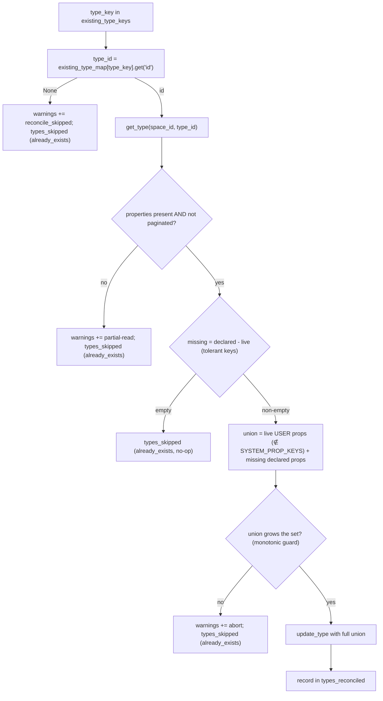

# Surface concept contradictions in wiki_lint (#426)

**Status:** SPEC
**Date:** 2026-06-25
**Author:** spec-writer agent
**Review rounds:** 1 (revised per review R1 — bootstrap reconcile precision)

---

## Problem Statement

Concept contradiction detection shipped in #325 (`ingest.py:944`): when ingesting, the pipeline
detects contradictions between concepts and writes links into `wiki_contradictions`. However,
`wiki_lint` only surfaces those contradictions for `wiki_entity` objects (`lint.py:490`
`if tk == "wiki_entity":`). Concept contradictions are silently ignored by the health check —
fleet and Jan get no signal that concept-level contradictions need resolution.

Two dependent gaps make it impossible to simply widen the lint gate:

1. `wiki_concept` carries `wiki_contradictions` in the schema but NOT `wiki_last_reviewed`
   (`types_schema.py:101-113`). Lint resolves contradictions via `wiki_last_reviewed`; without
   it, every concept contradiction would permanently fire `critical` with no way to clear it —
   a broken UX.

2. The bootstrap path (`bootstrap.py:279-285`) skips existing types with `already_exists` and
   never re-links properties. Adding `wiki_last_reviewed` to the schema has no effect on a space
   that is already bootstrapped. There is no `update_type` wrapper in `wiki_client.py` today.

This ticket is the declared closure-condition follow-up for #325 (see `#325/spec.md`
"Recommended Follow-Up").

---

## Research Summary

Full research and live-probe transcript: [research.md](./research.md).

Key findings:

- **Gating question resolved.** `API-update-type` (`PATCH /v1/spaces/{id}/types/{type_id}`)
  links properties onto an existing type. Verified live against `wiki-validation-throwaway`
  space (probe transcript in `research.md §1`).
- **Replace-not-merge contract.** `update-type` REPLACES the user-defined property set. Any
  property omitted from the call is dropped from the type (confirmed by probe step 2 of
  `research.md §1`). System properties (`tag`, `backlinks`, `created_date`, `creator`, `links` —
  the `SYSTEM_PROP_KEYS` constant, see §1) are Anytype-managed and auto-re-added when omitted, so
  they are never sent in the reconcile payload.
- **Re-sending an existing key is idempotent.** It links the existing space-level property (same
  stable id); no duplication (probe step 3/4). A property shared across types (e.g.
  `wiki_last_reviewed`, already linked to `wiki_entity`) is handled correctly: the union re-sends
  the key and Anytype links the existing space-level property — no duplicate is created
  (`research.md §1` step 3).
- **Consequence.** The bootstrap reconcile step must be read-modify-write: GET the live type's
  current property set → compute missing = declared − live → if non-empty, send the UNION (live
  + missing), never the delta alone.
- No detection code changes are needed. `ingest.py:944` already gates on
  `if kind in ("entity", "concept")`.
- `wiki_client.py` has `create_type`, `list_types`, `list_properties`, `update_object` but NO
  `update_type` and NO `get_type`.

---

## Proposed Solution

Four coordinated changes, applied in dependency order:

### 1 — Schema: add `wiki_last_reviewed` to `wiki_concept` + `SYSTEM_PROP_KEYS` constant

**File:** `src/anytype_llm_wiki/wiki/types_schema.py`

- Add `{"property_key": "wiki_last_reviewed", "name": "Wiki Last Reviewed", "format": "date"}`
  to the `wiki_concept` properties list (after `wiki_status` at line 112, mirroring its
  position in `wiki_entity` at line 97).
- Bump `WIKI_SCHEMA_VERSION` (line 27) from `"0.4.1"` → `"0.4.2"`. (The version marker gates only
  the `schema_upgrade` *report* block — see §3; it does NOT gate the reconcile loop, which runs on
  every bootstrap.)
- Add a named module constant `SYSTEM_PROP_KEYS = {"tag", "backlinks", "created_date", "creator",
  "links"}`. This is the Anytype-managed property set: auto-re-added when omitted from an
  `update-type` payload (probe `research.md §1` / §4), so it must never be sent in the reconcile
  union. `bootstrap.py` imports it from `types_schema`; the spec and code reference the same
  symbol so there is no risk of a divergent spelling. The impl MUST add a unit assertion pinning
  the constant's exact membership (`SYSTEM_PROP_KEYS == {"tag", "backlinks", "created_date",
  "creator", "links"}`) so an accidental edit fails loudly.

### 2 — New wiki_client methods: `get_type` and `update_type`

**File:** `src/anytype_llm_wiki/wiki/wiki_client.py`

Add two methods to `WikiClient`, modelled after the existing `update_object` (line 78):

```python
def get_type(self, space_id: str, type_id: str) -> dict:
    """GET a single type by id. Returns the type dict."""
    c = self._client()
    resp = c.get(f"/v1/spaces/{space_id}/types/{type_id}")
    resp.raise_for_status()
    return resp.json()["type"]

def update_type(self, space_id: str, type_id: str, type_def: dict) -> dict:
    """PATCH an existing type. Returns the updated type dict."""
    c = self._client()
    resp = c.patch(f"/v1/spaces/{space_id}/types/{type_id}", json=type_def)
    resp.raise_for_status()
    return resp.json()["type"]
```

Wire contracts (pinned):

| Method | Verb + Path | Returns | Mirror |
|---|---|---|---|
| `get_type` | `GET /v1/spaces/{space_id}/types/{type_id}` | `{"type": {..., "properties": [...]}}` | mirror `update_object` GET idiom; add GET route in `test_bootstrap.py` |
| `update_type` | `PATCH /v1/spaces/{space_id}/types/{type_id}` | `{"type": {...}}` | mirror `update_object` PATCH idiom (`wiki_client.py:78-82`); add `patch_response` route in `test_bootstrap.py::_install_success_routes` |

The `type_id` to pass to both methods is resolved from the `existing_types` list already fetched
at `bootstrap.py:271` (see §3 for the key→id map) — do not issue a second list call.

**`update_type` defensive guard (read-side safety).** `update_type` (or the caller in §3) MUST
refuse a `properties` payload that is empty or `None` — raise/abort rather than PATCH. Under
replace-not-merge a `{"properties": []}` call would wipe every user property on the type. The
caller never intends to send one; this is a belt-and-suspenders backstop that folds together with
the §3 monotonic-union guard. The reconcile logic in §3 carries the read-side completeness
guarantees (monotonic-union guard, pagination/shape guard); `get_type` itself stays a thin
single-GET helper, but the §3 caller validates the read before it can drive a destructive PATCH.

### 3 — Bootstrap: idempotent property reconcile onto existing types

**File:** `src/anytype_llm_wiki/wiki/bootstrap.py`

**When it runs (decoupled from `is_upgrade`).** The reconcile runs inside the existing-types
branch of the type loop (`bootstrap.py:279-285`), which executes on **every** bootstrap. It is
gated **only** on the per-type missing-set being non-empty — when a type already carries all its
declared properties the loop skips the PATCH, making the whole step a no-op on a reconciled space.
`is_upgrade` (`bootstrap.py:265-268`) is NOT consulted here; it continues to gate only the
`schema_upgrade` *report* block (`bootstrap.py:433`). Wrapping reconcile in `if is_upgrade:` would
wrongly skip marker-less legacy spaces (`found_version is None` → `is_upgrade=False`) and any
property added without a version bump — exactly the spaces that need it.

**Scope: all WIKI_TYPES, general by design.** The loop iterates all six `WIKI_TYPES`, not just
`wiki_concept`, so any future schema addition reconciles automatically. For the 0.4.1→0.4.2
upgrade only `wiki_concept` has a missing declared property (`wiki_last_reviewed`); every other
type computes an empty missing-set and is a no-op.

**Setup (before the loop).** The existing code at `bootstrap.py:271-272` keeps only the derived
`existing_type_keys` set, which discards type ids. `existing_types` (the full list of
`{id, key, name}` dicts) is in scope at `:271`. Build a key→entry map alongside the set:

```python
existing_type_map = {t["key"]: t for t in existing_types if t.get("key")}
```

**The reconcile branch.** Replace the existing-types branch body (currently an unconditional
`types_skipped.append(...)` then `continue` at `bootstrap.py:281-285`) with the logic below. Note
the `types_skipped.append(...)` **moves into the no-missing branch** so a reconciled type is never
recorded in both `types_skipped` and `types_reconciled`:

```python
for type_def in WIKI_TYPES:
    type_key = type_def["type_key"]
    if type_key not in existing_type_keys:
        ... create_type (unchanged) ...   # retain the existing types_created.append(...) reporting verbatim
        continue

    # --- existing type: reconcile missing declared properties ---
    entry = existing_type_map.get(type_key)
    type_id = entry.get("id") if entry else None
    if type_id is None:
        # SF-2: visible-but-non-fatal. Cannot reconcile without an id.
        result["warnings"].append(
            f"reconcile_skipped: no type_id for existing type {type_key}; "
            "cannot reconcile missing properties"
        )
        result["types_skipped"].append({"type_key": type_key, "reason": "already_exists"})
        continue

    live_type = client.get_type(space_id, type_id)

    # Pagination / shape guard (BL-6.3): a truncated read would drop a real
    # user prop from the union and DESTROY it on the replace-PATCH. Abort.
    pag = live_type.get("pagination") or {}
    if "properties" not in live_type or pag.get("has_more") is True:
        result["warnings"].append(
            f"reconcile_skipped: partial/paginated get_type read for {type_key}; "
            "not reconciling to avoid dropping properties"
        )
        result["types_skipped"].append({"type_key": type_key, "reason": "already_exists"})
        continue

    # Normalize BOTH sides through the tolerant accessor (BL-3); skip malformed.
    live_props = live_type.get("properties", [])
    live_prop_keys = {
        k for p in live_props
        if (k := (p.get("key") or p.get("property_key"))) is not None
    }
    declared_prop_keys = {
        k for p in type_def["properties"]
        if (k := (p.get("property_key") or p.get("key"))) is not None
    }
    missing = declared_prop_keys - live_prop_keys

    if not missing:
        result["types_skipped"].append({"type_key": type_key, "reason": "already_exists"})
        continue

    # Build name/format from the DECLARED schema where keys overlap, never trust
    # the live echo to carry name/format (BL-6.2). declared_by_key maps key→
    # {property_key,name,format}; list_properties also carries format if needed.
    declared_by_key = {
        (p.get("property_key") or p.get("key")): p for p in type_def["properties"]
    }

    union_props = []
    live_user_count = 0
    for p in live_props:                                  # keep live USER props
        k = p.get("key") or p.get("property_key")
        if k is None or k in types_schema.SYSTEM_PROP_KEYS:
            continue                                       # system props auto-re-added
        live_user_count += 1
        decl = declared_by_key.get(k)
        union_props.append({
            "key": k,
            "name": (decl or p).get("name") or k,
            "format": (decl or p).get("format"),
        })
    for k in missing:                                      # add missing declared props
        decl = declared_by_key[k]
        union_props.append({
            "key": k,
            "name": decl.get("name") or k,
            "format": decl.get("format"),
        })

    # Monotonic-union guard (BL-6.1, SF-7): a union that would SHRINK the live
    # user set, or an empty payload, is always a bug — never PATCH.
    if not union_props or len(union_props) < live_user_count + len(missing):
        result["warnings"].append(
            f"reconcile_skipped: computed union for {type_key} would not grow the "
            f"property set ({len(union_props)} < {live_user_count}+{len(missing)}); aborting"
        )
        result["types_skipped"].append({"type_key": type_key, "reason": "already_exists"})
        continue

    logger.info(  # SG-e: audit log of the union before the destructive PATCH
        "wiki_reconcile type=%s adding=%s union_keys=%s",
        type_key, sorted(missing), [p["key"] for p in union_props],
    )
    client.update_type(space_id, type_id, {"properties": union_props})
    result["types_reconciled"].append({
        "type_key": type_key,
        "type_id": type_id,
        "properties_added": sorted(missing),
    })
```

The decision flow for the reconcile step:



**Critical correctness constraint — replace-not-merge.** `update_type` replaces the property set.
Sending only `missing` would destroy all existing properties. The union MUST include all live
user-defined properties plus the missing declared ones. System properties (`SYSTEM_PROP_KEYS`:
`tag`, `backlinks`, `created_date`, `creator`, `links`) are deliberately excluded from the union
— Anytype auto-re-adds them when omitted.

**Read-side safety-by-construction (BL-6).** Three layers make the reconcile safe even though the
exact raw-`GET` per-property field set is not yet empirically transcribed (see Open Questions):
(1) the **monotonic-union guard** — never PATCH if the union would shrink the live user-prop set;
(2) **name/format are sourced from the declared schema** (or `list_properties`, which carries
`format` — see `test_bootstrap.py:51`) where keys overlap, with `name = p.get("name") or key`
fallback, so a sparse live echo cannot corrupt the payload; (3) the **pagination/shape guard** —
a `pagination.has_more is True` or a missing `properties` key aborts that type's reconcile with a
warning, never a PATCH.

**Result dict additions.** `types_reconciled` (list of `{type_key, type_id, properties_added}`)
is registered in `_empty_result` (`bootstrap.py:146-162`) so it exists on every run — including
non-reconciling ones — and `test_result_has_required_keys` covers it (BL-5).

**Out of scope (SG-c).** Reconcile only ADDS missing keys. It never corrects a format mismatch on
an already-present property (e.g. a live prop declared `text` but live as `select`) — that is a
distinct, higher-risk migration and is explicitly out of scope.

### 4 — Lint gate: extend contradiction check to `wiki_concept`

**File:** `src/anytype_llm_wiki/wiki/lint.py`

Change the gate at line 490 and correct the stale comment at line 487:

```python
# Before:
# (d) contradiction_unresolved (Critical) — active; wiki_entity only (SF9).
if tk == "wiki_entity":

# After:
# (d) contradiction_unresolved (Critical) — active; wiki_entity and wiki_concept.
if tk in ("wiki_entity", "wiki_concept"):
```

The body is unchanged — it reads `wiki_contradictions` (objects-format, bare ID strings per
mem0 56845bac) and resolves via `wiki_last_reviewed`. The severity `critical` is correct (see
`lint.py:500`). This mirrors the `("wiki_entity", "wiki_concept")` tuple idiom used at
`lint.py:506` and `lint.py:516`.

### 5 — Docs

- **README** (~line 175): remove the surfacing-gap clause ("concept contradictions not yet
  flagged by wiki_lint — a planned follow-up") and replace with a statement that concept
  contradiction surfacing is live.
- **CHANGELOG.md**: add entry for schema 0.4.2 and concept contradiction surfacing.
- **MIGRATIONS.md**: add a prominent note that re-running `wiki_bootstrap` is **REQUIRED** (not
  optional) for any existing space, and is a **prerequisite** for the new concept-contradiction
  lint gate to be resolvable. The lint gate fires `critical` for concept contradictions
  regardless of whether `wiki_last_reviewed` exists on `wiki_concept`; a space that runs the new
  `wiki_lint` without first re-bootstrapping would fire `critical` with no field to clear it —
  the exact broken UX this ticket exists to avoid (Problem Statement #1). The reconcile step
  idempotently links `wiki_last_reviewed` onto `wiki_concept`. Sequencing: the lint gate (§4) and
  the bootstrap reconcile (§3) ship **together** in this change. (Consideration, not mandatory:
  `wiki_lint` could emit a guidance warning when `wiki_concept` lacks `wiki_last_reviewed` —
  noted as a future option, not part of this ticket.)

### Alternatives Considered

- **Delete-and-recreate type:** destructive, would drop all existing concept objects' property
  data. Rejected immediately.
- **Manual one-off migration script:** does not close the bootstrap gap for future schema
  additions; rejected in favour of a general reconcile capability built into bootstrap.

---

## Resource Impact

Negligible. The reconcile step adds one `GET /v1/spaces/{id}/types/{type_id}` call per wiki
type that already exists (on **every** bootstrap, not only upgrades), and at most one `PATCH`
call per type that has missing properties. For the typical wiki space (6 wiki types), this is at
most 6 extra GETs + 1 PATCH on the 0.4.1→0.4.2 reconcile. Once a space is fully reconciled, the
per-type missing-set is empty so all PATCH calls are skipped — steady-state cost is the 6 GETs.
No change to memory footprint, disk, or continuous-operation cost.

---

## Security Considerations

The **replace-not-merge footgun** is the central risk. Sending only the missing-property delta
to `update_type` silently destroys all other properties on the type, corrupting the graph for
every object of that type. This is mitigated by:

1. The union-send design (sends live user props + missing declared props).
2. The monotonic-union guard (BL-6.1) — never PATCH if the union would shrink the live user set.
3. The empty/None-payload refusal in `update_type` (SF-7) — a `{"properties": []}` PATCH can
   never be issued.
4. The pagination/shape guard (BL-6.3) — a truncated `get_type` read aborts the reconcile.
5. An INFO-level audit log of the computed union before each PATCH (SG-e), given the blast radius.
6. A regression test (see Test Plan) that asserts pre-existing properties are never dropped.

No new trust boundary is introduced. `update_type` uses the same Anytype API key and transport
as all existing bootstrap calls. No new secrets or credentials. The `get_type` response is
trusted (same source as `list_types` / `create_type`) but is validated for completeness before
it can drive a destructive PATCH.

---

## Operational Considerations

- **Re-bootstrap is required, runs unconditionally.** The reconcile loop runs on every bootstrap
  (not gated on `is_upgrade`); a space upgrading from 0.4.1 must re-run `wiki_bootstrap` to gain
  `wiki_last_reviewed` on `wiki_concept`. Documented in MIGRATIONS.md (§5, SF-4).
- **Failure modes:**
  - `get_type` fails (transport/HTTP error): propagate — the existing `wiki_bootstrap` wrapper
    (`bootstrap.py:229-246`) categorizes it. Do not silently skip the reconcile.
  - `get_type` returns a partial/paginated read (`pagination.has_more` or no `properties` key):
    abort that type's reconcile, append a `warnings[]` entry, do NOT PATCH (BL-6.3).
  - `update_type` fails: propagate; partial reconcile is worse than a destructive PATCH. The
    version marker is stamped only after the loop completes (see Idempotency), so a clean re-run
    recovers.
  - `type_id` is `None` for an existing type with missing props: append a `warnings[]` entry and
    skip the type (record it in `types_skipped`); do NOT raise (SF-2). A reconcile that should
    have run but couldn't must be visible in the result.
- **Idempotency + ordering invariant (SF-3).** Each per-type reconcile is independently
  idempotent (re-sending the union links the same stable property ids). The schema-version marker
  is stamped only **after** the full reconcile loop succeeds (`bootstrap.py:419-430`,
  `:446+`). Therefore a mid-loop `update_type` failure leaves the marker unstamped (or at the
  old version), so a clean re-run re-enters the loop and completes the remaining types. The
  marker MUST NOT be moved before the loop.
- **Existing properties are never dropped**: enforced by always sending the union, never the
  delta, plus the monotonic-union guard (BL-6.1); verified by the regression test in
  test_bootstrap.py.

---

## Test Plan

### test_lint.py — extend `_make_concept`, add contradiction test

**Location:** `tests/wiki/test_lint.py`

1. Extend `_make_concept` (~line 157) to accept `wiki_contradictions: list | None = None` and
   `wiki_last_reviewed: str | None = None` parameters, mirroring `_make_entity` (~line 117).
   When non-None, append the corresponding property entries to `props` exactly as `_make_entity`
   does at lines 137-140. **Note (SG-b):** the existing `_make_concept` seeds a `wiki_description`
   property (`test_lint.py:167`) while the `wiki_concept` schema actually declares
   `wiki_definition`. This is a pre-existing, harmless test inconsistency — the test-writer should
   NOT propagate it to the new params, nor "fix" it as part of this ticket (out of scope).

2. Add `test_concept_contradiction_unresolved` with three assertions:
   - Concept with `wiki_contradictions=["contra-id-1"]` and `wiki_last_reviewed=None` →
     fires exactly one finding in `result["findings"]` with
     `check == "contradiction_unresolved"` and `severity == "critical"` (SF-6, AC#1).
   - Same concept with `wiki_last_reviewed="2026-01-01"` → zero `contradiction_unresolved`
     findings.
   - Concept with no `wiki_contradictions` → zero `contradiction_unresolved` findings.

These tests MUST fail against the current `lint.py` (entity-only gate at line 490), confirming
they are genuine regression guards.

### test_bootstrap.py — cover the reconcile step

**Location:** `tests/wiki/test_bootstrap.py`

**Route ordering (SF-1) — critical.** The existing `get_response` router in
`_install_success_routes` matches `path.endswith("/types")` and returns the list shape
(`{"data": [...], "pagination": ...}`). A `GET /types/{type_id}` falls through this and returns
the wrong shape, so `get_type` would KeyError on `["type"]`. The new single-type GET route MUST
be matched by `"/types/" in path` (i.e. a trailing `/{type_id}` segment) and **ordered BEFORE**
the `endswith("/types")` list branch, returning `{"type": {...}}`:

```python
def get_response(request, **kwargs):
    path = str(request.url).split("?")[0]
    if "/types/" in path:                      # single-type GET — BEFORE the list branch
        return httpx.Response(200, json={"type": <live type dict with properties + pagination>})
    if path.endswith("/types"):                # existing list route
        ...
```

**PATCH route (SF-1).** Existing PATCH-capture tests set their own `respx.patch()`. To avoid
clobbering them, do NOT add a global PATCH side-effect to `_install_success_routes`
unconditionally. Add an optional `patch_handler` parameter to `_install_success_routes` (default
`None` → no PATCH route installed) that the reconcile tests pass explicitly, OR scope the
`respx.patch()` mock to the new reconcile tests only:

```python
def patch_response(request, **kwargs):
    path = str(request.url).split("?")[0]
    if "/types/" in path:
        return httpx.Response(200, json={
            "type": {"id": "type-id-001", "key": "wiki_concept", "properties": [...]}
        })
    return httpx.Response(200, json={})
```

Add four test cases (fail-first status noted per SG-a):

1. **`test_reconcile_adds_missing_property`** (fail-first): existing `wiki_concept` type is
   missing `wiki_last_reviewed`; bootstrap calls `update_type` with the union (existing props +
   `wiki_last_reviewed`) and reports the type in `types_reconciled` with
   `properties_added == ["wiki_last_reviewed"]`.

2. **`test_reconcile_no_op_when_complete`** (passes against current unimplemented code — forward
   regression guard, not fail-first; SG-a): existing `wiki_concept` already has all declared
   properties; bootstrap does NOT call `update_type` (assert the respx PATCH route was not hit).

3. **`test_reconcile_never_drops_existing_properties`** (fail-first, regression): existing
   `wiki_concept` carries a custom user property; after reconcile, assert the payload sent to
   `update_type` contains that user property key (union, not delta) and the missing
   `wiki_last_reviewed`.

4. **`test_reconcile_partial_failure_recovers_on_rerun`** (SF-3): two types each missing a
   property; `update_type` raises on the **2nd** type. Assert: the error propagates out of
   `wiki_bootstrap`, the schema-version marker is NOT stamped, and a clean re-run (with
   `update_type` no longer raising) completes the remaining type. Pins the ordering invariant.

Also add a schema assertion that `wiki_concept` in `WIKI_TYPES` contains `wiki_last_reviewed`,
and the `SYSTEM_PROP_KEYS` membership assertion (§1, BL-1).

**Version bump (M3).** There is NO hardcoded `0.4.1` assertion in `test_bootstrap.py` — the
version tests compare dynamically to the `WIKI_SCHEMA_VERSION` symbol (`test_bootstrap.py:711`).
Do not invent a test edit for a non-existent pin. The test-writer SHOULD `grep -rn "0.4.1"
tests/` to confirm no test hardcodes the old version before the bump lands.

---

## Implementation Plan

Implement in this order (each step is independently testable):

1. **Schema** (`types_schema.py`): add `wiki_last_reviewed` to `wiki_concept`; bump
   `WIKI_SCHEMA_VERSION` to `"0.4.2"`; add the `SYSTEM_PROP_KEYS` constant (BL-1). Unblocks all
   downstream steps.

2. **`wiki_client.py`**: add `get_type` and `update_type` methods (with the empty/None-payload
   refusal in `update_type`, SF-7). No behaviour change to existing code — pure addition.

3. **Bootstrap reconcile** (`bootstrap.py`): register `"types_reconciled": []` in `_empty_result`
   (BL-5); build the `existing_type_map` key→entry map (BL-4); implement the read-modify-write
   reconcile in the existing-types branch per §3, gated only on the missing-set (NOT `is_upgrade`,
   BL-2), with the tolerant-key normalization (BL-3) and the BL-6 guards. Depends on step 2.

4. **Lint gate** (`lint.py:490`): change `tk == "wiki_entity"` to
   `tk in ("wiki_entity", "wiki_concept")`; fix the comment. Depends on step 1 (schema must
   have `wiki_last_reviewed` on `wiki_concept` before the lint check is meaningful).

5. **Docs**: README surfacing-gap clause, CHANGELOG entry, MIGRATIONS.md note.

Tests are authored by the test-phase worker after steps 1-5 are complete. The test-phase worker
must author `test_concept_contradiction_unresolved` targeting the new gate and the three
bootstrap reconcile test cases described above.

---

## Open Questions

The gating question (idempotent property-link onto an existing type, the **write** contract) is
resolved via live probe (see `research.md §1`). One **impl/test-phase precondition** is carried
forward — it is a verification step, NOT an upstream blocker, because §3 is safe-by-construction
regardless of its outcome:

- **Live-probe the `get_type` read side (BL-6.4).** Before the reconcile ships, the impl/test
  phase MUST issue a raw `GET /v1/spaces/{id}/types/{type_id}` against a bootstrapped type in the
  `wiki-validation-throwaway` space and record in `research.md`: (a) the exact per-property field
  set returned (does each entry carry `key`/`property_key`, `name`, `format`?), and (b) whether
  the `properties[]` array is ever paginated (`pagination.has_more`). This closes the empirical
  gap on the read contract. The lead has Anytype MCP access and can run it. The §3 monotonic,
  name/format-from-declared, and pagination guards make the reconcile correct even if the probe
  reveals a sparse or paginated echo.

---

## Acceptance Criteria

1. **Concept contradictions surfaced.** Running `wiki_lint` on a space that contains a
   `wiki_concept` object with `wiki_contradictions` links and no `wiki_last_reviewed` date
   returns a finding in `result["findings"]` with `check == "contradiction_unresolved"` and
   `severity == "critical"`. Setting `wiki_last_reviewed` clears the finding. Behaviour is
   identical to `wiki_entity`. Verified by `test_concept_contradiction_unresolved`.

2. **Bootstrap idempotently links required property.** Running `wiki_bootstrap` on a space
   already containing `wiki_concept` (schema 0.4.1) reconciles `wiki_last_reviewed` onto it
   without dropping any pre-existing properties, recording a `types_reconciled` entry for
   `wiki_concept` with `properties_added == ["wiki_last_reviewed"]` (and the same `type_key` is
   NOT also in `types_skipped`). Re-running bootstrap on a fully-reconciled space makes no
   `update_type` call. Verified by the four `test_reconcile_*` test cases. `types_reconciled` is
   present in `_empty_result` so non-reconciling runs return it as `[]` (covered by
   `test_result_has_required_keys`).

3. **Docs updated (manual-review gate + one automatable check).** The README surfacing-gap clause
   from the #325 follow-up is removed — verified by a substring-absence assertion
   (`"not yet flagged" not in README.read_text()`, adjust to the actual clause text). The
   reviewer additionally confirms by manual inspection: (a) CHANGELOG.md records the 0.4.2 schema
   bump and concept-contradiction surfacing as live; (b) MIGRATIONS.md states re-running
   `wiki_bootstrap` is REQUIRED and is a prerequisite for the lint gate (§5, SF-4); (c) the README
   states concept-contradiction surfacing is live.

---

## Deferred Items

- **Format-mismatch correction (SG-c).** Reconcile only adds missing property keys; it does not
  correct a format mismatch on an already-present property. Deferred as a distinct, higher-risk
  migration — out of scope for this ticket.
- **Lint guidance-warning when `wiki_concept` lacks `wiki_last_reviewed` (SF-4 optional).** Noted
  as a future consideration. Deferred: the required re-bootstrap (MIGRATIONS.md) is the primary
  mitigation; an extra warning is not needed for correctness.
