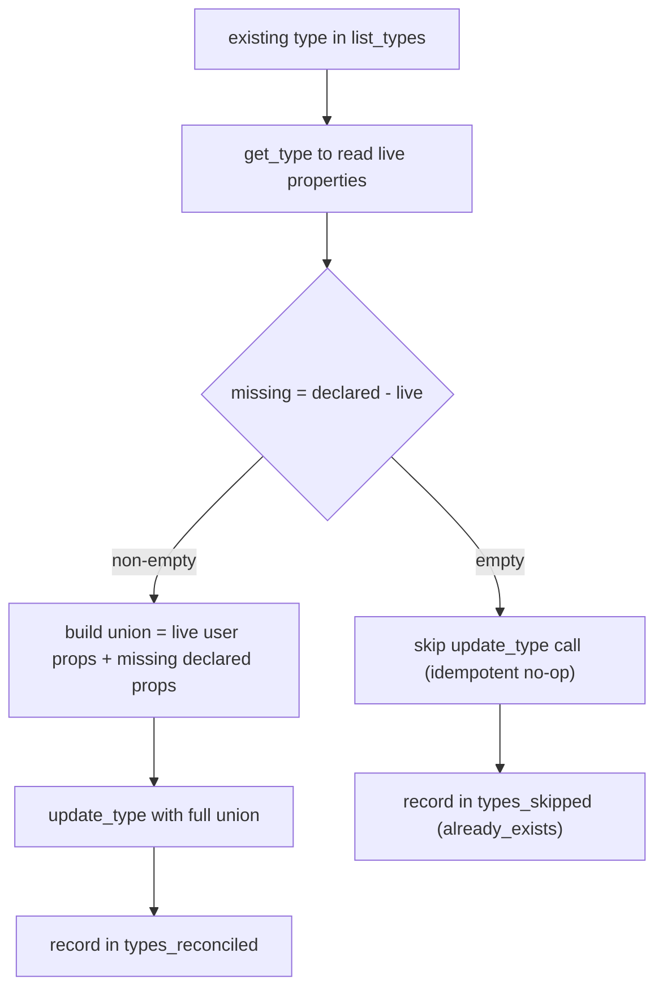

# Surface concept contradictions in wiki_lint (#426)

**Status:** DRAFT
**Date:** 2026-06-25
**Author:** spec-writer agent
**Review rounds:** 0

---

## Problem Statement

Concept contradiction detection shipped in #325 (`ingest.py:944`): when ingesting, the pipeline
detects contradictions between concepts and writes links into `wiki_contradictions`. However,
`wiki_lint` only surfaces those contradictions for `wiki_entity` objects (`lint.py:490`
`if tk == "wiki_entity":`). Concept contradictions are silently ignored by the health check —
fleet and Jan get no signal that concept-level contradictions need resolution.

Two dependent gaps make it impossible to simply widen the lint gate:

1. `wiki_concept` carries `wiki_contradictions` in the schema but NOT `wiki_last_reviewed`
   (`types_schema.py:101-113`). Lint resolves contradictions via `wiki_last_reviewed`; without
   it, every concept contradiction would permanently fire `critical` with no way to clear it —
   a broken UX.

2. The bootstrap path (`bootstrap.py:279-285`) skips existing types with `already_exists` and
   never re-links properties. Adding `wiki_last_reviewed` to the schema has no effect on a space
   that is already bootstrapped. There is no `update_type` wrapper in `wiki_client.py` today.

This ticket is the declared closure-condition follow-up for #325 (see `#325/spec.md`
"Recommended Follow-Up").

---

## Research Summary

Full research and live-probe transcript: [research.md](./research.md).

Key findings:

- **Gating question resolved.** `API-update-type` (`PATCH /v1/spaces/{id}/types/{type_id}`)
  links properties onto an existing type. Verified live against `wiki-validation-throwaway`
  space (probe transcript in `research.md §1`).
- **Replace-not-merge contract.** `update-type` REPLACES the user-defined property set. Any
  property omitted from the call is dropped from the type (confirmed by probe step 2 of
  `research.md §1`). System properties (`tag`, `backlinks`, `created_date`, `creator`, `links`)
  are Anytype-managed and auto-preserved.
- **Re-sending an existing key is idempotent.** It links the existing space-level property (same
  stable id); no duplication (probe step 3/4).
- **Consequence.** The bootstrap reconcile step must be read-modify-write: GET the live type's
  current property set → compute missing = declared − live → if non-empty, send the UNION (live
  + missing), never the delta alone.
- No detection code changes are needed. `ingest.py:944` already gates on
  `if kind in ("entity", "concept")`.
- `wiki_client.py` has `create_type`, `list_types`, `list_properties`, `update_object` but NO
  `update_type` and NO `get_type`.

---

## Proposed Solution

Four coordinated changes, applied in dependency order:

### 1 — Schema: add `wiki_last_reviewed` to `wiki_concept`

**File:** `src/anytype_llm_wiki/wiki/types_schema.py`

- Add `{"property_key": "wiki_last_reviewed", "name": "Wiki Last Reviewed", "format": "date"}`
  to the `wiki_concept` properties list (after `wiki_status` at line 112, mirroring its
  position in `wiki_entity` at line 97).
- Bump `WIKI_SCHEMA_VERSION` (line 27) from `"0.4.1"` → `"0.4.2"`. This triggers
  `bootstrap.py`'s `is_upgrade` path (`bootstrap.py:265-268`) so existing spaces re-run the
  bootstrap reconcile loop.

### 2 — New wiki_client methods: `get_type` and `update_type`

**File:** `src/anytype_llm_wiki/wiki/wiki_client.py`

Add two methods to `WikiClient`, modelled after the existing `update_object` (line 78):

```python
def get_type(self, space_id: str, type_id: str) -> dict:
    """GET a single type by id. Returns the type dict."""
    c = self._client()
    resp = c.get(f"/v1/spaces/{space_id}/types/{type_id}")
    resp.raise_for_status()
    return resp.json()["type"]

def update_type(self, space_id: str, type_id: str, type_def: dict) -> dict:
    """PATCH an existing type. Returns the updated type dict."""
    c = self._client()
    resp = c.patch(f"/v1/spaces/{space_id}/types/{type_id}", json=type_def)
    resp.raise_for_status()
    return resp.json()["type"]
```

Wire contracts (pinned):

| Method | Verb + Path | Returns | Mirror |
|---|---|---|---|
| `get_type` | `GET /v1/spaces/{space_id}/types/{type_id}` | `{"type": {..., "properties": [...]}}` | mirror `update_object` GET idiom; add GET route in `test_bootstrap.py` |
| `update_type` | `PATCH /v1/spaces/{space_id}/types/{type_id}` | `{"type": {...}}` | mirror `update_object` PATCH idiom (`wiki_client.py:78-82`); add `patch_response` route in `test_bootstrap.py::_install_success_routes` |

The `type_id` to pass to both methods is resolved from the `list_types` result already fetched
at `bootstrap.py:271` — do not issue a second list call.

### 3 — Bootstrap: idempotent property reconcile onto existing types

**File:** `src/anytype_llm_wiki/wiki/bootstrap.py`

In the existing-types branch (`bootstrap.py:279-285`), replace the bare `continue` with a
reconcile step. The logic is:

```
for type_def in WIKI_TYPES:
    if type_key already exists:
        type_id = resolve from list_types entry
        live_type = get_type(space_id, type_id)
        live_prop_keys = {p["key"] for p in live_type.get("properties", [])}
        declared_prop_keys = {p["property_key"] for p in type_def["properties"]}
        missing = declared_prop_keys - live_prop_keys
        if missing:
            union_props = [
                {"key": p["key"], "name": p["name"], "format": p["format"]}
                for p in live_type["properties"]
                if p.get("key") not in SYSTEM_PROP_KEYS
            ] + [
                {"key": p["property_key"], "name": p["name"], "format": p["format"]}
                for p in type_def["properties"]
                if p["property_key"] in missing
            ]
            update_type(space_id, type_id, {"properties": union_props})
            record in result["types_reconciled"]
        else:
            result["types_skipped"] (already_exists, no-op)
```

The decision flow for the reconcile step:



Critical correctness constraint — replace-not-merge: `update_type` replaces the property set.
Sending only `missing` would destroy all existing properties. The union MUST include all live
user-defined properties plus the missing declared ones. System properties (`tag`, `backlinks`,
`created_date`, `creator`, `links`) are Anytype-managed and excluded from the union — the API
auto-preserves them.

Result dict additions: add `types_reconciled` (list of `{type_key, type_id, properties_added}`)
alongside the existing `types_created`/`types_skipped` keys. Ensure the reconcile step runs on
the `is_upgrade` path so existing spaces receive `wiki_last_reviewed` on `wiki_concept` when
upgrading from schema 0.4.1 to 0.4.2.

### 4 — Lint gate: extend contradiction check to `wiki_concept`

**File:** `src/anytype_llm_wiki/wiki/lint.py`

Change the gate at line 490 and correct the stale comment at line 487:

```python
# Before:
# (d) contradiction_unresolved (Critical) — active; wiki_entity only (SF9).
if tk == "wiki_entity":

# After:
# (d) contradiction_unresolved (Critical) — active; wiki_entity and wiki_concept.
if tk in ("wiki_entity", "wiki_concept"):
```

The body is unchanged — it reads `wiki_contradictions` (objects-format, bare ID strings per
mem0 56845bac) and resolves via `wiki_last_reviewed`. The severity `critical` is correct (see
`lint.py:500`). This mirrors the `("wiki_entity", "wiki_concept")` tuple idiom used at
`lint.py:506` and `lint.py:516`.

### 5 — Docs

- **README** (~line 175): remove the surfacing-gap clause ("concept contradictions not yet
  flagged by wiki_lint — a planned follow-up") and replace with a statement that concept
  contradiction surfacing is live.
- **CHANGELOG.md**: add entry for schema 0.4.2 and concept contradiction surfacing.
- **MIGRATIONS.md**: add note that spaces upgrading from schema 0.4.1 must re-run
  `wiki_bootstrap`; the upgrade will idempotently link `wiki_last_reviewed` onto `wiki_concept`
  via the new reconcile step.

### Alternatives Considered

- **Delete-and-recreate type:** destructive, would drop all existing concept objects' property
  data. Rejected immediately.
- **Manual one-off migration script:** does not close the bootstrap gap for future schema
  additions; rejected in favour of a general reconcile capability built into bootstrap.

---

## Resource Impact

Negligible. The reconcile step adds one `GET /v1/spaces/{id}/types/{type_id}` call per wiki
type that already exists, and at most one `PATCH` call per type that has missing properties.
For the typical wiki space (6 wiki types), this is at most 6 extra GETs + 1 PATCH on a
schema-upgrade bootstrap. Normal (non-upgrade) bootstraps that find all types complete skip
the PATCH calls entirely. No change to memory footprint, disk, or continuous-operation
cost.

---

## Security Considerations

The **replace-not-merge footgun** is the central risk. Sending only the missing-property delta
to `update_type` silently destroys all other properties on the type, corrupting the graph for
every object of that type. This is mitigated by:

1. The union-send design (sends live user props + missing declared props).
2. A regression test (see Test Plan) that asserts pre-existing properties are never dropped.

No new trust boundary is introduced. `update_type` uses the same Anytype API key and transport
as all existing bootstrap calls. No new secrets or credentials. The `get_type` response is
trusted (same source as `list_types` / `create_type`).

---

## Operational Considerations

- **Schema bump triggers re-bootstrap.** Bumping `WIKI_SCHEMA_VERSION` to 0.4.2 sets
  `is_upgrade = True` for any space on 0.4.1. Users must re-run `wiki_bootstrap`. This is
  documented in MIGRATIONS.md.
- **Failure modes:**
  - `get_type` fails: bootstrap should propagate the error (do not silently skip the reconcile).
  - `update_type` fails: propagate; partial reconcile is worse than no reconcile (the type
    would be left in an unknown state).
  - `type_id` not found in `list_types` entry: defensive — guard against a `None` type_id
    before calling `get_type`.
- **Idempotency:** re-running bootstrap on a fully-reconciled space calls `get_type`, finds no
  missing properties, and skips `update_type`. Fully idempotent.
- **Existing properties are never dropped**: enforced by always sending the union, never the
  delta; verified by the regression test in test_bootstrap.py.

---

## Test Plan

### test_lint.py — extend `_make_concept`, add contradiction test

**Location:** `tests/wiki/test_lint.py`

1. Extend `_make_concept` (~line 157) to accept `wiki_contradictions: list | None = None` and
   `wiki_last_reviewed: str | None = None` parameters, mirroring `_make_entity` (~line 117).
   When non-None, append the corresponding property entries to `props` exactly as `_make_entity`
   does at lines 137-140.

2. Add `test_concept_contradiction_unresolved` with three assertions:
   - Concept with `wiki_contradictions=["contra-id-1"]` and `wiki_last_reviewed=None` →
     fires exactly one `critical` / `contradiction_unresolved` finding.
   - Same concept with `wiki_last_reviewed="2026-01-01"` → zero `contradiction_unresolved`
     findings.
   - Concept with no `wiki_contradictions` → zero `contradiction_unresolved` findings.

These tests MUST fail against the current `lint.py` (entity-only gate at line 490), confirming
they are genuine regression guards.

### test_bootstrap.py — cover the reconcile step

**Location:** `tests/wiki/test_bootstrap.py`

Extend `_install_success_routes` to add a `patch_response` side-effect router:

```python
def patch_response(request, **kwargs):
    path = str(request.url).split("?")[0]
    if "/types/" in path:
        return httpx.Response(200, json={
            "type": {"id": "type-id-001", "key": "wiki_concept", "properties": [...]}
        })
    return httpx.Response(200, json={})

respx.patch().mock(side_effect=patch_response)
```

Also add a `get_type` GET route that handles `/types/{type_id}` paths (distinct from the
existing `/types` list route) returning the live type with its current properties.

Add three test cases:

1. **`test_reconcile_adds_missing_property`**: existing `wiki_concept` type is missing
   `wiki_last_reviewed`; bootstrap calls `update_type` with the union (existing props +
   `wiki_last_reviewed`) and reports the type in `types_reconciled`.

2. **`test_reconcile_no_op_when_complete`**: existing `wiki_concept` type already has all
   declared properties; bootstrap does NOT call `update_type` (assert the respx PATCH route
   was not hit).

3. **`test_reconcile_never_drops_existing_properties`** (regression): existing `wiki_concept`
   has a custom user property; after reconcile, assert that the payload sent to `update_type`
   contains that user property key (union, not delta).

Also add a schema assertion that `wiki_concept` in `WIKI_TYPES` contains `wiki_last_reviewed`.

---

## Implementation Plan

Implement in this order (each step is independently testable):

1. **Schema** (`types_schema.py`): add `wiki_last_reviewed` to `wiki_concept`; bump
   `WIKI_SCHEMA_VERSION` to `"0.4.2"`. Unblocks all downstream steps.

2. **`wiki_client.py`**: add `get_type` and `update_type` methods. No behaviour change to
   existing code — pure addition.

3. **Bootstrap reconcile** (`bootstrap.py`): implement the read-modify-write reconcile in the
   existing-types branch. Depends on step 2.

4. **Lint gate** (`lint.py:490`): change `tk == "wiki_entity"` to
   `tk in ("wiki_entity", "wiki_concept")`; fix the comment. Depends on step 1 (schema must
   have `wiki_last_reviewed` on `wiki_concept` before the lint check is meaningful).

5. **Docs**: README surfacing-gap clause, CHANGELOG entry, MIGRATIONS.md note.

Tests are authored by the test-phase worker after steps 1-5 are complete. The test-phase worker
must author `test_concept_contradiction_unresolved` targeting the new gate and the three
bootstrap reconcile test cases described above.

---

## Open Questions

None. The gating question (idempotent property-link onto an existing type) is resolved via live
probe (see `research.md §1`). All design decisions are determined.

---

## Acceptance Criteria

1. **Concept contradictions surfaced.** Running `wiki_lint` on a space that contains a
   `wiki_concept` object with `wiki_contradictions` links and no `wiki_last_reviewed` date
   returns a `critical` / `contradiction_unresolved` finding. Setting `wiki_last_reviewed`
   clears the finding. Behaviour is identical to `wiki_entity`. Verified by
   `test_concept_contradiction_unresolved`.

2. **Bootstrap idempotently links required property.** Running `wiki_bootstrap` on a space
   already containing `wiki_concept` (schema 0.4.1) reconciles `wiki_last_reviewed` onto it
   without dropping any pre-existing properties. Re-running bootstrap on a fully-reconciled
   space makes no `update_type` call. Verified by the three `test_reconcile_*` test cases.

3. **README/CHANGELOG updated.** The README surfacing-gap clause from #325 follow-up is removed.
   CHANGELOG.md records the 0.4.2 schema bump and concept contradiction surfacing as live.
   MIGRATIONS.md instructs users to re-run `wiki_bootstrap` when upgrading from 0.4.1 to 0.4.2.

---

## Deferred Items

None.
