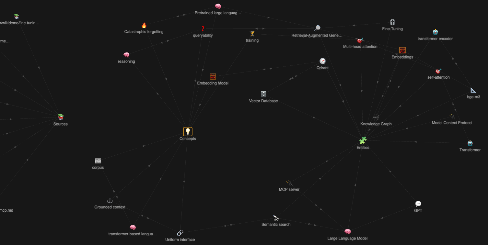

# anytype-llm-wiki

**A local-first, typed "second brain" on [Anytype](https://anytype.io) — for humans *and* AI agents.**

It takes Andrej Karpathy's *LLM-wiki* idea — let an LLM compile your sources into a curated, interlinked knowledge base you can then query — and builds it on Anytype's native **Objects, Types, and Relations** instead of flat Markdown files. Everything is exposed over the [Model Context Protocol](https://modelcontextprotocol.io), so Claude Code, Cursor, any MCP client — or your own autonomous agents — can both read *and* write it. It runs entirely on your machine.

## Why a typed graph instead of flat notes or plain RAG?

- **Typed Objects and bidirectional Relations — not files.** Knowledge lands as `Entity`, `Concept`, and `Source` objects linked by real, traversable relations in a queryable database. Markdown wikis (Obsidian, Logseq) give you backlinks over text files; Anytype gives you a typed knowledge graph.
- **It detects contradictions.** When newly ingested facts conflict with an already-linked entity, **both positions are kept and cross-linked** (`wiki_contradictions`) and flagged for review — never silently overwritten. Your knowledge base tells you when it disagrees with itself. Flat wikis and vector stores can't.
- **Cited synthesis, not just search.** `wiki_query` returns a prose answer drawn **only from your wiki**, citing the exact Objects it used — and can file the answer back so the wiki gets a little better every time it's used.
- **Local-first.** Anytype + Ollama (embeddings & extraction) + Qdrant (vectors), all on `localhost`. Nothing leaves your machine by default. See [Security & data flow](docs/security-and-data-flow.md).



## Use cases

### 1. A research / knowledge wiki (for you)

Point it at sources — Wikipedia articles, papers, internal docs, your own notes — and it compiles them into typed, interlinked Entities and Concepts *with provenance*, deduping and merging as it goes. Then ask questions in plain language and get answers synthesized **only from your wiki**, each citing the Objects it drew from. It's Karpathy's LLM-wiki pattern on a real database: the graph is browsable in Anytype, and every fact traces back to a Source.

→ Path: `wiki_bootstrap` → `wiki_ingest` → `wiki_query` ([walkthrough](#try-it-in-5-minutes)).

### 2. A secondary brain for an AI agent fleet

Give autonomous agents a **persistent, typed memory that survives sessions** and is shared across projects. Agents narrate what they learn (`wiki_remember`) — decisions, durable facts, and the relations between things — and read it back with citations (`wiki_query`) before starting new work. Consolidation makes repeated writes safe (it dedups, supersedes, and **flags contradictions instead of overwriting**), and a periodic `wiki_lint` surfaces contradictions and staleness for review. One brain, contradiction-aware, that compounds as the fleet works.

→ Path: register as an MCP server in your agent runtime, then `wiki_remember` / `wiki_query`.

> This is exactly how we use it at [Aldeia IT](https://github.com/Aldeia-IT): as the shared long-term memory for our autonomous SDLC agent fleet.

## How it works

```
Sources (URLs, files, agent narration)        Anytype vault (local API)
        │  fetch / narrate                              │  read objects → markdown
        ▼                                               ▼
   LLM extraction (local Ollama)              Chunker (headings / paragraphs)
        │  entities, concepts, relations,              │  text chunks + metadata
        │  contradiction detection                     ▼
        ▼                                       Ollama embeddings (bge-m3)
   Typed Objects + Relations  ───────────────►        │  vectors + payload
   written back to Anytype                            ▼
        ▲                                        Qdrant (vector DB)
        │  cited synthesis (wiki_query)                ▲  similarity search
        └───────────────── MCP server ────────────────┘
              semantic_search · reindex · wiki_* tools
                                │
                     Claude Code / Cursor / your agents
```

Objects carry their knowledge in **properties** (`wiki_facts`, `wiki_definition`, …), not in the object body — so an ingested object shows an empty body in the Anytype client by design; the content is fully indexed and retrievable.

## Quick start

### Prerequisites
- [Anytype](https://anytype.io) desktop (REST API on port 31012)
- [Ollama](https://ollama.ai) with an embedding model: `ollama pull bge-m3` (extraction also uses a small local generation model, e.g. `ollama pull qwen2.5:7b`)
- [Qdrant](https://qdrant.tech): `docker run -p 6333:6333 qdrant/qdrant`

### Install

Install from source with [uv](https://docs.astral.sh/uv/) (PyPI publishing is on the roadmap):

```bash
git clone https://github.com/Aldeia-IT/anytype-llm-wiki.git
cd anytype-llm-wiki
uv sync
```

Run any command with `uv run anytype-llm-wiki …`. Running it with **no subcommand** starts the MCP server over stdio.

### Configure

Create a `.env` (only `ANYTYPE_API_KEY` is required):

```bash
ANYTYPE_API_KEY=your-anytype-api-key     # Anytype → Settings → API
# Optional (defaults shown):
ANYTYPE_API_URL=http://127.0.0.1:31012
QDRANT_URL=http://127.0.0.1:6333
OLLAMA_URL=http://127.0.0.1:11434
EMBED_MODEL=bge-m3
```

### Verify & provision

```bash
uv run anytype-llm-wiki doctor                          # read-only preflight (Anytype, Qdrant, Ollama)
uv run anytype-llm-wiki wiki-bootstrap --space-id <id>  # idempotently create the typed wiki schema
```

`wiki-bootstrap` is safe to re-run — it reconciles the space to the expected schema without creating duplicates. Re-run it after an upgrade that changes the schema (the CHANGELOG flags those).

### Register as an MCP server

**Claude Code:**
```bash
claude mcp add anytype-llm-wiki -e ANYTYPE_API_KEY=your-key \
  -- uv run --directory /path/to/anytype-llm-wiki anytype-llm-wiki
```

**Claude Desktop / Cursor / other clients** — add to your MCP config:
```json
{
  "anytype-llm-wiki": {
    "command": "uv",
    "args": ["run", "--directory", "/path/to/anytype-llm-wiki", "anytype-llm-wiki"],
    "env": { "ANYTYPE_API_KEY": "your-key" }
  }
}
```

### Try it in 5 minutes

**Build a research wiki and query it** (from an empty space):
```bash
# 1. Provision the typed schema.
uv run anytype-llm-wiki wiki-bootstrap --space-id <id>

# 2. Compile a source into typed, interlinked Objects (auto-reindexes).
uv run anytype-llm-wiki wiki-ingest --space-id <id> \
  --source https://en.wikipedia.org/wiki/Retrieval-augmented_generation

# 3. Ask a question — answered only from your wiki, with citations.
#    --file-back stores the Q&A so it can be retrieved by FUTURE queries.
uv run anytype-llm-wiki wiki-query --space-id <id> \
  --question "What is retrieval-augmented generation?" --file-back
```

**Give an agent memory** — once registered over MCP, your agent can:
```
wiki_remember(space_id, "Qdrant 1.12 added native multi-tenancy via payload partitioning.", subject_hint="Qdrant")
wiki_query(space_id, "What do we know about Qdrant multi-tenancy?")
```

## The MCP tools

| Tool | What it does |
|------|--------------|
| `semantic_search` | Search the vault by meaning. `query`, `space_id?`, `types?`, `limit?` |
| `reindex_anytype` | Trigger an incremental reindex. `space_id?` |
| `wiki_bootstrap` | Provision the typed wiki schema in a space. `space_id`, `domain_tags?` |
| `wiki_ingest` | Compile a source (URL or file) into curated, interlinked Objects with provenance; auto-reindex. `source`, `space_id`, `domain_hint?` |
| `wiki_remember` | Consolidate an agent's natural-language narration into typed Objects (LLM merge/dedup/conflict-flag); auto-reindex. `space_id`, `knowledge`, `subject_hint?`, `kind?`, `relations?`, `domain_tags?`, `source?` |
| `wiki_query` | Query the wiki for a synthesized, source-cited answer (tiered retrieval + local synthesis); optionally file the answer back. `question`, `space_id`, `file_back?` |
| `wiki_lint` | Read-only structural health check (contradictions, orphans, staleness, asymmetric relations, …), ranked by severity. `space_id`, `severity_threshold?`, `include_duplicates?` |

Extraction and synthesis run on local Ollama by default (`WIKI_EXTRACT_MODEL`, default `qwen2.5:7b`); pointing `WIKI_EXTRACT_ENDPOINT` at a hosted API moves that processing off-machine behind a one-time consent gate — see [Security & data flow](docs/security-and-data-flow.md).

## Key behaviors worth knowing

- **Contradiction detection is automatic, but scoped.** At ingest, when an updated entity's new facts conflict with an already-linked peer, both are cross-linked via `wiki_contradictions` and left for review (`wiki_lint` flags them `High`). Today detection is bounded to **linked entities** and to `wiki_entity` objects — an entity that contradicts something it isn't linked to won't surface a finding yet. Don't over-trust a clean contradiction column.
- **Cited synthesis + a compounding loop.** `wiki_query` answers only from retrieved Objects and cites them. A clean answer that meets the file-back gate (≥ 3 cited sources **and** ≥ 100 words, or `file_back=True`) is stored as a typed Query Object; after the next reindex it becomes retrievable itself — so the wiki improves with use. (Filed answers surface only after that reindex — see [known limitations](docs/known-limitations.md).)
- **Safe repeated writes (`wiki_remember`).** Reworded duplicates merge, genuinely new facts append, superseding facts replace (the prior text is recorded in the WikiLog and recoverable), contradictions are flagged not overwritten, and re-asserting the same knowledge converges to a no-op.
- **Tiered retrieval.** Below `WIKI_INDEX_THRESHOLD` (default 200) Objects, `wiki_query` reads the whole wiki directly (exhaustive and fast); above it, it uses vector search plus 1-hop neighborhood expansion.
- **Incremental, schedulable indexing.** Only changed objects are re-embedded. For continuous indexing, run `reindex_anytype` on a schedule (cron/launchd — a sample plist ships in the repo). For high agent write-rates, set `WIKI_AUTO_REINDEX=false` and batch a scheduled reindex, since reindex cost scales with total space size.

## Performance

Benchmarked on a Mac Mini (Apple Silicon):

| Operation | Time |
|-----------|------|
| Single search query | **0.22s** |
| Index 50 chunks | 0.73s |
| Full reindex (500 chunks) | ~7s |

## Configuration

`ANYTYPE_API_KEY` is the only required variable; sensible defaults cover the rest.

| Variable | Default | Description |
|----------|---------|-------------|
| `ANYTYPE_API_URL` | `http://127.0.0.1:31012` | Anytype REST API endpoint |
| `QDRANT_URL` | `http://127.0.0.1:6333` | Qdrant endpoint |
| `OLLAMA_URL` | `http://127.0.0.1:11434` | Ollama endpoint |
| `EMBED_MODEL` / `EMBED_DIMS` | `bge-m3` / `1024` | Embedding model and its vector dimensions (must match) |
| `WIKI_EXTRACT_MODEL` | `qwen2.5:7b` | Local model for extraction / synthesis / consolidation |
| `WIKI_EXTRACT_ENDPOINT` | *(unset → local Ollama)* | Hosted LLM endpoint for extraction (off-machine; consent-gated) |
| `WIKI_INDEX_THRESHOLD` | `200` | Object count at which `wiki_query` flips Tier 1 → Tier 2 |
| `WIKI_AUTO_REINDEX` | `true` | Auto-reindex after each write (set `false` to batch via a scheduled reindex) |

Additional `WIKI_SYNTH_*` and `WIKI_LINT_*` tuning knobs exist with sensible defaults — you won't normally need them.

## Architecture

- **Anytype client** — reads/writes objects via the REST API; handles pagination and auth.
- **Chunker** — splits markdown by headings, falls back to paragraphs; each chunk carries object/space/type/heading metadata.
- **Embedder / Indexer** — Ollama `/api/embed`; incremental by `last_modified_date`, re-embedding only changed objects and cleaning up vectors for deleted ones.
- **Wiki pipeline** — LLM extraction → entity/concept resolution → typed Objects with bidirectional Relations → contradiction detection → cited synthesis.
- **MCP server** — [FastMCP](https://github.com/jlowin/fastmcp) over stdio, exposing the seven tools above.
- **doctor** — read-only preflight (Anytype, Qdrant, Ollama, embedding model).

## Supply-chain posture

Dependencies are pinned in two layers: **`uv.lock`** locks every direct and transitive dependency to an exact, content-hashed version (CI runs `uv lock --check`), and **`pyproject.toml`** declares compatible ranges with next-major upper bounds so a transitive resolution can't silently cross a major version. Release artifacts are built cache-free and signed with a [SLSA build-provenance attestation](https://docs.github.com/actions/security-guides/using-artifact-attestations); once wheels are published you'll be able to `gh attestation verify` them against this repo.

## Roadmap

- Hybrid search — semantic similarity + keyword + metadata filters
- Relationship-aware retrieval — follow Anytype Relations to pull connected context
- Contradiction detection beyond linked entities (semantic pre-filter) and across Concepts
- Cross-space federation with access control
- PyPI publishing
- Webhook-based indexing when Anytype adds webhook support

See the [GitHub Releases](https://github.com/Aldeia-IT/anytype-llm-wiki/releases) and [CHANGELOG](CHANGELOG.md) for what's shipped.

## Comparison

|  | anytype-llm-wiki | Flat-file wiki (Obsidian / Logseq) | Plain vector RAG |
|--|------------------|-----------------------------------|------------------|
| Storage | Typed Anytype Objects + Relations | Markdown files + backlinks | Chunks in a vector DB |
| Knowledge model | Entities/Concepts in a queryable graph | Documents you organize by hand | Opaque chunks |
| Contradiction handling | **Detected & cross-linked for review** | None | None |
| Answers | **Synthesized, with Object citations** | You read & connect | Retrieved snippets |
| Agent read **and** write | **Yes (MCP)** | Manual | Read-mostly |
| Local-first | Yes (Ollama + Qdrant) | Yes | Varies |

It also differs from API-access MCPs like [`anyproto/anytype-mcp`](https://github.com/anyproto/anytype-mcp) (object CRUD, no semantic/vector search) and [`wethegreenpeople/anytype-mcp`](https://github.com/wethegreenpeople/anytype-mcp) (ChromaDB, full re-embed on start): embedding-backed semantic retrieval **plus** the typed-wiki pipeline is the core differentiator.

## Contributing

Contributions welcome — maintained by [Aldeia IT](https://github.com/Aldeia-IT).

```bash
git clone https://github.com/Aldeia-IT/anytype-llm-wiki.git && cd anytype-llm-wiki
uv sync --all-extras
cp .env.example .env          # add your keys
uv run pytest tests/ -v        # requires Anytype, Ollama, Qdrant running locally
```

Most-welcome areas: chunking strategies per object type, hybrid search (semantic + keyword), testing with large vaults (1000+ objects), and examples for different MCP clients.

## License

MIT. See [CONTRIBUTING.md](CONTRIBUTING.md) for contribution licensing (inbound = outbound).

## Trademarks

Anytype is a trademark of Any Association. This project is not affiliated with, sponsored by, or endorsed by Any Association or the Anytype project; the name is used solely to identify the platform this software integrates with.
