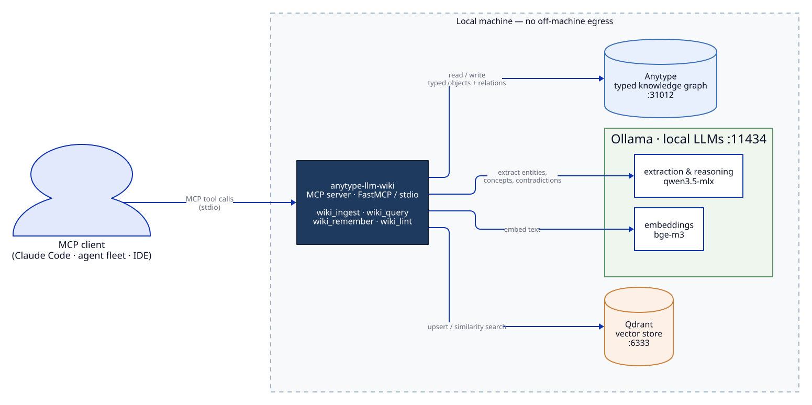
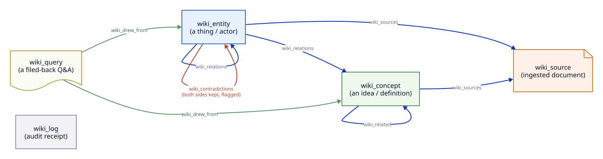
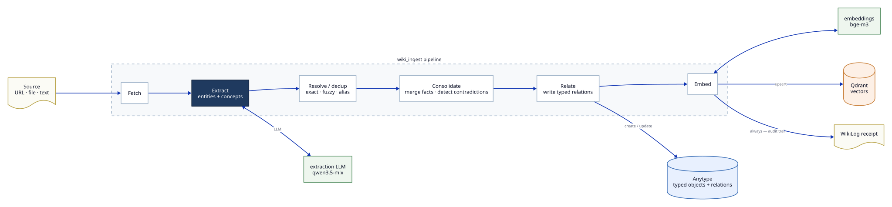
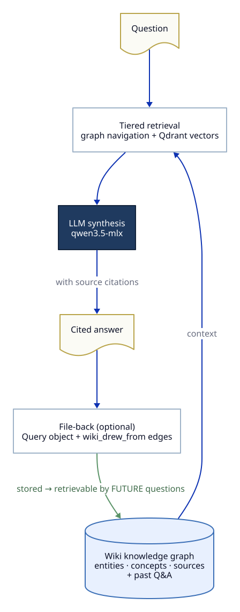
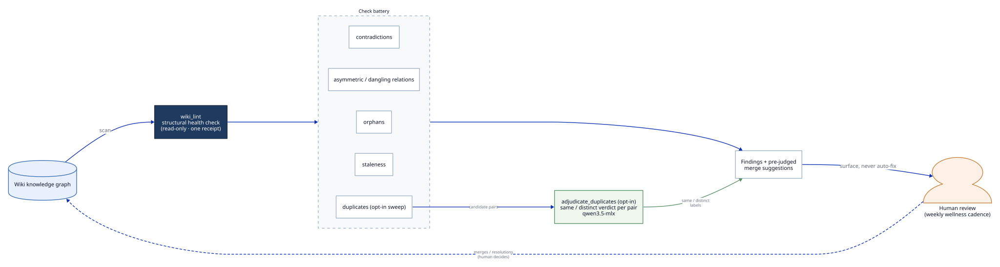

# Architecture — Visual Guide

A visual tour of how `anytype-llm-wiki` works: the components, the write and read
pipelines, the typed object model, and the self-auditing health check. Diagrams are
authored in [D2](https://d2lang.com) (sources in [`diagrams/`](diagrams/)) and
committed as rendered SVGs.

> Regenerate any diagram with: `d2 --theme 0 --pad 24 docs/diagrams/<name>.d2 docs/diagrams/<name>.svg`

---

## 1. System architecture

Everything runs **locally** — no off-machine egress. An MCP client (Claude Code, an
agent fleet, an IDE) calls the `anytype-llm-wiki` MCP server, which orchestrates three
local backends: **Anytype** (the typed knowledge graph), **Ollama** (an extraction /
reasoning LLM plus an embedding model), and **Qdrant** (the vector store).

---

## 2. The typed object model

The wiki is a **typed graph, not flat notes**. Five object types, joined by typed
relations: entities and concepts link to each other and to the sources they came from;
contradictions are kept on both sides and flagged for review; filed-back Q&A
(`wiki_query`) records exactly which objects it drew from.

---

## 3. The write pipeline (`wiki_ingest`)

A source (URL, file, or text) is compiled into typed, interlinked objects:
**fetch → extract → resolve/dedup → consolidate → relate → embed**, writing objects and
relations to Anytype, vectors to Qdrant, and an audit receipt to a `wiki_log` — every time.

---

## 4. The compounding loop (`wiki_query`)

Questions are answered **only from the wiki**, with citations. Optionally the Q&A is
*filed back* as a `wiki_query` object with `wiki_drew_from` edges — so it becomes part of
the corpus that future questions retrieve from. The wiki gets more useful as you use it.

---

## 5. Self-auditing health (`wiki_lint`)

`wiki_lint` runs a read-only battery of structural checks (contradictions, asymmetric /
dangling relations, orphans, staleness, duplicates). The opt-in duplicate sweep can be
**LLM-adjudicated** into pre-judged `same`/`distinct` merge suggestions. Findings are
**surfaced for human review** (the weekly wellness cadence) — never auto-applied.

---

See also: [`architecture.md`](architecture.md) for the prose deep-dive, and the
[README](../README.md) for quick start and the MCP tool reference.
